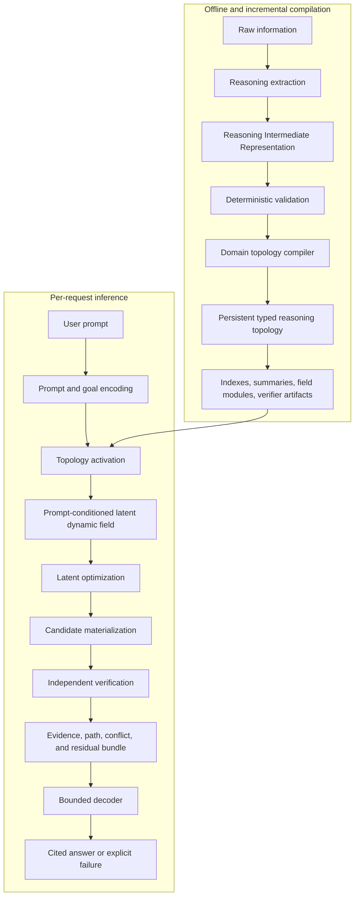
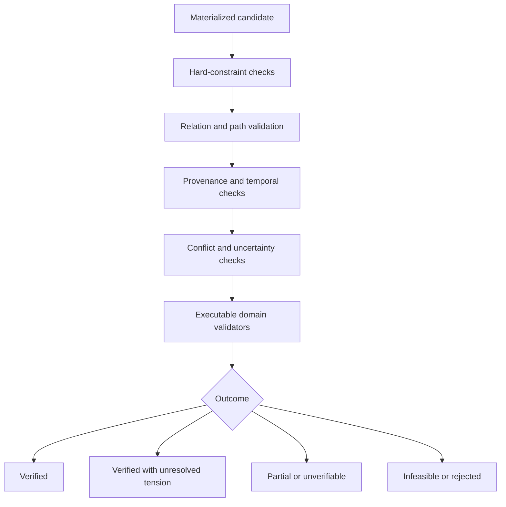
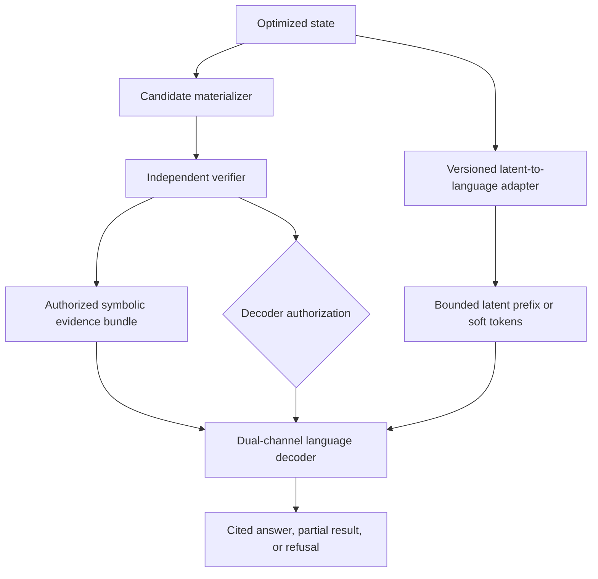
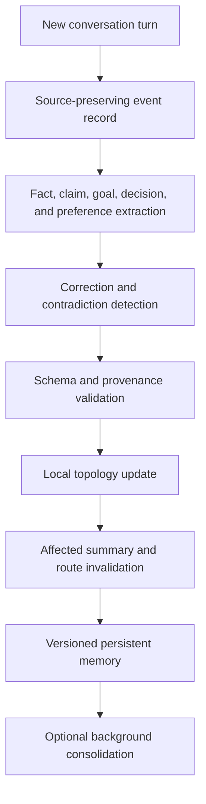
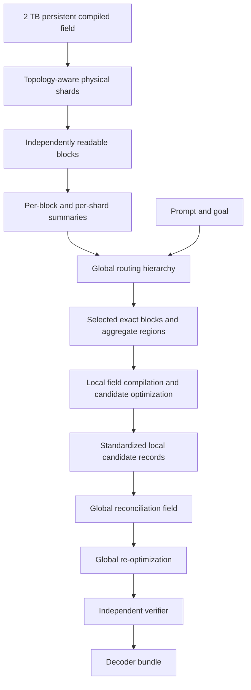
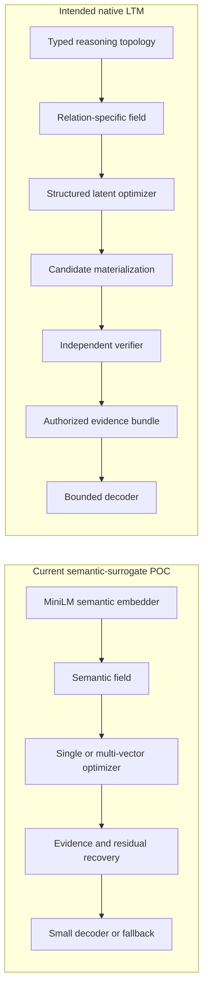
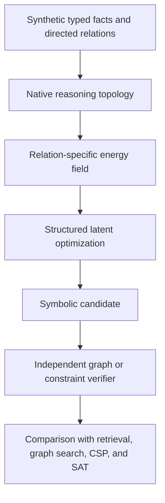

# Latent Topology Models: Canonical Architecture

## 1. Purpose, status, and reading rules

This document is the authoritative technical description of the intended
Latent Topology Model (LTM) architecture. It describes what a mature LTM is
supposed to be, how its components interact, which mechanisms are candidates,
and which parts have actually been implemented.

It is not a claim that a native LTM reasoning model already exists.

Measured results belong in the [experimental report](report.md). The research
basis is indexed in the
[literature map](research/literature-review.md). Scaling projections and their
limits are expanded in
[inference and scaling](research/inference-and-scaling.md).

### 1.1 Claim labels

Every architectural statement should be interpreted using one of these four
labels:

| Label | Meaning |
| --- | --- |
| **Requirement** | A property a system must preserve to qualify as the intended LTM architecture. |
| **Candidate** | A plausible implementation mechanism that has not been experimentally selected. |
| **POC** | A mechanism implemented and measured in the current semantic-surrogate repository. |
| **Hypothesis** | A future capability that remains unimplemented or unverified. |

When a section describes a candidate without repeating the label on every
sentence, the candidate status applies to the whole section.

### 1.2 Current project conclusions

The repository supports exactly three high-level conclusions:

1. **The semantic-surrogate pipeline works mechanically.** Data can be
   embedded, compiled into a field, optimized under bounded numerical budgets,
   resolved into exact evidence, and decoded.
2. **Semantic latent optimization did not demonstrate native reasoning.** The
   tested semantic objectives did not establish an advantage over the strongest
   simpler retrieval or weighted-averaging controls.
3. **Native reasoning topology remains unimplemented and untested.** Neither
   semantic success nor semantic failure establishes whether a relation-aware
   reasoning topology will work.

### 1.3 Core terminology

**Reasoning topology**
: A persistent, typed, attributed, versioned graph or hypergraph whose nodes,
  relations, factors, rules, constraints, and provenance preserve operational
  reasoning meaning rather than semantic similarity alone.

**Topology compiler**
: The offline and incremental system that transforms source-grounded
  Reasoning Intermediate Representation records into validated topology
  objects, field modules, indexes, summaries, and verifier artifacts.

**Reasoning state**
: The request-specific assignment being optimized. In a mature LTM it may
  contain continuous coordinates, discrete truth or activation variables,
  conflict branches, confidence values, and an explicit goal state.

**Latent dynamic field**
: The prompt-conditioned energy landscape induced by activated topology
  objects. It determines which changes to a reasoning state reduce or increase
  typed constraint violations.

**Active frontier**
: The exact topology objects and aggregate regions that contribute to one
  request. It is bounded for ordinary inference and may expand for global
  queries.

**Constraint residual**
: A typed, inspectable measure of how poorly a candidate state satisfies one
  fact, relation, rule, dependency, conflict policy, or goal.

**Force**
: The negative derivative of an energy term with respect to the reasoning
  state. Force is a mathematical optimization quantity, not a claim that
  reasoning literally obeys physical law.

**Equilibrium**
: A state at which permitted local movement no longer materially lowers the
  selected energy. Equilibrium is not automatically correctness.

**Attractor or well**
: A region toward which the optimization dynamics move nearby initial states.
  A well is useful only when low energy correlates with verified validity.

**Verifier**
: A system independent of the optimizer's convergence test that checks
  constraints, reasoning paths, provenance, applicability, and domain validity.

**Decoder**
: A bounded language or symbolic interface that expresses a verified candidate
  using only an authorized evidence and residual bundle.

**Persistent context**
: Information compiled into the workspace and reusable across requests without
  resending its complete source text on every turn.

## 2. Architectural hypothesis

> A domain's knowledge and reasoning rules can be compiled into a persistent
> typed topology. That topology can induce a prompt-conditioned latent field in
> which optimization finds a state minimizing the most relevant and reliable
> constraint violations. An independent verifier checks that state, and a
> bounded decoder expresses the verified result in natural language.

The hypothesis decomposes into five falsifiable claims.

### 2.1 H1 — Topology representation

Typed premises, implications, conflicts, dependencies, goals, uncertainty,
and provenance can be represented in a geometry and symbolic structure that
preserve their operational meaning.

H1 fails if:

- direction is lost;
- argument roles become interchangeable;
- incompatible statements collapse into ordinary similarity;
- valid and invalid relation compositions cannot be distinguished;
- exact sources cannot be recovered from latent objects.

Directed knowledge-graph models such as
[TransE](https://papers.nips.cc/paper_files/paper/2013/hash/1cecc7a77928ca8133fa24680a88d2f9-Abstract.html),
[RotatE](https://openreview.net/forum?id=HkgEQnRqYQ), and
[Rot-Pro](https://papers.nips.cc/paper/2021/hash/cf2f3fe19ffba462831d7f037a07fc83-Abstract.html)
show that direction and composition can be represented, but they do not prove
that one topology handles every reasoning domain.

### 2.2 H2 — Field compilation

Validated topology objects can be converted into a controlled scalar energy
whose low-energy regions correspond to lower typed violations.

H2 fails if:

- the field has spurious wells unrelated to valid solutions;
- important contradictions disappear into an unlabeled midpoint;
- aggregate summaries change the intended constraints;
- low energy is poorly calibrated across relation types;
- the field cannot expose a verifier-equivalent residual.

The initial native implementation should prefer a scalar energy that can be
differentiated. An unconstrained learned vector field may contain cycles or
curl and need not correspond to any coherent global objective. This follows
the conservative starting point motivated by
[energy-based learning](https://yann.lecun.org/exdb/publis/pdf/lecun-06.pdf).

### 2.3 H3 — Latent optimization

Movement through the compiled field can solve unseen relation compositions or
constraint problems that retrieval, weighted averaging, direct decoding, and
simple traversal cannot solve as reliably or economically.

H3 fails if:

- optimization is merely semantic retrieval in continuous form;
- a closed-form weighted average is equally good or better;
- exact graph search or a standard constraint solver dominates;
- convergence does not correlate with verification;
- the decoder repairs incorrect latent states.

### 2.4 H4 — Sparse scaling

An expandable persistent store can influence ordinary requests through exact
activation and hierarchical summaries without request compute growing in
direct proportion to total storage.

H4 fails if:

- most requests must scan most of the field;
- routing omits necessary cross-shard constraints;
- aggregate regions lose important evidence or relation paths;
- update and compaction costs make persistent memory uneconomic.

### 2.5 H5 — Faithful dual-channel decoding

A compact decoder can express an already selected and verified result by
combining two bounded inputs: a learned projection of the final optimized
state and an authorized symbolic evidence bundle. The latent channel may
preserve global equilibrium information that is absent from a four-item
evidence bundle, but it cannot override the verifier or authorize facts.

H5 fails if:

- answer correctness disappears when the decoder is restricted to the verified
  bundle;
- a query-only decoder performs similarly;
- a shuffled, zeroed, or unrelated latent state performs as well as the correct
  state despite a claimed latent contribution;
- the latent channel causes claims unsupported by the authorized bundle;
- the decoder silently resolves conflicts absent from the verifier result;
- generated citations do not correspond to authorized evidence.

## 3. Complete system overview

LTM has four primary components:

1. reasoning topology;
2. latent dynamic field;
3. latent optimizer;
4. decoder.

It also requires two supporting systems:

- an offline and incremental topology compiler;
- an independent verifier.

The compiler builds the persistent substrate. The verifier separates numerical
convergence from correctness.



### 3.1 Lifecycle classification

| Artifact or operation | Lifetime | Exact or approximate | Cacheable |
| --- | --- | --- | --- |
| Raw source and source spans | Persistent | Exact | Yes |
| Validated RIR | Persistent and versioned | Exact representation of accepted extraction | Yes |
| Typed topology | Persistent and incrementally updated | Exact accepted structure | Yes |
| Global indexes and summaries | Persistent | May be approximate | Yes, version-bound |
| Prompt and goal encoding | Per request | Model-dependent | For repeated prompts |
| Activation plan | Per request | May be approximate | If topology version matches |
| Exact active factors | Per request | Exact | Sometimes |
| Aggregate frontier factors | Per request | Approximate with diagnostics | Sometimes |
| Optimization trace | Per request | Numerical | No general reuse |
| Verifier result | Per request | Exact or domain-bounded | For identical versioned inputs |
| Decoder bundle | Per request | Exact bounded payload | Yes |

### 3.2 Persistent versus movable objects

The topology does not physically move during ordinary inference. It supplies
the fixed or controlled factors that define the request field.

The reasoning state moves:

```text
Persistent topology and activated constraints
                     ↓ forces
Initial prompt/goal state ───────→ candidate reasoning state
```

An adaptive field may open additional topology regions during inference, but
every change must be recorded. Otherwise the claimed energy and convergence
trace become uninterpretable.

## 4. Component 1 — Reasoning topology

### 4.1 Normative topology model

**Requirement:** The reasoning topology is a typed, attributed, versioned
hypergraph or factor graph, not a bag of text embeddings.

Let:

\[
\mathcal{T}=(V,R,F,P,\Sigma,\nu)
\]

where:

- \(V\) is the set of typed nodes;
- \(R\) is the set of directed, role-labelled relations;
- \(F\) is the set of rule and constraint factors;
- \(P\) maps objects to exact provenance;
- \(\Sigma\) is the domain schema and relation algebra;
- \(\nu\) is the topology version.

Hyperedges are necessary because a rule may depend on several premises:

\[
(A\land B\land C)\Rightarrow D.
\]

Reducing this to unrelated pairwise similarities can change its meaning.

### 4.2 Primary object families

The shared ontology must support at least:

| Family | Examples | Required semantics |
| --- | --- | --- |
| Entities | person, service, package, component | Stable identity and aliases |
| Values and states | temperature, approved, installed | Typed domains and admissible values |
| Observations | measured temperature, log event | Time, source, confidence |
| Facts and claims | policy statement, user assertion | Truth status is not assumed from ingestion alone |
| Goals and queries | choose plan, explain failure | Requested outputs and acceptable terminal conditions |
| Implications | `A → B` | Direction, premises, conclusion |
| Dependencies | `X requires Y` | Required availability or state |
| Causal relations | event A causes event B | Direction, context, uncertainty |
| Temporal relations | before, after, supersedes | Time and update order |
| Support and opposition | evidence for/against | Target claim and evidential strength |
| Incompatibilities | mutually exclusive versions | Branching or exclusion |
| Hard constraints | safety invariant | Must not be violated by an accepted result |
| Soft constraints | preference, heuristic | May retain a non-zero residual |
| Uncertainty | unknown, interval, alternatives | Calibrated confidence and abstention |
| Provenance | source path and span | Exact recoverability and audit |

### 4.3 Direction and role preservation

The topology must distinguish:

```text
A implies B
B implies A
A supports B
A contradicts B
A causes B
A occurs before B
```

The same two nodes may participate in all these relations, but the relations
have different directions, residuals, composition rules, and verifier checks.

Every relation argument therefore has a role:

```json
{
  "relation_type": "implication",
  "arguments": [
    {"role": "premise", "node_id": "fact-A"},
    {"role": "conclusion", "node_id": "fact-B"}
  ]
}
```

Swapping these arguments creates a different relation.

### 4.4 Reasoning Intermediate Representation

Teacher extraction never writes directly into latent coordinates. It produces
a source-grounded Reasoning Intermediate Representation (RIR).

A fact record:

```json
{
  "id": "fact-temperature-17",
  "kind": "fact",
  "subject": "reactor-A",
  "predicate": "temperature_celsius",
  "value": 82.0,
  "confidence": 0.98,
  "authority": 0.9,
  "valid_time": "2026-07-29T09:00:00Z",
  "applicability": ["plant:alpha"],
  "source": {
    "path": "sensors/reactor-a.json",
    "span": [120, 168]
  }
}
```

An implication:

```json
{
  "id": "rule-overheat-1",
  "kind": "implication",
  "premises": [
    {"node_id": "reactor-A.temperature", "operator": ">", "value": 80.0}
  ],
  "conclusion": {
    "subject": "reactor-A",
    "predicate": "requires_cooling",
    "value": true
  },
  "strength": 1.0,
  "hard": true,
  "source": {
    "path": "rules/thermal.json",
    "span": [10, 94]
  }
}
```

A dependency:

```json
{
  "id": "dependency-service-db",
  "kind": "dependency",
  "dependent": "service-api",
  "requires": "database-primary",
  "required_state": "healthy",
  "strength": 0.95,
  "hard": false,
  "source": {
    "path": "architecture/services.yaml",
    "span": [440, 512]
  }
}
```

A weighted contradiction:

```json
{
  "id": "conflict-release-status",
  "kind": "conflict",
  "alternatives": [
    {
      "claim_id": "claim-release-approved",
      "weight": 2.0,
      "source_id": "board-minutes-8"
    },
    {
      "claim_id": "claim-release-blocked",
      "weight": 1.0,
      "source_id": "draft-email-3"
    }
  ],
  "policy": "preserve_branches",
  "source": {
    "path": "compiled/conflicts.json",
    "span": [220, 390]
  }
}
```

A multi-premise rule:

```json
{
  "id": "rule-deploy-eligible",
  "kind": "implication",
  "premises": [
    {"node_id": "tests-passed", "expected": true},
    {"node_id": "security-approved", "expected": true},
    {"node_id": "rollback-ready", "expected": true}
  ],
  "conclusion": {
    "subject": "release-42",
    "predicate": "deployable",
    "value": true
  },
  "composition": "all",
  "hard": true,
  "source": {
    "path": "policy/deployment.json",
    "span": [50, 230]
  }
}
```

A temporal correction:

```json
{
  "id": "correction-language-preference",
  "kind": "supersession",
  "older_claim": "preference-python",
  "newer_claim": "preference-rust",
  "effective_time": "2026-07-29T11:30:00Z",
  "scope": ["project:compiler"],
  "source": {
    "path": "conversation/turn-118.json",
    "span": [0, 148]
  }
}
```

### 4.5 Domain topology configuration

**Requirement:** Domain logic must be explicit data or validated code, not
hidden inside decoder prompts.

A domain configuration declares object types, relations, composition rules,
energy adapters, verification rules, and decoder-visible fields.

```json
{
  "schema_version": 1,
  "domain_id": "package-resolution",
  "node_types": {
    "package": {"key_fields": ["name", "version"]},
    "platform": {"key_fields": ["os", "architecture"]}
  },
  "relations": {
    "requires": {
      "arguments": ["dependent", "dependency"],
      "directed": true,
      "arity": 2,
      "hard_default": true,
      "energy": "dependency_residual_v1",
      "verifier": "dependency_check_v1"
    },
    "conflicts_with": {
      "arguments": ["left", "right"],
      "directed": false,
      "arity": 2,
      "hard_default": true,
      "energy": "mutual_exclusion_v1",
      "verifier": "exclusion_check_v1"
    }
  },
  "weight_policy": {
    "fields": ["priority", "confidence", "authority", "recency"],
    "zero_excludes": true
  },
  "decoder_visible": [
    "source",
    "selected_version",
    "residual",
    "verification_status"
  ]
}
```

Configuration validation must reject:

- unknown node or relation types;
- invalid arity or roles;
- missing provenance;
- out-of-range weights;
- references to absent energy or verifier contracts;
- hard constraints without an independent verifier;
- unsupported composition rules.

### 4.6 Compilation sequence


Teacher output is untrusted until deterministic validation succeeds. Rejected
records retain diagnostics and their source spans; they do not silently enter
the topology.

### 4.7 Incremental topology updates

An update must:

1. retain the new source payload;
2. extract and validate new RIR records;
3. resolve stable identities and aliases;
4. identify superseded or conflicting records;
5. update only affected topology regions;
6. recompute affected summaries and indexes;
7. increment the topology version;
8. invalidate caches tied to previous versions;
9. preserve an audit trail.

Deletion or source withdrawal must create an auditable tombstone and remove the
withdrawn object's force from new fields. Previously generated answers remain
linked to the topology version that produced them.

## 5. Reasoning geometry and state representation

### 5.1 Semantic content is not reasoning role

Two statements may be semantically similar but have different roles:

```text
"The valve is open."             observation
"If the valve is open, cool."    implication
"The valve must not be open."    hard constraint
"Was the valve open?"            query
```

A native representation must therefore encode more than content similarity.

### 5.2 Candidate native representation

**Candidate:** Each topology object may combine:

- semantic or content coordinates;
- origin and target coordinates for directed relations;
- type coordinates;
- argument-role coordinates;
- confidence and applicability scalars;
- discrete truth, selection, or activation variables;
- conflict-branch identifiers;
- exact symbolic and provenance references.

Origin and target coordinates are one candidate for preventing
`A → B` from becoming interchangeable with `B → A`. Other candidates include
relation operators, complex rotations, boxes, cones, order embeddings, or
explicit factor functions. These alternatives must be compared rather than
assumed equivalent.

### 5.3 Structured reasoning state

The intended native state is:

\[
S=(x_g,X_e,X_r,y,b,c)
\]

where:

- \(x_g\) is the continuous prompt and goal state;
- \(X_e\) contains active entity and value states;
- \(X_r\) contains relation-specific continuous states;
- \(y\) contains discrete assignments or truth/activation variables;
- \(b\) identifies maintained conflict branches;
- \(c\) contains confidence or uncertainty assignments.

This is an abstract contract, not a fixed tensor layout.

**Requirement:** Exact source data and the complete topology remain external
to \(S\). The state references them; it does not losslessly compress the whole
corpus into one finite vector.

### 5.4 POC state

**POC:** Phase 1 used one normalized 384-dimensional
`all-MiniLM-L6-v2` vector as the prompt state. Phase 1.1 used multiple such
vectors. Phase 1.2 returned to one vector and optimized a semantic equilibrium.

Those states are valid pipeline surrogates. They are not the prescribed shape
of a native reasoning state.

### 5.5 State manifold

Each continuous component may have a validity domain:

- unit sphere for normalized directions;
- Euclidean space for unconstrained values;
- simplex for probabilities;
- interval for confidence;
- hyperbolic manifold for hierarchical coordinates;
- product manifold for mixed components.

Discrete components require branching, relaxation, rounding, search, or a
specialized solver. Projecting all reasoning into one unit vector would erase
these distinctions.

## 6. Component 2 — Latent dynamic field

### 6.1 Persistent topology versus active field

The persistent topology contains the accepted knowledge and reasoning
structure. The latent dynamic field is the request-specific objective induced
by a bounded activation of that topology.

```text
Persistent topology + prompt + goal + activation policy
                            ↓
       Request-specific factors, weights, and summaries
                            ↓
               Latent dynamic field E(S | q)
```

The field is called dynamic because it changes across prompts, goals, topology
versions, active frontiers, and applicability contexts. For a conservative
optimization run, its selected factors should remain fixed or every adaptive
change must be recorded.

### 6.2 Field compilation procedure

For prompt \(q\):

1. encode the prompt and explicit goal;
2. identify domain, time, user, and task applicability;
3. activate candidate topology regions;
4. retain high-relevance relations and evidence exactly;
5. represent distant regions through versioned summaries;
6. compile every active object into a typed residual \(r_i(S)\);
7. transform each residual into an energy \(E_i(S)\);
8. calculate its request-specific weight \(w_i(q)\);
9. add goal, conflict, uncertainty, provenance, and hard-constraint terms;
10. freeze and hash the resulting frontier before conservative optimization.

### 6.3 General energy contract

\[
\begin{aligned}
E(S\mid q)={}&
E_{\mathrm{goal}}(S,q)
+E_{\mathrm{facts}}(S)
+E_{\mathrm{relations}}(S)\\
&+E_{\mathrm{dependencies}}(S)
+E_{\mathrm{conflicts}}(S)
+E_{\mathrm{uncertainty}}(S)\\
&+E_{\mathrm{provenance}}(S)
+E_{\mathrm{hard}}(S).
\end{aligned}
\]

The terms mean:

- \(E_{\mathrm{goal}}\): departure from the requested task or terminal state;
- \(E_{\mathrm{facts}}\): disagreement with activated observations and facts;
- \(E_{\mathrm{relations}}\): violations of implications, causal links,
  temporal order, or other typed relations;
- \(E_{\mathrm{dependencies}}\): unmet prerequisites;
- \(E_{\mathrm{conflicts}}\): invalid simultaneous assignments or hidden
  branch collapse;
- \(E_{\mathrm{uncertainty}}\): unsupported certainty or poor calibration;
- \(E_{\mathrm{provenance}}\): use of candidates without sufficient source
  support;
- \(E_{\mathrm{hard}}\): barrier or feasibility terms for non-negotiable
  constraints.

### 6.4 Prompt-conditioned weights

A general factor weight may be:

\[
w_i(q)=
g\!\left(
\operatorname{relevance}_i(q),
\operatorname{priority}_i,
\operatorname{confidence}_i,
\operatorname{authority}_i,
\operatorname{recency}_i,
\operatorname{applicability}_i
\right),
\]

where \(g\) is a declared domain policy.

These meanings must not be conflated:

- relevance determines whether an item applies to this request;
- confidence expresses uncertainty in the item;
- authority expresses trust in the source;
- recency affects temporal validity;
- priority expresses task or policy importance;
- applicability gates domain, user, jurisdiction, or scenario scope.

A weight of zero explicitly excludes an item. A very small non-zero weight may
allow a summary region to exert bounded background influence.

### 6.5 Energy-term contract

Every native energy module must declare:

| Field | Requirement |
| --- | --- |
| Input types | Which state and topology object types it accepts |
| Residual | What a zero and non-zero residual mean |
| Weight source | Which metadata and routing values scale it |
| Gradient | Analytic, automatic, subgradient, or discrete update contract |
| Verifier equivalent | Independent check for the represented condition |
| Provenance | Exact topology and source IDs |
| Aggregation behavior | Whether and how the factor may be summarized |
| Numerical domain | Valid state range and stability limits |

### 6.6 Candidate energy examples

These are illustrative candidates, not selected native laws.

#### Supporting evidence

For candidate representation \(s\) and evidence representation \(z_i\):

\[
r_i^{\mathrm{support}}(s)=1-\operatorname{sim}(s,z_i),
\qquad
E_i^{\mathrm{support}}=w_i\rho(r_i),
\]

where \(\rho\) is a non-negative penalty.

#### Directed implication

For premise activation \(a\) and conclusion activation \(b\):

\[
r^{\Rightarrow}(a,b)=\max(0,a-b),
\qquad
E^{\Rightarrow}=w\,\rho(r^{\Rightarrow}).
\]

This penalizes an active premise with an inactive conclusion without asserting
the reverse implication.

#### Multi-premise implication

For premise activations \(a_1,\ldots,a_m\):

\[
r^{\land\Rightarrow}
=
\max\left(0,\min_j a_j-b\right).
\]

Other fuzzy or discrete conjunctions must be compared against exact Boolean
controls.

#### Dependency

For dependent selection \(y_d\) and prerequisite availability \(y_p\):

\[
r^{\mathrm{dep}}=\max(0,y_d-y_p).
\]

#### Incompatibility

For mutually exclusive assignments \(y_a,y_b\in[0,1]\):

\[
r^{\mathrm{excl}}=y_a y_b.
\]

A hard exclusion requires the verifier to ensure both are not selected.

#### Temporal order

For event times \(t_a\) and \(t_b\) with \(a\) required before \(b\):

\[
r^{\mathrm{time}}=\max(0,t_a-t_b).
\]

#### Temporal correction

If claim \(n\) supersedes older claim \(o\) in scope \(d\), a candidate that
uses \(o\) after the effective time receives a residual unless \(n\) is
inapplicable to \(d\).

#### Uncertainty

For predicted confidence \(c\) and supported confidence bound \(\hat c\):

\[
r^{\mathrm{uncertainty}}=\max(0,c-\hat c).
\]

#### Hard constraint

A continuous relaxation may use a rapidly increasing barrier:

\[
E_{\mathrm{hard}}(r)=
\begin{cases}
0, & r\leq 0,\\
\kappa r^2, & r>0,
\end{cases}
\]

with large \(\kappa\). The verifier, not a finite penalty alone, decides final
feasibility.

#### Prompt-goal anchor

\[
E_{\mathrm{goal}}(x_g,q)=
\lambda_q\left(1-\operatorname{sim}(x_g,q)\right).
\]

The anchor prevents a low-energy but goal-irrelevant attractor from replacing
the user's task.

### 6.7 Exact and aggregate contribution

Every included corpus object must be represented once:

- exactly as an active factor; or
- through exactly one aggregate ancestor.

An aggregate must record:

- member count and stable member range;
- topology version;
- total or bounded mass;
- summary coordinates;
- applicability range;
- relation-type composition;
- uncertainty or approximation bound;
- conditions that force exact expansion.

An aggregate cannot safely replace a hard constraint unless it carries a
certified bound sufficient for verification.

## 7. Force-field analogy and equilibrium

### 7.1 From energy to force

For a differentiable state \(S\), the total optimization force is:

\[
F(S)=-\nabla_S E(S).
\]

If:

\[
E(S)=\sum_i w_i E_i(S),
\]

then:

\[
F(S)=\sum_i -w_i\nabla_S E_i(S).
\]

Each activated factor therefore exerts a typed, weighted influence. Stronger
or more violated factors can exert greater force, depending on the declared
energy law.

### 7.2 The electric-field analogy

The intuitive picture is:

```text
constraint A ─┐
constraint B ─┼── weighted forces ──→ movable reasoning state
constraint C ─┘
```

The state moves until the permitted components of these forces approximately
balance.

This resembles a charge moving in an electric potential, but the analogy has
limits:

- reasoning factors need not use inverse-square distance;
- implication is directional, not ordinary attraction;
- hard constraints require feasibility, not merely a stronger pull;
- contradictions may require branches instead of one spatial midpoint;
- discrete decisions are not continuous charge locations;
- weights represent declared reasoning importance, not physical charge.

Literal Coulomb-style laws remain an experimental candidate, not an
architectural requirement.

### 7.3 Weight-2 versus weight-1 example

Let \(z_A\) and \(z_B\) be two positions and define:

\[
E(x)=2\|x-z_A\|^2+\|x-z_B\|^2.
\]

Differentiating and setting the gradient to zero:

\[
\nabla E(x)=4(x-z_A)+2(x-z_B)=0,
\]

so:

\[
x^*=\frac{2z_A+z_B}{3}.
\]

The equilibrium lies one-third of the segment from the stronger constraint
\(A\) toward the weaker constraint \(B\):

```text
A, weight 2          x*                              B, weight 1
●────────────────────●───────────────────────────────●
                     one-third from A
```

This result is specific to unconstrained squared Euclidean distance.

### 7.4 Why other force laws rest elsewhere

For a weighted cosine barycenter on a unit sphere:

\[
x^*=
\operatorname{normalize}(2z_A+z_B).
\]

If \(z_B=-z_A\), then \(x^*=z_A\). The state cannot occupy the interior
one-third point because it is constrained to the unit sphere.

A smooth worst-residual energy changes effective weights during optimization:
badly satisfied important constraints receive additional influence. Its final
state is an iteratively reweighted compromise rather than a fixed barycenter.

A literal inverse-square force would use a different balance equation and
produce a different distance ratio. The topology must select force laws by
reasoning meaning, not by visual analogy.

### 7.5 Equilibrium definition

On a constrained manifold \(\mathcal{M}\), a local equilibrium \(S^*\) obeys:

\[
\left\|
\operatorname{Proj}_{T_{S^*}\mathcal{M}}
\nabla E(S^*)
\right\|
\leq \varepsilon,
\]

where:

- \(T_{S^*}\mathcal{M}\) is the valid tangent space at \(S^*\);
- \(\operatorname{Proj}\) removes invalid movement directions;
- \(\varepsilon\) is the numerical convergence tolerance.

This means no permitted infinitesimal move materially lowers the current
objective. It does not establish that:

- the result is globally optimal;
- every constraint has zero residual;
- every stored claim is true;
- routing included every necessary factor;
- the energy correctly represents reasoning;
- the verifier will accept the result.

### 7.6 What is and is not at equilibrium

During ordinary inference:

- the persistent topology is fixed;
- the compiled active field is fixed or auditably adapted;
- the prompt-conditioned reasoning state moves;
- an optional set of conflict branches evolves;
- the final state reaches equilibrium with respect to the active field.

It is therefore more precise to say:

> The reasoning state reaches a local equilibrium under the forces induced by
> the activated latent dynamic field.

It is not precise to say that the whole two-terabyte store physically moves
into equilibrium for each request.

## 8. Contradictions and weighted satisfaction

### 8.1 Compatible constraints

Compatible constraints may jointly admit a state with low or zero residual:

```text
temperature > 80
temperature < 100
candidate temperature = 90
```

### 8.2 Unequal compatible constraints

Soft constraints may disagree about a preferred value while remaining jointly
admissible. A weighted equilibrium can form a compromise, and its exact
position depends on the loss.

### 8.3 Logically incompatible constraints

Statements such as:

```text
release-42 is approved
release-42 is not approved
```

cannot both be true in the same branch at the same time and scope.

**Requirement:** The field must not turn this contradiction into an unlabeled
semantic midpoint and call it solved.

The default native policy is:

1. preserve both claims and exact provenance;
2. create explicit alternative branches;
3. apply their weights within each candidate branch;
4. calculate a residual for each claim and branch;
5. use applicability, time, authority, and other topology relations to test
   whether one branch is admissible;
6. send all surviving tension to the verifier;
7. abstain or report uncertainty if neither branch can be resolved.

### 8.4 Weighted contradiction example

Suppose:

- board minutes say approved with effective weight 2;
- a draft email says blocked with effective weight 1;
- both apply to the same release and time;
- no supersession rule resolves the conflict.

A continuous substate may be pulled toward the first claim. That does not
delete the second claim. The materialized candidate could be:

```json
{
  "preferred_branch": "claim-release-approved",
  "branch_scores": {
    "claim-release-approved": 2.0,
    "claim-release-blocked": 1.0
  },
  "unresolved_conflict": true,
  "reason": "incompatible claims remain applicable",
  "verifier_status": "verified_with_unresolved_tension"
}
```

The decoder must say that the higher-weight evidence favors approval while a
contradictory lower-weight source remains unresolved. It must not say that
both statements were satisfied as true.

### 8.5 Meaning of “satisfy all data”

In LTM:

> “Satisfy all data” means minimize prompt-relevant,
> reliability- and applicability-weighted violations subject to hard
> constraints, while preserving and reporting irreducible residuals.

It does not mean:

- equal raw distance to every item;
- simultaneous truth of contradictions;
- equal treatment of weak and authoritative sources;
- letting irrelevant documents distort the answer;
- accepting a numerically balanced but logically invalid midpoint.

## 9. Component 3 — Latent optimizer

### 9.1 Responsibility

The optimizer searches the active field for a lower-energy valid candidate. It
does not define the meaning of the constraints; that meaning comes from the
topology and field compiler.

### 9.2 Request-time algorithm

The normative control flow is:

1. initialize \(S_0\) from the prompt, goal, and any required known state;
2. compile and hash the active frontier;
3. calculate total energy, per-term energy, force, and residuals;
4. project continuous gradients onto each component's valid manifold;
5. propose continuous updates;
6. propose, relax, or branch discrete assignments;
7. run backtracking, trust-region, or solver-specific acceptance checks;
8. reject invalid or materially energy-increasing updates;
9. retain competing branches required by unresolved conflicts;
10. stop on convergence, infeasibility, numerical failure, or budget exhaustion;
11. materialize the continuous/discrete state into a symbolic candidate;
12. send the candidate and trace to the independent verifier.

### 9.3 Continuous update

For step \(t\), a projected gradient proposal is:

\[
\tilde S_{t+1}
=
S_t-\eta_t
\operatorname{Proj}_{T_{S_t}\mathcal{M}}\nabla E(S_t),
\]

followed by a retraction:

\[
S_{t+1}=\operatorname{Retr}_{\mathcal{M}}(\tilde S_{t+1}),
\]

where \(\eta_t\) is the accepted step size.

Backtracking reduces \(\eta_t\) until:

- energy does not materially increase;
- state validity is retained;
- hard relaxed barriers are not crossed;
- numerical values remain finite.

### 9.4 Discrete and branched updates

Continuous gradients alone cannot guarantee correct discrete reasoning.
Candidate mechanisms include:

- continuous relaxation followed by verified rounding;
- branch-and-bound over a small active discrete set;
- beam search over conflict branches;
- differentiable SAT/CSP layers;
- direct calls to exact domain solvers;
- hybrid alternating continuous and discrete optimization.

[OptNet](https://proceedings.mlr.press/v70/amos17a.html),
[SATNet](https://proceedings.mlr.press/v97/wang19e.html), and
[LinSATNet](https://proceedings.mlr.press/v202/wang23at.html) demonstrate that
differentiable optimization and satisfiability constraints can be combined.
They are also mandatory baselines where applicable.

### 9.5 Required optimizer output

```json
{
  "topology_version": "topology-2026-07-29.4",
  "frontier_hash": "sha256:example",
  "termination": "converged_local",
  "initial_energy": 8.42,
  "final_energy": 2.17,
  "accepted_updates": 7,
  "rejected_updates": 2,
  "active_topology_ids": ["fact-1", "rule-4", "conflict-2"],
  "per_term_energy": {
    "goal": 0.08,
    "relations": 0.41,
    "conflicts": 1.38,
    "uncertainty": 0.3
  },
  "unresolved_branches": ["conflict-2:left", "conflict-2:right"],
  "convergence_reason": "projected_gradient_below_tolerance",
  "numerical_failures": [],
  "resource_use": {
    "field_evaluations": 12,
    "bytes_read": 67108864
  }
}
```

The real schema may add fields, but it must preserve the listed information.

### 9.6 Stopping conditions

Optimization stops when one of the following occurs:

- projected gradient is below tolerance;
- state change is below tolerance;
- objective improvement is below tolerance;
- a verified exact solution is found;
- no feasible branch remains;
- evaluation or time budget is exhausted;
- line search cannot find an accepted step;
- a numerical invariant fails.

Budget exhaustion is not convergence. Convergence is not verification.

### 9.7 Correctness ladder

| Level | Meaning |
| --- | --- |
| Numerically stable | Values remained finite and updates followed the solver contract |
| Converged | A stopping tolerance was reached |
| Local equilibrium | No small permitted move lowers the active objective materially |
| Globally optimal | No state has lower objective under the specified field |
| Feasible | Hard constraints are satisfied |
| Verified correct | Independent checks accept the candidate for the requested domain and topology version |

An answer must not silently promote a lower level into a higher one.

## 10. Averages, wells, equilibria, and reasoning

| Result | Meaning |
| --- | --- |
| Arithmetic or weighted average | Closed-form combination of fixed vectors |
| Semantic equilibrium | Balance of similarity-derived forces |
| Attractor or well | Local low-energy region under some dynamics |
| Constraint equilibrium | State minimizing typed relation and constraint violations |
| Verified reasoning result | Materialized constraint equilibrium accepted by an independent verifier |

### 10.1 Weighted average

For vectors \(z_i\) and normalized weights \(w_i\), a barycenter is:

\[
x_{\mathrm{bar}}
=
\operatorname{normalize}
\left(
\lambda_q q+\sum_i w_i z_i
\right).
\]

This is useful as a mandatory baseline because many apparently iterative
semantic fields reduce to or fail to improve on this calculation.

### 10.2 Semantic equilibrium

A semantic equilibrium may dynamically reweight items by residual, density, or
query relevance. It can be a genuine minimum of its mathematical objective,
but the objective represents semantic compatibility rather than implication,
causality, or logical feasibility.

### 10.3 Constraint equilibrium

A native constraint equilibrium uses relation-specific residuals. Its state
may contain several variables and branches. It is not required to correspond
to one point halfway between text embeddings.

### 10.4 Why a well is not enough

An optimizer will faithfully descend a badly designed energy landscape.
Therefore:

> Optimization cannot manufacture reasoning relations that the topology and
> energy do not encode.

A stable attractor may be:

- the desired solution;
- a semantic average;
- an unsupported high-density mode;
- a goal-irrelevant state;
- a spurious minimum caused by correlated data;
- an artifact of hierarchy approximation.

Associative-memory research including
[Modern Hopfield Networks](https://papers.nips.cc/paper_files/paper/2020/hash/da4902cb0bc38210839714ebdcf0efc3-Abstract.html)
supports attractor-based retrieval, while work on correlated memories and
spurious minima motivates explicit capacity and basin tests.

### 10.5 What Phase 1.2 established

**POC:** The semantic equilibrium implementation:

- constructed exact and hierarchical semantic fields;
- calculated analytic gradients;
- maintained normalized states;
- accepted only non-increasing-energy updates;
- reacted monotonically to controlled weight increases;
- produced residual and provenance bundles.

It found stable semantic equilibria. It did not demonstrate that the
equilibrium was a reasoning solution, and its weighted barycenter control was
stronger on the registered comparison. Exact results and classifications
remain in the [experimental report](report.md).

## 11. Candidate materialization

The optimized state is not serialized as arbitrary numbers and sent directly
to a language model. It follows two controlled paths: materialization produces
an auditable symbolic candidate, while a versioned learned adapter may project
the state into a small decoder-native latent prefix. The verifier controls
whether either path may be used to answer.

Materialization converts it into an auditable symbolic candidate:

```text
Continuous states
+ discrete assignments
+ active branches
+ residuals
+ topology references
        ↓
Candidate facts, decisions, paths, assumptions, and conflicts
```

The materializer must:

- resolve latent references to stable topology IDs;
- retain all selected discrete assignments;
- preserve alternative branches;
- attach per-factor residuals;
- recover exact supporting and opposing sources;
- identify any aggregate-only influence;
- mark claims that lack exact support;
- retain the topology and frontier versions.

A materializer may fail even after numerical convergence. Such failure is an
explicit result, not a reason for the decoder to guess.

## 12. Supporting system — Independent verifier

### 12.1 Verifier boundary



The verifier evaluates:

- hard constraints;
- relation direction and argument roles;
- proof or dependency path validity;
- discrete assignment consistency;
- source existence and integrity;
- temporal and domain applicability;
- conflict-branch handling;
- unsupported certainty;
- executable tests or domain validators;
- routing and hierarchy approximation bounds.

### 12.2 Required outcomes

| Outcome | Meaning | Decoder permission |
| --- | --- | --- |
| `verified` | Candidate satisfies required checks | Answer from verified bundle |
| `verified_with_unresolved_tension` | Candidate is admissible but important conflict remains | Answer must disclose tension |
| `partial` | Only part of the requested goal was verified | Answer only verified portion |
| `infeasible` | No candidate satisfies hard constraints | Explain infeasibility |
| `numerically_unconverged` | Optimizer stopped without convergence | No correctness claim |
| `unverifiable` | Evidence or validation is insufficient | Abstain or deterministic report |
| `rejected` | Candidate violates a required check | Do not authorize it |

### 12.3 Independence requirement

Repeating the optimizer's energy calculation and calling low energy “verified”
is not independent verification.

The verifier should use at least one materially different mechanism:

- graph traversal;
- symbolic rule evaluation;
- SAT, CSP, or optimization solver;
- executable test;
- database constraint;
- domain-specific deterministic validator;
- exact source and applicability check.

## 13. Component 4 — Decoder

### 13.1 Decoder boundary



**Architectural decision:** Mature LTM uses a dual-channel decoder. One channel
contains verified symbolic information; the second contains a learned,
bounded projection of the final optimized state. The decoder does not receive
an untyped list of coordinates, does not independently search the corpus, and
does not treat the latent channel as factual authorization.

The purpose of the latent channel is expression, not proof. It can tell the
decoder which equilibrium region, branch pattern, or global balance was
reached. The structured channel tells it which claims are verified, why they
are permitted, and which exact sources must be cited.

### 13.2 Authorized symbolic channel

The authorized bundle contains only:

- original prompt;
- normalized goal;
- verified candidate assignments;
- proof, dependency, or relation paths;
- exact supporting evidence;
- exact opposing evidence;
- constraint weights and residual labels;
- unresolved conflict branches;
- assumptions;
- uncertainty;
- source provenance;
- topology and frontier versions;
- verifier outcome.

Example:

```json
{
  "prompt": "Can release 42 be deployed?",
  "goal": {"type": "decision", "target": "release-42.deployable"},
  "verifier_status": "verified_with_unresolved_tension",
  "candidate": {
    "value": false,
    "basis": "required security approval is absent"
  },
  "paths": [
    ["rule-deploy-eligible", "security-approved", "release-42.deployable"]
  ],
  "evidence": [
    {
      "id": "security-review-9",
      "stance": "opposing",
      "residual": 0.0,
      "source": {"path": "reviews/security.md", "span": [210, 330]}
    }
  ],
  "conflicts": [
    {
      "id": "conflict-release-status",
      "status": "unresolved",
      "weights": [2.0, 1.0]
    }
  ],
  "assumptions": [],
  "uncertainty": 0.18
}
```

### 13.3 Learned latent channel

The final state is converted into decoder-native continuous representations by
a trained adapter:

\[
P = A_\theta(S^*, d, v),
\qquad
P\in\mathbb{R}^{m\times h}
\]

where:

- \(S^*\) is the final optimized reasoning state;
- \(d\) contains bounded state diagnostics such as energy, residual summaries,
  support density, branch activations, and uncertainty;
- \(v\) identifies the topology, state-schema, and adapter versions;
- \(A_\theta\) is the learned latent-to-language adapter;
- \(m\) is a small fixed prefix length, initially 8–32 positions;
- \(h\) is the decoder's embedding width;
- \(P\) is supplied as continuous prefix embeddings or cross-attention memory,
  not converted to decimal text.

The initial candidate mechanism is a small multilayer projection that produces
soft prefix tokens for a frozen or lightly adapted compact language model.
Cross-attention adapters, vector quantization, or a learned discrete codebook
remain candidate mechanisms and require comparative evidence before becoming
architectural defaults.

The latent channel may encode:

- the equilibrium region reached by the optimizer;
- continuous confidence and applicability patterns;
- active conflict-branch configuration;
- the balance between supporting and opposing constraint families;
- residual-distribution shape;
- whether the final state is near a known attractor;
- support density and distance from exact activated evidence;
- distinctions between nearby verified candidates that the bounded textual
  bundle does not express compactly.

It cannot be assumed to encode:

- the complete corpus;
- exact source text;
- a recoverable proof unless the state representation explicitly preserves it;
- facts that were never activated or materialized;
- universal meaning for each coordinate.

Coordinates are basis-dependent. An orthogonal rotation can preserve geometric
relations while changing every coordinate. Consequently, an arbitrary latent
vector is not intrinsically readable. The adapter must be trained and versioned
for the exact state schema and topology family that produced it. A state from
an incompatible topology or adapter version must be rejected rather than
approximately decoded.

### 13.4 Empty-space and support-density semantics

An apparently empty region of the field contains no factual content by itself.
Its measurable properties may still be useful decoder signals:

- distance to the nearest exact activated constraints;
- local evidence density;
- distance to known verified attractors;
- disagreement among nearby constraint families;
- hierarchy approximation coverage;
- out-of-distribution score.

The materializer converts these measurements into named diagnostics such as
`support_density`, `nearest_exact_distance`, and `out_of_distribution`. The
latent adapter may also carry their continuous pattern. The decoder must
interpret sparse support as uncertainty, interpolation, or possible field
failure. It must never invent a proposition merely because the optimized state
occupies an unlabelled region.

### 13.5 Fusion and authority rules

The decoder fuses the channels under a strict authority order:

1. verifier authorization and hard-constraint outcome;
2. exact symbolic candidate, proof paths, conflicts, and provenance;
3. learned latent-state projection;
4. language-model prior only for grammatical realization.

If the latent projection conflicts with the verified bundle, the structured
bundle wins. The event is logged as adapter disagreement. If the verifier
rejects or cannot authorize a candidate, the latent channel cannot rescue it.
The decoder must emit the authorized partial, infeasible, unverifiable, or
rejected response.

The decoder receives an explicit mask indicating which candidate assignments,
evidence IDs, citations, conflict labels, and certainty levels are authorized.
The latent prefix cannot add entries to that mask.

### 13.6 Adapter and decoder training contract

Training examples pair the complete controlled decoder input with an approved
target:

```text
prompt
+ final optimized state
+ state and field version
+ state diagnostics
+ verified symbolic candidate
+ exact evidence and provenance
+ residuals and conflicts
+ verifier authorization mask
        ↓
approved cited explanation, partial answer, abstention, or rejection
```

Training should combine:

- language-model loss for the approved response;
- citation loss restricted to authorized source IDs;
- candidate-consistency loss against verified assignments;
- conflict-disclosure and uncertainty-calibration losses;
- contrastive loss separating different verified equilibrium states;
- counterfactual examples in which one constraint or branch changes;
- shuffled-state examples teaching the decoder to reject mismatched latent and
  symbolic channels.

The training set must include states with the same prompt but different
verified outcomes, and states with similar final vectors but different
authorized evidence. Otherwise the decoder may ignore one channel or memorize
surface correlations.

The decoder and adapter are not allowed to train against hidden gold answers in
an experiment that claims the optimizer performed the measured reasoning. The
adapter's role must be isolated with registered ablations.

### 13.7 Decoder obligations

The decoder must:

- answer only from the authorized bundle;
- cite every factual statement;
- distinguish observation, stored claim, derived conclusion, and assumption;
- report unresolved contradictions;
- report partial verification;
- avoid claiming that all stored information was proven true;
- avoid silently changing the candidate;
- use the latent channel only to express or qualify an authorized result;
- report sparse support, adapter disagreement, or out-of-distribution state;
- reject topology, state-schema, and adapter version mismatches;
- refuse or render a deterministic report when authorization is absent.

### 13.8 Fully verified example

Bundle result:

```text
tests passed
security approval present
rollback plan present
all three are required by rule-deploy-eligible
```

Permitted answer:

> Release 42 is deployable because all three required conditions were verified:
> tests, security approval, and rollback readiness. [rule and source citations]

### 13.9 Weighted unresolved contradiction example

Permitted answer:

> The higher-weight board record favors “approved” with weight 2, while a
> conflicting draft email favors “blocked” with weight 1. The conflict remains
> unresolved because both records apply to the same release and time. The
> system therefore cannot present approval as certain. [citations]

The decoder must not convert “closer to approved” into “both claims are true.”

### 13.10 Partial result example

Permitted answer:

> The dependency path for the database was verified, but the topology contains
> no verified state for the message queue. The service's complete readiness
> cannot be established.

### 13.11 Failed verification example

Permitted answer:

> The optimizer returned a candidate, but it violates the package exclusion
> rule. No answer was authorized.

### 13.12 Deterministic fallback

When the language decoder fails or is disabled, the system returns a table:

```text
Verifier: verified_with_unresolved_tension
Candidate: release status favors approved
Supporting source: board-minutes-8, weight 2.0
Opposing source: draft-email-3, weight 1.0
Conflict: unresolved
Conclusion: do not treat approval as certain
```

The deterministic path preserves usability without allowing a generative model
to conceal field or verifier failures.

### 13.13 Dual-channel decoder ablations and leakage tests

Evaluation must compare:

- verified bundle only;
- correct latent channel only;
- verified bundle plus the correct latent channel;
- verified bundle plus a zeroed latent channel;
- verified bundle plus a shuffled state from another case;
- verified bundle plus a rotated or otherwise incompatible state;
- corrupted candidate;
- swapped evidence;
- random evidence;
- query-only input;
- unauthorized extra corpus access.

The latent channel demonstrates value only if the correct combined input
outperforms the verified-bundle-only decoder and shuffled or mismatched states
degrade the dimensions of output that the channel claims to carry. A
latent-only decoder may be measured diagnostically, but it cannot establish
grounded correctness because it lacks exact provenance.

If the decoder recovers correct answers from corrupted, query-only, or
unauthorized inputs, the experiment cannot attribute reasoning to the topology
and optimizer. If shuffling the latent state has no effect, the adapter is
redundant and should be removed. If the latent channel improves fluency while
reducing citation or verifier consistency, it fails H5.

## 14. Persistent conversational context

### 14.1 Three memory levels

Mature LTM conversational memory has three levels:

| Level | Contents | Update behavior |
| --- | --- | --- |
| Working memory | Recent turns retained nearly verbatim | Immediate and bounded |
| Episodic topology | Events, claims, decisions, corrections, preferences | Incrementally compiled |
| Long-term topology | Consolidated stable facts, rules, identities, and relationships | Background validation and consolidation |

### 14.2 Incremental conversation compilation



Examples of explicit relations include:

```text
turn-118 corrects turn-91
decision-7 depends_on assumption-3
preference-4 applies_to project-compiler
claim-12 supported_by source-8
event-20 caused_by event-17
```

### 14.3 Context-scaling benefit

Old turns need not be resent in full. A new request can use:

```text
current prompt
+ recent working memory
+ relevant episodic topology
+ relevant long-term topology
```

This changes ordinary context cost from repeatedly processing the complete
history toward routing and activating a bounded persistent representation.

It does not make updates free. Each new turn may require:

- extraction;
- validation;
- source storage;
- identity resolution;
- contradiction detection;
- index and summary updates;
- cache invalidation;
- periodic compaction.

Queries such as “compare everything I have ever said” may still require broad
activation or exhaustive processing.

## 15. Large-field inference and scaling

### 15.1 Scaling definition

“Practically unlimited context” means an expandable persistent store whose
ordinary active work may remain bounded under a fixed workload distribution.
It does not mean:

- infinite information capacity;
- perfect lossless compression into a fixed state;
- constant worst-case work;
- free ingestion;
- exact global reasoning without corpus-dependent cost.

The initial research target remains 10–20 million token-equivalent persistent
knowledge. Two-terabyte and trillion-parameter cases are systems hypotheses.

### 15.2 Storage hierarchy

```text
Cold: exact payload, inactive topology, historical versions on SSD/object store
  ↓
Warm: route indexes, summaries, common topology modules in host memory
  ↓
Hot: prompt encoder, global router, common field modules on accelerator
  ↓
Active: exact factors and aggregates for one request
```

Exact source payload, field parameters, routing metadata, and verifier data are
separate artifacts. A compressed summary never replaces exact provenance.

### 15.3 Two-terabyte compiled-field architecture



Physical shards must be smaller than available memory. Each shard should
contain smaller independently readable blocks so one request does not load an
entire 32 GB container merely to access a few constraints.

### 15.4 Local candidate contract

Each selected block or shard emits:

- local candidate state;
- common-scale energy terms;
- prompt and goal alignment;
- constraint mass represented;
- exact and aggregate residuals;
- conflict branches;
- evidence and topology IDs;
- uncertainty;
- approximation bounds;
- shard and topology version;
- bytes read and evaluations used.

### 15.5 Global reconciliation

Local final states must not be naïvely averaged because:

- local energies may use different scales;
- different shards may contain incompatible modes;
- one shard may omit a prerequisite stored elsewhere;
- averaging can create a state valid in no shard;
- hard constraints cannot be diluted by shard count.

The reconciler merges the strongest exact factors, relevant aggregate bounds,
cross-shard dependencies, and conflict branches into a common objective. It
then runs a bounded global optimization and independent verification.

### 15.6 Routed and exhaustive modes

**Routed mode**

- activates a bounded number of shards and blocks;
- keeps distant regions represented through summaries;
- targets interactive latency;
- may fail if routing recall is inadequate.

**Exhaustive mode**

- streams every relevant shard;
- computes exact accumulated gradients or explicit global constraints;
- is appropriate for audits and genuinely global questions;
- has \(O(N)\) I/O and computation in total field size \(N\).

Updating after every streamed shard is stochastic and order-dependent; it is
not identical to accumulating the exact full gradient before an update.

### 15.7 Complexity

An honest request cost is:

\[
C_{\mathrm{request}}
=
C_{\mathrm{encode}}
+C_{\mathrm{route}}
+C_{\mathrm{I/O}}
+\Theta(EFd)
+C_{\mathrm{verify}}
+C_{\mathrm{decode}},
\]

where:

- \(E\) is the number of active field evaluations;
- \(F\) is the number of active exact and aggregate factors;
- \(d\) is the active continuous-state dimension.

If \(E\), \(F\), and \(d\) remain bounded, only the active optimization term is
approximately constant relative to total corpus size.

Storage and compilation remain \(O(N)\). Routing may be approximately
\(O(\log N)\) under a suitable hierarchy. Exhaustive queries remain \(O(N)\).

### 15.8 POC compute reference

For the Phase 1.2-style surrogate with:

- \(E=9\) field evaluations;
- \(F=256\) active factors;
- \(d=384\);

an illustrative dot-product and gradient estimate is:

\[
2EFd
=
2\times9\times256\times384
=
1{,}769{,}472
\text{ multiply-accumulates}.
\]

This small number describes only the active semantic optimizer after frontier
loading. It excludes routing, block I/O, native structured-state complexity,
verification, and decoding.

Scanning a complete 2 TB field on every step would require multiple terabytes
of reads per request and is incompatible with interactive latency. Sparse
activation is therefore a required scaling hypothesis, not an optional
optimization.

### 15.9 Required scaling measurements

- routing recall;
- cross-shard reasoning recall;
- active factors and parameters;
- bytes read per request;
- cache hit rate;
- optimizer evaluations;
- verification time;
- decoder time and tokens;
- latency percentiles;
- memory and SSD footprint;
- update and compaction cost;
- accuracy as total storage grows;
- accuracy as the active frontier is capped;
- routed versus exhaustive agreement.

## 16. Worked end-to-end examples

### 16.1 Unequal contradictory claims

**Sources**

```text
board minutes: release 42 approved, authority-adjusted weight 2
draft email: release 42 blocked, authority-adjusted weight 1
```

**Topology**

```text
claim-approved conflicts_with claim-blocked
both apply_to release-42 at time T
```

**Active field**

- evidence force toward the approved branch;
- weaker evidence force toward the blocked branch;
- exclusion factor preventing both truth assignments;
- goal anchor asking for release status.

**Optimization**

The continuous state favors approval, while the branch state retains both
alternatives because no supersession or applicability rule resolves them.

**Verifier**

Confirms that the claims are incompatible and both sources exist. Returns
`verified_with_unresolved_tension`.

**Decoder bundle**

Contains both sources, weights, branch scores, residuals, and conflict ID.

**Answer**

> Evidence favors approval two-to-one by the configured weights, but a
> conflicting applicable source remains. Approval is not verified as certain.

### 16.2 Multi-premise implication

**Sources and rule**

```text
tests-passed = true
security-approved = true
rollback-ready = false
tests-passed AND security-approved AND rollback-ready → deployable
```

**Field**

The deployable assignment incurs a dependency residual because one required
premise is false.

**Optimization**

Selects `deployable=false` under the hard rule.

**Verifier**

Checks the three-premise rule symbolically.

**Answer**

> The release is not deployable because rollback readiness is required and has
> not been verified.

### 16.3 Package dependency resolution

**Topology**

```text
app@2 requires lib-a >= 3
lib-a@3 requires runtime-x
runtime-x conflicts_with runtime-y
platform policy requires runtime-y
```

**Optimization**

Explores package-version and runtime assignments, retaining the conflict
between `runtime-x` and the platform requirement.

**Verifier**

Uses an exact package constraint check. If no assignment satisfies all hard
constraints, it returns `infeasible`.

**Answer**

> No valid installation exists under the current platform policy: `app@2`
> requires `runtime-x` through `lib-a@3`, while the platform requires the
> incompatible `runtime-y`.

### 16.4 Temporal conversation correction

**Conversation**

```text
turn 91: use Python for this project
turn 118: for the compiler project, use Rust instead
```

**Topology**

```text
preference-rust supersedes preference-python
scope = project:compiler
```

**Request**

```text
Which language should the compiler use?
```

**Optimization and verification**

The newer scoped preference dominates. The older preference remains in
provenance but is inapplicable to the current time and scope.

**Answer**

> Use Rust for the compiler project. This is the latest scoped preference and
> supersedes the earlier Python preference.

### 16.5 Higher-authority override

**Topology**

```text
team note: retention = 90 days, weight 1
binding regulation: retention <= 30 days, weight 5, hard
regulation overrides local policy
```

The hard regulatory factor is not merely a stronger attraction. It defines
feasibility. A 90-day candidate is rejected even if many low-authority notes
support it.

### 16.6 Routed request over a 2 TB field

**Prompt**

```text
Can service A be deployed in region Z?
```

**Route**

The global hierarchy selects:

- service dependency shard;
- region-Z policy shard;
- current deployment-state block;
- summaries for unrelated organizational knowledge.

**Local optimization**

Each selected block emits candidate factors and exact evidence.

**Global reconciliation**

Finds a cross-shard dependency on a database version prohibited by region Z.

**Verifier**

Checks dependency and regional policy paths.

**Answer**

> Service A cannot currently be deployed in region Z because its required
> database version violates the active regional policy.

The request does not scan the complete two-terabyte field, but the routing
claim is valid only if routing recall has been measured.

### 16.7 Missed-shard failure

Suppose the router omits the region-Z policy shard. Local optimization reports
the deployment as valid.

The correct system behavior is:

- approximation diagnostics show that policy coverage was not certified;
- the verifier rejects or marks the candidate unverifiable;
- the decoder does not produce a confident deployment approval.

If the system confidently answers despite the missing shard, sparse scaling
has failed for that workload.

## 17. Current POC versus intended LTM



| Intended component | Current substitute | Demonstrated | Missing |
| --- | --- | --- | --- |
| Reasoning topology | MiniLM semantic geometry | Deterministic embedding pipeline | Typed relations, role-preserving geometry, native reasoning factors |
| Reasoning field | Semantic attraction and equilibrium | Conservative energy mechanics and hierarchy | Relation-specific constraint field |
| Structured optimizer | Single- and multi-vector optimization | Bounded numerical convergence and traces | Hybrid continuous/discrete reasoning state |
| Candidate materializer | Evidence ranking and residual bundle | Exact chunk provenance | Native symbolic assignments and proof paths |
| Independent verifier | Evidence and numerical controls | Provenance and invariant checks | Independent native constraint validation |
| Decoder | Small grounded decoder and deterministic fallback | Bounded evidence decoding | Dual-channel adapter, latent-prefix interpretation, and verbalization of a verified native reasoning state |

### 17.1 What the semantic surrogate was for

The semantic embedder acted as a topology-interface surrogate. It tested
whether downstream components could:

- consume a latent structured space;
- construct an explicit field;
- optimize under fixed budgets;
- recover exact evidence;
- retain provenance;
- produce a bounded natural-language output.

It did not encode implication, causality, dependency, or logical conflict.

### 17.2 What the POC cannot establish

The POC does not demonstrate:

- native topology representation;
- implication chaining;
- causal reasoning;
- constraint-solving advantage;
- reliable contradiction resolution;
- useful 10–20 million-token memory;
- two-terabyte routed quality;
- frontier-model equivalence;
- one-cent production inference.

Semantic performance failures do not disprove a future reasoning topology.
Pipeline success does not prove it.

## 18. Architectural invariants

A credible LTM must preserve:

1. exact provenance from ingestion to answer;
2. typed node, relation, and argument-role meaning;
3. directionality;
4. explicit prompt and goal conditioning;
5. hard versus soft constraint semantics;
6. visible contradictions and branches;
7. bounded and inspectable optimization;
8. independent verification;
9. decoder access limited to authorized evidence;
10. versioned topology, field, and route artifacts;
11. reproducible evaluation;
12. comparison against the strongest simpler baseline;
13. separate reporting of measured results and projections;
14. explicit approximation diagnostics for sparse inference.

## 19. Failure modes

### 19.1 Compiler failures

- teacher extraction invents relations;
- source spans do not support extracted records;
- stable entities are merged incorrectly;
- equivalent entities remain duplicated;
- updates fail to supersede stale claims;
- domain logic is hidden in prompts instead of the topology;
- withdrawn information continues exerting force.

### 19.2 Topology failures

- relation direction or argument roles are lost;
- one geometry cannot represent required relation families;
- confidence scores are uncalibrated;
- domain configurations are incompatible;
- topology size grows without useful compositional structure;
- ordinary graph representation is simpler and equally effective.

### 19.3 Field failures

- typed residuals do not match intended semantics;
- incompatible claims collapse into a false midpoint;
- hard constraints behave like weak preferences;
- energy scales are incomparable across modules;
- the landscape contains trivial or spurious minima;
- aggregate summaries alter important forces;
- the field is non-conservative without controlled dynamics.

### 19.4 Optimizer failures

- the state moves away from the prompt goal;
- local minima dominate;
- gradients vanish before constraints are satisfied;
- branch count becomes intractable;
- discrete rounding destroys feasibility;
- accepted steps increase energy unexpectedly;
- streaming order changes answers materially;
- convergence is mislabeled as correctness.

### 19.5 Routing and scaling failures

- required shards are omitted;
- cross-shard dependencies are missed;
- exact expansion grows with total storage on ordinary requests;
- cache invalidation returns stale results;
- aggregate bounds are insufficient for verification;
- most accurate requests require full-field scans;
- I/O dominates the intended cost advantage.

### 19.6 Verifier failures

- verifier repeats the optimizer's objective;
- optimizer and verifier share the same blind spot;
- partial evidence is accepted as complete;
- provenance exists but does not support the conclusion;
- approximation uncertainty is ignored;
- domain validators are missing for hard constraints.

### 19.7 Decoder failures

- decoder searches outside its bundle;
- decoder repairs an invalid candidate by guessing;
- decoder treats the latent prefix as authority over the verifier;
- arbitrary or version-mismatched vectors are accepted;
- shuffled latent states do not change behavior despite a claimed contribution;
- sparse latent space is translated into invented facts;
- citations are fabricated or mismatched;
- unresolved conflicts are hidden;
- assumptions are presented as facts;
- fluent output is mistaken for reasoning success.

### 19.8 Architectural failure criterion

For a target workload, LTM should be redesigned or rejected if standard
retrieval, graph traversal, CSP, SAT, mathematical optimization, or a
task-specific solver consistently dominates quality, reliability, latency,
and cost.

LTM may still remain useful as a persistent memory or orchestration layer, but
that would be a different and narrower claim.

## 20. Next falsifiable milestone

The next experiment must replace semantic similarity with a small native typed
world:



The experiment must include unseen:

- direction-sensitive relations;
- multi-premise implications;
- dependency chains;
- incompatible assignments;
- unequal-authority contradictions;
- temporal corrections;
- relation compositions longer than those used for tuning.

It succeeds only if:

1. the topology preserves exact relation meaning and provenance;
2. low energy correlates with independently verified validity;
3. optimization solves held-out compositions beyond retrieval and weighted
   averaging;
4. failures remain visible in residuals and verifier results;
5. the decoder cannot manufacture success from a wrong candidate;
6. quality and cost are competitive with graph and constraint-solver controls.

Only that result would justify claiming that a reasoning equilibrium—not merely
a semantic equilibrium—has been demonstrated.

## 21. Final architectural definition

A mature LTM is:

> A persistent, versioned, typed reasoning topology compiled from
> source-grounded data; a prompt-conditioned field whose relation-specific
> energies expose weighted constraints and contradictions; a bounded optimizer
> that searches a structured reasoning state for a low-violation equilibrium;
> an independent verifier that determines whether the materialized candidate is
> valid; and a constrained decoder that communicates only the verified result,
> evidence, assumptions, uncertainty, and unresolved conflicts.

Its potential advantage is not that every stored item is compressed into one
magic vector. Its potential advantage is that expensive organization happens
once, persistent information remains externally addressable, and ordinary
requests activate only the reasoning structure required for the current goal.

Whether that advantage survives native-topology implementation, sparse
scaling, verification, and comparison with simpler systems remains the central
research question.
