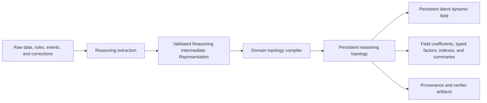
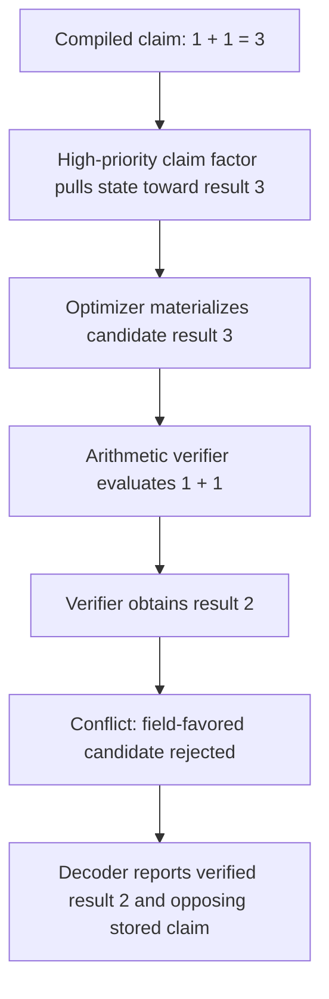
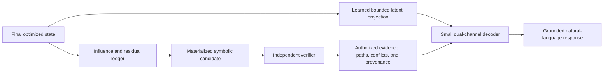
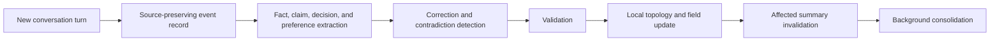
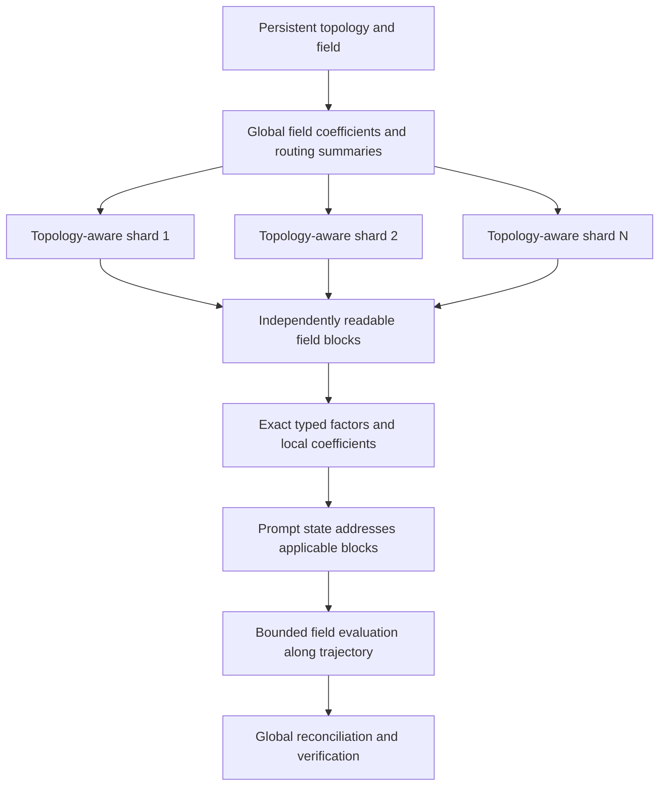

# Latent Topology Models: Canonical Architecture

## 1. Purpose and status

This document defines the intended architecture of a **Latent Topology Model
(LTM)**.

An LTM compiles information into a persistent, multi-variable latent dynamic
field. At request time, a prompt becomes an initial reasoning state. The
already-compiled field acts on that state, latent optimization moves it toward
an equilibrium, an independent verifier evaluates the resulting candidate,
and a small decoder expresses the authorized result in natural language.

This is an architectural specification, not evidence that a native LTM has
already been built. Mechanisms described as candidates must be experimentally
validated.

The central architectural idea is:

> Compile knowledge and reasoning structure once. Reuse the resulting field
> across requests. During ordinary inference, optimize the prompt state using
> a bounded set of applicable field variables instead of rereading the entire
> corpus or executing a large autoregressive model over all stored context.

## 2. The complete flow

### 2.1 Knowledge-compilation flow



Compilation is offline or incremental. It may be computationally expensive,
because it is amortized across future requests.

### 2.2 Request-serving flow

```mermaid
flowchart LR
    A["User prompt"]
    B["Prompt and goal encoder"]
    C["Initial structured latent state"]
    D["Evaluate applicable variables in the precompiled field"]
    E["Latent optimization"]
    F["Final equilibrium state"]
    G["Influence and residual materialization"]
    H["Independent verifier"]
    I["Authorized latent and symbolic bundle"]
    J["Small dual-channel decoder"]
    K["Natural-language answer, conflict, or abstention"]

    A --> B --> C --> D --> E --> F --> G --> H --> I --> J --> K
```



The system does not need to treat request-time inference as document retrieval.
The compiled field is the reasoning substrate. An implementation may read the
field coefficients addressed by the state, but it should not need to score all
source documents on every request.

### 2.3 Four primary components

The architecture has four primary components:

1. **Reasoning topology** — encodes knowledge, relations, rules, conflicts,
   applicability, uncertainty, and provenance.
2. **Latent dynamic field** — compiles those topology objects into persistent
   variables and energy functions that can act on a reasoning state.
3. **Latent optimizer** — moves the prompt state through the field toward a
   lower-energy equilibrium.
4. **Decoder** — translates the verified final state and its most influential
   variables into a grounded natural-language response.

Two supporting systems are mandatory:

- a topology and field compiler;
- an independent verifier.

## 3. Architectural invariants

An implementation qualifies as the intended LTM only if it preserves these
properties:

1. Knowledge is compiled into a persistent field before ordinary requests.
2. The field contains more than an undifferentiated average of embeddings.
3. Relation direction, argument roles, conflicts, and provenance survive
   compilation.
4. Adding information can increase field capacity and update field variables.
5. A prompt is an initial state acted upon by the compiled field.
6. Request-time optimization is distinct from corpus retrieval and decoding.
7. The final state is accompanied by an influence and residual ledger.
8. Contradictory claims remain identifiable after optimization.
9. A verifier separates convergence from correctness.
10. The decoder cannot silently overrule the verifier.
11. Storage and compilation may grow with the corpus even when ordinary
    request computation remains bounded.
12. The system never claims that a finite state contains the complete raw
    corpus losslessly.

## 4. Component 1 — Reasoning topology

### 4.1 Definition

The reasoning topology is a persistent, typed, attributed, versioned
hypergraph or factor graph:

\[
\mathcal{T}=(V,R,F,P,\Sigma,\nu)
\]

where:

- \(V\) contains entities, values, events, claims, goals, and states;
- \(R\) contains typed and role-labelled relations;
- \(F\) contains rules, constraints, and factor definitions;
- \(P\) maps every accepted object to exact provenance;
- \(\Sigma\) defines the domain schema and permitted compositions;
- \(\nu\) is the topology version.

The topology is not just a collection of semantically nearby vectors. It must
preserve what each object *does* in reasoning.

### 4.2 Required object families

The topology should support at least:

- entities and stable identities;
- values and typed states;
- observations and measurements;
- facts and unverified claims;
- user goals and queries;
- directed implications;
- multi-premise rules;
- prerequisites and dependencies;
- causal relations;
- temporal order and supersession;
- evidential support and opposition;
- incompatibility and mutual exclusion;
- hard and soft constraints;
- uncertainty and alternative hypotheses;
- confidence, authority, priority, recency, and applicability;
- source paths, spans, versions, and provenance.

### 4.3 Direction and roles

The following are different topology objects:

```text
A implies B
B implies A
A supports B
A contradicts B
A causes B
A occurs before B
```

The compiler must preserve relation direction and argument roles. A rule such
as

\[
(A\land B)\Rightarrow C
\]

cannot be reduced to three pairwise similarities without changing its meaning.

### 4.4 Reasoning Intermediate Representation

Information first becomes a source-grounded Reasoning Intermediate
Representation (RIR). Teacher-model extraction is allowed, but its output is
untrusted until deterministic validation succeeds.

Example claim:

```json
{
  "id": "claim-17",
  "kind": "claim",
  "subject": "standard-arithmetic",
  "predicate": "addition_result",
  "arguments": [1, 1],
  "claimed_value": 3,
  "truth_status": "unverified",
  "priority": 0.4,
  "confidence": 0.6,
  "authority": 0.2,
  "applicability": ["standard-arithmetic"],
  "source": {
    "path": "source/example.txt",
    "span": [12, 21]
  }
}
```

Example verified rule:

```json
{
  "id": "rule-thermal-1",
  "kind": "implication",
  "premises": [
    {
      "subject": "reactor-A",
      "predicate": "temperature_celsius",
      "operator": ">",
      "value": 80
    }
  ],
  "conclusion": {
    "subject": "reactor-A",
    "predicate": "requires_cooling",
    "value": true
  },
  "hard": true,
  "authority": 0.95,
  "source": {
    "path": "rules/thermal.json",
    "span": [10, 180]
  }
}
```

### 4.5 Domain configuration

A domain configuration defines:

- valid node and relation types;
- relation arity and argument roles;
- legal relation compositions;
- hard and soft semantics;
- units and value domains;
- confidence and authority interpretation;
- relation-specific residual and energy functions;
- conflict and branching policies;
- verifier functions;
- decoder-visible fields.

Example:

```json
{
  "schema_version": 1,
  "domain_id": "arithmetic",
  "relations": {
    "addition": {
      "arguments": ["left", "right", "result"],
      "directed": true,
      "energy": "addition_residual_v1",
      "verifier": "integer_addition_v1"
    }
  },
  "conflicts": {
    "policy": "preserve_branches",
    "allow_unverified_claim_to_override_axiom": false
  },
  "decoder_visible": [
    "verified_assignments",
    "opposing_claims",
    "residuals",
    "provenance"
  ]
}
```

### 4.6 Compilation sequence

```text
Source record
    ↓
Claim, fact, rule, event, or correction extraction
    ↓
Schema and type validation
    ↓
Identity and alias resolution
    ↓
Conflict and supersession detection
    ↓
Stable topology objects
    ↓
Typed latent parameters and factor modules
    ↓
Persistent field update
    ↓
Summary and index invalidation
    ↓
Verifier artifact generation
```

Source records must remain recoverable. Compiling information does not justify
discarding the exact evidence needed for auditing and verification.

## 5. Structured reasoning state

### 5.1 Why one vector is insufficient

A single semantic vector can represent topic or similarity, but it cannot
reliably preserve every entity assignment, directed rule, alternative branch,
and proof obligation needed for general reasoning.

The native optimized state is therefore a structured object:

\[
S=(x_g,X_e,X_r,y,b,c)
\]

where:

- \(x_g\) represents the encoded goal and global request state;
- \(X_e\) contains active entity and value states;
- \(X_r\) contains relation-role states;
- \(y\) contains discrete truth, selection, or activation assignments;
- \(b\) contains incompatible branches;
- \(c\) contains confidence and applicability variables.

The topology and exact evidence remain external to \(S\). The state is a
request-specific working configuration, not a lossless container for all
knowledge.

### 5.2 State validity

The state may live on a product manifold containing:

- unit spheres for normalized latent coordinates;
- Euclidean coordinates for unconstrained values;
- intervals for probabilities and confidence;
- categorical or Boolean variables;
- branch variables for incompatible alternatives.

Every optimizer update must preserve or restore the validity of these domains.

## 6. Component 2 — Persistent latent dynamic field

### 6.1 Definition

Let \(D\) be the compiled knowledge store and \(\Theta_D\) its persistent field
variables. The latent dynamic field is an evaluable potential:

\[
\Phi_D(S;\Theta_D)
\]

It returns the energy and force induced by compiled knowledge at a candidate
reasoning state \(S\).

The field is analogous to a precomputed electric field:

- compiled topology objects are analogous to charges and boundary conditions;
- \(\Theta_D\) stores the field representation;
- the prompt produces a new movable state;
- field evaluation calculates how that state should move;
- equilibrium occurs when permitted movement no longer lowers the request
  energy.

The analogy explains precomputation and force balance. It does not require
literal inverse-square Coulomb forces.

### 6.2 What is stored with the field

The persistent field can contain multiple families of variables:

- global basis coefficients;
- regional and local field coefficients;
- semantic content variables;
- entity and identity variables;
- relation-type and argument-role parameters;
- rule and dependency factors;
- causal and temporal factors;
- conflict and exclusion factors;
- uncertainty and calibration variables;
- confidence, authority, priority, and recency weights;
- topology addresses and routing summaries;
- approximation bounds;
- provenance references;
- verifier programs or symbolic checks.

These variables are what allow the field to grow in capacity as knowledge is
added. The architecture does not compress arbitrary unlimited information into
one fixed-size vector.

### 6.3 Multi-resolution representation

A candidate field representation is:

\[
\Phi_D(S)=
\Phi_0(S;\theta_0)
+\sum_{\ell=1}^{L}
\Phi_{\ell,c_\ell(S)}(S;\theta_{\ell,c_\ell(S)})
+\Phi_{\mathrm{typed}}(S)
\]

where:

- \(\Phi_0\) contains global summaries;
- level \(\ell\) contains progressively more local variables;
- \(c_\ell(S)\) addresses the region applicable to state \(S\);
- \(\Phi_{\mathrm{typed}}\) contains exact relation and constraint factors.

This is field addressing, not necessarily document retrieval. The state
determines which coefficients are required to evaluate the already-compiled
function at its current coordinates.

### 6.4 Incremental updates

When a validated datum \(z\) enters the topology, the compiler updates the
affected local variables and their ancestor summaries:

\[
\theta_{\ell,c_\ell(z)}
\leftarrow
\theta_{\ell,c_\ell(z)}+\Delta\theta_\ell(z)
\]

It may also create or update typed factors, conflict branches, provenance
links, and verifier artifacts.

An incremental update must record:

- the topology version before and after the update;
- coefficients and factors changed;
- summaries invalidated;
- conflicts introduced or resolved;
- provenance of the update;
- whether background recompilation is required.

### 6.5 Request energy

For prompt \(q\), the complete request energy is:

\[
E(S\mid q,D)=
\lambda_gE_{\mathrm{goal}}(S,q)
+\Phi_D(S;\Theta_D)
+E_{\mathrm{hard}}(S)
+E_{\mathrm{uncertainty}}(S)
\]

An expanded typed form is:

\[
\begin{aligned}
E(S\mid q,D)=
&E_{\mathrm{goal}}
+E_{\mathrm{facts}}
+E_{\mathrm{relations}}
+E_{\mathrm{dependencies}}\\
&+E_{\mathrm{causal}}
+E_{\mathrm{temporal}}
+E_{\mathrm{conflicts}}
+E_{\mathrm{uncertainty}}
+E_{\mathrm{hard}}.
\end{aligned}
\]

Each term must declare:

- its input types;
- the meaning of its residual;
- the source of its weight;
- how its gradient or update is calculated;
- its exact verifier equivalent;
- its provenance;
- how it behaves when summarized or sharded.

### 6.6 Prompt-conditioned influence

The persistent field does not mean that every stored item exerts equal force on
every prompt. Influence may depend on:

\[
w_i(q,S)=
f(\text{relevance},\text{priority},\text{confidence},
\text{authority},\text{recency},\text{applicability},
\text{relation role})
\]

This modulation must be compiled or cheaply evaluable. It should not require
rescoring every source document at request time.

### 6.7 Candidate typed energies

Supporting evidence can use an attraction residual:

\[
E_{\mathrm{support},i}(S)=w_i\rho_i(S,z_i).
\]

A directed implication \(A\Rightarrow B\) can use:

\[
E_{\Rightarrow}(S)=
w\,\sigma(a(S))\,[1-\sigma(b(S))],
\]

which penalizes an active premise with an inactive conclusion but not the
reverse direction.

A multi-premise rule can use:

\[
E_{\mathrm{rule}}(S)=
w\,\Big(\prod_{j=1}^{m}\sigma(p_j(S))\Big)
[1-\sigma(c(S))].
\]

Mutual exclusion can use:

\[
E_{\mathrm{exclude}}(S)=w\,\sigma(a(S))\sigma(b(S)).
\]

A prerequisite can use:

\[
E_{\mathrm{dependency}}(S)=
w\,\sigma(\text{dependent active})
[1-\sigma(\text{requirement satisfied})].
\]

Hard constraints should use barriers, projection, or exact discrete checks
rather than relying only on a large soft penalty.

These are candidate mechanisms. Their usefulness depends on whether low energy
corresponds to valid reasoning under independent verification.

## 7. Field forces and equilibrium

### 7.1 Force

For continuous state variables, field force is:

\[
F(S\mid q,D)=-\nabla_SE(S\mid q,D).
\]

The total force is the sum of goal, field, relation, conflict, uncertainty, and
hard-constraint contributions.

### 7.2 Weighted balance example

For two compatible quadratic constraints located at \(z_A\) and \(z_B\):

\[
E(x)=2\lVert x-z_A\rVert^2+\lVert x-z_B\rVert^2.
\]

The equilibrium is:

\[
x^*=\frac{2z_A+z_B}{3}.
\]

It lies one-third of the way from the stronger point toward the weaker point.
This is the precise version of the electric-charge analogy for quadratic
energies.

That result is only a weighted barycenter. A useful reasoning field must also
contain nonlinear wells, directed relation energies, discrete assignments,
hard constraints, and explicit conflict branches. Otherwise latent
optimization is merely weighted averaging.

### 7.3 Equilibrium definition

For the permitted tangent space \(T_S\), a continuous local equilibrium obeys:

\[
\left\lVert
\operatorname{Proj}_{T_S}\nabla_SE(S^*\mid q,D)
\right\rVert\leq\varepsilon.
\]

This means that a permitted local movement no longer materially reduces the
chosen objective.

It does **not** mean:

- every stored claim is true;
- every contradiction has disappeared;
- the optimum is global;
- the state has been independently verified;
- the complete raw corpus is contained in \(S^*\).

### 7.4 Average, well, and reasoning result

| Object | Meaning |
| --- | --- |
| Weighted average | Closed-form combination of fixed vectors |
| Semantic equilibrium | Balance of similarity-derived forces |
| Attractor or well | Local region toward which nearby states move |
| Constraint equilibrium | State minimizing typed constraint violations |
| Verified reasoning result | Materialized constraint equilibrium accepted by an independent verifier |

Optimization cannot manufacture reasoning relations that were never encoded
in the topology or field.

## 8. Contradictions, priorities, and false information

### 8.1 Default contradiction behavior

When two claims are logically incompatible, LTM must not erase them into an
unlabelled midpoint. It must:

1. preserve both claims and their provenance;
2. create distinct branch or assignment variables;
3. let priority, confidence, authority, recency, and applicability influence
   their energies;
4. retain a residual for each alternative;
5. materialize the conflict after optimization;
6. ask the verifier whether either branch is admissible;
7. abstain or report unresolved tension when the conflict cannot be resolved.

### 8.2 What priority does

If an incorrect claim is relevant and prioritized strongly enough, it can pull
the optimized state toward itself. The field does not automatically know truth;
it represents compiled constraints and their assigned semantics.

Suppose the field contains a claim that standard arithmetic gives
\(1+1=3\). If that claim dominates all other applicable field terms, the
equilibrium candidate may favor \(3\).

What becomes the final answer depends on the verifier:



Without an appropriate verifier, the system may output \(3\). That is expected:
latent optimization identifies the state favored by the compiled field; it
does not independently guarantee that the compiled field is truthful.

If the topology explicitly defines a fictional arithmetic domain in which
\(1+1=3\) is a hard axiom, the decoder may state \(3\), but it must identify
the domain assumption.

### 8.3 Meaning of satisfaction

“Satisfying the field” means:

> minimizing prompt-conditioned weighted residuals subject to hard constraints,
> while preserving irreducible conflicts and uncertainty.

It does not mean giving every datum equal influence or declaring incompatible
claims simultaneously true.

## 9. Component 3 — Latent optimizer

### 9.1 Responsibility

The optimizer begins at the prompt-derived state and searches for a valid
lower-energy state under a bounded computation budget.

### 9.2 Request-time procedure

1. Encode the prompt, explicit goal, domain, and requested output.
2. Initialize structured state \(S_0\).
3. Address the compiled field variables applicable at \(S_0\).
4. Evaluate total energy, per-term energy, forces, and residuals.
5. Propose continuous and discrete updates.
6. Project continuous updates onto valid manifolds.
7. preserve or branch incompatible alternatives.
8. Use backtracking, a trust region, or another acceptance rule.
9. Reject invalid or unjustified energy-increasing updates.
10. Re-address local field coefficients if the state crosses a field region.
11. Stop on convergence, infeasibility, or budget exhaustion.
12. Materialize the final state into explicit candidate assignments and an
    influence ledger.
13. Send the candidate to the independent verifier.

### 9.3 Continuous update

A simple projected update is:

\[
\widetilde S_{t+1}=S_t-\eta_t
\operatorname{Proj}_{T_{S_t}}\nabla E(S_t\mid q,D),
\]

followed by a retraction or projection:

\[
S_{t+1}=\operatorname{Retract}(\widetilde S_{t+1}).
\]

The implementation should evaluate the compiled field at the state, not scan
every original datum to reconstruct the force from scratch.

### 9.4 Discrete and branched updates

Continuous gradients alone cannot reliably represent Boolean choices,
mutually exclusive explanations, or combinatorial assignments. Candidate
mechanisms include:

- alternating continuous and discrete optimization;
- differentiable relaxations followed by exact projection;
- beam search over a bounded number of branches;
- message passing over activated factors;
- a domain constraint solver for hard assignments.

If a conventional solver performs the actual reasoning, the system must report
that fact. Latent optimization should not receive credit for work done by an
unreported solver.

### 9.5 Optimizer output contract

The optimizer returns:

- initial and final structured states;
- initial and final energy;
- convergence reason;
- accepted and rejected updates;
- per-term energy histories;
- per-constraint residuals;
- field coefficient and topology IDs addressed;
- branch assignments and unresolved alternatives;
- approximation bounds;
- numerical diagnostics;
- resource use;
- an influence ledger;
- exact provenance references.

### 9.6 Correctness ladder

These statements are progressively stronger and must not be conflated:

1. the numerical update ran;
2. energy decreased;
3. the state reached a local equilibrium;
4. the state is feasible;
5. the materialized candidate satisfies the applicable constraints;
6. the independent verifier accepts it;
7. the decoder faithfully expresses the verified result.

## 10. Influence and candidate materialization

The final latent state is not sent blindly to a language model. A
materialization stage creates an inspectable bridge between optimization and
language.

### 10.1 Influence ledger

For every important field contribution, record:

- field variable or factor ID;
- topology object and relation type;
- signed contribution to the final energy;
- force magnitude along the accepted trajectory;
- initial and final residual;
- assigned priority and reliability weights;
- whether it supported or opposed the selected candidate;
- whether it remained unresolved;
- exact source provenance;
- approximation status.

“Most influential” must be defined by a reproducible measure, such as
accumulated work along the trajectory, residual reduction, counterfactual
energy change, or a validated attribution method. Nearest-vector similarity
alone is insufficient.

### 10.2 Materialized candidate

The materialized candidate contains:

- explicit entity and value assignments;
- activated premises and conclusions;
- reasoning or dependency paths;
- selected conflict branches;
- hard-constraint status;
- uncertainty estimates;
- unsatisfied constraints;
- exact supporting and opposing evidence;
- the influence ledger.

This candidate is what the verifier checks.

## 11. Independent verifier

### 11.1 Boundary

The verifier checks the candidate using domain rules that are independent of
the optimizer’s convergence test. Repeating the same energy calculation is not
independent verification.

It checks:

- hard constraints;
- relation direction and argument roles;
- proof and dependency paths;
- executable arithmetic or domain functions;
- discrete assignment consistency;
- temporal applicability and supersession;
- conflict handling;
- provenance existence;
- unsupported certainty;
- aggregation and routing bounds.

### 11.2 Outcomes

The verifier returns one of:

- `verified`;
- `verified_with_unresolved_tension`;
- `partial`;
- `infeasible`;
- `numerically_unconverged`;
- `unverifiable`;
- `rejected`.

It also returns the exact assignments and claims the decoder is allowed to
state.

## 12. Component 4 — Dual-channel decoder

### 12.1 Decoder flow



The decoder uses two complementary channels.

### 12.2 Latent channel

The final structured state is transformed by a learned adapter into a small
decoder-native latent prefix:

\[
H_{\mathrm{latent}}=A_\psi(S^*,\Delta S,\mathcal I),
\]

where:

- \(S^*\) is the final state;
- \(\Delta S\) summarizes the optimization trajectory;
- \(\mathcal I\) contains bounded influence statistics;
- \(A_\psi\) maps this controlled representation into the decoder’s embedding
  space.

This channel may communicate:

- which equilibrium region was reached;
- the balance of supporting and opposing forces;
- branch and confidence patterns;
- local field curvature or stability;
- information preserved by the optimized state but awkward to express as a
  small symbolic table.

The decoder is not expected to translate an arbitrary vector with no learned
alignment. The adapter must be trained on controlled state-to-bundle-to-output
examples and tested against shuffled or corrupted states.

### 12.3 Authorized symbolic channel

The symbolic channel contains:

- original prompt and normalized goal;
- verifier status;
- verified candidate assignments;
- exact reasoning or relation paths;
- strongest supporting influences;
- strongest opposing influences;
- high-priority unsatisfied constraints;
- conflict branches;
- assumptions and uncertainty;
- exact evidence and provenance;
- approximation warnings.

### 12.4 Authority order

The decoder obeys this authority order:

1. verifier result and hard constraints;
2. authorized symbolic candidate and exact evidence;
3. latent channel as a bounded description of the equilibrium;
4. language priors only for fluent expression.

The latent channel may shape phrasing and communicate continuous structure, but
it cannot authorize a factual claim rejected or absent from the symbolic
bundle.

### 12.5 Decoder obligations

The decoder must:

- answer only from authorized inputs;
- cite factual statements to exact provenance;
- distinguish observed fact, derived conclusion, and assumption;
- disclose unresolved contradictions and important residuals;
- avoid claiming that every field constraint was true;
- avoid searching hidden corpus content;
- avoid performing unreported reasoning that repairs a bad candidate;
- return a deterministic report or abstention when verification fails.

### 12.6 Example decoder bundle

```json
{
  "prompt": "What is 1 + 1?",
  "final_state_projection": "adapter-controlled-latent-prefix",
  "candidate": {
    "operation": "addition",
    "arguments": [1, 1],
    "field_favored_result": 3
  },
  "influences": [
    {
      "factor_id": "claim-17",
      "direction": "toward_3",
      "priority": 10.0,
      "provenance": "source/example.txt:12"
    }
  ],
  "verifier": {
    "status": "rejected",
    "verified_result": 2,
    "reason": "integer_addition_v1"
  },
  "authorized_claims": [
    "Standard integer addition gives 2.",
    "The stored field contains an opposing high-priority claim that gives 3."
  ]
}
```

An acceptable decoded response is:

> Standard integer addition gives 2. The compiled field contained a
> high-priority opposing claim that favored 3, but the arithmetic verifier
> rejected that candidate.

## 13. Persistent conversational context

### 13.1 Memory levels

LTM uses three levels of conversational memory:

1. recent verbatim working memory;
2. compiled episodic conversation topology;
3. consolidated long-term reasoning topology.

### 13.2 Incremental conversation compilation



Old conversation need not be resent verbatim on every request after it has been
compiled. This reduces repeated context processing, but compilation,
validation, conflict detection, indexing, and compaction still consume
resources.

Corrections must supersede rather than silently coexist with older preferences
unless the scopes differ.

## 14. Large-field inference

### 14.1 Storage hierarchy

A large compiled field may use:



Physical storage may be SSD, memory, or accelerators. Only the field blocks
needed along the state trajectory need to be resident on the accelerator for
an ordinary routed request.

### 14.2 Local and global variables

The field should separate:

- global coefficients that influence broad regions;
- regional coefficients that encode domain or cluster structure;
- local coefficients that preserve detailed facts and rules;
- exact cross-region relations;
- conflict and temporal links;
- summaries with explicit approximation bounds.

Local shard outputs must not be combined by naïve averaging. They should be
reconciled in a global field containing cross-shard constraints and then
verified.

### 14.3 Complexity

For \(N\) compiled objects, \(K\) optimizer steps, \(V\) addressed field
variables per step, and state width \(d\), a target ordinary-request cost is:

\[
C_{\mathrm{request}}=
C_{\mathrm{encode}}
+C_{\mathrm{address}}
+C_{\mathrm{IO}}
+\Theta(KVd)
+C_{\mathrm{verify}}
+C_{\mathrm{decode}}.
\]

With hierarchical addressing, \(C_{\mathrm{address}}\) may be approximately
\(O(\log N)\). If \(K\), \(V\), and \(d\) are bounded, only the active
optimization portion is approximately constant with respect to total corpus
size.

The complete system is not globally \(O(1)\):

- storage grows at least with retained information;
- compilation and exact ingestion are at least \(O(N)\) over all data;
- updates require local writes and summary maintenance;
- genuinely global questions may need to expand many or all field regions;
- exact worst-case inference can remain \(O(N)\).

“Practically unlimited context” therefore means an expandable persistent store
with bounded ordinary activation—not literal unlimited information or constant
worst-case work.

## 15. End-to-end example

Consider the question:

> May release 42 be deployed?

The topology contains:

- tests passed;
- security approval exists;
- rollback readiness is unknown;
- deployment requires all three premises;
- an old low-authority note says deployment is allowed without rollback;
- every object retains provenance.

The flow is:

```text
Prompt and goal encoding
    ↓
Initial state: deployment approval requested
    ↓
Precompiled field evaluation
    ↓
Test and security factors support deployment
    ↓
Hard multi-premise rule opposes deployment because rollback is unknown
    ↓
Old low-authority note produces a weaker competing influence
    ↓
Optimizer reaches a state favoring “not yet deployable”
    ↓
Influence ledger materializes the missing prerequisite and opposing note
    ↓
Verifier checks the three required premises
    ↓
Verifier returns partial/infeasible-for-approval
    ↓
Decoder states that deployment is not yet authorized, cites the evidence,
and identifies rollback readiness as the unresolved requirement
```

This is more than semantic averaging only if the multi-premise rule remains
typed, directional, and independently verifiable.

## 16. What the architecture does and does not promise

### 16.1 Intended capabilities

If its hypotheses hold, a mature LTM could provide:

- persistent compiled knowledge without resending all context;
- incremental updates;
- bounded ordinary request computation;
- explicit constraint and conflict handling;
- auditable influence and provenance;
- a small decoder that verbalizes rather than performs the core reasoning;
- separate routed and exhaustive inference modes.

### 16.2 Non-promises

The architecture does not by itself guarantee:

- truth from incorrect or maliciously weighted data;
- exact constant-cost inference for arbitrary global questions;
- lossless compression of unlimited information into fixed capacity;
- global optimization;
- reasoning relations absent from the topology;
- correctness without independent verification;
- frontier-model quality or any particular serving price.

## 17. Failure modes

The architecture fails if any of the following remains unavoidable:

- extraction errors silently become authoritative field factors;
- relation direction or argument roles are lost;
- the field becomes only a semantic average;
- distinct facts interfere destructively as storage grows;
- false high-priority claims bypass verification;
- contradictions disappear into unlabelled compromises;
- field addressing misses necessary relations;
- aggregate summaries create false equilibria;
- optimization converges to irrelevant wells;
- branch count grows without a controllable policy;
- verifier behavior is merely correlated with the optimizer;
- decoder reasoning repairs or replaces the measured latent result;
- ordinary requests require scanning the complete field;
- simpler retrieval, graph search, or constraint solvers perform the same work
  more accurately and cheaply.

## 18. Falsifiable architectural milestones

The architecture should be validated in this order:

1. **Persistent nonlinear field:** compile data into a reusable field and
   evaluate prompts without scanning source documents.
2. **Capacity and interference:** add increasing numbers of field wells and
   measure rare-item retention, collisions, and incremental-update drift.
3. **Bounded field serving:** demonstrate flat or logarithmic ordinary-request
   scaling while storage grows.
4. **Typed relations:** preserve direction, argument roles, dependencies, and
   conflicts through compilation and materialization.
5. **Unseen composition:** solve held-out multi-premise and relation-composition
   problems that similarity and averaging cannot solve.
6. **Independent verification:** detect field-favored but invalid candidates,
   including highly prioritized false claims.
7. **Faithful dual-channel decoding:** show that the decoder uses the correct
   latent state while remaining bounded by verified evidence.
8. **Large-field routing:** preserve exact reasoning paths across shards with
   measured approximation and miss rates.

The decisive reasoning test is not whether a prompt reaches an equilibrium.
It is whether the compiled native topology and field cause that equilibrium to
represent a valid unseen reasoning solution that simpler similarity-based
methods cannot produce.

## 19. Canonical definition

> A Latent Topology Model is a system that incrementally compiles typed
> knowledge and reasoning relations into an expandable persistent latent
> dynamic field; encodes a prompt as an initial structured state; evaluates
> applicable precompiled field variables along a bounded optimization
> trajectory; reaches and materializes a constraint equilibrium; independently
> verifies the resulting candidate; and uses a small dual-channel decoder to
> express the verified state together with its strongest influences,
> unresolved conflicts, assumptions, and exact provenance.
