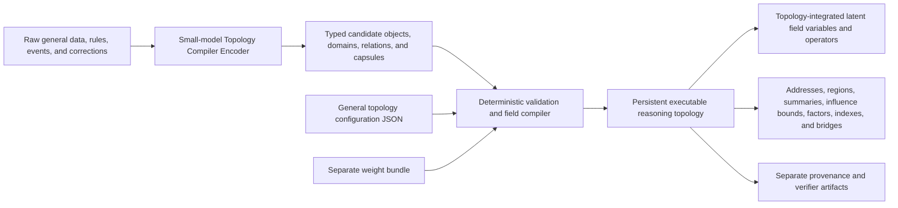
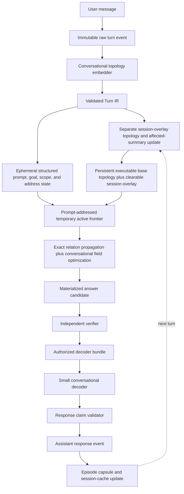
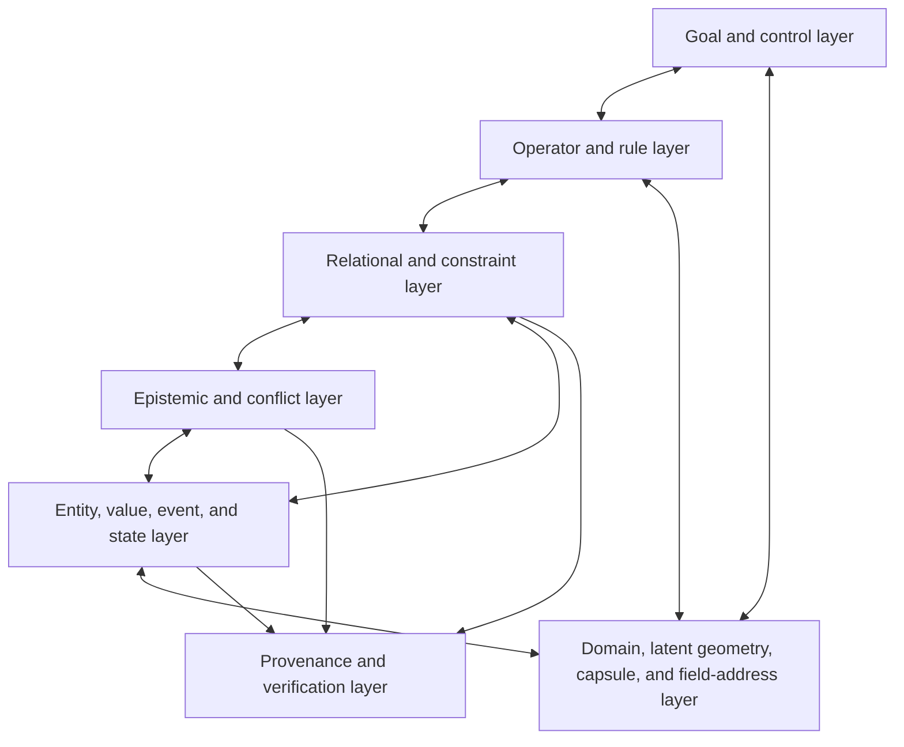
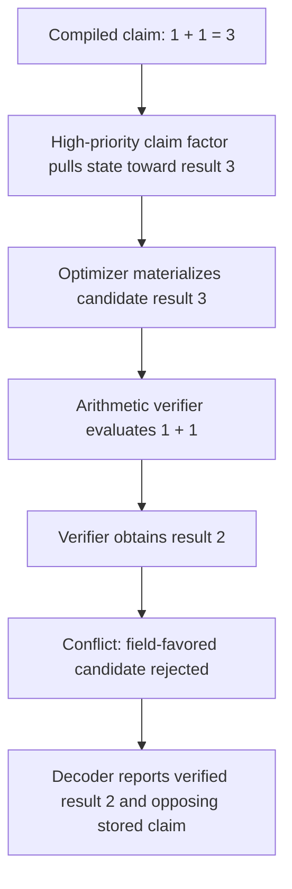
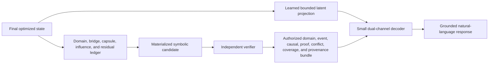
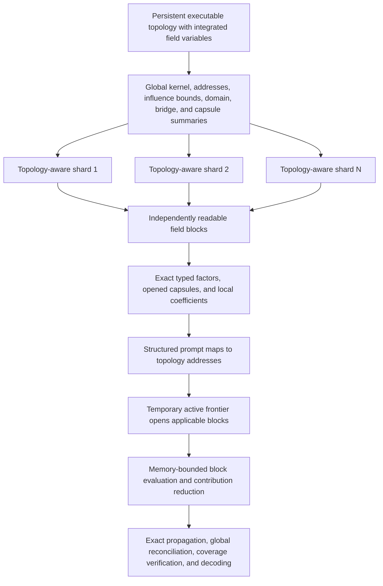

# Latent Topology Models: Canonical Architecture — Infinity-2

## 1. Purpose and status

This document defines the intended architecture of a **Latent Topology Model
(LTM)**.

An LTM compiles information into a persistent, executable reasoning topology.
That topology is the authoritative map and storage structure of the
multi-variable latent dynamic field: it contains stable addresses, typed
relations, field variables, summaries, influence bounds, exact-data pointers,
and provenance. At request time, a prompt becomes an initial structured state
and is mapped to starting addresses in that topology. Topology-directed field
evaluation acts on the state, latent optimization moves it toward an
equilibrium, an independent verifier evaluates the resulting candidate and
coverage, and a small decoder expresses the authorized result in natural
language.

This is an architectural specification. A controlled conversational native
topology was implemented and tested in CNTG-1-R2, but the result is not a
general LTM validation. Mechanisms described as candidates must still be
experimentally validated outside the registered fictional ontology.

**Infinity-2** is the conversational-first revision. It co-designs topology,
field state, optimization, verification, and decoding by working backwards
from the exact verified state a conversational decoder must express. The first
native target is a persistent multi-turn conversational LTM. General-domain
reasoning and specialist topologies are later targets.

The conversational measured boundary and limitations are recorded in the
[CNTG-1-R2 report](report.md). The narrower latent-state boundary is recorded
in the [MICRO-LTM-3 report](micro-ltm-3-report.md). The next product gate is a
learned topology-compiler and prompt-addressing experiment; a 100-million-token
quality build is not authorized until compiler validity, required-factor
activation, and coverage verification pass at smaller scales.

### 1.1 Current evidence boundary

The controlled experiment demonstrated that correctly formed typed topology
can feed a persistent field, structured optimizer, independent verifier, and
grounded decoder. Registered relation composition improved by 100 percentage
points over the no-optimization control, session context was preserved, and
ordinary field activation remained sparse across the 64 MB–1 GB ladder.

The central unresolved product boundary is the topology compiler: the small
model directly produced valid Turn IR for only 10% of turns, while
deterministic recovery handled the remaining controlled language. Therefore
the current evidence supports the downstream architecture given a valid
topology; it does not yet support unrestricted natural-language topology
construction.

MICRO-LTM-3 sharpened the optimizer boundary. Exact topology propagation
recovered the registered conclusions perfectly, but the strict differentiable
single-state optimizer plus query-agnostic compression reached only 49.86%
locked accuracy and failed the causal state-swap gate. The earlier closure-only
compression diagnostic reached 99.17%, but it did not demonstrate reasoning by
latent equilibrium. Consequently, the shippable architecture uses exact typed
relation propagation plus structured field optimization and global
reconciliation. Pure equilibrium reasoning remains a parallel research track,
not a prerequisite for the first product.

The central architectural idea is:

> Compile knowledge and reasoning structure once into an explicit, addressable,
> executable topology. Map each prompt to topology addresses, traverse the
> typed relations capable of affecting its goal, evaluate exact constraints and
> certified summaries, and optimize a bounded working state without rereading
> the entire corpus or resending all stored context to an autoregressive model.

### 1.2 Shippable architecture decision

The initial conversational product follows these decisions:

1. The executable reasoning topology is the persistent map of the latent
   dynamic field. There is no separately authoritative stored mini-map.
2. The prompt encoder emits a structured query signature and stable starting
   topology addresses, not only an undifferentiated semantic vector.
3. The request constructs a temporary active frontier by following applicable
   typed relations from those addresses.
4. Persistent regions contribute through exact opened factors or declared
   aggregate summaries with measured influence bounds and coverage status.
5. Registered implications, prerequisites, corrections, temporal relations,
   hard constraints, and exact exceptions use topology-directed exact
   propagation for the first product. Structured latent optimization handles
   soft compatibility, uncertainty, conflicts, references, preferences, and
   global reconciliation.
6. Memory-bounded field blocks emit standardized contributions that are
   reduced before a global update; storage order is not allowed to determine
   the answer.
7. The verifier checks prompt addressing, derivation, provenance, hard
   constraints, omissions, and coverage and widens the frontier or abstains
   when necessary.
8. The decoder receives the final structured latent state plus the authorized
   symbolic, influence, conflict, coverage, and provenance bundle.
9. Persistent base knowledge and the clearable conversational overlay are
   separately owned layers. User turns and accepted assistant response events
   are incrementally compiled into the overlay with distinct authority.
10. The first capacity target is a 100-million-source-token-equivalent
    persistent conversation/workspace, reached through locked 1M, 10M, 30M,
    and 100M scaling gates.

## 2. The complete flow

### 2.1 Knowledge-compilation flow



Compilation is offline or incremental. It may be computationally expensive,
because it is amortized across future requests.

### 2.2 Request-serving flow

```mermaid
flowchart LR
    A["User prompt"]
    B["Prompt and goal encoder"]
    C["Initial structured latent state"]
    D["Map goal, entities, scope, time, and predicates to topology addresses"]
    E["Construct temporary active frontier by typed topology traversal"]
    O["Open influential regions and exact exceptions"]
    P["Evaluate field blocks and aggregate typed forces and constraints"]
    F["Exact propagation plus structured latent optimization and global reconciliation"]
    G["Final state, influence ledger, derivation graph, and coverage certificate"]
    H["Independent verifier; widen frontier when coverage is insufficient"]
    I["Authorized latent and symbolic bundle"]
    J["Small dual-channel decoder"]
    K["Natural-language answer, conflict, or abstention"]

    A --> B --> C --> D --> E
    E <--> O
    E --> P --> F --> G --> H
    H -. "coverage retry" .-> E
    H --> I --> J --> K
```



The system does not need to treat request-time inference as document retrieval.
The executable topology and its integrated field representation are the
reasoning substrate. The request creates a temporary active frontier, not a
second persistent mini-map or copy of the field. An implementation may read
the coefficients and exact factors addressed through topology traversal, but
it should not need to score all source documents on every ordinary request.

### 2.3 Four primary components

The architecture has four primary components:

1. **Reasoning topology** — is the persistent executable map of knowledge and
   field structure. It encodes stable addresses, hierarchical domain regions,
   typed bridges, nested capsules, relations, rules, conflicts, applicability,
   uncertainty, summaries, influence bounds, indexes, and provenance.
2. **Latent dynamic field** — is the evaluable force and energy behavior
   induced by that topology at a request state. It is integrated with the
   topology rather than stored as an unrelated second knowledge structure.
3. **Latent optimizer** — combines exact typed relation propagation, field
   evaluation, batched contribution aggregation, and global reconciliation to
   move the prompt state toward a lower-energy valid equilibrium.
4. **Decoder** — translates the verified final state and its most influential
   variables into a grounded natural-language response.

Two supporting systems are mandatory:

- a topology and field compiler;
- an independent verifier.

### 2.4 Infinity-2 conversational turn loop

Infinity-2 treats a message, its temporary reasoning state, and its durable
memory effects as separate objects. A raw turn is preserved exactly. A
validated turn IR updates a session-delta topology. The current prompt becomes
an ephemeral goal state, is optimized against the persistent and session
fields, and is discarded after materialization. The assistant response is
stored as a conversational event, not as self-authenticating evidence.



The response validator re-extracts factual claims from decoder text and checks
that each is authorized by the verifier bundle. Rejected decoder text never
enters conversational memory as a validated claim.

## 3. Architectural invariants

An implementation qualifies as the intended LTM only if it preserves these
properties:

1. Knowledge is compiled into a persistent field before ordinary requests.
2. The field contains more than an undifferentiated average of embeddings.
3. Relation direction, argument roles, conflicts, and provenance survive
   compilation.
4. Adding information can increase field capacity and update field variables.
5. A prompt is an initial state acted upon by the compiled field.
6. Request-time optimization is distinct from corpus retrieval and decoding.
7. The final state is accompanied by an influence and residual ledger.
8. Contradictory claims remain identifiable after optimization.
9. A verifier separates convergence from correctness.
10. The decoder cannot silently overrule the verifier.
11. Storage and compilation may grow with the corpus even when ordinary
    request computation remains bounded.
12. The system never claims that a finite state contains the complete raw
    corpus losslessly.
13. Every request targets one explicitly versioned general topology.
14. Configuration, source data, weights, compiled field state, provenance, and
    verifier artifacts remain separately identifiable.
15. The topology contains hierarchical multi-label domain regions and explicit
    cross-domain bridges rather than one undifferentiated semantic space.
16. Related events and reasoning episodes may be folded into nested capsules,
    but their boundary, field summary, error bound, and provenance remain
    visible to the global topology.
17. Model-inferred causation enters as a hypothesis until validated.
18. A fictional domain region's axioms are authoritative only inside its
    disclosed scope.
19. Raw conversation turns are preserved separately from extracted topology
    claims and temporary prompt states.
20. Conversational salience and epistemic authority are distinct weight
    channels; recent text does not become true merely because it is recent.
21. Assistant responses cannot serve as independent evidence for their own
    claims.
22. Corrections supersede matching earlier claims without deleting their
    provenance or escaping their scope.
23. Decoder-visible claims must map to verified optimized-state variables, and
    those variables must map to declared topology factors.
24. Conversation compression must preserve answers, scopes, corrections,
    conflicts, preferences, and exact evidence within registered error bounds.
25. The persistent reasoning topology itself is the executable map of the
    latent dynamic field; a separately persisted request mini-map is neither
    required nor authoritative.
26. Every prompt is encoded into explicit goal, entity, predicate, scope,
    temporal, polarity, modality, and resource-budget fields before topology
    activation begins.
27. A request creates only an ephemeral active frontier whose objects retain
    stable addresses back to the persistent topology.
28. Every persistent region contributes either through a declared aggregate
    field summary or through exact opened factors; omission and approximation
    must be recorded in the coverage certificate.
29. Batched or sequential field execution aggregates standardized force,
    constraint, conflict, and evidence contributions before global state
    reconciliation. Batch order must not silently determine the answer.
30. The immutable base topology and clearable conversation overlay remain
    separately addressable, versioned, attributable, and deletable, including
    their derived summaries and caches.

### 3.1 Decoder-to-topology co-design contract

Infinity-2 defines the conversational topology by working backwards from the
authorized state needed to produce a correct answer:

```text
Desired conversational answer
    ↓
Authorized decoder bundle
    ↓
Materialized optimized state
    ↓
Registered energy and residual terms
    ↓
Typed topology objects and relations
    ↓
Validated conversational Turn IR
```

The canonical conversational state is:

\[
S_t=(g,a,y,r,p,b,u,e)
\]

where:

- \(g\) is the current conversational goal;
- \(a\) is the authorized response act;
- \(y\) contains proposition assignments;
- \(r\) contains entity and reference bindings;
- \(p\) contains active preferences and instructions;
- \(b\) contains explicit conflict branches;
- \(u\) contains calibrated uncertainty;
- \(e\) contains evidence and proof-path authorizations.

The decoder may receive a learned projection of this state, but an arbitrary
latent vector is never the sole authority for factual language. Every factual
decoder claim must be recoverable from \((y,b,u,e)\) and accepted by the
independent verifier.

The conversational objective is:

\[
\begin{aligned}
E_{\mathrm{conversation}}(S_t)={}&
E_{\mathrm{goal}}
+E_{\mathrm{claim}}
+E_{\mathrm{reference}}
+E_{\mathrm{supersession}}\\
&+E_{\mathrm{scope}}
+E_{\mathrm{preference}}
+E_{\mathrm{conflict}}
+E_{\mathrm{uncertainty}}.
\end{aligned}
\]

Each energy term has a topology-side factor, a materialized residual, a
verifier implementation, a decoder-visible explanation, and exact provenance.

## 4. Component 1 — Reasoning topology

### 4.1 Definition

The reasoning topology is a persistent, typed, attributed, versioned,
general-purpose hypergraph or factor graph with hierarchical domain regions
and nested capsules:

\[
\mathcal{T}_G=(K,V,R,F,\mathcal D,\mathcal B,\mathcal C,P,\Theta,\Sigma,\nu)
\]

where:

- \(K\) is the universal reasoning kernel;
- \(V\) contains entities, values, events, claims, goals, and states;
- \(R\) contains typed and role-labelled relations;
- \(F\) contains rules, constraints, and factor definitions;
- \(\mathcal D\) contains hierarchical multi-label domain regions;
- \(\mathcal B\) contains typed cross-domain bridges;
- \(\mathcal C\) contains nested event and reasoning capsules;
- \(P\) maps every accepted object to exact provenance;
- \(\Theta\) contains compiled field variables and learned parameters;
- \(\Sigma\) defines the universal schema, domain-extension contract, and
  permitted compositions;
- \(\nu\) is the topology version.

The topology is not just a collection of semantically nearby vectors. It must
preserve what each object *does* in reasoning.

It is also the persistent executable map of the latent dynamic field. The
canonical topology instance stores or directly addresses:

- stable node, relation, factor, region, bridge, and capsule addresses;
- adjacency and reverse-dependency indexes;
- semantic and reasoning coordinates;
- relation-specific transfer and residual operators;
- regional density, mass, summaries, and approximation bounds;
- maximum possible influence and exact-exception flags;
- persistent base-field and clearable session-overlay ownership;
- exact interiors and source records through provenance pointers.

No separately persisted “mini-map” is part of the canonical architecture. A
runtime may cache traversals or materialized views, but those caches are
derived, invalidatable artifacts. The topology remains authoritative.

One topology instance defines one general reasoning world containing multiple
scoped domain interpretations. The same source object may participate in
several domain regions through distinct typed memberships without duplicating
its provenance.

### 4.2 Required object families

The topology should support at least:

- entities and stable identities;
- values and typed states;
- observations and measurements;
- facts and unverified claims;
- user goals and queries;
- directed implications;
- multi-premise rules;
- prerequisites and dependencies;
- causal relations;
- temporal order and supersession;
- evidential support and opposition;
- incompatibility and mutual exclusion;
- hard and soft constraints;
- uncertainty and alternative hypotheses;
- confidence, authority, priority, recency, and applicability;
- source paths, spans, versions, and provenance.

### 4.3 Direction and roles

The following are different topology objects:

```text
A implies B
B implies A
A supports B
A contradicts B
A causes B
A occurs before B
```

The compiler must preserve relation direction and argument roles. A rule such
as

\[
(A\land B)\Rightarrow C
\]

cannot be reduced to three pairwise similarities without changing its meaning.

### 4.4 Reasoning Intermediate Representation

Information first becomes a source-grounded Reasoning Intermediate
Representation (RIR). Teacher-model extraction is allowed, but its output is
untrusted until deterministic validation succeeds.

Example claim:

```json
{
  "id": "claim-17",
  "kind": "claim",
  "subject": "standard-arithmetic",
  "predicate": "addition_result",
  "arguments": [1, 1],
  "claimed_value": 3,
  "truth_status": "unverified",
  "priority": 0.4,
  "confidence": 0.6,
  "authority": 0.2,
  "applicability": ["standard-arithmetic"],
  "source": {
    "path": "source/example.txt",
    "span": [12, 21]
  }
}
```

Example verified rule:

```json
{
  "id": "rule-thermal-1",
  "kind": "implication",
  "premises": [
    {
      "subject": "reactor-A",
      "predicate": "temperature_celsius",
      "operator": ">",
      "value": 80
    }
  ],
  "conclusion": {
    "subject": "reactor-A",
    "predicate": "requires_cooling",
    "value": true
  },
  "hard": true,
  "authority": 0.95,
  "source": {
    "path": "rules/thermal.json",
    "span": [10, 180]
  }
}
```

### 4.5 General topology configuration

A general topology configuration defines:

- universal node and relation types;
- domain discovery, hierarchy, and promotion policies;
- domain-extension contracts;
- capsule kinds, boundaries, summaries, and opening policies;
- relation arity and argument roles;
- legal relation compositions;
- hard and soft semantics;
- units and value domains;
- confidence and authority interpretation;
- relation-specific residual and energy functions;
- conflict and branching policies;
- verifier functions;
- decoder-visible fields.

The configuration describes the reasoning language and references versioned
artifacts. It does not contain the complete knowledge corpus, learned parameter
tensors, or compiled field blocks inline.

Minimal example:

```json
{
  "schema_version": 1,
  "topology_id": "general-reasoning-v1",
  "domains": {
    "mode": "seeded_and_discovered",
    "multi_label": true,
    "hierarchical": true,
    "unknown_policy": "provisional_region"
  },
  "relations": {
    "implies": {
      "arguments": ["premise", "conclusion"],
      "directed": true,
      "energy": "implication_residual_v1",
      "verifier": "implication_check_v1"
    }
  },
  "capsules": {
    "enabled": true,
    "hierarchical": true,
    "causal_inference_default": "hypothesis",
    "opening_policy": "relevance_residual_or_verifier"
  },
  "conflicts": {
    "policy": "preserve_branches"
  },
  "decoder_visible": [
    "verified_assignments",
    "opposing_claims",
    "residuals",
    "provenance"
  ]
}
```

### 4.6 General-topology decision

**Architectural decision:** The first native LTM is one general reasoning
topology. It contains a universal kernel, automatically organized domain
regions, explicit cross-domain bridges, and nested event or reasoning capsules.

The topology does not force all information into one semantic geometry. It
maintains specialized internal regions while allowing verified relations to
cross their boundaries.

Consequences:

- the topology has one general topology ID and version;
- data may receive several domain memberships with independent confidence;
- broad domains may be seeded while subdomains are discovered from structure;
- unknown structures enter provisional regions rather than silently changing
  the universal schema;
- cross-domain reasoning requires explicit typed bridge factors;
- domain-relative axioms remain scoped and cannot leak into other regions;
- a request may activate several domain regions inside the same topology;
- domain-specialist models may later be extracted, pruned, distilled, or
  fine-tuned from this general topology;
- a separate mixture-of-topologies router is not part of the present design.

The target is general reasoning through structured internal specialization,
not uniform treatment of every datum.

### 4.7 Separation of configuration, data, weights, and field state

A topology package is logically separated into these artifacts:

| Artifact | Purpose | Mutable | Contains raw data |
| --- | --- | ---: | ---: |
| General configuration | Declares the universal kernel, domain policies, capsule rules, relation registry, factor laws, and interfaces | Versioned | No |
| Data manifest | Identifies source datasets and accepted RIR partitions | Appendable | References only |
| RIR data | Stores facts, claims, rules, events, capsules, examples, and exact source links | Appendable/versioned | Structured source-derived data |
| Weight bundle | Stores learned and assigned weights, calibration, encoders, and factor parameters | Replaceable/versioned | No |
| Domain registry | Stores seeded, discovered, provisional, and promoted domain regions | Incremental | No |
| Compiled topology | Stores instantiated nodes, hyperedges, bridges, capsules, factors, scopes, and indexes | Incremental | No raw source bodies |
| Compiled field | Stores global, domain, capsule, bridge, local, and typed field variables | Incremental | No raw source bodies |
| Provenance store | Stores exact source records, hashes, spans, licenses, and lineage | Appendable | Yes |
| Verifier bundle | Stores executable checks, proof kernels, schemas, and certificates | Versioned | No |

A candidate deployed topology layout is:

```text
topologies/general/<version>/
├── topology.json
├── manifests/
│   ├── data.json
│   ├── weights.json
│   └── field.json
├── data/
│   ├── facts.rir
│   ├── rules.rir
│   ├── events.rir
│   ├── capsules.rir
│   ├── examples.rir
│   └── conflicts.rir
├── domains/
│   ├── seeds.json
│   ├── generated.json
│   └── bridges.json
├── weights/
│   ├── encoders
│   ├── factor-parameters
│   └── calibration
├── compiled/
│   ├── topology
│   ├── field-blocks
│   ├── capsule-summaries
│   ├── global-summaries
│   └── address-index
├── provenance/
│   ├── source-manifest
│   └── source-records
└── verifier/
    ├── schema
    ├── proof-kernel
    └── executable-checks
```

`topology.json` may contain paths, content hashes, versions, shapes, and loading
policies for these artifacts. It must not duplicate their full contents.

### 4.8 Universal kernel and internal domain regions

The general topology is built on a small universal runtime kernel. The kernel
defines interfaces, not universal truth and not every domain's semantics.

The kernel supplies:

- stable symbolic IDs;
- typed constants and variables;
- scoped entities and events;
- role-labelled hyperedges;
- continuous, discrete, and branched variables;
- factor and residual interfaces;
- provenance and version contracts;
- energy aggregation;
- field addressing;
- optimizer state transitions;
- verifier outcomes;
- decoder bundle schemas.

Each recognized domain region supplies or references:

- domain types and subtypes;
- predicates, functions, and operations;
- axioms and definitions;
- relation signatures and role names;
- legal inference compositions;
- domain-specific residuals and energy terms;
- hard versus soft treatment;
- contradiction policies;
- uncertainty interpretation;
- trusted verifier functions;
- domain-relative truth policy;
- permitted decoder statements.

This division allows one general LTM to contain specialized internal reasoning
regions without pretending that mathematical proof, causal explanation,
package resolution, and legal interpretation use identical semantics.

Domain membership is multi-label and hierarchical. A datum may simultaneously
belong to computing, physics, energy analysis, and planning. The topology stores
those memberships as typed gates rather than copying the datum into unrelated
models.

Unknown domains begin as provisional regions. They may hold data and soft field
summaries, but they cannot introduce hard axioms, executable operations, or
authoritative cross-domain bridges until their structure and verifier contract
are validated.

#### 4.8.1 Layered internal organization

The general topology is a set of coupled layers rather than one homogeneous
graph:



The layers have distinct responsibilities:

- **Entity layer:** stable identities, literals, expressions, events, and
  scoped state assignments.
- **Relational layer:** typed hyperedges, constraints, dependencies, causal
  links, and temporal links.
- **Epistemic layer:** support, opposition, confidence, authority,
  contradictions, hypotheses, and supersession.
- **Operator layer:** domain-approved rule templates, transformations,
  procedures, and composition laws.
- **Goal and control layer:** requested objective, subgoals, open obligations,
  branch budgets, stopping conditions, and strategy state.
- **Domain, capsule, and geometry layer:** hierarchical domain memberships,
  folded capsule boundaries, continuous coordinates, and field addresses used
  to evaluate relevant compiled variables efficiently.
- **Provenance and verification layer:** exact lineage, proof objects,
  executable checks, and certificates.

No layer may silently replace another. Geometry can address a relation, but it
cannot redefine its role signature. A language decoder can describe a proof,
but it cannot create a missing proof edge.

#### 4.8.2 Goal and control topology

Frontier-class reasoning needs control state as well as domain knowledge. The
topology therefore represents:

- root goals and typed output contracts;
- generated subgoals;
- backward and forward reasoning modes;
- open and discharged proof obligations;
- candidate operator applications;
- branch priority and pruning state;
- resource budgets;
- convergence and verifier feedback;
- requests for additional field detail;
- abstention and failure conditions.

The control layer may learn which approved operator to try next. It cannot
invent a new operator or treat a statistically likely transition as a valid
domain rule.

A control factor may reward progress toward discharged obligations:

\[
E_{\mathrm{control}}(S)=
\lambda_o\lvert O_{\mathrm{open}}(S)\rvert
+\lambda_bC_{\mathrm{branch}}(S)
+\lambda_sC_{\mathrm{step}}(S)
+\lambda_fC_{\mathrm{failure}}(S).
\]

This lets optimization trade off solution progress and computation without
allowing cheap invalid answers to beat verified solutions.

#### 4.8.3 Backward, forward, and bidirectional reasoning

The request controller may use:

- **forward propagation:** activate consequences of grounded premises;
- **backward propagation:** start from a goal and create required premises;
- **bidirectional meeting:** grow bounded structures from observations and the
  goal until compatible variables or factors connect them;
- **constraint propagation:** narrow variable domains without committing to a
  complete branch;
- **counterexample search:** optimize an opposing branch to test a universal
  claim;
- **counterfactual search:** alter declared intervention variables while
  preserving background conditions.

All modes operate on registered factors and explicit working-topology objects.
The optimizer's trajectory may be continuous, but its materialized reasoning
steps remain typed and inspectable.

### 4.9 Domain-relative axiom policy

Truth is evaluated relative to the active domain region's declared axioms,
scope, and verifiers.

The configuration must declare an axiom policy:

```json
{
  "axiom_policy": {
    "mode": "domain_relative",
    "axiom_sets": ["fictional-arithmetic-v1"],
    "external_truth_override": false,
    "require_domain_disclosure": true,
    "allow_source_claims_to_modify_axioms": false
  }
}
```

Under this policy, a fictional topology may define \(1+1=3\). Its verifier
must then verify against the fictional axiom set, and its decoder must disclose
that domain. The standard-arithmetic topology can independently define and
verify \(1+1=2\).

Ordinary source claims cannot silently rewrite axioms. Changing an axiom
requires a new signed topology configuration version, verifier update, field
recompilation, and compatibility review.

### 4.10 Native type system

A frontier-class reasoning topology requires a strong type system because
untyped latent similarity cannot prevent invalid compositions.

The minimal kinds are:

| Kind | Meaning | Examples |
| --- | --- | --- |
| `entity` | Stable object identity | package, person, theorem |
| `value` | Typed literal | integer, unit-bearing quantity, string |
| `state` | Time- or scope-bound assignment | installed, temperature=82 |
| `event` | Occurrence with participants and time | deployment, collision |
| `claim` | Proposition whose truth is not assumed | “release is safe” |
| `axiom` | Domain-authoritative proposition | group identity law |
| `definition` | Meaning-preserving expansion | derivative definition |
| `goal` | Requested terminal condition | prove, calculate, choose |
| `decision` | Controllable assignment | deploy=true |
| `hypothesis` | Candidate explanatory branch | fault caused by memory |
| `rule` | Typed composition from premises to conclusion | modus ponens |
| `constraint` | Required or preferred relationship | version range |
| `evidence` | Source-grounded support or opposition | measurement, citation |
| `procedure` | Executable domain transformation | addition, type checking |

Value types must support:

- finite and unbounded discrete domains;
- real and complex quantities;
- units and dimensional analysis;
- intervals and distributions;
- sequences, sets, maps, and tensors;
- functions and higher-order references where the domain permits them;
- symbolic expressions;
- unknown, partially known, and inapplicable states.

Invalid operations should be rejected during compilation or verification, not
merely assigned a high semantic distance.

### 4.11 Variables and assignments

Topology factors operate over explicit variable classes:

- **observed variables** are grounded directly in accepted evidence;
- **derived variables** are produced by valid rule applications;
- **latent variables** represent continuous features or unresolved structure;
- **decision variables** are selected to satisfy goals and constraints;
- **branch variables** preserve incompatible alternatives;
- **slack variables** quantify soft-constraint violations;
- **confidence variables** represent calibrated epistemic uncertainty;
- **activation variables** control which compiled factor templates are active;
- **scope variables** determine domain, time, jurisdiction, or scenario.

Every assignment records:

\[
a=(\text{variable},\text{value},\text{scope},\text{status},
\text{confidence},\text{derivation},\text{provenance}).
\]

An assignment without a derivation or evidence status may be used as a search
hypothesis, but cannot be decoded as a verified fact.

### 4.12 Contradiction-preserving epistemic state

A single truth scalar is inadequate for inconsistent real-world data. Each
claim therefore maintains independent support and opposition channels:

\[
t(c)=(s^+(c),s^-(c)),\qquad s^+,s^-\in[0,1].
\]

This represents four important conditions:

| Support | Opposition | Interpretation |
| ---: | ---: | --- |
| low | low | unknown or unsupported |
| high | low | supported |
| low | high | opposed |
| high | high | inconsistent evidence |

The topology must not normalize the last condition into ordinary uncertainty.
It is an explicit contradiction requiring branch handling, applicability
resolution, authority comparison, or abstention.

Epistemic status is separately labelled as:

- observed;
- assumed;
- axiom;
- derived;
- hypothesized;
- contradicted;
- superseded;
- rejected;
- unverifiable.

### 4.13 Scope, context, and applicability

Every topology object lives in a scope:

\[
\kappa=(\text{domain},\text{subdomain},\text{time},\text{location},
\text{agent},\text{scenario},\text{assumptions}).
\]

Two apparently contradictory claims may both be valid in different scopes.
Conflict detection must first test scope overlap.

Examples:

- a software dependency differs between operating systems;
- a regulation differs between jurisdictions;
- a user preference changes after a correction;
- a fictional axiom differs from standard mathematics;
- a causal rule applies only under a temperature range.

Applicability is therefore a typed gate in the field, not a decoder-side
guess.

### 4.14 Terms, predicates, functions, and quantification

The topology's reasoning language contains:

- typed constants;
- bound and free variables;
- function applications;
- predicates;
- equality and inequality;
- logical connectives;
- quantifiers permitted by the domain;
- temporal and modal operators where configured;
- goals and optimization objectives.

Rules are stored as templates rather than grounding every possible variable
binding in advance. A rule template has:

```text
identifier
typed variables
premise pattern
conclusion pattern
scope conditions
composition operator
factor implementation
verifier implementation
provenance
```

At request time, the topology may instantiate a bounded number of rule
bindings relevant to the current structured state. This is factor
instantiation, not document retrieval.

### 4.15 Relation and factor contract

A relation states structured meaning. A factor makes that meaning operational
during optimization.

Every relation definition includes:

- stable relation ID;
- argument roles and types;
- arity;
- directionality;
- symmetry or antisymmetry where applicable;
- inverse relation if defined;
- permitted compositions;
- scope and temporal behavior;
- conflict behavior;
- factor-template ID;
- verifier ID;
- decoder-visible explanation template.

Every instantiated factor includes:

\[
f=(A_f,r_f,\phi_f,w_f,h_f,v_f,p_f),
\]

where:

- \(A_f\) identifies participating state variables;
- \(r_f(S_{A_f})\) is a typed residual vector;
- \(\phi_f(r_f)\) converts residuals into scalar energy;
- \(w_f\) contains explicit and learned weights;
- \(h_f\) declares hard or soft behavior;
- \(v_f\) identifies the independent verifier;
- \(p_f\) identifies provenance.

The factor application binary interface must support:

```text
evaluate(assignments, scope) -> residuals, energy, diagnostics
differentiate(assignments, scope) -> continuous gradients
propose_discrete(assignments, scope) -> bounded candidate changes
materialize(assignments) -> symbolic contribution
verify(candidate, evidence) -> verifier result
summarize(region) -> bounded aggregate or not-summarizable
```

### 4.16 Weight model

Factor influence is decomposed rather than stored as one opaque score:

\[
w_f(q,S)=
w_{\mathrm{priority}}
w_{\mathrm{confidence}}
w_{\mathrm{authority}}
w_{\mathrm{recency}}
w_{\mathrm{applicability}}
w_{\mathrm{goal}}
w_{\mathrm{learned}}.
\]

In implementations where multiplicative reliability is preferable, the
contract may use a calibrated product. The decomposition must remain
inspectable.

Weight channels mean different things:

- priority says how strongly the workspace wants the constraint considered;
- confidence says how certain the source or extraction is;
- authority says how trusted the source is for this relation type;
- recency affects temporally mutable claims;
- applicability says whether the factor belongs to the active scope;
- goal relevance says how directly it affects the requested solution;
- learned calibration corrects systematic scale differences between factors.

Hard axioms are not merely very large weights. They define the feasible set or
an exact verifier obligation. This prevents an arbitrarily dense collection of
soft claims from outvoting a domain axiom accidentally.

### 4.17 Reasoning operator families

A Mythos-class general topology should allow validated domain regions to
register these operator families when relevant:

#### Deductive operators

- implication application;
- conjunction and disjunction;
- unification and substitution;
- equality rewriting;
- transitive composition;
- proof by cases;
- contradiction detection;
- domain-approved negation rules.

#### Mathematical operators

- arithmetic and algebraic operations;
- symbolic simplification;
- dimensional analysis;
- equation and inequality constraints;
- induction schemas where explicitly supported;
- numerical approximation with error bounds;
- executable proof-kernel checks.

#### Causal operators

- intervention versus observation;
- cause, enabling condition, and correlation separation;
- counterfactual branch construction;
- temporal precedence;
- mechanism applicability;
- confounder and uncertainty variables.

#### Planning operators

- action preconditions;
- effects;
- resource constraints;
- ordering and concurrency;
- goal and subgoal states;
- cost and risk objectives;
- plan simulation and invariant checks.

#### Program and system operators

- type and shape checking;
- data-flow and control-flow relations;
- dependency resolution;
- preconditions and postconditions;
- executable tests;
- resource and failure propagation.

#### Evidential operators

- source support and opposition;
- authority by claim type;
- evidence independence and duplication;
- temporal supersession;
- applicability gating;
- uncertainty propagation.

Domains register only meaningful operators. An operator absent from the domain
must not be approximated by semantic similarity and reported as valid
reasoning.

### 4.18 Composition algebra

The configuration declares which relations compose and how.

Example composition table:

| Left relation | Right relation | Result | Conditions |
| --- | --- | --- | --- |
| `implies(A,B)` | `implies(B,C)` | `implies(A,C)` | transitivity enabled |
| `before(A,B)` | `before(B,C)` | `before(A,C)` | same temporal frame |
| `requires(A,B)` | `requires(B,C)` | `indirectly_requires(A,C)` | dependency policy permits |
| `causes(A,B)` | `causes(B,C)` | no automatic result | mechanism validation required |
| `similar(A,B)` | `implies(B,C)` | no result | semantic similarity is not implication |

This prevents invalid latent shortcuts. The compiler may learn parameters for
an approved composition, but it may not invent the composition's logical
meaning.

### 4.19 Novel multi-step reasoning

Frontier-class reasoning requires constructing intermediate states not stored
verbatim in the data.

Given:

\[
A\Rightarrow B,\qquad B\land C\Rightarrow D,
\]

and observed \(A\) and \(C\), the request working topology must be able to:

1. bind the first rule to derive candidate \(B\);
2. create an explicit derived-variable assignment for \(B\);
3. attach its derivation path and confidence;
4. activate the second rule because \(B\) and \(C\) are now available;
5. derive candidate \(D\);
6. preserve the complete path \(A\rightarrow B\),
   \((B,C)\rightarrow D\);
7. verify every rule application independently;
8. expose the path to the decoder.

The intermediate \(B\) does not need to be a stored document. It is a
request-specific assignment produced by the topology's composition algebra.

The field supports this through nonlinear factor interaction and controlled
working-topology expansion. A static weighted sum of independent semantic
vectors cannot supply this behavior.

### 4.20 Semantic placement and reasoning placement

The encoder produces several coordinated representations rather than one
embedding:

\[
e(o)=(h_{\mathrm{content}},h_{\mathrm{type}},h_{\mathrm{role}},
h_{\mathrm{domain}},h_{\mathrm{scope}},h_{\mathrm{relation}},
h_{\mathrm{capsule}},h_{\mathrm{epistemic}},h_{\mathrm{provenance}}).
\]

- content coordinates address semantically related regions;
- domain coordinates represent calibrated hierarchical multi-label placement;
- type coordinates restrict valid operations;
- role coordinates distinguish premise, conclusion, cause, effect, and other
  argument positions;
- scope coordinates gate applicability;
- relation coordinates select factor families;
- capsule coordinates identify episode boundaries, nesting, and boundary ports;
- epistemic coordinates distinguish observation, assertion, hypothesis,
  contradiction, and verified derivation;
- provenance coordinates address exact source records but do not determine
  truth.

The encoder may be neural, symbolic, or hybrid. Placement is accepted only if
the compiled symbolic object can be recovered and validated. The latent
coordinates accelerate field evaluation; the typed RIR defines meaning.

The Topology Compiler Encoder uses a small language model to interpret bounded
source windows and propose structured records. It therefore has separate
output heads:

```text
small-model source interpreter
    ├── identity and entity head
    ├── type and value head
    ├── hierarchical multi-label domain head
    ├── predicate and relation head
    ├── argument-role head
    ├── scope and temporal head
    ├── epistemic-weight head
    ├── event and reasoning capsule head
    ├── capsule-boundary and nesting head
    ├── causal-claim status head
    ├── rule and operator head
    ├── conflict and supersession head
    ├── provenance-alignment head
    └── field-placement head
```

The structured heads create candidate RIR and capsule records. The small model
never writes field state directly. Deterministic validators approve, reject,
or quarantine each record; identity resolution and relation checking link it
to existing topology objects; only then do explicit compilation functions
produce field coordinates, factors, weights, summaries, and verifier
artifacts. This prevents a plausible latent coordinate or fluent extraction
from becoming a topology fact without a valid symbolic interpretation.

The prompt encoder is separate. It produces a typed goal, candidate domain
distribution, and initial reasoning state under the general topology. A prompt
is not permanently written into the topology unless an explicit conversational
or workspace compilation transaction later accepts it.

### 4.21 General topology configuration template

The root configuration defines the meta-topology used by the Topology Compiler
Encoder and runtime. It contains contracts and artifact references, not source
data or full learned weights.

```json
{
  "schema_version": 1,
  "topology": {
    "id": "general-reasoning-topology",
    "version": "1.0.0",
    "kernel": "universal-reasoning-kernel-v1"
  },
  "artifacts": {
    "data_manifest": "manifests/data.json",
    "weights_manifest": "manifests/weights.json",
    "field_manifest": "manifests/field.json",
    "domain_registry": "domains/generated.json",
    "bridge_registry": "domains/bridges.json",
    "provenance_manifest": "provenance/manifest.json",
    "verifier_manifest": "verifier/manifest.json"
  },
  "domains": {
    "mode": "seeded_and_discovered",
    "multi_label": true,
    "hierarchical": true,
    "seed_registry": "domains/seeds.json",
    "unknown_policy": "provisional_region",
    "promotion_policy": "validated_structural_stability",
    "allow_hard_axioms_in_provisional_regions": false,
    "require_scoped_domain_memberships": true
  },
  "objects": {
    "allowed_kinds": [
      "entity",
      "value",
      "state",
      "event",
      "claim",
      "observation",
      "goal",
      "hypothesis",
      "definition",
      "rule",
      "constraint",
      "evidence",
      "procedure",
      "decision",
      "event_capsule",
      "reasoning_capsule"
    ]
  },
  "relations": {
    "registry": "relations/registry.json",
    "unknown_relation_policy": "quarantine",
    "require_argument_roles": true,
    "require_factor": true,
    "require_verifier": true,
    "cross_domain_policy": "typed_bridge_only"
  },
  "encoder": {
    "mode": "small_model_structured_topology_compiler",
    "outputs": [
      "identity",
      "type",
      "domain_membership",
      "relation",
      "argument_role",
      "scope",
      "epistemic_status",
      "event_capsule",
      "reasoning_capsule",
      "conflict",
      "provenance",
      "field_placement"
    ],
    "minimum_validation_confidence": 0.95,
    "unvalidated_output_policy": "quarantine"
  },
  "capsules": {
    "enabled": true,
    "kinds": [
      "atomic_event",
      "event_sequence",
      "episode",
      "reasoning_episode",
      "causal_episode",
      "procedure"
    ],
    "hierarchical": true,
    "maximum_nesting_depth": 8,
    "boundary_ports": [
      "entities",
      "inputs",
      "outputs",
      "preconditions",
      "effects",
      "claims",
      "dependencies",
      "conflicts",
      "unresolved",
      "provenance"
    ],
    "summary": {
      "representation": "typed_low_rank_field",
      "require_error_bound": true,
      "preserve_support_and_opposition": true
    },
    "opening": {
      "policy": "state_relevance_residual_or_verifier",
      "maximum_ordinary_open_capsules": 64,
      "allow_recursive_opening": true
    },
    "compilation": {
      "require_structured_validation": true,
      "causal_inference_default": "hypothesis",
      "unknown_relation_policy": "quarantine"
    }
  },
  "field": {
    "representation": "hierarchical_multi_domain_capsule_typed_energy",
    "global_channels": [
      "goal",
      "domain",
      "epistemic",
      "uncertainty"
    ],
    "regional_channels": [
      "entity",
      "relation",
      "operator",
      "scope",
      "capsule_boundary"
    ],
    "local_channels": [
      "fact",
      "rule_instance",
      "event_internal",
      "conflict",
      "counterexample"
    ],
    "bridge_channels": [
      "cross_domain_relation",
      "shared_entity",
      "shared_constraint",
      "cross_capsule_relation"
    ],
    "addressing": "state_conditioned_hierarchical",
    "allow_full_scan_in_ordinary_mode": false
  },
  "weights": {
    "channels": [
      "priority",
      "extraction_confidence",
      "source_confidence",
      "authority",
      "recency",
      "applicability",
      "goal_relevance",
      "learned_calibration"
    ],
    "keep_channels_inspectable": true
  },
  "optimizer": {
    "state": "hybrid_structured",
    "ordinary": {
      "maximum_steps": 32,
      "maximum_active_domains": 8,
      "maximum_active_factors": 4096,
      "maximum_rule_depth": 16,
      "maximum_branches": 16
    },
    "exhaustive": {
      "enabled": true,
      "limits_required": true
    },
    "require_non_increasing_accepted_energy": true
  },
  "coverage": {
    "track_open_obligations": true,
    "track_unexplored_domain_bounds": true,
    "track_unopened_capsule_bounds": true,
    "track_unexplored_bridge_bounds": true,
    "require_coverage_report": true
  },
  "verifier": {
    "mode": "domain_relative_independent",
    "require_proof_paths": true,
    "require_capsule_provenance": true,
    "reject_unregistered_operations": true,
    "reject_unvalidated_causal_claims": true
  },
  "decoder": {
    "mode": "verified_dual_channel",
    "include": [
      "final_state_projection",
      "domain_path",
      "proof_paths",
      "event_paths",
      "causal_paths",
      "strongest_influences",
      "opposing_influences",
      "open_obligations",
      "coverage_report",
      "conflicts",
      "uncertainty",
      "provenance"
    ]
  }
}
```

The template is declarative. Registries define extension objects, manifests
identify external data and weights, and compiled field artifacts store the
large numerical state.

#### 4.21.1 Domain discovery and promotion

Domain organization is hybrid:

1. seed broad stable domains such as mathematics, physical science,
   computing, human systems, language, and planning;
2. assign every accepted object a calibrated multi-label distribution;
3. cluster objects using content, type, relation, operator, scope, and
   connectivity signals;
4. create provisional subdomains when existing regions cannot express a stable
   structure;
5. prevent provisional regions from declaring hard axioms or executable
   operations;
6. promote a region only after its relation signatures, factor behavior,
   verifier contract, and boundaries stabilize;
7. preserve the entire promotion history and topology version.

Domain membership is a structural gate, not merely a topic label. It determines
which factor families, axioms, operations, summaries, and verifiers may apply.

#### 4.21.2 Cross-domain bridges

A cross-domain bridge is a typed hyperedge:

\[
b=(D_a,D_b,R,\text{roles},\kappa,w,v,p),
\]

where \(D_a\) and \(D_b\) are domain regions, \(R\) is a registered relation,
\(\kappa\) is scope, \(w\) is decomposed influence, \(v\) is a verifier, and
\(p\) is provenance.

Bridges may express that:

- a mathematical equation models a physical quantity;
- scientific evidence changes an engineering decision;
- code implements an algorithm;
- a historical event changes legal applicability;
- an economic constraint changes a plan.

Semantic co-occurrence alone cannot create an authoritative bridge.

### 4.22 Event and reasoning capsules

An event capsule or reasoning capsule is a transparent hierarchical container
for a related micrograph:

\[
C=(G_C,B_C,h_C,\Theta_C,P_C,\sigma_C),
\]

where:

- \(G_C\) is the internal event or reasoning micrograph;
- \(B_C\) contains typed boundary ports;
- \(h_C\) is a compact latent summary;
- \(\Theta_C\) contains local field variables;
- \(P_C\) is exact provenance;
- \(\sigma_C\) contains validation state, confidence, scope, and error bounds.

The global topology sees the capsule ID, domain memberships, boundary ports,
summary field, influence bounds, major unresolved conflicts, and provenance.
Its exact interior remains folded until opening is justified.

#### 4.22.1 Capsule hierarchy

Capsules may nest:

```text
document capsule
├── episode capsule
│   ├── event capsule
│   │   ├── atomic event
│   │   ├── atomic event
│   │   └── internal causal hypothesis
│   └── event capsule
└── reasoning episode capsule
    ├── premises
    ├── registered operation
    ├── intermediate assignments
    └── verifier outcome
```

Broad requests can use folded document or episode summaries. Detailed causal
or logical requests can recursively open the relevant children.

#### 4.22.2 Boundary contract

Boundary ports may include:

- participating entities;
- input states;
- output states;
- preconditions;
- effects;
- asserted claims;
- causal hypotheses;
- temporal anchors;
- domain memberships;
- dependencies;
- contradictions;
- open obligations;
- provenance.

Cross-capsule relations connect boundary ports. They do not bypass the relation
registry or verifier contract.

#### 4.22.3 Event capsule example

```json
{
  "capsule_id": "capsule-macbook-open-001",
  "kind": "event_capsule",
  "granularity": "episode",
  "domain_memberships": [
    {
      "domain": "computing.hardware",
      "confidence": 0.96
    },
    {
      "domain": "human_computer_interaction",
      "confidence": 0.72
    }
  ],
  "scope": {
    "entities": ["user-17", "macbook-4"],
    "time": {
      "start": "2026-08-01T10:20:00Z",
      "end": "2026-08-01T10:20:03Z"
    }
  },
  "events": [
    {
      "id": "event-1",
      "type": "physical_action",
      "actor": "user-17",
      "action": "open",
      "object": "macbook-4.lid",
      "status": "observed"
    },
    {
      "id": "event-2",
      "type": "state_transition",
      "subject": "macbook-4.display",
      "from": "off",
      "to": "illuminated",
      "status": "observed"
    }
  ],
  "relations": [
    {
      "type": "precedes",
      "source": "event-1",
      "target": "event-2",
      "confidence": 0.99
    },
    {
      "type": "causes",
      "source": "event-1",
      "target": "event-2",
      "status": "causal_hypothesis",
      "confidence": 0.78,
      "verifier": "device_event_causality_v1"
    }
  ],
  "boundary": {
    "inputs": [
      {
        "variable": "macbook-4.lid",
        "value": "closed"
      }
    ],
    "outputs": [
      {
        "variable": "macbook-4.display",
        "value": "illuminated"
      }
    ],
    "unresolved": [
      "Whether lid opening directly caused display activation"
    ]
  },
  "weights": {
    "priority": 1.0,
    "extraction_confidence": 0.93,
    "source_authority": 0.8
  },
  "field": {
    "summary_channel": "event_causal_temporal",
    "exact_internal_factors": 3,
    "opening_policy": "relevance_or_residual"
  },
  "provenance": {
    "source_id": "conversation-turn-19",
    "span": [0, 55]
  }
}
```

Temporal sequence and causation remain distinct. If a source says “he did that
because she did this,” the causal edge is an asserted claim. If the small model
infers causation from order alone, it must use `causal_hypothesis` until a
registered verifier accepts it.

#### 4.22.4 Reasoning capsules

A reasoning capsule stores structured reasoning artifacts rather than opaque
language-model chain-of-thought:

- input premises;
- selected registered operation;
- intermediate assignments;
- alternative branches;
- conclusion candidate;
- validation state;
- verifier result;
- model and source provenance.

Fluent teacher reasoning may propose a capsule, but it is not authoritative.
Only validated operations and verifier-approved derivations may become reusable
reasoning structure.

#### 4.22.5 Folded and opened fields

A folded capsule contributes an approximate boundary field
\(\widetilde\Phi_C(S)\). An opened capsule contributes its exact internal
factors \(\Phi_C^{\mathrm{exact}}(S)\):

\[
\Phi_C(S)=
(1-g_C)\widetilde\Phi_C(S)
+g_C\Phi_C^{\mathrm{exact}}(S),
\qquad g_C\in[0,1].
\]

A capsule may open when:

- the prompt directly targets it;
- its boundary residual is high;
- it becomes part of an active causal or logical path;
- its summary error bound is insufficient;
- it contains a high-weight contradiction;
- a counterfactual could change the result;
- the verifier requests exact internal evidence.

Opening is adaptive field resolution, not raw-document retrieval.

#### 4.22.6 Capsule compiler functions

The implementation must expose equivalent operations to:

```text
extract_capsule(source) -> candidate capsule
validate_capsule(candidate, config) -> accepted, rejected, or quarantined
link_capsule(capsule, topology) -> identities, domains, and bridge relations
compile_capsule(capsule) -> local coefficients and exact factors
summarize_capsule(capsule) -> boundary field and approximation bound
open_capsule(capsule_id, request_state) -> exact request factors
attribute_capsule(capsule_id, trace) -> influence and residual report
materialize_capsule(capsule_id, state) -> verifier-ready narrative structure
```

Neural functions may implement parts of these operations, but their inputs,
outputs, versions, and validation rules remain explicit.

#### 4.22.7 Capsule-aware decoder contract

The decoder may receive:

- selected opened capsules;
- influential folded capsule summaries;
- chronological event paths;
- causal paths and their validation status;
- logical derivation paths;
- strongest supporting and opposing capsules;
- counterfactual branches;
- unresolved internal relations;
- capsule coverage and approximation reports;
- exact provenance.

This supports concise answers, event narratives, causal explanations,
chronological reconstruction, reasoning explanations, counterfactuals, and
conflict reports without letting the decoder invent missing capsule interiors.

### 4.23 Topology-to-field compilation

For each validated topology object or capsule \(o_i\), the compiler produces:

\[
C(o_i)=(a_i,\theta_i,f_i,v_i,p_i),
\]

where:

- \(a_i\) is its multi-resolution field address;
- \(\theta_i\) contains its local field parameters;
- \(f_i\) is its typed factor or factor-template reference;
- \(v_i\) is its verifier reference;
- \(p_i\) is exact provenance.

Compilation updates:

- global statistics and basis coefficients;
- regional topology summaries;
- hierarchical domain memberships and promotion statistics;
- capsule boundary summaries and approximation bounds;
- local wells or constraint coefficients;
- exact cross-domain, cross-capsule, and cross-region relation factors;
- conflict and temporal structures;
- address indexes;
- verifier certificates;
- influence-attribution metadata.

The compiled field is not required to materialize every possible rule binding.
It may store factor templates and create bounded request-specific instances
when variable bindings become applicable.

### 4.24 Complete compilation sequence

```text
General topology configuration and artifact manifests
    ↓
Universal schema, domain, capsule, factor, and verifier validation
    ↓
Source record
    ↓
Small-model Topology Compiler Encoder
    ↓
Claim, fact, rule, event, capsule, domain, or correction extraction
    ↓
Schema and type validation
    ↓
Identity and alias resolution
    ↓
Multi-label domain placement and provisional-region handling
    ↓
Capsule construction, linking, validation, and summarization
    ↓
Conflict and supersession detection
    ↓
Stable topology objects
    ↓
Typed latent parameters and factor modules
    ↓
Persistent field update
    ↓
Summary and index invalidation
    ↓
Verifier artifact generation
```

Source records must remain recoverable. Compiling information does not justify
discarding the exact evidence needed for auditing and verification.

### 4.25 Versioning and updates

Every compiled topology is immutable by version. Incremental ingestion creates
a new logical version, even if storage uses copy-on-write field blocks.

An update transaction must either publish all of these consistently or publish
none:

- accepted RIR objects;
- topology nodes and factors;
- domain memberships, region updates, and bridges;
- capsule interiors, boundaries, summaries, and links;
- field coefficient changes;
- global and regional summaries;
- address indexes;
- conflict links;
- provenance records;
- verifier artifacts;
- content hashes and version manifests.

Axioms, type definitions, relation signatures, domain promotion, factor
implementations, capsule summary laws, and verifier code are schema-level
changes. They require compatibility testing and usually full or partial
recompilation. Ordinary facts, observations, and validated event capsules
should support local incremental compilation.

### 4.26 Topology loading contract

Before serving a request, the runtime validates:

1. configuration schema and general topology ID;
2. topology, weight, field, provenance, and verifier hashes;
3. domain registry, bridge registry, and capsule summary versions;
4. factor implementation versions;
5. tensor and coefficient shapes;
6. scoped axiom and verifier compatibility;
7. address-index coverage;
8. domain and capsule approximation certificates;
9. decoder adapter compatibility;
10. topology version requested by the workspace.

No request may combine artifacts from incompatible topology versions.

### 4.27 Topology success criteria

A general reasoning topology is not accepted merely because its optimizer
converges. It must demonstrate all of the following:

- exact recovery of typed objects and provenance from compiled addresses;
- preservation of argument roles and relation direction;
- calibrated multi-label domain placement and provisional-domain isolation;
- valid cross-domain bridge reasoning;
- faithful folded-versus-opened capsule behavior;
- bounded capsule-summary error and complete capsule provenance;
- domain-relative axiom enforcement;
- explicit contradiction and scope handling;
- valid construction of previously unstored intermediate assignments;
- unseen multi-step composition under bounded working-state growth;
- monotonic or otherwise controlled energy dynamics;
- agreement between materialized factors and independent verifiers;
- low interference as independently addressable knowledge grows;
- stable incremental updates without unrelated answer drift;
- faithful decoding from the verified state and influence bundle;
- measurable advantage over semantic similarity, weighted averaging, graph
  traversal, and appropriate domain solvers on tasks attributed to latent
  topology reasoning.

### 4.28 Boundaries for implementation

Always:

- preserve data, weights, compiled field state, and configuration separately;
- validate teacher extraction before compilation;
- quarantine unknown domain structures and relation types;
- treat model-inferred causation as a hypothesis;
- preserve capsule boundaries and exact interiors separately;
- version every topology artifact;
- attach provenance to every factor and derived assignment;
- provide factor and independent verifier implementations together;
- preserve fictional-domain disclosure through decoding;
- measure simpler controls.

Require an explicit architecture revision before:

- introducing separately served specialist topologies or external routing;
- allowing provisional domains to declare hard axioms;
- sharing unscoped field coefficients across domains;
- changing axiom authority rules;
- allowing a decoder to access unmaterialized source data;
- replacing independent verification with learned confidence alone.

Never:

- store domain data or full weight tensors inline in topology configuration;
- treat semantic similarity as implication or causation;
- promote model-inferred causal edges directly to verified facts;
- discard capsule interiors after producing their summaries;
- allow priority alone to override a hard domain axiom;
- erase contradictions into one unlabelled vector;
- claim reasoning from decoder-generated steps absent from the topology trace;
- claim constant worst-case complexity for arbitrary global inference.

### 4.29 Learning the topology and field

The universal schema, domain-extension contract, and axiom policy are explicit
design inputs. Learned systems may infer RIR objects, domain memberships,
capsules, placement coordinates, factor parameters, field summaries,
addressing policies, and decoder adapters, but they do not silently change the
declared meaning of relation types.

Training proceeds in separable stages:

1. **Kernel grounding:** learn how language maps to universal typed objects,
   roles, variables, and scopes.
2. **RIR extraction:** train the encoder to produce source-grounded candidate
   facts, rules, claims, events, domain memberships, and capsules.
3. **Validation calibration:** measure extraction precision and abstain on
   malformed or ambiguous records.
4. **Topology placement:** align content, type, role, scope, and relation
   coordinates while preserving symbolic recoverability.
5. **Domain and capsule learning:** calibrate multi-label domain placement,
   provisional-domain discovery, capsule boundaries, and folded summaries.
6. **Factor learning:** train factor parameters so valid assignments have lower
   energy than carefully constructed invalid assignments.
7. **Composition curriculum:** train on increasing reasoning depth, novel
   variable bindings, counterexamples, and adversarial shortcuts.
8. **Optimizer training:** learn step sizes, preconditioners, or proposal
   policies without hiding new domain rules inside the optimizer.
9. **Attribution training:** ensure materialized influential factors and
   capsules correspond to causal changes in the result.
10. **Decoder alignment:** train the latent adapter and decoder to express only
   verifier-authorized results.
11. **Calibration:** align residuals, confidence, abstention, and verifier
    outcomes across task types.

A candidate joint objective is:

\[
\begin{aligned}
\mathcal L={}&
\lambda_{\mathrm{extract}}\mathcal L_{\mathrm{extract}}
+\lambda_{\mathrm{type}}\mathcal L_{\mathrm{type}}
+\lambda_{\mathrm{role}}\mathcal L_{\mathrm{role}}
+\lambda_{\mathrm{domain}}\mathcal L_{\mathrm{domain}}\\
&+\lambda_{\mathrm{capsule}}\mathcal L_{\mathrm{capsule}}
+\lambda_{\mathrm{causal}}\mathcal L_{\mathrm{causal\ status}}
+\lambda_{\mathrm{energy}}\mathcal L_{\mathrm{energy\ margin}}
+\lambda_{\mathrm{solution}}\mathcal L_{\mathrm{solution}}
+\lambda_{\mathrm{compose}}\mathcal L_{\mathrm{composition}}\\
&+\lambda_{\mathrm{dynamics}}\mathcal L_{\mathrm{dynamics}}
+\lambda_{\mathrm{attrib}}\mathcal L_{\mathrm{attribution}}
+\lambda_{\mathrm{decode}}\mathcal L_{\mathrm{decoder}}
+\lambda_{\mathrm{cal}}\mathcal L_{\mathrm{calibration}}.
\end{aligned}
\]

Training data must include:

- valid and invalid relation directions;
- swapped argument roles;
- missing premises;
- locally plausible but globally invalid conclusions;
- contradictory sources with varied applicability;
- multi-label data spanning several domain regions;
- provisional-domain examples and invalid domain promotions;
- correct and incorrect capsule boundaries and nesting;
- event sequences that do and do not imply causation;
- folded summaries paired with their exact opened interiors;
- fictional and standard domains using similar surface language;
- unseen entity bindings;
- longer compositions than memorized templates;
- irrelevant high-similarity distractors;
- field-state and evidence-bundle mismatches;
- examples requiring abstention.

Teacher reasoning traces may propose supervision, but verifier-derived
assignments and proof obligations are the preferred ground truth. The system
must not learn that fluent teacher text is itself a proof.

### 4.30 Normative implementation interfaces

The architecture-only repository does not provide executable software. A
future implementation should expose equivalent interfaces to:

```text
ltm topology validate \
  --config topologies/general/1.0.0/topology.json

ltm topology compile \
  --config topologies/general/1.0.0/topology.json \
  --data-manifest topologies/general/1.0.0/manifests/data.json \
  --weight-manifest topologies/general/1.0.0/manifests/weights.json \
  --output topologies/general/1.0.0/compiled

ltm topology inspect \
  --topology topologies/general/1.0.0 \
  --object-id rule-thermal-1

ltm infer \
  --topology topologies/general/1.0.0 \
  --prompt "Solve the cross-domain problem" \
  --mode ordinary \
  --trace

ltm verify \
  --topology topologies/general/1.0.0 \
  --candidate request-output/candidate.json
```

Command names may change, but validation, compilation, inspection, inference,
trace export, and independent verification must remain distinct operations.

#### 4.30.1 Technology and interface conventions

The architecture is implementation-language neutral. Before code is written,
an implementation specification must pin exact runtimes, tensor formats,
schema versions, numeric precision, verifier sandboxing, and accelerator
backends.

Cross-language artifact conventions are normative:

- JSON keys use `snake_case`;
- stable object IDs are opaque and never derived only from display text;
- relation roles use semantic names such as `premise` and `conclusion`;
- residual functions use names such as `addition_residual_v1`;
- verifier functions use names such as `addition_check_v1`;
- artifact manifests contain cryptographic hashes;
- factor evaluation is deterministic for fixed inputs and topology version;
- factor functions are side-effect free;
- mutations occur only through versioned compilation transactions.

Representative typed pseudocode:

```text
factor implication_residual_v1(
    premise: Activation,
    conclusion: Activation,
    scope: Scope
) -> FactorEvaluation:
    applicable = scope_gate(scope)
    residual = applicable * premise.value * (1 - conclusion.value)
    return FactorEvaluation(
        residuals=[residual],
        energy=weight * square(residual),
        provenance=relation.provenance,
        verifier="implication_check_v1"
    )
```

This style keeps types, residual meaning, provenance, and verifier identity
visible at the factor boundary.

### 4.31 Validation strategy

Validation is layered:

#### Schema tests

- reject unknown types and invalid role bindings;
- reject incompatible factor and verifier signatures;
- reject inline weight tensors or unversioned artifacts;
- reject silent axiom changes;
- reject unscoped domain memberships and malformed capsule boundaries;
- parse and canonicalize every accepted RIR object deterministically.

#### Algebra tests

- distinguish valid and invalid relation compositions;
- preserve direction and argument order;
- instantiate quantified templates with fresh entities;
- expose missing premises;
- preserve contradictory support and opposition channels.

#### Field tests

- place valid assignments below invalid assignments in energy;
- ensure hard constraints remain non-negotiable;
- detect destructive interference during incremental updates;
- verify that addressed field blocks cover required factors;
- bound folded capsule and domain-summary error against exact evaluation;
- compare summaries against exact regional evaluation.

#### Reasoning tests

- solve unseen bindings and unseen compositions;
- compare against retrieval, averaging, graph traversal, and domain solvers;
- prevent decoder repair from counting as reasoning;
- measure reasoning depth, branching, and intermediate-state correctness;
- test multi-domain membership and cross-domain bridge paths;
- test recursive capsule opening and causal-hypothesis validation;
- test fictional-domain isolation.

#### Decoder tests

- zero, shuffle, or replace the latent state;
- remove influential factors one at a time;
- provide conflicting latent and verifier channels;
- verify that the decoder follows verifier authority;
- require domain disclosure for fictional axioms;
- ensure capsule narratives distinguish observed sequence from verified cause;
- reject unsupported claims and citations.

### 4.32 Open architectural questions

The following mechanisms remain candidates rather than settled facts:

- the best topology-coordinate geometry;
- the best nonlinear field basis;
- how much factor logic should be learned versus executable;
- whether optimization uses gradients, message passing, equilibrium layers, or
  a hybrid;
- how rule templates are addressed without combinatorial grounding;
- how domain regions are discovered without unstable fragmentation;
- how cross-domain bridge coverage is certified;
- how capsule boundaries and nesting depth are selected;
- how folded capsule summaries obtain usable error bounds;
- how many active variables are required for frontier-level reasoning;
- how to control branch explosion;
- how to certify multi-resolution summaries;
- how to train a latent adapter that contributes useful information without
  decoder leakage;
- how later specialist topologies should be derived from the general topology.

## 5. Structured reasoning state

### 5.1 Why one vector is insufficient

A single semantic vector can represent topic or similarity, but it cannot
reliably preserve every entity assignment, directed rule, alternative branch,
and proof obligation needed for general reasoning.

The native optimized state is therefore a structured object:

\[
S=(x_g,d,X_e,X_r,y,b,c,\pi,o,m,k)
\]

where:

- \(x_g\) represents the encoded goal and global request state;
- \(d\) contains calibrated domain-region activations;
- \(X_e\) contains active entity and value states;
- \(X_r\) contains relation-role states;
- \(y\) contains discrete truth, selection, or activation assignments;
- \(b\) contains incompatible branches;
- \(c\) contains confidence and applicability variables;
- \(\pi\) contains the request-specific derivation graph;
- \(o\) contains unresolved proof and constraint obligations;
- \(m\) contains bounded factor messages and optimizer working memory;
- \(k\) contains folded, partially opened, and exactly opened capsule states.

The topology and exact evidence remain external to \(S\). The state is a
request-specific working configuration, not a lossless container for all
knowledge.

### 5.2 State validity

The state may live on a product manifold containing:

- unit spheres for normalized latent coordinates;
- Euclidean coordinates for unconstrained values;
- intervals for probabilities and confidence;
- categorical or Boolean variables;
- branch variables for incompatible alternatives;
- simplex or sparse-gating variables for domain membership;
- bounded opening variables for hierarchical capsules.

Every optimizer update must preserve or restore the validity of these domains.

### 5.3 Prompt-conditioned active frontier

The persistent topology is not copied into the request state and no second
persistent mini-map is created. Instead, the runtime constructs an ephemeral,
bounded active frontier directly from topology addresses:

\[
\mathcal W_q=(V_q,R_q,F_q,D_q,B_q,C_q,I_q),
\]

where:

- \(V_q\) contains active variables and request-created intermediate variables;
- \(R_q\) contains active relation instances;
- \(F_q\) contains addressed field factors and instantiated rule templates;
- \(D_q\) contains active domain regions and their applicable semantics;
- \(B_q\) contains exact cross-domain and cross-capsule bridge factors;
- \(C_q\) contains folded and opened capsule records;
- \(I_q\) maps every working object back to its persistent topology origin.

The frontier is a request-local view. It changes under controlled operations
as topology traversal and optimization reveal new applicable relations. This
allows novel multi-step reasoning while keeping the persistent topology fixed
for the selected version.

Every persistent region must be represented exactly once in the request's
coverage accounting: as an opened exact factor set, as a declared aggregate
summary, or as an explicitly omitted region with a certified influence bound.
The frontier is therefore both an execution plan and a coverage partition.

Expansion is allowed only when:

- an active factor produces a typed binding or proof obligation;
- a declared composition rule authorizes the expansion;
- a domain or bridge gate authorizes the applicable semantics;
- a capsule opening trigger exceeds its configured threshold or is requested
  by the verifier;
- the resulting variables pass schema validation;
- the request remains within depth, branch, variable, and field-I/O budgets;
- every new object retains a derivation path.

This is general-topology reasoning activation. Cross-domain transitions occur
through registered bridge factors inside the same topology.

### 5.4 Prompt structure and topology addressing

The prompt encoder first materializes a structured query signature:

\[
Q(q)=(G_q,E_q,P_q,S_q,T_q,L_q,M_q,C_q),
\]

where:

- \(G_q\) is the requested goal and response operation;
- \(E_q\) contains entities and reference candidates;
- \(P_q\) contains predicates, relations, and target variables;
- \(S_q\) contains active domain, fictional, hypothetical, and session scopes;
- \(T_q\) contains temporal anchors and applicability;
- \(L_q\) contains polarity, modality, and certainty requirements;
- \(M_q\) contains conversation-memory and episode references;
- \(C_q\) contains compute, coverage, and partial-result policy.

The address operator maps this signature into stable starting locations:

\[
A_0=\operatorname{Address}(Q(q),\mathcal T_G).
\]

Addressing uses the topology's own entity, predicate, relation, scope,
temporal, episode, and exception indexes. Semantic similarity may propose
candidates, but it is not the authority for relation direction or
applicability.

A goal record includes:

- requested operation: answer, prove, calculate, compare, plan, explain, or
  generate;
- target variables;
- required output type;
- explicit assumptions;
- domain and scope;
- correctness and uncertainty requirements;
- resource budget;
- acceptable partial-result policy.

Two prompts mentioning the same entities can therefore induce different
frontiers and fields because one requests proof while another requests a
counterexample or a plan.

### 5.5 State-to-topology invariants

At every accepted optimizer step:

- each state variable has a valid topology type;
- each active domain has a calibrated membership and explicit scope;
- each cross-domain transition identifies a registered bridge;
- each opened capsule records why it opened and which summary it replaced;
- each relation state preserves its argument roles;
- each derived assignment has a derivation parent;
- each branch records the conflict that created it;
- each confidence value records its calibration source;
- each field message identifies the factor that produced it;
- each materializable claim can be traced to evidence, an axiom, or a verified
  derivation;
- no latent coordinate alone is treated as a symbolic fact.

## 6. Component 2 — Persistent latent dynamic field

### 6.1 Definition

Let \(\mathcal T\) be the compiled executable topology and \(\Theta_{\mathcal
T}\) its topology-integrated persistent field variables. The latent dynamic
field is the evaluable potential induced by that topology:

\[
\Phi_{\mathcal T}(S;\Theta_{\mathcal T})
\]

It returns the energy and force induced by compiled knowledge at a candidate
reasoning state \(S\). The field is not a second independent knowledge store.
Topology objects define what exists and how it is related; field variables
define how those registered objects act on a request state.

The field is analogous to a precomputed electric field:

- compiled topology objects are analogous to charges and boundary conditions;
- \(\Theta_{\mathcal T}\) stores the field representation inside or directly
  addressable from the topology;
- the prompt produces a new movable state;
- field evaluation calculates how that state should move;
- equilibrium occurs when permitted movement no longer lowers the request
  energy.

The analogy explains precomputation and force balance. It does not require
literal inverse-square Coulomb forces.

### 6.1.1 Addressability advantage over weight-only language models

The claimed context advantage is not that LTM knows more merely because it
stores more. It is that compiled knowledge has explicit, interpretable and
mutable addresses. Given a validated prompt signature, the runtime can locate
entities, predicates, relations, scopes, corrections, exceptions, episodes,
and provenance and can follow declared influence paths. Knowledge represented
only as distributed model parameters generally lacks this direct fact- and
relation-level addressing, deletion, supersession, and coverage interface.

This advantage is conditional. If topology compilation omits a relation or the
prompt encoder maps to the wrong address, explicit structure cannot recover
the missing path. Compiler validity, prompt-address accuracy, required-factor
activation, and coverage verification are therefore measured as primary
correctness properties rather than treated as implementation details.

### 6.2 What is stored with the field

The persistent field can contain multiple families of variables:

- global basis coefficients;
- universal-kernel and domain-region coefficients;
- regional and local field coefficients;
- cross-domain and cross-capsule bridge factors;
- folded capsule summaries and exact capsule interiors;
- semantic content variables;
- entity and identity variables;
- relation-type and argument-role parameters;
- rule and dependency factors;
- causal and temporal factors;
- conflict and exclusion factors;
- uncertainty and calibration variables;
- confidence, authority, priority, and recency weights;
- topology addresses and routing summaries;
- entity, predicate, relation, scope, temporal, episode, adjacency, and
  reverse-dependency indexes;
- regional centroids, radii, weighted densities, and mass;
- relation-transfer operators and aggregate force approximations;
- maximum-influence bounds and exact-exception flags;
- approximation bounds;
- provenance references;
- verifier programs or symbolic checks.

These variables are what allow the field to grow in capacity as knowledge is
added. They are maintained as part of the executable topology compilation, not
as a separately authoritative mini-map. The architecture does not compress
arbitrary unlimited information into one fixed-size vector.

### 6.3 Multi-resolution representation

A candidate general field representation is:

\[
\begin{aligned}
\Phi_D(S)=
&\Phi_K(S)
+\sum_j\gamma_j(S)\Phi_{D_j}(S)
+\Phi_{\mathrm{bridges}}(S)\\
&+\sum_C\left[(1-g_C)\widetilde\Phi_C(S)
+g_C\Phi_C^{\mathrm{exact}}(S)\right]
+\Phi_{\mathrm{typed}}(S).
\end{aligned}
\]

where:

- \(\Phi_K\) contains universal-kernel and global summaries;
- \(\gamma_j(S)\) gates the contribution of domain region \(D_j\);
- \(\Phi_{D_j}\) contains hierarchical domain-region variables;
- \(\Phi_{\mathrm{bridges}}\) contains exact applicable bridge factors;
- \(\widetilde\Phi_C\) is a folded capsule summary;
- \(g_C\) controls capsule opening;
- \(\Phi_C^{\mathrm{exact}}\) contains an opened capsule's internal factors;
- \(\Phi_{\mathrm{typed}}\) contains exact relation and constraint factors.

This is field addressing, not necessarily document retrieval. The state
determines which coefficients are required to evaluate the already-compiled
function at its current coordinates.

For request \(q\), topology traversal constructs an active frontier
\(\mathcal A_q\) such that the persistent topology is covered by exact opened
regions and declared aggregate regions:

\[
\mathcal T=
\left(\biguplus_{i\in\mathcal A_q^{\mathrm{exact}}}\mathcal T_i\right)
\uplus
\left(\biguplus_{r\in\mathcal A_q^{\mathrm{aggregate}}}\widetilde{\mathcal T}_r\right).
\]

Each region \(r\) exposes an influence upper bound
\(U_r(Q(q),S)\). A region is opened when its bound, hard-constraint status,
exception flags, relation obligations, conflict status, or verifier demand
shows that its exact interior could materially change the candidate. Otherwise
its aggregate field term remains active. This is the formal meaning of
“knowing where to focus” from the topology's known structure.

### 6.4 Incremental updates

When a validated datum \(z\) enters the topology, the compiler updates the
affected local variables and their ancestor summaries:

\[
\theta_{\ell,c_\ell(z)}
\leftarrow
\theta_{\ell,c_\ell(z)}+\Delta\theta_\ell(z)
\]

It may also create or update domain memberships, provisional regions, bridge
factors, capsule interiors, capsule summaries, typed factors, conflict
branches, provenance links, and verifier artifacts.

An incremental update must record:

- the topology version before and after the update;
- coefficients and factors changed;
- domain regions and bridges changed;
- capsules created, relinked, opened for recompilation, or resummarized;
- summaries invalidated;
- conflicts introduced or resolved;
- provenance of the update;
- whether background recompilation is required.

### 6.5 Request energy

For prompt \(q\), the complete request energy is:

\[
E(S\mid q,D)=
\lambda_gE_{\mathrm{goal}}(S,q)
+\Phi_D(S;\Theta_D)
+E_{\mathrm{hard}}(S)
+E_{\mathrm{uncertainty}}(S)
\]

An expanded typed form is:

\[
\begin{aligned}
E(S\mid q,D)=
&E_{\mathrm{goal}}
+E_{\mathrm{domains}}
+E_{\mathrm{facts}}
+E_{\mathrm{relations}}
+E_{\mathrm{dependencies}}\\
&+E_{\mathrm{causal}}
+E_{\mathrm{temporal}}
+E_{\mathrm{capsule\ summaries}}
+E_{\mathrm{opened\ capsules}}
+E_{\mathrm{bridges}}
+E_{\mathrm{proof}}
+E_{\mathrm{conflicts}}
+E_{\mathrm{uncertainty}}
+E_{\mathrm{coverage}}
+E_{\mathrm{compute}}
+E_{\mathrm{hard}}.
\end{aligned}
\]

Each term must declare:

- its input types;
- the meaning of its residual;
- the source of its weight;
- how its gradient or update is calculated;
- its exact verifier equivalent;
- its provenance;
- how it behaves when summarized or sharded.

### 6.6 Prompt-conditioned influence

The persistent field does not mean that every stored item exerts equal force on
every prompt. Influence may depend on:

\[
w_i(q,S)=
f(\text{domain membership},\text{capsule state},\text{relevance},
\text{priority},\text{confidence},
\text{authority},\text{recency},\text{applicability},
\text{relation role})
\]

This modulation must be compiled or cheaply evaluable. It should not require
rescoring every source document at request time.

The query-independent channels—topology address, relation type, authority,
confidence, persistent scope, temporal history, regional density, summaries,
and influence bounds—are compiled once. The prompt-dependent channels—entity
binding, requested goal, active scope, current time, applicability, and
relevance—are evaluated from \(Q(q)\) against those explicit structures. Thus
the topology makes focus addressable, but it does not claim to know a
prompt-conditioned weight before the prompt exists.

### 6.7 Candidate typed energies

Supporting evidence can use an attraction residual:

\[
E_{\mathrm{support},i}(S)=w_i\rho_i(S,z_i).
\]

A directed implication \(A\Rightarrow B\) can use:

\[
E_{\Rightarrow}(S)=
w\,\sigma(a(S))\,[1-\sigma(b(S))],
\]

which penalizes an active premise with an inactive conclusion but not the
reverse direction.

A multi-premise rule can use:

\[
E_{\mathrm{rule}}(S)=
w\,\Big(\prod_{j=1}^{m}\sigma(p_j(S))\Big)
[1-\sigma(c(S))].
\]

Mutual exclusion can use:

\[
E_{\mathrm{exclude}}(S)=w\,\sigma(a(S))\sigma(b(S)).
\]

A prerequisite can use:

\[
E_{\mathrm{dependency}}(S)=
w\,\sigma(\text{dependent active})
[1-\sigma(\text{requirement satisfied})].
\]

Hard constraints should use barriers, projection, or exact discrete checks
rather than relying only on a large soft penalty.

These are candidate mechanisms. Their usefulness depends on whether low energy
corresponds to valid reasoning under independent verification.

## 7. Field forces and equilibrium

### 7.1 Force

For continuous state variables, field force is:

\[
F(S\mid q,D)=-\nabla_SE(S\mid q,D).
\]

The total force is the sum of goal, field, relation, conflict, uncertainty, and
hard-constraint contributions.

### 7.2 Weighted balance example

For two compatible quadratic constraints located at \(z_A\) and \(z_B\):

\[
E(x)=2\lVert x-z_A\rVert^2+\lVert x-z_B\rVert^2.
\]

The equilibrium is:

\[
x^*=\frac{2z_A+z_B}{3}.
\]

It lies one-third of the way from the stronger point toward the weaker point.
This is the precise version of the electric-charge analogy for quadratic
energies.

That result is only a weighted barycenter. A useful reasoning field must also
contain nonlinear wells, directed relation energies, discrete assignments,
hard constraints, and explicit conflict branches. Otherwise latent
optimization is merely weighted averaging.

### 7.3 Equilibrium definition

For the permitted tangent space \(T_S\), a continuous local equilibrium obeys:

\[
\left\lVert
\operatorname{Proj}_{T_S}\nabla_SE(S^*\mid q,D)
\right\rVert\leq\varepsilon.
\]

This means that a permitted local movement no longer materially reduces the
chosen objective.

It does **not** mean:

- every stored claim is true;
- every contradiction has disappeared;
- the optimum is global;
- the state has been independently verified;
- the complete raw corpus is contained in \(S^*\).

### 7.4 Average, well, and reasoning result

| Object | Meaning |
| --- | --- |
| Weighted average | Closed-form combination of fixed vectors |
| Semantic equilibrium | Balance of similarity-derived forces |
| Attractor or well | Local region toward which nearby states move |
| Constraint equilibrium | State minimizing typed constraint violations |
| Verified reasoning result | Materialized constraint equilibrium accepted by an independent verifier |

Optimization cannot manufacture reasoning relations that were never encoded
in the topology or field.

## 8. Contradictions, priorities, and false information

### 8.1 Default contradiction behavior

When two claims are logically incompatible, LTM must not erase them into an
unlabelled midpoint. It must:

1. preserve both claims and their provenance;
2. create distinct branch or assignment variables;
3. let priority, confidence, authority, recency, and applicability influence
   their energies;
4. retain a residual for each alternative;
5. materialize the conflict after optimization;
6. ask the verifier whether either branch is admissible;
7. abstain or report unresolved tension when the conflict cannot be resolved.

### 8.2 What priority does

If an incorrect claim is relevant and prioritized strongly enough, it can pull
the optimized state toward itself. The field does not automatically know truth;
it represents compiled constraints and their assigned semantics.

Suppose the field contains a claim that standard arithmetic gives
\(1+1=3\). If that claim dominates all other applicable field terms, the
equilibrium candidate may favor \(3\).

What becomes the final answer depends on the verifier:



Without an appropriate verifier, the system may output \(3\). That is expected:
latent optimization identifies the state favored by the compiled field; it
does not independently guarantee that the compiled field is truthful.

If the topology explicitly defines a fictional arithmetic domain in which
\(1+1=3\) is a hard axiom, the decoder may state \(3\), but it must identify
the domain assumption.

### 8.3 Meaning of satisfaction

“Satisfying the field” means:

> minimizing prompt-conditioned weighted residuals subject to hard constraints,
> while preserving irreducible conflicts and uncertainty.

It does not mean giving every datum equal influence or declaring incompatible
claims simultaneously true.

## 9. Component 3 — Latent optimizer

### 9.1 Responsibility

The optimizer begins at the prompt-derived state and its topology addresses,
then combines exact typed relation propagation with continuous and discrete
field optimization to search for a valid lower-energy state under a bounded
computation budget. For the shippable architecture, exact propagation is the
correctness path for registered implications, prerequisites, corrections, and
hard constraints. Smooth latent equilibrium alone is not credited with that
reasoning until a causal locked experiment demonstrates it.

### 9.2 Request-time procedure

1. Encode the prompt into \(Q(q)\): explicit goal, entities, predicates, scope,
   time, polarity, modality, conversation references, and requested output.
2. Map \(Q(q)\) to stable starting addresses \(A_0\) in the executable topology.
3. Initialize structured state \(S_0\) without treating its latent coordinates
   as self-authenticating facts.
4. Traverse applicable typed adjacency, reverse dependencies, corrections,
   scopes, bridges, and episode references from \(A_0\).
5. Construct the temporary active frontier from exact factors and certified
   aggregate regions.
6. Always open answer-changing hard constraints, exact exceptions, applicable
   corrections, and unresolved conflict boundaries.
7. Instantiate newly applicable relations and rule templates and perform exact
   propagation for registered logical and temporal operators.
8. Evaluate field blocks under the current state and emit standardized energy,
   force, residual, conflict, evidence, and coverage contributions.
9. Aggregate contributions across sequential or parallel batches before the
   global state update.
10. Propose continuous and discrete state updates and reconcile local candidate
    states in the global field.
11. Project continuous updates onto valid manifolds and preserve or branch
    incompatible alternatives.
12. Use backtracking, a trust region, or another acceptance rule; reject invalid
    or unjustified energy-increasing updates.
13. Re-address topology regions and widen the frontier as new bindings,
    obligations, residuals, or verifier demands appear.
14. Continue until convergence and sufficient coverage, infeasibility, or
    budget exhaustion.
15. Materialize the final state into explicit candidate assignments, a
    derivation graph, an influence ledger, and a coverage certificate.
16. Send those artifacts and their exact topology addresses to the independent
    verifier.

### 9.3 Relation-jump and capsule-expansion loop

Multi-step reasoning alternates working-topology expansion and state
optimization:

\[
\mathcal W_{t+1}=
\operatorname{Expand}(\mathcal W_t,S_t,O_t,U_t),
\]

\[
S_{t+1}=\operatorname{Optimize}
\left(E(S\mid q,\mathcal W_{t+1})\right),
\]

where \(O_t\) contains open obligations and \(U_t\) contains upper bounds for
unexplored domains, bridges, and folded capsules.

An accepted expansion may:

- activate another relation in the current domain;
- instantiate a multi-premise rule;
- create an intermediate assignment;
- traverse a registered cross-domain bridge;
- open a folded event or reasoning capsule;
- reveal a causal hypothesis requiring verification;
- create a counterfactual or contradiction branch.

This is the operational meaning of the prompt “travelling through” relations.
The state accumulates typed messages and explicit derivation paths; it does not
need to visit every stored point geometrically.

Ordinary mode stops when remaining influence bounds are below configured
tolerance or the budget is exhausted. Exhaustive mode may continue expanding
the applicable closure and therefore cannot promise constant cost.

#### 9.3.1 Coverage and arbitrarily long relation chains

Let \(\mathcal R^*(q)\) be the finite applicable closure of registered
relations, rule bindings, bridges, and capsule interiors reachable from the
prompt under the active scopes. An exhaustive request attempts to explore
\(\mathcal R^*(q)\), subject to explicit physical limits and cycle detection.

Ordinary mode explores a subset \(\widehat{\mathcal R}(q)\). It may stop only
with a coverage report containing:

- discharged and open obligations;
- maximum estimated influence of unexplored domain regions;
- maximum estimated influence of untraversed bridges;
- error bounds for influential folded capsules;
- rule templates that remained uninstantiated because of budget;
- detected cycles and memoized fixed points;
- branch mass or priority pruned;
- whether more computation could materially change the answer.

The topology can therefore support long chains through recurrence rather than
a fixed one-hop operation. It cannot truthfully guarantee exploration of every
possible path at constant cost: cyclic or branching structures may have
unbounded or exponential closures. When the coverage bound is insufficient,
the system must continue in exhaustive mode, return a partial result, or
abstain.

### 9.3.2 Memory-bounded batched field evaluation

The active or exhaustive field may exceed available accelerator memory. Field
blocks may therefore be evaluated sequentially or in parallel batches, but the
state must not simply be handed through batches in arbitrary storage order.
Each block \(b\) emits a standardized contribution:

\[
\mathcal C_b(S)=
(E_b,F_b,R_b,H_b,X_b,V_b,P_b),
\]

where \(E_b\) is energy, \(F_b\) is force or a typed update message, \(R_b\)
contains residuals, \(H_b\) contains hard obligations, \(X_b\) contains
conflicts and exceptions, \(V_b\) contains exact evidence, and \(P_b\)
contains provenance and coverage metadata.

The global contribution is reduced using declared order-independent operators:

\[
E_{\mathrm{total}}=\sum_bE_b,
\qquad
F_{\mathrm{total}}=\sum_bF_b,
\]

with hard obligations, conflict branches, proof messages, and evidence merged
according to their registered topology semantics. The global optimizer or
reconciliation field applies the update only after the reduction. Local
candidate states may be proposed by blocks, but they are never combined by
naïve averaging.

If a nonlinear field contribution cannot be summarized independently of the
current state, each optimizer step may require another pass over the applicable
blocks. That cost is explicit. Batching reduces memory requirements; it does
not make exhaustive computation constant-time.

### 9.4 Continuous update

A simple projected update is:

\[
\widetilde S_{t+1}=S_t-\eta_t
\operatorname{Proj}_{T_{S_t}}\nabla E(S_t\mid q,D),
\]

followed by a retraction or projection:

\[
S_{t+1}=\operatorname{Retract}(\widetilde S_{t+1}).
\]

The implementation should evaluate the compiled field at the state, not scan
every original datum to reconstruct the force from scratch.

### 9.5 Discrete and branched updates

Continuous gradients alone cannot reliably represent Boolean choices,
mutually exclusive explanations, or combinatorial assignments. Candidate
mechanisms include:

- alternating continuous and discrete optimization;
- differentiable relaxations followed by exact projection;
- beam search over a bounded number of branches;
- message passing over activated factors;
- a domain constraint solver for hard assignments.

If a conventional solver performs the actual reasoning, the system must report
that fact. Latent optimization should not receive credit for work done by an
unreported solver.

### 9.6 Optimizer output contract

The optimizer returns:

- initial and final structured states;
- initial and final energy;
- convergence reason;
- accepted and rejected updates;
- per-term energy histories;
- per-constraint residuals;
- active-domain history and cross-domain bridges traversed;
- capsules considered, opened, rejected, and left folded;
- capsule-summary and coverage bounds;
- field coefficient and topology IDs addressed;
- branch assignments and unresolved alternatives;
- approximation bounds;
- numerical diagnostics;
- resource use;
- an influence ledger;
- exact provenance references.

### 9.7 Correctness ladder

These statements are progressively stronger and must not be conflated:

1. the numerical update ran;
2. energy decreased;
3. the state reached a local equilibrium;
4. prompt addressing selected the correct starting topology objects;
5. the active frontier covered all answer-changing applicable constraints;
6. the state is feasible;
7. the materialized candidate satisfies the applicable constraints;
8. the independent verifier accepts it;
9. the decoder faithfully expresses the verified result.

## 10. Influence and candidate materialization

The final latent state is not sent blindly to a language model. A
materialization stage creates an inspectable bridge between optimization and
language.

### 10.1 Influence ledger

For every important field contribution, record:

- field variable or factor ID;
- domain-region, bridge, and capsule IDs;
- topology object and relation type;
- signed contribution to the final energy;
- force magnitude along the accepted trajectory;
- initial and final residual;
- assigned priority and reliability weights;
- whether it supported or opposed the selected candidate;
- whether it remained unresolved;
- exact source provenance;
- approximation status;
- folded-versus-exact capsule status and opening reason;

“Most influential” must be defined by a reproducible measure, such as
accumulated work along the trajectory, residual reduction, counterfactual
energy change, or a validated attribution method. Nearest-vector similarity
alone is insufficient.

### 10.2 Materialized candidate

The materialized candidate contains:

- explicit entity and value assignments;
- activated premises and conclusions;
- active domain path and cross-domain bridges;
- opened event and reasoning capsules;
- chronological, causal, and counterfactual paths;
- reasoning or dependency paths;
- selected conflict branches;
- hard-constraint status;
- uncertainty estimates;
- unsatisfied constraints;
- exact supporting and opposing evidence;
- the influence ledger.

This candidate is what the verifier checks.

## 11. Independent verifier

### 11.1 Boundary

The verifier checks the candidate using domain rules that are independent of
the optimizer’s convergence test. Repeating the same energy calculation is not
independent verification.

It checks:

- prompt-to-topology address validity and unresolved address ambiguity;
- active-frontier required-factor recall and answer-changing omission bounds;
- hard constraints;
- domain membership, scoped axiom use, and bridge validity;
- capsule boundary integrity and summary-to-interior consistency;
- whether asserted causation was observed, sourced, inferred, or verified;
- relation direction and argument roles;
- proof and dependency paths;
- executable arithmetic or domain functions;
- discrete assignment consistency;
- temporal applicability and supersession;
- conflict handling;
- provenance existence;
- unsupported certainty;
- aggregation and routing bounds.

When the candidate is otherwise plausible but the coverage certificate cannot
bound the influence of unopened regions, the verifier does not authorize the
answer. It requests frontier widening, returns a partial result, invokes an
explicit exhaustive mode, or requires abstention.

### 11.2 Outcomes

The verifier returns one of:

- `verified`;
- `verified_with_unresolved_tension`;
- `partial`;
- `infeasible`;
- `numerically_unconverged`;
- `unverifiable`;
- `rejected`.

It also returns the exact assignments and claims the decoder is allowed to
state.

## 12. Component 4 — Dual-channel decoder

### 12.1 Decoder flow



The decoder uses two complementary channels.

### 12.2 Latent channel

The final structured state is transformed by a learned adapter into a small
decoder-native latent prefix:

\[
H_{\mathrm{latent}}=A_\psi(S^*,\Delta S,\mathcal I),
\]

where:

- \(S^*\) is the final state;
- \(\Delta S\) summarizes the optimization trajectory;
- \(\mathcal I\) contains bounded influence statistics;
- \(A_\psi\) maps this controlled representation into the decoder’s embedding
  space.

This channel may communicate:

- which equilibrium region was reached;
- which domain mixture and bridge pattern was active;
- which capsules remained folded or opened;
- the balance of supporting and opposing forces;
- branch and confidence patterns;
- local field curvature or stability;
- information preserved by the optimized state but awkward to express as a
  small symbolic table.

The decoder is not expected to translate an arbitrary vector with no learned
alignment. The adapter must be trained on controlled state-to-bundle-to-output
examples and tested against shuffled or corrupted states.

### 12.3 Authorized symbolic channel

The symbolic channel contains:

- original prompt and normalized goal;
- topology ID, version, active domain path, and domain disclosures;
- verifier status;
- verified candidate assignments;
- opened event and reasoning capsules;
- authorized capsule summaries left folded;
- chronological, causal, counterfactual, and cross-domain paths;
- exact reasoning or relation paths;
- strongest supporting influences;
- strongest opposing influences;
- high-priority unsatisfied constraints;
- conflict branches;
- assumptions and uncertainty;
- open obligations, capsule error bounds, and coverage report;
- exact evidence and provenance;
- approximation warnings.

### 12.4 Authority order

The decoder obeys this authority order:

1. verifier result and hard constraints;
2. authorized symbolic candidate and exact evidence;
3. latent channel as a bounded description of the equilibrium;
4. language priors only for fluent expression.

The latent channel may shape phrasing and communicate continuous structure, but
it cannot authorize a factual claim rejected or absent from the symbolic
bundle.

### 12.5 Decoder obligations

The decoder must:

- answer only from authorized inputs;
- identify fictional or nonstandard topology assumptions when required by the
  active domain-region configuration;
- distinguish observed temporal sequence, asserted causation, inferred causal
  hypothesis, and verified causation;
- never invent the interior of a folded capsule;
- cite factual statements to exact provenance;
- distinguish observed fact, derived conclusion, and assumption;
- disclose unresolved contradictions and important residuals;
- avoid claiming that every field constraint was true;
- avoid searching hidden corpus content;
- avoid performing unreported reasoning that repairs a bad candidate;
- return a deterministic report or abstention when verification fails.

### 12.6 Example decoder bundle

```json
{
  "prompt": "What is 1 + 1?",
  "final_state_projection": "adapter-controlled-latent-prefix",
  "candidate": {
    "operation": "addition",
    "arguments": [1, 1],
    "field_favored_result": 3
  },
  "influences": [
    {
      "factor_id": "claim-17",
      "direction": "toward_3",
      "priority": 10.0,
      "provenance": "source/example.txt:12"
    }
  ],
  "verifier": {
    "status": "rejected",
    "verified_result": 2,
    "reason": "integer_addition_v1"
  },
  "authorized_claims": [
    "Standard integer addition gives 2.",
    "The stored field contains an opposing high-priority claim that gives 3."
  ]
}
```

An acceptable decoded response is:

> Standard integer addition gives 2. The compiled field contained a
> high-priority opposing claim that favored 3, but the arithmetic verifier
> rejected that candidate.

### 12.7 Capsule-aware decoding example

For the MacBook episode, the decoder may receive two observed events, a folded
hardware capsule summary, an opened device-state capsule, and an unverified
causal edge. An authorized response is:

> The user opened the MacBook lid, and the display illuminated immediately
> afterward. The active device capsule supports a connection through the lid
> sensor and wake state, but direct causation remains a hypothesis unless the
> hardware verifier confirms that path.

The decoder may offer a chronological reconstruction without upgrading a
temporal sequence into verified causation.

## 13. Persistent conversational context

### 13.1 Conversational topology objective

The first native Infinity-2 topology must support a coherent multi-turn
conversation before it attempts broad external reasoning benchmarks. It must
represent not only factual content, but the function of an utterance inside a
conversation: asking, asserting, correcting, instructing, hypothesizing,
setting a preference, referring to an earlier entity, reopening an episode, or
requesting a synthesis.

A conversational topology succeeds only if it preserves the following across
turn insertion, optimization, decoding, response reinsertion, compression,
restart, and replay:

- speaker and source identity;
- turn and episode order;
- current and historical goals;
- entities, mentions, and coreference;
- facts, claims, commitments, and retractions;
- corrections and temporal supersession;
- instructions and response preferences;
- fictional, hypothetical, and session scopes;
- support, opposition, uncertainty, and unresolved conflict;
- verified assistant conclusions and unverified assistant language;
- exact provenance and decoder authorization.

### 13.2 Memory levels

LTM uses three levels of conversational memory:

1. **Recent verbatim working memory** — a bounded exact window used for
   phrasing, deixis, ellipsis, and references whose topology bindings remain
   unresolved.
2. **Compiled episodic conversation topology** — typed session objects,
   relations, episode capsules, field variables, and exact provenance.
3. **Consolidated long-term reasoning topology** — only information explicitly
   committed, independently verified, or accepted under a registered workspace
   memory policy.

The raw transcript is an immutable source log. It is not itself the active
reasoning state, and it is not resent in full to the decoder on every turn.

### 13.3 Conversational object model

The native conversational topology registers at least these object families:

| Object | Meaning |
| --- | --- |
| `conversation` | Versioned session boundary |
| `episode` | Coherent subtopic or activity capsule |
| `turn` | Immutable user, assistant, system, or tool event |
| `utterance_span` | Exact source-preserving text interval |
| `speech_act` | Question, assertion, correction, instruction, preference, hypothetical, or synthesis request |
| `goal` | Current requested conversational outcome |
| `entity_mention` | Surface reference in one turn |
| `canonical_entity` | Session-stable resolved identity |
| `claim` | Speaker-attributed proposition, not automatically a fact |
| `commitment` | Proposition explicitly established under a scope |
| `preference` | Requested response or interaction behavior |
| `correction` | Scoped supersession operation |
| `fictional_rule` | Rule authoritative only in a disclosed fictional scope |
| `assistant_response` | Generated conversational event |
| `verified_conclusion` | Verifier-authorized materialized result |
| `conflict_branch` | Preserved incompatible alternative |
| `uncertainty` | Calibrated missing-information or ambiguity state |

Required native relations include `responds_to`, `continues`, `mentions`,
`refers_to`, `asks`, `asserts`, `corrects`, `supersedes`, `supports`, `opposes`,
`contradicts`, `scoped_to`, `sets_preference`, `derived_from`, `verified_by`,
`commits`, `retracts`, `opens_episode`, and `belongs_to_episode`.

### 13.4 Conversational Turn IR

The topology embedder converts each new turn into a source-linked candidate IR:

```json
{
  "turn_id": "session-42:turn-12",
  "speaker": "user",
  "speech_acts": ["correction", "question"],
  "goal": {
    "type": "request_current_location",
    "arguments": ["person:alice"]
  },
  "mentions": [
    {
      "span": "she",
      "candidate_entities": ["person:alice"],
      "resolved_entity": "person:alice",
      "confidence": 0.98
    }
  ],
  "claims": [
    {
      "predicate": "located_in",
      "arguments": ["person:alice", "place:paris"],
      "polarity": "positive",
      "scope": "session-42"
    }
  ],
  "supersedes": ["session-42:turn-4:claim-1"],
  "preferences": [],
  "uncertainties": [],
  "provenance": {
    "source_turn": "session-42:turn-12",
    "source_spans": [[0, 43]]
  }
}
```

The small topology-compiler model is untrusted. Deterministic validation checks
schema, source spans, identity bindings, role signatures, scope transitions,
supersession targets, topology version, and provenance before the candidate IR
can change the session field.

### 13.5 Incremental conversation compilation


Old conversation need not be resent verbatim after compilation. Compilation,
validation, conflict detection, indexing, cache invalidation, and compaction
still consume resources and are measured independently from request inference.

### 13.6 Persistent base topology and clearable session overlay

Conversational inference combines separately versioned topology layers whose
field contributions are evaluated through one temporary active frontier:

\[
F_{\mathrm{turn}}(S\mid q)=
F_{\mathrm{general}}(S\mid q)
+F_{\mathrm{session}}(S\mid q)
+F_{\mathrm{current}}(S\mid q)
+F_{\mathrm{exact}}(S\mid q).
\]

- \(F_{\mathrm{general}}\) is induced by the immutable or explicitly updated
  base topology containing documents, stable knowledge, reasoning policies,
  registered relation operators, and domain-independent behavior.
- \(F_{\mathrm{session}}\) is induced by a separately owned, incrementally
  maintained session-overlay topology containing the current conversation's
  episodes, commitments, preferences, corrections, conflicts, and summaries.
- \(F_{\mathrm{current}}\) represents the ephemeral prompt and goal.
- \(F_{\mathrm{exact}}\) contains bounded decisive constraints that cannot be
  safely summarized.

The session overlay is copy-on-write and isolated by session. Updating it must
not rebuild the base topology. A new turn updates local session variables, its
episode capsule, hierarchical summaries, exact-exception indexes, and the
certificates whose assumptions changed. Cached active frontiers are derived
artifacts and are invalidated rather than treated as authoritative topology.

Every session-derived node, relation, field coefficient, summary contribution,
and cache entry retains the source event and overlay ownership that created it.
Clearing a conversation removes or tombstones those derived objects,
recomputes affected ancestor summaries, invalidates dependent caches and
certificates, and leaves the base topology unchanged. Removing raw transcript
text alone is not a valid clear operation.

### 13.7 Authority is not salience

Infinity-2 prohibits one undifferentiated conversation weight. Every object has
separate channels for:

- epistemic authority;
- conversational salience;
- recency;
- explicit commitment;
- scope applicability;
- verification status;
- persistence policy;
- source kind.

A current user correction may have high session salience and high authority
inside the session. A user hypothetical may have high authority only inside
its declared scope. An assistant response has high conversational salience but
low independent epistemic authority. A validated persistent fact may have high
authority and low relevance to the current goal.

Facts do not decay merely because they are old. Mention salience may decay.
Preferences remain active until scoped expiration or supersession. Corrections
set the temporal applicability of the corrected claim to zero inside the
matching scope while retaining its provenance.

### 13.8 Conversational optimization contract

For each turn, the optimizer must jointly determine:

- which goal is active;
- which entities mentions refer to;
- which claims apply in the current scope and time;
- which earlier claims were superseded;
- which preferences constrain the response;
- which conflict branches remain admissible;
- what conclusion is supported;
- whether clarification or abstention is required;
- what response act the decoder is authorized to perform.

The optimizer does not optimize natural-language tokens. It optimizes the
structured state \(S_t=(g,a,y,r,p,b,u,e)\). The verifier independently checks
its assignments, references, scopes, supersession paths, conflicts, evidence,
and coverage before authorizing decoder claims.

### 13.9 Assistant-response reinsertion

Every assistant response is preserved as a conversational event, but its text
is not inserted as an ordinary fact. The runtime stores three distinguishable
objects:

1. the exact assistant response event;
2. the verified claims the response was authorized to express;
3. unverified linguistic content, suggestions, or speculation.

The response event links to the user turn, verifier status, authorized claims,
evidence, topology version, decoder version, and response-validation result.
It may support continuity and later references. It cannot independently support
its own claims.

This invariant prevents self-reinforcement:

```text
Assistant says X
    ↛ X becomes independent evidence
    ↛ field now supports X because the assistant said it
```

Promotion into consolidated memory requires explicit user confirmation,
external validation, a registered commitment rule, or an independently
verified topology conclusion.

### 13.9.1 Conversational cycle and 100-million-token-equivalent capacity

One conversational cycle is:

```text
user turn
→ immutable source event and validated session-topology delta
→ structured prompt state and topology addresses
→ active frontier, exact propagation, field optimization, and verification
→ authorized dual-channel decoding and response validation
→ assistant response event linked to its authorized evidence
→ affected session-topology, summaries, indexes, and certificates updated
→ next turn
```

The initial product target permits the clearable conversation overlay to grow
to 100 million source-token-equivalent units, subject to storage quotas,
compaction, provenance retention, and measured topology expansion. This number
describes persistent capacity, not the number of raw tokens processed by the
decoder or held in the optimizer state on every request. Raw source size,
compiled object count, relation count, field bytes, summary bytes, and active
request budget are all reported separately.

At the configured threshold the product must apply an explicit policy—reject
new durable context, request archival, compact verified episodes while
preserving exact provenance, or allocate more storage. It must not silently
discard old context or merge it into unauditable model weights.

### 13.10 Decoder round-trip contract

After decoding, the response claim extractor produces a response IR. The
validator compares it with the authorized decoder bundle:

```text
Verified state
→ authorized decoder bundle
→ generated response
→ response claim extraction
→ authorization comparison
→ accept, repair from templates, or reject
```

Every factual response claim must be present in the authorized bundle with a
compatible polarity, scope, uncertainty, and provenance. The decoder may add
grammar, tone, discourse markers, and registered conversational phrasing. It
may not add conclusions, evidence, scopes, or certainty absent from the bundle.

### 13.11 Episode capsules and compression

Related turns form source-preserving episode capsules. An episode contains its
goal history, entities, commitments, corrections, preferences, conflicts,
assistant outputs, verified conclusions, and unresolved questions. Closed
episodes may be folded into a summary containing:

- active commitments and final values;
- supersession map;
- unresolved conflicts and questions;
- active preferences and scopes;
- entity identity map;
- field summary and approximation bound;
- exact source and proof pointers.

Referencing an older entity, decision, or topic reopens the relevant episode.
Compression is accepted only when full-history and compressed-history answers
agree within the registered semantic, symbolic, scope, and provenance gates.

### 13.12 Conversational failure conditions

The conversational architecture fails if:

- a correction does not supersede the matching earlier claim;
- a fictional rule escapes its scope;
- an assistant statement authenticates itself;
- a pronoun silently binds to the wrong entity;
- a closed episode cannot be reopened from a valid reference;
- compression changes a verified answer or removes decisive provenance;
- recent salience overrides higher-authority applicable evidence without a
  registered policy;
- decoder text introduces claims absent from the verified state;
- session information leaks between conversations;
- ordinary turns require replaying the complete raw transcript;
- disabling topology-directed propagation and structured optimization produces
  the same results on registered topology-composition cases;
- prompt addressing or active-frontier construction misses an answer-changing
  factor without forcing wider activation or abstention;
- clearing a session leaves session-derived nodes, relations, summaries, or
  cached influences in the base topology.

### 13.13 Final conversational gate

The native conversational architecture is not authorized for the final
100-million-token quality build until smaller locked ladder experiments measure
learned topology extraction, prompt-to-topology addressing, required-factor
activation, topology updates, clearable session overlays, exact propagation,
structured optimization, batch-order invariance, verification, decoder
faithfulness, response reinsertion, coverage equivalence, compute scaling, and
restart reproducibility without deterministic template recovery. The completed
CNTG-1-R2 result and its CNTG-C classification are summarized in
[report.md](report.md); the strict single-state limitation is summarized in
[micro-ltm-3-report.md](micro-ltm-3-report.md).

## 14. Large-field inference

### 14.1 Storage hierarchy

A large compiled field may use:



Physical storage may be SSD, memory, or accelerators. Only the topology and
field blocks required by the temporary active frontier need to be resident on
the accelerator for an ordinary request. The persistent hierarchy is not a
separate mini-map; it is part of the executable topology itself.

The initial serving target is a high-end consumer machine with approximately
32–64 GB of unified or system memory, optional 16–24 GB accelerator memory,
and SSD-resident topology and field blocks. Memory-bounded block evaluation
allows larger fields to run sequentially, with latency increasing according to
the number of evaluated blocks. Ordinary requests should keep only addressed
coefficients, active factors, optimizer state, verifier state, and the compact
decoder resident in fast memory. Topology training, unrestricted compilation,
global rebalancing, exhaustive verification, and high-concurrency serving may
use larger or distributed hardware.

### 14.2 Local and global variables

The field should separate:

- global coefficients that influence broad regions;
- regional coefficients that encode hierarchical domain structure;
- folded capsule summaries and exact capsule interiors;
- cross-domain and cross-capsule bridges;
- local coefficients that preserve detailed facts and rules;
- exact cross-region relations;
- conflict and temporal links;
- summaries with explicit approximation bounds.

Local shard outputs must not be combined by naïve averaging. They should be
reconciled in a global field containing cross-shard constraints and then
verified.

### 14.3 Complexity

For \(N\) compiled objects, \(K\) optimizer steps, \(V\) addressed field
variables per step, \(O_C\) capsule-opening work, \(B\) active bridge work,
\(J\) evaluated memory-bounded blocks, and state width \(d\), a target
ordinary-request cost is:

\[
C_{\mathrm{request}}=
C_{\mathrm{encode}}
+C_{\mathrm{address}}
+C_{\mathrm{IO}}
+\Theta(KVd)
+C_{\mathrm{batch}}(J)
+C_{\mathrm{capsule}}(O_C)
+C_{\mathrm{bridge}}(B)
+C_{\mathrm{verify}}
+C_{\mathrm{decode}}.
\]

With hierarchical topology addressing, \(C_{\mathrm{address}}\) may be
approximately \(O(\log N)\). If \(K\), \(V\), \(O_C\), \(B\), \(J\), and
\(d\) are bounded, only the active request portion can be approximately
constant with respect to total corpus size.

The complete system is not globally \(O(1)\):

- storage grows at least with retained information;
- compilation and exact ingestion are at least \(O(N)\) over all data;
- updates require local writes and summary maintenance;
- genuinely global questions may need to expand many or all field regions;
- exhaustive memory-bounded inference may require one or more sequential
  passes over all applicable blocks;
- deep questions may open many capsules or traverse many bridges;
- exact worst-case inference can remain \(O(N)\).

“Practically unlimited context” therefore means an expandable persistent store
with bounded ordinary activation—not literal unlimited information or constant
worst-case work.

## 15. End-to-end example

Consider the question:

> May release 42 be deployed?

The topology contains:

- tests passed;
- security approval exists;
- rollback readiness is unknown;
- deployment requires all three premises;
- an old low-authority note says deployment is allowed without rollback;
- tests, security review, rollback preparation, and approval history are stored
  in separate nested event and reasoning capsules;
- computing, security, organizational-policy, and planning regions are linked
  by typed bridges;
- every object retains provenance.

The flow is:

```text
Prompt and goal encoding
    ↓
Initial state: deployment approval requested
    ↓
General field activates computing, security, policy, and planning regions
    ↓
Folded capsule summaries identify tests, approval, and rollback episodes
    ↓
Relevant capsules open into exact internal facts and rule applications
    ↓
Test and security factors support deployment
    ↓
Hard multi-premise rule opposes deployment because rollback is unknown
    ↓
Old low-authority note produces a weaker competing influence
    ↓
Optimizer reaches a state favoring “not yet deployable”
    ↓
Influence ledger materializes the missing prerequisite and opposing note
    ↓
Verifier checks the three required premises, bridge semantics, and capsule
provenance
    ↓
Verifier returns partial/infeasible-for-approval
    ↓
Decoder states that deployment is not yet authorized, cites the evidence,
and identifies rollback readiness as the unresolved requirement
```

This is more than semantic averaging only if the multi-premise rule remains
typed, directional, and independently verifiable.

## 16. What the architecture does and does not promise

### 16.1 Intended capabilities

If its hypotheses hold, a mature LTM could provide:

- persistent compiled knowledge without resending all context;
- automatic multi-label organization into hierarchical domain regions;
- cross-domain reasoning through explicit bridge factors;
- folded event and reasoning episodes that open adaptively;
- incremental updates;
- bounded ordinary request computation;
- explicit constraint and conflict handling;
- auditable influence and provenance;
- a small decoder that verbalizes rather than performs the core reasoning;
- separate routed and exhaustive inference modes.

### 16.2 Non-promises

The architecture does not by itself guarantee:

- truth from incorrect or maliciously weighted data;
- exact constant-cost inference for arbitrary global questions;
- lossless compression of unlimited information into fixed capacity;
- global optimization;
- reasoning relations absent from the topology;
- complete traversal of every possible relation path at bounded cost;
- correct causal conclusions from temporal sequence alone;
- correctness without independent verification;
- frontier-model quality or any particular serving price.

## 17. Failure modes

The architecture fails if any of the following remains unavoidable:

- extraction errors silently become authoritative field factors;
- domain discovery fragments or merges reasoning regions incorrectly;
- provisional domains gain authority without validation;
- required cross-domain bridges are missing or semantically invalid;
- capsule boundaries separate dependencies that must remain exact;
- folded capsule summaries hide conclusion-changing information;
- recursive capsule opening becomes an unbounded hidden corpus scan;
- inferred causation is promoted without validation;
- relation direction or argument roles are lost;
- the field becomes only a semantic average;
- distinct facts interfere destructively as storage grows;
- false high-priority claims bypass verification;
- contradictions disappear into unlabelled compromises;
- field addressing misses necessary relations;
- aggregate summaries create false equilibria;
- optimization converges to irrelevant wells;
- branch count grows without a controllable policy;
- verifier behavior is merely correlated with the optimizer;
- decoder reasoning repairs or replaces the measured latent result;
- ordinary requests require scanning the complete field;
- simpler retrieval, graph search, or constraint solvers perform the same work
  more accurately and cheaply.

## 18. Falsifiable architectural milestones

The architecture should be validated in this order:

1. **Structured compiler:** use a small model plus deterministic validation to
   produce typed objects, relations, domain memberships, and capsules.
2. **Domain organization:** demonstrate calibrated multi-label placement,
   provisional-domain isolation, and stable incremental domain structure.
3. **Capsule mechanics:** preserve exact nested interiors while folded
   summaries maintain bounded error and open deterministically when required.
4. **Persistent nonlinear field:** compile data into a reusable field and
   evaluate prompts without scanning source documents.
5. **Capacity and interference:** add increasing numbers of field wells and
   measure rare-item retention, collisions, and incremental-update drift.
6. **Bounded field serving:** demonstrate flat or logarithmic ordinary-request
   scaling while storage grows.
7. **Typed relations:** preserve direction, argument roles, dependencies, and
   conflicts through compilation and materialization.
8. **Cross-domain bridges:** solve problems requiring verified transitions
   between internal domain regions.
9. **Unseen composition:** solve held-out multi-premise and relation-composition
   problems that similarity and averaging cannot solve.
10. **Independent verification:** detect field-favored but invalid candidates,
   including highly prioritized false claims.
11. **Capsule-aware decoding:** distinguish observed events, causal hypotheses,
   verified causes, folded summaries, and exact opened interiors.
12. **Faithful dual-channel decoding:** show that the decoder uses the correct
    latent state while remaining bounded by verified evidence.
13. **Large-field addressing:** preserve exact reasoning paths across domains,
    capsules, bridges, and shards with measured approximation and miss rates.
14. **Prompt-to-topology addressing:** map unseen language to the correct
    entity, predicate, scope, temporal, episode, and goal addresses without
    evaluator assistance.
15. **Required-factor activation:** demonstrate at least 99% recall of every
    answer-changing registered factor and force a wider pass when the coverage
    certificate is insufficient.
16. **Batch-order invariance:** show that sequentially evaluated field blocks
    produce the same verified candidate, within registered tolerance, under
    different valid block orders and memory budgets.
17. **100-million-token ladder:** preserve conversational context, corrections,
    provenance, and reasoning accuracy across 1M, 10M, 30M, and 100M
    token-equivalent compiled stores without a full scan on ordinary requests.

The decisive reasoning test is not whether a prompt reaches an equilibrium.
It is whether the compiled native topology and field cause that equilibrium to
represent a valid unseen reasoning solution that simpler similarity-based
methods cannot produce.

## 19. Canonical definition

> A Latent Topology Model is a system that incrementally compiles typed
> knowledge, hierarchical multi-label domain regions, typed cross-domain
> bridges, and nested event or reasoning capsules into an expandable,
> persistent, executable topology that is itself the authoritative map of its
> latent dynamic field; encodes a prompt as an initial structured state and a
> set of stable topology addresses; constructs a temporary active frontier by
> following applicable typed relations; evaluates exact factors and certified
> aggregate regions under memory-bounded batching; combines exact relation
> propagation with structured latent optimization and global reconciliation;
> independently verifies the candidate, proof paths, omissions, and coverage;
> and uses a small dual-channel decoder to express the verified state together
> with its strongest influences, unresolved conflicts, assumptions, and exact
> provenance. Persistent base knowledge and clearable conversational context
> remain separately owned layers of the same executable topology.
