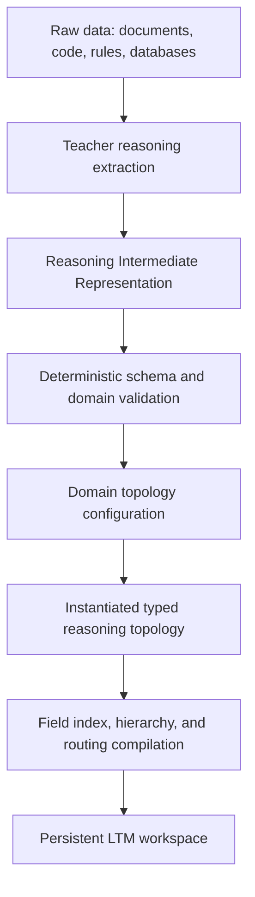
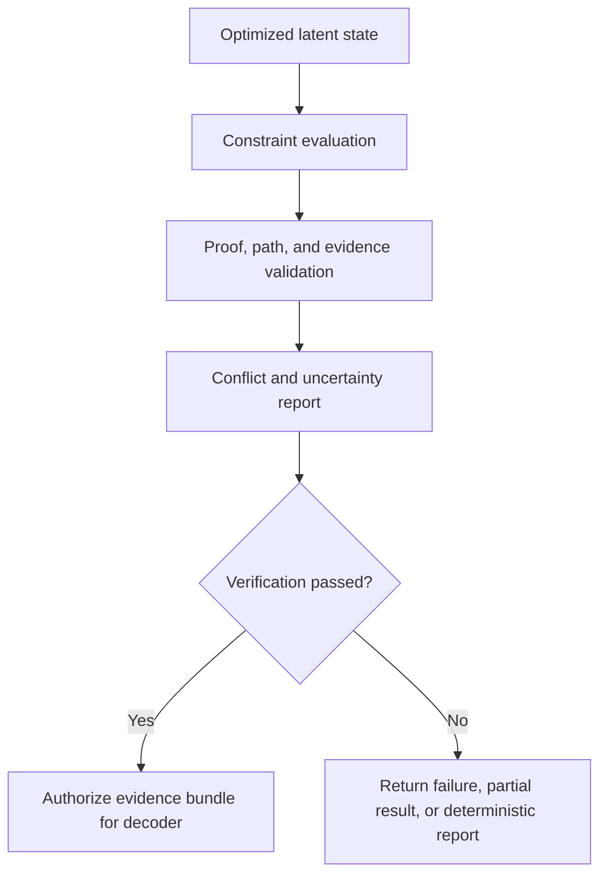
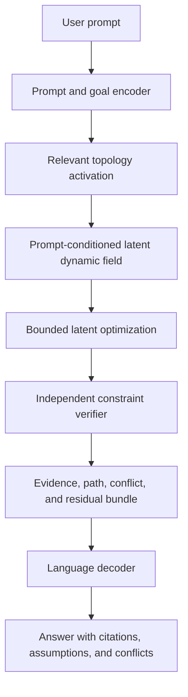
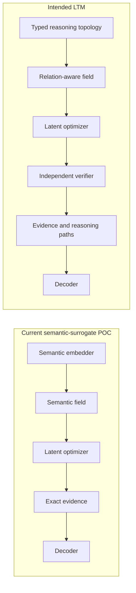

# Latent Topology Models: Canonical Architecture

## Status and boundary

This document defines the intended LTM architecture. It is a research
hypothesis, not a description of a completed reasoning model.

The current implementation proves that a semantic surrogate can drive the
complete encode → field → optimize → evidence → decode pipeline. It does not
contain the native reasoning topology described here. Consequently, the
central reasoning hypothesis remains untested.

Measured claims belong in the [experimental report](report.md). Supporting
research and citations are indexed in the
[literature map](research/literature-review.md).

## Architectural hypothesis

> A domain's knowledge and reasoning rules can be compiled into a persistent
> typed topology. That topology can induce a prompt-conditioned latent field in
> which optimization finds a state satisfying the most relevant, reliable
> constraints. A decoder then expresses the independently verified state in
> natural language.

This thesis contains five separate, falsifiable hypotheses.

### H1 — Topology representation

Typed premises, implications, conflicts, dependencies, goals, uncertainty,
and provenance can be represented in a geometry that preserves their
operational meaning.

This fails if the representation reduces directed or logical relations to
ordinary similarity, or if valid reasoning paths cannot be distinguished from
nearby but invalid states.

### H2 — Field compilation

An instantiated topology can produce a controlled latent energy or vector
field whose forces correspond to the topology's typed relations and
constraints.

This fails if low energy is unrelated to constraint validity, contradictions
are silently averaged away, or field approximation destroys the relevant
structure.

### H3 — Latent optimization

Movement through the field can solve unseen relation compositions or
constraint problems that retrieval, weighted averaging, and direct decoding
cannot solve.

This fails if optimization merely moves toward semantically similar evidence,
if a closed-form average dominates it, or if ordinary graph or constraint
search is consistently better on quality and cost.

### H4 — Sparse scaling

An expandable persistent knowledge store can influence a request through exact
activation and hierarchical summaries without ordinary request cost growing
in direct proportion to the full corpus.

This fails if accurate requests require scanning or loading most stored
knowledge, or if routing and aggregation lose too much evidence.

### H5 — Faithful decoding

A compact language model can express an already selected and verified result
without performing, replacing, or fabricating the measured reasoning.

This fails if answer quality disappears when the decoder is restricted to the
verified evidence bundle.

## System boundary

LTM has four primary reasoning components:

1. reasoning topology;
2. latent dynamic field;
3. latent optimizer;
4. decoder.

Two supporting systems are also required:

- an offline topology compiler;
- an independent verifier.

The compiler constructs the persistent reasoning substrate. The verifier
decides whether convergence corresponds to a valid result. Neither is counted
as one of the four runtime reasoning components, but a credible product cannot
omit them.

## Component 1: reasoning topology

The reasoning topology stores typed reasoning structure rather than only
semantic proximity.

### Required objects

The initial shared vocabulary includes:

- entities and states;
- observations and claims;
- premises and consequences;
- directed implications;
- dependencies and prerequisites;
- causal hypotheses;
- supporting and opposing evidence;
- conflicts and incompatibilities;
- hard and soft constraints;
- goals and acceptable terminal states;
- confidence, authority, and uncertainty;
- recency and domain applicability;
- source provenance.

A native topology must preserve direction. `A implies B` must not be
interchangeable with `B implies A`, even when their language embeddings are
close.

### Domain configuration

Each domain supplies a validated configuration describing:

- permitted node and relation types;
- relation direction and composition rules;
- hard versus soft constraints;
- confidence and authority semantics;
- applicability and recency rules;
- relation-specific energy terms;
- verifier requirements;
- decoder-visible provenance fields.

The configuration is data, not hidden decoder prompting. A JSON configuration
may tune a shared topology template, but any domain logic required for correct
reasoning must be represented explicitly and testably.

### Reasoning Intermediate Representation

Teacher-model extraction does not write directly into latent vectors. It
first emits a structured Reasoning Intermediate Representation (RIR).

A minimal RIR record contains:

```json
{
  "id": "claim-17",
  "type": "implication",
  "premises": ["fact-3", "fact-8"],
  "conclusion": "state-12",
  "confidence": 0.91,
  "authority": 0.80,
  "applicability": ["domain:thermal-control"],
  "conflicts_with": ["claim-24"],
  "source": {
    "path": "manual.md",
    "span": [410, 566]
  }
}
```

The compiler validates identifiers, relation arity, direction, provenance,
metadata ranges, and domain rules before topology encoding.

## Component 2: latent dynamic field

The latent dynamic field transforms activated topology objects into forces or
energy constraints over a latent state.

For prompt \(q\), topology object \(i\), and state \(x\), its influence depends
on:

- prompt and goal relevance;
- confidence, authority, and recency;
- domain applicability;
- relation type and direction;
- conflict status;
- topology position;
- activation or aggregation level.

Prompt-relevant objects may be activated exactly. Distant regions may remain
as aggregate constraints so that the full store remains represented without
loading every payload into active compute.

The field must not hide contradictions by placing the final state at an
unlabelled midpoint. Incompatible important constraints must remain visible as
separate residuals or branches.

## Component 3: latent optimizer

The optimizer begins from a prompt and goal state \(x_0=q\), then searches for
a lower-energy valid state.

It must:

- remain within the representation's valid manifold;
- preserve the prompt goal;
- reduce relevant weighted violations;
- respect hard constraints;
- expose unresolved soft constraints and conflicts;
- operate under a bounded evaluation budget;
- emit a convergence trace;
- distinguish numerical convergence from correctness.

Depending on the topology, the state may be a single vector, a set of vectors,
a structured latent object, or a combination of continuous and discrete
variables. The representation is not required to remain a 384-dimensional
semantic vector.

## Component 4: decoder

The decoder is a language interface, not the source of truth.

It receives only:

- the original prompt;
- the verified optimized-state summary;
- exact supporting and opposing evidence;
- relation or proof paths;
- constraint residuals;
- unresolved conflicts;
- provenance;
- verifier outcome.

It must:

- cite factual statements;
- state assumptions;
- identify weakly satisfied or incompatible evidence;
- avoid claiming that every stored item was proven true;
- refuse or fall back to a deterministic table when verification fails.

If the decoder can access hidden corpus material or regenerate the reasoning
independently, the experiment cannot attribute success to LTM.

## Supporting system: offline topology compiler

The compiler turns user data into persistent reasoning structure.



Teacher output remains untrusted until deterministic validation succeeds.
Failed records retain source diagnostics and do not silently enter the
topology.

Incremental updates must preserve stable identifiers and provenance, rebuild
affected field regions, and invalidate cached activation plans when necessary.

## Supporting system: independent verifier

The verifier evaluates the candidate result outside the optimizer's own
convergence criterion.



The verifier may use graph traversal, symbolic checks, domain validators,
constraint solvers, or executable tests. It must not merely repeat the same
energy calculation and call the result verified.

## Complete online flow



### Persistent state

Persisted between requests:

- validated topology objects and relations;
- exact source payload and provenance;
- field modules and hierarchy summaries;
- routing indexes;
- domain configurations;
- topology and schema versions;
- safe reusable caches.

### Per-request state

Computed for each request:

- prompt and goal encoding;
- activation plan;
- fixed or adaptive field frontier;
- optimization trace;
- verifier output;
- bounded decoder bundle.

### Cacheable work

Subject to topology-version invalidation:

- common prompt routes;
- aggregate region summaries;
- domain-specific field modules;
- verified subpaths;
- compiled decoder evidence templates.

## Current POC versus intended LTM



The semantic embedder is a topology-interface surrogate. It organizes text by
meaning similarity, not by implication, causality, or constraint structure.
It was used to test whether the downstream pipeline could consume a latent
space, optimize a state, recover exact evidence, and decode an answer.

The completed experiments therefore support pipeline compatibility and field
mechanics. They do not test H1 or establish native-topology reasoning. The
semantic performance failures in the report cannot be used as evidence that a
reasoning topology will fail; conversely, pipeline success cannot be used as
evidence that it will succeed.

## Mathematical contract

A general prompt-conditioned objective is:

\[
E(x\mid q)=
E_{\text{goal}}(x,q)
+\sum_i w_i(q)E_i(x)
+E_{\text{conflict}}(x)
+E_{\text{uncertainty}}(x)
\]

Where:

- \(q\) is the encoded prompt and goal;
- \(x\) is the candidate reasoning state;
- \(E_{\text{goal}}\) anchors the state to the requested task;
- \(E_i\) is a relation- or constraint-specific energy;
- \(w_i(q)\) combines relevance, reliability, and applicability;
- \(E_{\text{conflict}}\) preserves incompatible important constraints;
- \(E_{\text{uncertainty}}\) penalizes unsupported certainty.

An optimization result is incomplete without:

- final state;
- initial and final energy;
- accepted-update trace;
- per-constraint residuals;
- exact evidence and provenance;
- unresolved conflicts;
- verifier result.

“Satisfying all data” means minimizing prompt-relevant, reliability-weighted
violations while reporting irreducible tension. It does not mean declaring
contradictory, outdated, or irrelevant statements simultaneously true.

## Scaling model

“Practically unlimited context” means an expandable persistent knowledge
store, initially targeting the equivalent of 10–20 million source tokens. It
does not mean infinite information capacity or constant worst-case compute.

The intended storage and activation model is:

- exact hot constraints and active states on GPU or unified memory;
- warm topology indexes and aggregates in host memory;
- cold exact payload and inactive modules on SSD;
- offline compilation for expensive global organization;
- prompt-conditioned routing for ordinary requests;
- hierarchical summaries for unexpanded corpus regions;
- streaming or multi-pass execution for genuinely global questions.

Ordinary request cost can remain approximately bounded only if the active
frontier remains bounded and approximation preserves answer quality. Questions
requiring exhaustive comparison may still scale with corpus size.

The architecture makes no established claim of literal unlimited context,
zero-cost scaling, constant worst-case inference, trillion-parameter
single-GPU execution, or $0.01 production requests. Those remain engineering
and economic hypotheses.

## End-user behavior

A mature user flow is:

1. create an LTM workspace;
2. select or configure one or more domain topologies;
3. add documents, code, rules, databases, and structured facts;
4. inspect compiler validation and rejected records;
5. ask questions through a normal language interface;
6. receive an answer with evidence, reasoning paths, assumptions, conflicts,
   uncertainty, and verification status;
7. update the persistent store without resending the full corpus;
8. audit which topology version and sources produced an answer.

Expected use cases include persistent domain research, large-project
reasoning, codebase analysis, constraint-aware planning, contradiction
inspection, and incremental organizational memory.

LTM is initially a specialized reasoning and memory coprocessor used alongside
language models, tools, search, and symbolic solvers. It is not initially a
replacement for all general language-model capabilities.

## Architectural invariants

A credible implementation must preserve:

1. source provenance from ingestion to answer;
2. typed relation meaning through topology and field compilation;
3. prompt conditioning during activation and optimization;
4. explicit conflicts rather than hidden averaging;
5. bounded and inspectable optimization;
6. independent verification;
7. decoder access limited to verified evidence;
8. deterministic or reproducibly seeded evaluation;
9. comparison against the strongest simpler baseline;
10. separation between projected claims and measurements.

## Failure conditions

The architecture should be redesigned or rejected for a target workload if:

- teacher extraction repeatedly encodes the wrong relations;
- domain configuration hides logic in prompts rather than topology;
- relation direction is lost;
- low energy does not correlate with verified validity;
- contradictions become an unlabeled semantic compromise;
- optimization falls into goal-irrelevant attractors;
- sparse routing omits necessary constraints;
- hierarchy approximation destroys evidence or reasoning paths;
- verifier failures are correlated with optimizer failures;
- the decoder performs most of the measured reasoning;
- accurate inference activates work proportional to the full store;
- standard retrieval, graph search, CSP, SAT, or task-specific solvers dominate
  quality, reliability, and cost.

## Next falsifiable milestone

The next experiment replaces semantic similarity as the topology with a small
native typed world:

```text
Typed facts and directed relations
    ↓
Native reasoning topology
    ↓
Relation-specific latent field
    ↓
Latent optimization
    ↓
Independent graph or constraint verifier
    ↓
Comparison with retrieval, graph search, and CSP/SAT
```

It succeeds only if it solves unseen relation compositions or constraint
problems beyond retrieval and averaging while retaining exact evidence and
validity.
