# LTM-ARCH-1.2 — Normative Architecture Lock

**Evidence cutoff:** 2026-08-09
**Status:** normative for the first controlled LTM build  
**Machine configuration:** [`configs/ltm-architecture-v1.json`](../../configs/ltm-architecture-v1.json)  
**Evidence registry:** [`docs/experiments/registry.json`](../experiments/registry.json)

**Canonical explanatory companions:** [Mother Architecture](mother-architecture.md) ·
[Component internals](component-internals.md) ·
[Experiment-series evidence compendium](../experiments/series-summary.md)

This document fixes the evidence-bounded architecture that may be built from
the completed experiments. Historical specifications and reports remain the
measurement authority. When this document and an experiment report disagree
about a measurement, the experiment report wins and this lock must be revised.

## 1. Mission and claim boundary

An LTM is an independent post-transformer, energy-based latent architecture for
persistent user-configurable semantic realities. Source information is compiled
into a typed numeric field once; an immutable request anchor then induces an
ephemeral latent activation state that is resolved by registered satisfaction
or exact execution laws. Exact meaning, continuous activation, raw source and
request state are separate objects with separate hashes and authority.

LTM is not an LLM complement, wrapper, RAG layer, or context-management
extension. A transformer may temporarily assist compilation or realization, but
it is a replaceable, non-authoritative boundary adapter. Transformer hidden
state, attention, logits, and pretrained weights MUST NOT be the persistent
reality, reasoning authority, factual authority, or verification authority.

The first controlled LTM MUST:

- preserve exact semantic identity, direction, roles, scope, time and provenance;
- let a signed topology profile select the purpose of already captured semantics;
- keep hard conclusions separate from soft optimization;
- open an indexed request frontier rather than reread the whole source corpus;
- independently verify every factual conclusion before language realization;
- clarify, quarantine or abstain when compilation, coverage or verification is uncertain;
- isolate user-defined realities, sessions and source authority.

“User-defined reality” means a signed, scope-isolated collection of semantic
bodies and laws. A reality may define a custom operator for which `1 ⊕ 1 = 3`.
That law is authoritative only inside that reality. It MUST NOT silently modify
standard addition, another user’s field, another session or evaluator truth.

This lock does not claim unrestricted-language understanding, universal
ontology coverage, arbitrary theorem proving, constant request cost, fluent
free-form generation or production readiness.

## 2. End-to-end architecture

```mermaid
flowchart LR
    A["Source or user turn"] --> B["Immutable source archive"]
    B --> C["Modular compiler"]
    C --> D["Candidate Mumbrane units and ports"]
    D --> E["G1 and profile validation"]
    E --> F["Atomic Mumbrane commit"]
    F --> G["FieldIR v2 packed execution view"]
    G --> H["G3 address"]
    H --> I["G4 active frontier"]
    I --> J["G5 coverage certificate"]
    J --> K{"Registered execution law"}
    K -->|"Exact proof/search"| L["G6 hard execution"]
    K -->|"Fixed acyclic equilibrium"| Q["L7 synchronous factor satisfaction"]
    L --> M["G7 soft reconciliation + G8 reduction"]
    Q --> M
    M --> N["G9 independent verification"]
    N --> O["G10.1 authorized realization"]
    O --> P["Response and non-evidential event"]
```



Compilation may be expensive because it is amortized. Ordinary execution is
bounded by addresses, opened regions, proof states and optimization steps. The
architecture does not promise constant work independent of problem difficulty.

The primary post-transformer computational cycle is:

```text
compiled persistent reality
→ immutable prompt anchor
→ ephemeral latent activation state
→ topology-constrained energy/satisfaction optimization
→ verified equilibrium or exact conclusion
→ authorized realization
```

Exact execution remains a first-class lane for registered hard transitions.
The architecture is internally hybrid between exact structure and continuous
energy, not a hybrid of LTM reasoning plus transformer reasoning.

## 3. The five planes

| Plane | Authoritative contents | Writes | Runtime source text | Hash boundary | Migration |
| --- | --- | --- | --- | --- | --- |
| Source/archive | raw text, spans, aliases, labels and source hashes | ingestion and authorized correction only | only ingestion, audit and realization | archive hash | immutable event plus replacement/supersession |
| Mumbrane substrate | exact units, sparse ports, coordinates, applicability, provenance and identity | validated atomic compiler transaction | forbidden | substrate semantic hash | indexed semantic migration or source recompilation |
| Topology profile | active operators, exact/soft laws, addressing, coverage, objective and output policy | signed profile compiler | forbidden | compiled profile hash | tiered profile revision |
| Vector/geometry | content, operator, role, context and binding vectors | verified sidecar construction | forbidden | artifact and row hashes | re-embedding changes artifact identity only |
| Request/execution | goal anchor, frontier, proof state, soft state, conflicts and coverage | ephemeral execution only | authorized labels at final realization | request/trace hash | discarded after materialization |

No plane may borrow authority from another. Source wording cannot directly
drive exact execution, a vector cannot authorize a fact, and decoder text
cannot modify the verified result.

## 4. Universal Mumbrane substrate

Mumbrane IR v1 is the normative semantic target. One physical unit schema
represents content, claims, observations, events, relations, contexts,
identities, sources, regions, constraints and certificate references.

```text
MumbraneUnit
    + zero or more MumbranePorts
    + zero or more MumbraneCoordinates
    + optional MumbraneVectorBundle
```

### 4.1 Nine feature bands

| Band | Captured information | Authority |
| --- | --- | --- |
| Content | kind, grounded identity and scalar payload | exact |
| Operator | operator identity and hard/soft class | exact |
| Role | sparse named ports, ordinals and targets | exact |
| Context | polarity, modality, scope, time and applicability | exact |
| Provenance | source identity, span, hash and derivation | exact |
| Geometry | content, operator, role, context and binding vectors | soft/routing only |
| Identity | stable object identity, aliases and supersession | exact |
| Region | address, membership and dependency indexes | routing with exact membership |
| Integrity | revisions, hashes and validation state | authorization |

Every unit conceptually owns all nine positions. A feature mask states which
bands contain meaningful values; absence is explicit and cannot be replaced by
an invented neutral default.

### 4.2 Authority boundary

```text
Exact authority = semantic codes + sparse ports + exact context
                + provenance + identity + integrity

Soft authority  = vectors + registered continuous geometry
                + signed profile weights
```

Vectors MAY retrieve, cluster, rank and modulate registered soft influence.
Vectors MUST NOT create a unit, choose an operator, bind a named role, alter
polarity or scope, change a hard conclusion or authorize insertion.

## 5. FieldIR v2 execution bridge

`ltm-field/2` is the implemented packed execution view. It is derived from the
Mumbrane substrate and is not a second factual topology. Until the isolated
`ltm_r2` codec is promoted, `src/ltm/` owns product-facing packing and reload.

FieldIR v2 contains stable numeric tables for symbols, atoms, factors,
bindings, contexts and provenance plus immutable vector references. Its
manifest records schema/config revisions, row counts, byte lengths and table,
sidecar, semantic, artifact and archive hashes.

The bridge MUST preserve:

- Mumbrane/G1 semantic signatures;
- named role incidence and direction;
- scope, time, polarity, modality and provenance;
- deterministic ordering and insertion-order invariance;
- vector row, dimension, normalization and complete-file hashes;
- in-memory versus packed/reloaded semantic and artifact identity;
- source-text absence from active numeric tables.

The four identities are distinct:

1. substrate semantic hash — exact meaning, excluding vectors and presentation;
2. artifact hash — substrate plus vector definitions and sidecars;
3. profile execution hash — substrate plus compiled profile;
4. archive hash — raw source, aliases and decoder-facing labels.

## 6. Topology profiles

The same substrate supports four initial purposes:

- reasoning;
- planning;
- evidence/science;
- conversation memory.

Runtime consumes compiled numeric opcodes only. Profiles MUST NOT contain
arbitrary Python or executable source. The primitive registry may include
derive, derive-all, require, exclude, temporal order, supersede, scope gate,
reference simplex, provenance link, soft attract/repel, uncertainty,
preference, causal hypothesis and fixed factor satisfaction. A fixed-law
equilibrium profile MUST declare its conjunction, source normalization,
polarity, tension, update, convergence and abstention laws numerically. It
MUST NOT contain a learned model or arbitrary callback.

### 6.1 Transformer dependency boundary

| Component | Transformer policy | Authority |
| --- | --- | --- |
| Compiler | transitional, replaceable adapter | must emit validated candidate semantics only |
| Latent dynamic field | transformer-independent | persistent semantic substrate |
| Latent optimizer | transformer-independent | registered request-time satisfaction only |
| Exact execution | transformer-independent | legal hard transitions |
| Verifier | transformer-independent | independent authorization boundary |
| Decoder | optional untrusted renderer | may only realize an authorized bundle |

No conforming LTM may require transformer hidden state, attention state, logits
or pretrained weights to establish a factual or reasoning conclusion.

Profile changes are classified before execution:

1. **Tier 1 — dynamics only:** change weights, thresholds, priority or region
   budget; change execution hash but rewrite no substrate rows.
2. **Tier 2 — structural policy:** disable/narrow an operator, change
   cardinality or hard/soft treatment; revalidate indexed affected units,
   preserve unaffected bytes and retain rollback.
3. **Tier 3 — missing semantics:** the profile needs data not captured in the
   substrate; return `SOURCE_RECOMPILATION_REQUIRED` and identify the source.

A profile selects and weights recorded meaning. It cannot manufacture meaning.

## 7. Universal compilation transaction

```text
source event
→ supplied or extracted semantic spans
→ content grounding
→ narrow compiler decisions
→ candidate units, ports and coordinates
→ deterministic context and provenance
→ G1 validation
→ profile compatibility
→ FieldIR projection
→ semantic/artifact/sidecar round trips
→ atomic commit, clarification or quarantine
```

Replaceable compiler modules are segmentation, content extraction, action or
operator routing, role/slot binding, context extraction, identity resolution,
candidate resolution, calibration and the representation writer.

Authority is monotonic:

```text
accept     → accept | clarification | quarantine
clarify    → clarification | quarantine
quarantine → quarantine
```

A downstream stage MUST NOT promote an abstention. A failed relation,
provenance, hash, sidecar or round-trip check rejects the complete semantic
transaction. Partial factual commits are forbidden.

## 8. Current compiler lanes

### 8.1 Controlled conversation

G2.14 combines frozen G2.13 predictions with typed, session-scoped candidate
resolution and confidence/margin gates. On its supplied-span locked boundary it
measured accepted precision `1.0000`, safe coverage `0.9998` and zero incorrect
accepted predictions. It authorizes controlled conversational routing only.

The canonical G1/FieldIR/Mumbrane writer remains an implementation gap. G2.14
does not authorize raw span extraction, deep reasoning or factual promotion of
ordinary user assertions.

### 8.2 Controlled reasoning

G2.5 is the provisional compiler selected by engineering decision. Its locked
experiment did not pass: exact recovery was `81.75%` and it recorded 199
directional reversal false accepts. Schema validity cannot detect a
semantically reversed but structurally legal relation.

Consequently, high-impact or direction-sensitive G2.5 proposals require exact
validation plus preview, user confirmation or abstention. G2.5 remains
replaceable and is not described as an experimental pass.

### 8.3 Formal mathematical realities

The I3.1/L1 lane accepts supplied formal expressions and source-backed bodies.
A content index proposes locally applicable bodies, a compact learned scorer
ranks applications, exact code changes the proof state, the frontier reopens,
and a process-isolated verifier replays the final proof.

### 8.4 Fixed-law mathematical equilibrium

L7 adds a separate controlled execution lane for supplied-formal, acyclic
factor fields. Prompt assumptions are immutable clamps. Every other atom and
factor activation starts at zero. A registered, unlearned synchronous law
reconciles conjunctions, source-normalized support, opposition, scope, time
and reality isolation until the field reaches a certified fixed point.

Exact topology validates factors and independently replays supporting paths;
it MUST NOT activate an outcome merely because an exact input key is active.
Candidate conclusions arise from optimized outcome activation. Positive and
negative channels coexist, and losing opposition remains visible as tension.

This lane is controlled evidence, not the default product reasoner. It is
authorized only for bounded acyclic fields whose equilibrium and mathematical
paths can be reproduced by an independent solver.

### 8.4.1 Provisional policy-conditioned equilibrium evidence

L8 is **development-only** evidence, not a completed L-series pass. Its
reduced 16-observation supplied-formal probe used zero trainable parameters
and reported independent-equilibrium agreement and policy-twin divergence of
`1.00`, with zero incorrect accepted conclusions. It supports the narrower
mechanism claim that a compiled, validated policy can alter a fixed-law
equilibrium without changing the persistent field. It does not validate the
complete planned L8 suite, general reasoning instructions, scaled fields,
cycles, or general post-transformer capability.

### 8.5 Ordinary mathematical language

L2 has a conservative arithmetic development baseline but no locked result. It
will separately measure ordinary-math compilation and downstream proof success.
A compilation error must clarify or abstain; it may not silently enter a reality
as a trusted axiom. The current baseline is not yet a product compiler.

## 9. Request execution contract

Every request follows these steps:

1. Compile public prompt semantics into an immutable request anchor.
2. Resolve entity, predicate, identity, scope and time addresses.
3. Open a bounded G4 frontier from exact indexes and declared bridges.
4. Use G5 to certify all answer-changing regions, widen, or abstain.
5. Select the registered execution lane: execute G6 exact relations, or run
   the L7 fixed-law equilibrium on a validated bounded acyclic factor graph.
6. Reconcile G7 evidence, preferences, uncertainty and reference alternatives
   without changing an exact hard feasible set or a certified L7 fixed point.
7. Reduce memory-bounded contributions through G8 independently of batch and
   storage order.
8. Materialize conclusions, proof steps, conflicts, residuals and provenance.
9. Verify profile, coverage, hard state, soft state, proof and provenance
   independently through G9 or exact replay.
10. Send only authorized claims and required archive labels to G10.1.
11. Validate realized claims and store the assistant output as a discourse
    event with no independent evidential authority.

Coverage failure widens within the request budget. Exhausted coverage returns
unknown or clarification. Verification failure returns no factual answer.

## 10. Mathematical-reality capacity evidence

L1 froze the I3.1 `r13` checkpoint and changed no weights, thresholds, beam or
search logic. It tested separate grounded formal and opaque traversal panels.

| Measurement | Result |
| --- | ---: |
| Formal point-estimate D90 | 64 |
| Formal point-estimate D95 | 64 |
| Opaque traversal point-estimate D90 | 64 |
| Opaque traversal point-estimate D95 | 64 |
| Deepest independently replayed proof | 64 |
| Incorrect accepted proofs | 0 |
| Cases per depth and panel | 20 |
| Wilson lower bound for 20/20 | 0.8389 |

All tested depths 1–64 succeeded. Opaque over-budget depths 65, 96 and 128
abstained, as did unsupported cases. The formal panel uses grounded
additive-zero and multiplicative-one transformations; the opaque panel measures
source-backed transport. L1 therefore establishes observed 64-hop grounded
capacity, not arbitrary 64-hop mathematics or a 95%-confidence lower bound.

The runtime caps each frontier read at 64 bodies. Dynamic reopening can visit
more than 64 distinct bodies cumulatively. The 50,000-body diagnostic opened
796 distinct body IDs across the request. Per-frontier and cumulative effort
MUST be reported separately.

### 10.1 Fixed-law equilibrium evidence

L7 `r3` evaluated 240 supplied-formal prompts over one immutable 512-body
field with zero trainable parameters and no model checkpoint. It measured
`1.0000` all-case exactness, accepted precision, exact depth-20 success and
independent-equilibrium agreement, with zero incorrect accepted conclusions
and zero accepted objective increases. The complete run finished in 27.34
seconds.

Removing optimization reduced exactness by `1.0000`; removing the relational
law reduced it by `0.9250`; shuffling endpoints reduced it by `0.8417`.
Authority swaps, decisive-body removal, source duplication, partial
conjunction, expiry, rescope and reality-move interventions behaved as frozen.

This supports a fixed, source-normalized satisfaction law on the tested
acyclic field through 20 body applications. It does not establish cyclic
equilibria, minimap retrieval, 64-hop equilibrium, literal counterfactual
arithmetic tables, natural-language compilation or unrestricted mathematics.

## 11. L2 boundary

L2 will test the missing end-to-end mathematical compiler:

```text
ordinary mathematical statements
→ formula, definition, constraint and provenance compiler
→ exact formal/Mumbrane bodies
→ isolated persistent reality

ordinary-language question
→ formal assumptions and goal
→ indexed multihop proof search
→ independent exact replay
→ authorized language answer
```

L2 must report at least:

- statement/formula compilation exactness;
- variable binding, scope and side-condition exactness;
- question/goal compilation exactness;
- accepted compilation precision and safe coverage;
- proof success conditional on correct compilation;
- end-to-end proof success;
- unknown/ambiguity recall;
- zero cross-reality proof steps and zero incorrect accepted proofs.

L3 is the completed follow-on controlled test. It compiled exact prose/notation
instances into a 50,000-body standard reality and measured `256 / 256`
independently replayed, shortest-45-step grounded proofs, plus `128 / 128`
replayed eight-schema ring 45-step paths. Its evidence is narrower than general
mathematical reasoning: the exact content index and dynamic reopening were
causally necessary, but removing the learned scorer, goal anchor and
remaining-cost head did not harm its mostly linear corpus. Its planned
three-family mixed-axiom diagnostic remains open.

## 12. Memory, persistence and scaling

Base knowledge and session memory have separate ownership, versions and hashes.
The base layer is immutable except through certified migration. The session
overlay is transactional and clearable. Corrections supersede rather than erase
provenance. Deletion removes current influence and invalidates affected
summaries. Episode folding and reopening preserve scope and exact source links.

Assistant responses are conversation events, not independent evidence.
Restart and replay must reproduce semantic hashes. Ordinary requests use
indexes; full transcript or field scans are diagnostic-only operations.

G13 supplies controlled sparse-layout scale evidence. It does not prove
arbitrary placement, production concurrency or constant latency at every field
size.

## 13. Safety and verification invariants

An implementation conforming to LTM-ARCH-1.2:

- MUST commit semantic transactions atomically;
- MUST preserve relation direction, named roles, arity, scope and provenance;
- MUST isolate reality, session, episode and validity windows;
- MUST validate every vector reference, dimension, row and sidecar hash;
- MUST keep hard conclusions immutable during soft optimization;
- MUST certify coverage or abstain;
- MUST independently replay hard proofs;
- MUST validate every decoder-visible factual claim;
- MUST treat assistant output as non-evidential;
- MUST reject unknown schema, profile, registry and field-law revisions;
- MUST preserve deterministic semantic replay and insertion-order equality;
- MUST NOT expose evaluator gold to runtime;
- MUST NOT allow source text in active numeric tables;
- MUST NOT allow vectors to authorize facts;
- MUST NOT allow cross-reality or cross-session proof steps;
- MUST NOT silently use a neutral value for missing required semantics;
- MUST NOT perform partial factual commits.
- MUST NOT make transformer hidden state, attention state, logits or pretrained
  weights a factual, reasoning or verification authority;
- MUST treat every transformer-assisted compiler or renderer as a replaceable
  adapter whose output is validated before it affects a semantic transaction or
  response.
- MUST keep L7 prompt clamps immutable and initialize all non-prompt
  activations to zero;
- MUST NOT use exact input-to-outcome propagation in the fixed-equilibrium
  lane;
- MUST expose opposing activation and residual tension for contradictory L7
  conclusions;
- MUST independently reproduce an accepted L7 fixed point and its exact
  supporting paths.

## 14. Complexity and economics

```text
Compilation cost:
    proportional to new or changed source plus affected indexes/migrations

Ordinary request cost:
    proportional to opened addresses, regions, factors, proof states,
    optimization steps and decoder candidates

Persistent storage:
    O(units + ports + coordinates + vectors + indexes)
```

Bounded request cost is a target, not a claim that all questions cost the same.
Retrieval saturation, frontier reopening, branching, verifier replay and
decoder ranking are separately measured. Source volume can grow without being
resent to a decoder, but difficult queries may require more regions or proof
states and may abstain at their budget.

## 15. Locked and replaceable components

| Category | Locked contract | Replaceable implementation |
| --- | --- | --- |
| Semantic authority | Mumbrane exact units and lossless G1 projection | language compiler and embedding model |
| Hard reasoning | exact typed transitions and replay | retrieval/proposal scorer |
| Soft reasoning | signed registered profile law and immutable hard state | optimizer algorithm |
| Fixed equilibrium | registered factor, source, polarity, tension and convergence law | numerically equivalent synchronous solver |
| Verification | independent coverage, proof and provenance boundary | internal search strategy |
| Language | authorized-claim boundary | segmenter and surface model |
| Storage identity | semantic/artifact/archive/profile hashes | physical codec after certified migration |
| Memory | base/overlay ownership and deletion semantics | index and cache implementation |

## 16. Evidence status at the lock

| Status | Evidence |
| --- | --- |
| Experimentally passed | G1, G3–G9, G10.1, G11–G13, LTM-I1, LTM-R1, LTM-R2, G2.14 supplied-span lane |
| Controlled composition | G14 structured path |
| Engineering-adopted | G2.5 provisional reasoning compiler |
| Development-only | I2.3, I3, I3.1 |
| Narrow capacity characterization | L1 grounded formal and opaque 1–64-hop panels |
| Failed historical approaches | G2–G2.13 except the bounded G2.14 gate, I1, I2 and MICRO latent-only variants as recorded in reports |
| Untested product boundary | G15 serving/isolation and canonical promoted Mumbrane writer |
| Development-only | L2 conservative arithmetic baseline; I2.3, I3 and I3.1 development-only evidence |
| Controlled mathematical-reality evidence | L3 exact controlled compilation through a 50,000-body field to verified 45-hop proofs; not learned branching discovery |
| Controlled fixed-law equilibrium | L7 acyclic 512-body field through 20 applications; zero learned parameters and independently reproduced fixed points |

## 17. Unresolved boundaries

The lock intentionally leaves open:

- canonical G2.14-to-Mumbrane writing;
- raw semantic span extraction;
- reliable unrestricted reasoning compilation;
- L2 ordinary-math ingestion and its locked evaluation;
- learned branching-proof discovery beyond L3's exact-indexed linear paths;
- broad variable-schema theorem proving;
- cyclic, scaled or 64-hop fixed-law equilibrium;
- literal counterfactual arithmetic tables with downstream formal operations;
- free-form conversational fluency;
- arbitrary ontology coverage;
- production concurrency, isolation and crash recovery in G15.

## 18. Change control

The lock manifest hashes this document, its machine configuration, the
experiment registry, G1 registry, Mumbrane schema and FieldIR v2 schema. A
semantic change requires a new architecture revision and changelog entry.
Editorial changes may retain the revision only when the manifest is refreshed
and all audits pass. Historical experiment reports are never rewritten to make
the architecture appear stronger.

### 18.1 Revision history

- `LTM-ARCH-1.0` (2026-08-07): initial evidence-bounded hybrid lock.
- `LTM-ARCH-1.1` (2026-08-08): adds L7 fixed-law acyclic equilibrium as a
  controlled mathematical-reality lane while retaining G6 exact execution and
  G9/independent verification as authorization boundaries.
- `LTM-ARCH-1.2` (2026-08-09): positions LTM as an independent
  post-transformer energy-based latent architecture. It preserves the exact,
  continuous and verification mechanisms, records L8 only as provisional
  reduced-probe evidence, and does not claim general post-transformer
  capability.
