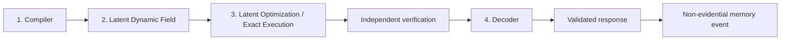
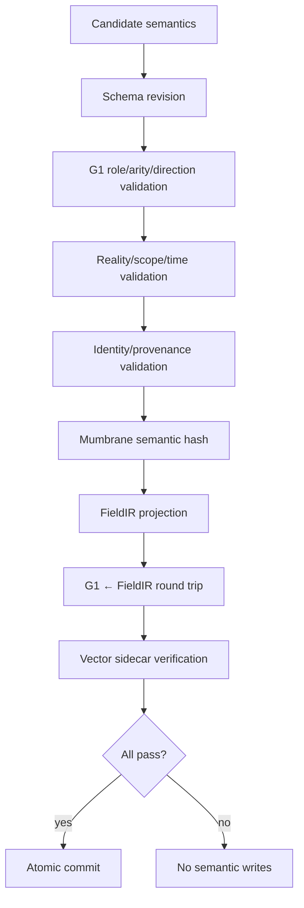
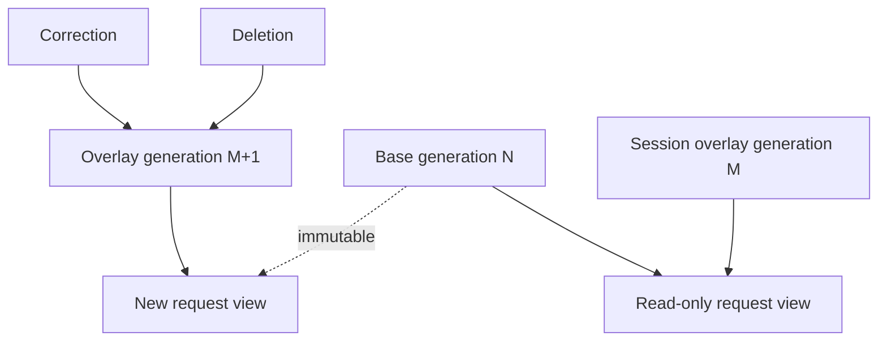
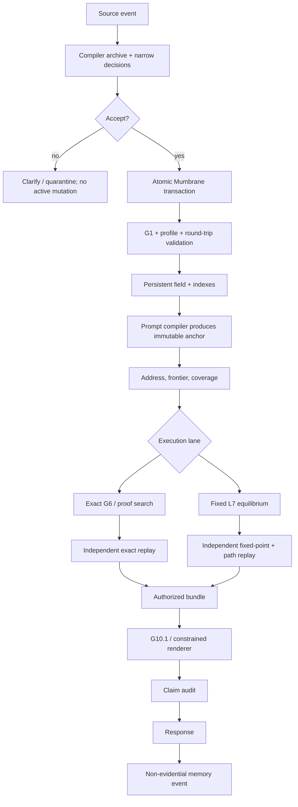
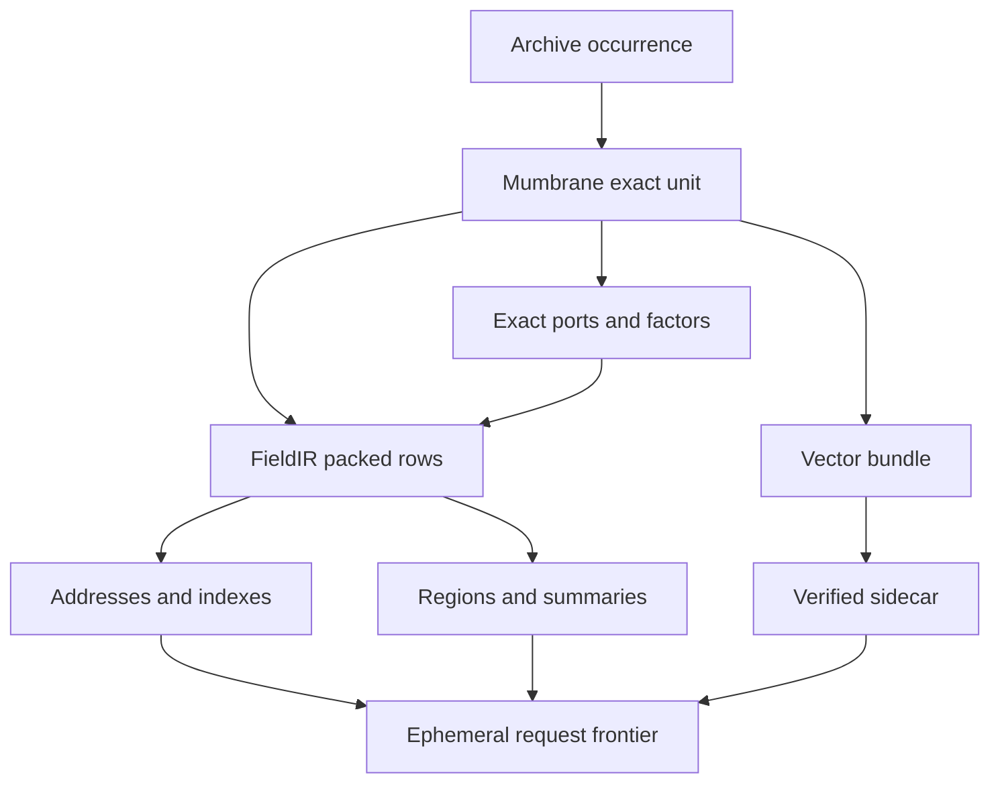

# LTM Component Internals

**Companion to:** [LTM Mother Architecture](mother-architecture.md)  
**Normative authority:** [LTM-ARCH-1.1](architecture-lock-v1.md)  
**Evidence cutoff:** 2026-08-08

This document explains the four principal runtime components: the compiler,
latent dynamic field, latent optimization, and decoder. It uses the maturity
labels **Validated**, **Provisional**, and **Planned** exactly as defined in the
Mother Architecture.



---

## 1. The Compiler

### 1.1 Responsibility

The compiler converts a source occurrence into a proposed semantic
transaction. It does not decide truth merely because text was asserted. It
captures what the source occurrence means, who supplied it, its context, and
which exact operations are proposed.

The compiler boundary is replaceable; the Mumbrane/G1 contract is not.

### 1.2 Inputs

```text
source bytes or supplied semantic spans
speaker/source identity
session, episode, reality, scope, and time metadata
bounded candidate objects for identity/reference linking
compiler/profile revision
```

Runtime compiler input must not contain evaluator gold, expected operations,
answer IDs, route IDs, template IDs, or target hashes.

### 1.3 Outputs

```text
accepted:
    candidate Mumbrane units and ports
    exact context and provenance
    optional vector bundles
    proposed G1 operations
    FieldIR projection

clarification_required:
    neutral source audit event
    candidate IDs needed for clarification
    no active semantic mutation

quarantine:
    source hash and failure evidence
    no active semantic mutation
```

### 1.4 Archive ingestion

The archive receives the source event before semantic compilation:

```text
source_id
source bytes or external immutable reference
speaker/source authority category
session and reality ownership
timestamp
content hash
compiler revision requested
```

The archive hash is separate from semantic identity. Two differently worded
sources may compile to the same semantics while retaining distinct provenance.

### 1.5 Segmentation and grounding

**Planned for unrestricted language.** A segmenter identifies content spans,
entities, predicates, references, context cues, and discourse structure. It
must preserve character offsets and source hashes.

**Validated only on narrower boundaries:** G2.14 assumes supplied semantic
spans; controlled mathematical compilers accept restricted formal or
prose/notation grammars.

Grounding maps surface occurrences to candidate semantic identities. Similarity
may retrieve candidates, but exact compatibility—reality, type, scope, time,
validity, session, and operation class—authorizes selection.

### 1.6 Narrow decisions

The architecture avoids one monolithic “understand everything” target. The
compiler decomposes decisions:

```text
content span
discourse/action class
operator or memory action
named role / typed slot bindings
polarity and modality
scope and time applicability
identity/reference target
disposition
```

G1 supplies legal roles, arity, kinds, and exact operator structure. A learned
head should predict only information not already fixed by the registry.

### 1.7 Conversational lane

**Validated for supplied spans.** G2.14 wraps frozen G2.13 predictions with
typed candidate filtering, confidence thresholds, and ambiguity margins.

The gate is monotonic:

```text
model accept → accept | clarify | quarantine
model clarify → clarify | quarantine
model quarantine → quarantine
```

Accepted actions include controlled questions, requests, neutral assertions,
preferences, corrections, retractions, and references. Ordinary assertions
remain `user_reported` and non-verified. Assistant responses cannot become
evidence.

The direct canonical G2.14-to-Mumbrane writer remains **Planned**.

### 1.8 Provisional reasoning lane

G2.5 is **Provisional**. It provides typed atom coordinates and valid G1-shaped
proposals, but its experiment recorded semantically reversed accepted
relations. Exact schema validation cannot identify every valid-but-wrong
direction.

Therefore:

```text
low impact + high confidence + exact validation → controlled accept
direction-sensitive or high impact             → preview/confirmation
ambiguous or unsupported                       → abstain
```

### 1.9 Formal mathematical compiler

Controlled formal compilers parse expressions into canonical typed ASTs,
normalize variables, preserve exact rational values, and attach a reality
manifest. The compiler must distinguish:

- standard operators;
- user-defined operators;
- assumptions;
- goals;
- rewrite bodies;
- side conditions;
- source provenance.

L3 provides controlled compilation evidence on narrow generated language. L2
remains development-only for broader ordinary mathematical language.

### 1.10 Identity and reference linking

Candidate retrieval is bounded and filtered before scoring:

```text
same tenant/reality/session where required
compatible scope and episode
active generation
not deleted, expired, or superseded
role-compatible semantic type
```

Unique high-margin targets may be linked. Ambiguous required targets cause
clarification. A compiler cannot invent a persistent identity not supported by
the source or allowed creation policy.

### 1.11 Context extraction

Context is exact authority after acceptance:

```text
polarity: positive | negative
modality: asserted | quoted | hypothetical
scope: global | session | episode | fictional | custom
validity: from/to time
reality key
source authority category
```

Public session and source authority metadata is deterministic input; the model
may not invent it.

### 1.12 Candidate Mumbrane construction

The compiler emits one universal record form:

```text
semantic unit
+ sparse named role ports
+ exact context coordinates
+ provenance and identity
+ optional vectors
+ integrity revision and hash
```

The semantic hash excludes surface wording and optional geometry. Vector
construction must verify dimensions, row ordering, normalization, and complete
sidecar hashes.

### 1.13 Validation pipeline



### 1.14 Transaction semantics

The commit contains units, ports, contexts, provenance, indexes, FieldIR rows,
and sidecar references. It is all-or-nothing. The archive event may remain for
audit when semantic compilation fails, but it has no active influence.

### 1.15 Compiler pseudocode

```python
def compile(source, public_metadata, candidates, profile):
    archive_event = archive(source, public_metadata)
    spans = segment_or_accept_supplied_spans(archive_event)
    decisions = make_narrow_decisions(spans, candidates)
    disposition = calibrate_and_gate(decisions)
    if disposition != "accept":
        return audit_only(disposition, archive_event, decisions)

    transaction = construct_mumbranes(decisions, archive_event)
    validate_g1(transaction)
    validate_context_identity_provenance(transaction)
    field_program = project_fieldir(transaction)
    verify_round_trips(transaction, field_program)
    return atomic_commit(transaction, field_program)
```

### 1.16 Failure codes

| Failure | Result |
| --- | --- |
| unsupported grammar | quarantine |
| low content confidence | clarification |
| ambiguous identity/reference | clarification |
| illegal role or arity | reject |
| low direction margin | clarification |
| context conflict | reject |
| missing provenance | reject |
| vector/hash corruption | reject |
| unknown schema/profile | reject |
| semantic round-trip mismatch | reject |

### 1.17 Complexity

Compilation scales with source length, candidate lattice size, semantic units,
and affected indexes. It is not part of ordinary equilibrium sweep cost.
Incremental compilation should rewrite only affected index and summary paths.

### 1.18 Observability

Record:

- source and compiler hashes;
- per-head probabilities and margins;
- candidate count and filters;
- disposition and stable failure codes;
- operation count;
- semantic and artifact hashes;
- round-trip result;
- atomic commit/rollback;
- runtime denial of evaluator paths.

### 1.19 Worked compiler trace

```text
Source: "Please answer concisely."
Metadata: user, session S, turn 8

content span     = "concisely"
discourse act    = request
memory action    = set_preference
preference key   = response_length
preference value = concise
scope            = session S
disposition      = accept

→ PREFERENCE unit
→ exact session context
→ user-source provenance
→ response-style target
→ atomic G1/Mumbrane/FieldIR commit
```

---

## 2. The Latent Dynamic Field

### 2.1 Responsibility

The field is the persistent compiled reality. It owns semantic objects,
relations, contexts, continuous coordinates, indexes, summaries, provenance,
integrity, and lifecycle state. It does not own raw-language interpretation or
surface realization.

### 2.2 Physical and logical views

```text
Logical authority:
    Mumbrane IR v1 exact units + ports + coordinates

Packed execution:
    FieldIR v2 tables + vector sidecars

Routing:
    identity, semantic, region, dependency, source, scope, time indexes

Persistence:
    immutable base generations + transactional overlays
```

### 2.3 Atoms and factors

An atom represents a semantic proposition, occurrence, entity state, goal,
preference, context, or other typed value. A factor connects input atoms to an
outcome, constraint, or interaction.

Exact factors preserve operator, named roles, direction, applicability, and
provenance. Fixed-equilibrium factors additionally carry numeric source mass
and polarity.

### 2.4 Exact and continuous channels

| Channel | Examples | Authority |
| --- | --- | --- |
| semantic code | claim, preference, equality | exact |
| role port | premise, conclusion, older, newer | exact |
| context | polarity, scope, time, modality | exact |
| provenance | source and derivation | exact |
| vector coordinate | similarity and routing | soft |
| factor activation | request-time satisfaction | ephemeral |
| contradiction tension | request-time unresolved opposition | ephemeral |

Persistent vector values do not become request activations. Request activation
starts from prompt clamps and a neutral non-prompt state.

### 2.5 Reality partitions

Every field row belongs to one reality or a deliberately shared immutable base.
Reality filtering occurs during address resolution, frontier construction,
execution, verification, and decoding.

Custom laws cannot shadow standard laws without an explicit profile/reality
selection. Cross-reality factor paths are integrity failures.

### 2.6 Base and overlay



Base state changes only by certified ingestion or migration. The session
overlay supports preference changes, user-reported claims, corrections,
references, and deletion. Clearing the overlay removes its influence without
mutating the base.

### 2.7 Addressing

G3 addresses exact identities and registered semantic keys. A request may
start from entity, predicate, property, scope, time, or region addresses.
Vector search may propose addresses but exact filters authorize them.

### 2.8 Frontier

G4 materializes a bounded set of detailed bodies. Each body read is recorded.
Dynamic reopening may close low-value regions and open new regions as an exact
proof state or continuous request state changes.

### 2.9 Coverage

G5 asks whether unopened regions can alter the authorized result. Coverage may
be exact, summary-bounded, incomplete, or exhausted. Incomplete coverage cannot
be converted into a confident answer.

### 2.10 Minimap and summaries

**Provisional/Planned depending on lane.** A hierarchical minimap can commit
every body into leaf-to-root summaries. Summaries may store semantic prototypes,
context masks, radii, uncertainty, and transition modes. They may not store
query-specific answers, closure, or hidden proof routes.

L7 did not validate minimap retrieval; it intentionally optimized one complete
512-body compatible partition.

### 2.11 Source normalization

Bodies are grouped by independent source. Equivalent claims from one source
contribute their maximum mass. This prevents copied records from manufacturing
authority.

### 2.12 Scope, time, and provenance

Factors have applicability masks:

```text
reality compatible
AND scope compatible
AND valid_from <= request time
AND valid_to >= request time
AND source/provenance valid
```

A mask blocks an invalid factor. It does not choose an answer.

### 2.13 Corrections and deletion

Correction creates a new occurrence and an exact supersession edge. The older
occurrence retains provenance but no longer contributes to the active view.
Deletion closes validity or creates a tombstone, invalidates dependent indexes
and summaries, and removes residual influence.

### 2.14 Migration

Tier 1 profile changes rewrite no substrate. Tier 2 changes revalidate indexed
affected units with rollback. Tier 3 changes reopen source and recompile. A
missing source or unknown revision causes abstention.

### 2.15 “All data influence”

The phrase has strict meaning:

- every body is committed to an exact partition and integrity boundary;
- every body can contribute to a hierarchy/index summary;
- every answer-changing body is opened or bounded before acceptance.

It does not mean every request reads every detailed body, nor that irrelevant
data should perturb a result. Relevant-region sensitivity and irrelevant-region
invariance are both required.

### 2.16 Field pseudocode

```python
def request_view(reality, session, scope, valid_at):
    base = load_verified_base_generation(reality)
    overlay = load_verified_session_overlay(session)
    rows = merge_without_mutating_base(base, overlay)
    return filter_exact_context(rows, reality, scope, valid_at)

def open_frontier(view, addresses, budget):
    proposed = indexes.lookup(addresses, budget)
    opened = exact_filter(proposed)
    coverage = certify_or_bound_unopened_regions(view, opened)
    return opened, coverage
```

### 2.17 Field failure modes

| Failure | Behavior |
| --- | --- |
| stale generation | refuse view |
| corrupt semantic hash | integrity failure |
| missing vector row | reject artifact, preserve semantic base |
| stale summary ancestor | refuse indexed execution |
| cross-session row | filter and audit |
| cross-reality body | integrity failure |
| expired factor | zero applicability |
| deleted body in cache | invalidate cache and refuse stale result |
| budget exhausted | incomplete coverage |

### 2.18 Complexity and scaling

Persistent storage is linear in units, ports, coordinates, vectors, and
indexes. Ordinary request cost is proportional to opened factors and execution
work, not total archived text. G13 validates controlled sparse layouts but not
production concurrency. L7’s whole 512-body scan is a mechanism experiment,
not a scaling result.

### 2.19 Observability

Record generation hashes, rows read, index probes, cache hits, opened/closed
regions, coverage bounds, cross-scope/reality rejections, invalidations,
summary rebuild paths, source mass groups, and cumulative versus per-frontier
body reads.

### 2.20 Worked field trace

```text
Base reality:
    standard arithmetic bodies

Custom reality alpha:
    custom operator-table bodies

Session overlay:
    user's preferred answer length

Request in alpha:
    view = shared immutable definitions + alpha + session overlay
    standard-only custom-conflicting bodies = excluded
    expired alpha body = excluded
    preference = visible only to decoder policy
```

---

## 3. The Latent Optimization

### 3.1 Responsibility

Latent optimization reconciles continuous request state under a registered law.
It is not permitted to invent exact topology. Two distinct mechanisms exist and
must not be conflated.

### 3.2 Mechanism A: G7 soft reconciliation

**Validated.** G7 operates after exact G6 reasoning. The hard feasible set is
immutable. G7 reconciles registered evidence weights, preferences,
uncertainty, reference alternatives, and other soft variables. G8 then reduces
bounded batches independently of storage order.

G7 cannot reverse a hard relation, add a missing premise, or turn vector
similarity into a fact.

### 3.3 Mechanism B: L7 fixed factor satisfaction

**Validated only for bounded supplied-formal acyclic fields.** L7 has zero
trainable parameters and no model checkpoint. Exact topology defines legal
factors; request-time state is continuous.

### 3.4 Initial state

For every prompt assumption \(i\):

\[
x_{i,+}=1
\]

For every other atom and every factor:

\[
x_{j,+}=x_{j,-}=t_j=f_b=0
\]

Prompt clamps never change.

### 3.5 Conjunction

For inputs \(I_b\):

\[
C_b(x)=\min_{i\in I_b}x_{i,+}
\]

Using maximum would allow one present premise to satisfy a multi-input body;
the partial-conjunction control detects this failure.

### 3.6 Context mask

\[
M_b = M_{reality}M_{scope}M_{time}M_{integrity}
\]

Each term is binary. Context can block a body but cannot select an outcome.

### 3.7 Source mass

\[
W_b=base_b\cdot authority_b\cdot confidence_b
\]

For a source group \(g\) supporting atom \(j\) with polarity \(s\):

\[
m_{g,j,s}=\max_{b\in g\to(j,s)} W_bM_bC_b(x)
\]

Across independent sources:

\[
A_{j,s}=1-\prod_g(1-m_{g,j,s})
\]

This law is monotone in independent support and invariant to duplicate copies
from one source.

### 3.8 Contradiction

\[
t_j=\min(A_{j,+},A_{j,-})
\]

Neither polarity deletes the other. A margin determines candidate versus
alternatives. The decoder must retain losing opposition.

### 3.9 Registered objective

\[
E=\lambda_cE_{clamp}
+\lambda_f\sum_b(f_b-M_bC_b(x))^2
+\lambda_a\sum_{j,s}(x_{j,s}-A_{j,s})^2
+\lambda_t\sum_j(t_j-\min(A_{j,+},A_{j,-}))^2
+\lambda_sE_{sparsity}+E_{relational\ reward}
\]

Telemetry is recomputed from the actual proposed state. It must not be clamped
to look monotonic.

### 3.10 Synchronous snapshot semantics

At sweep \(k\), every factor target is computed from state \(x^k\). Atom
targets are computed from the corresponding logical factor block, not from a
procedurally updated active-key set. The update produces \(x^{k+1}\)
simultaneously.

This prevents source order from acting as a hidden executor.

```python
def sweep(state, field, prompt):
    snapshot = freeze(state)
    factor_targets = all_factor_targets(snapshot, field, prompt)
    atom_targets = source_normalized_targets(snapshot, factor_targets)
    tension_targets = polarity_tension(atom_targets)
    proposal = project(factor_targets, atom_targets, tension_targets)
    return proposal if objective(proposal) <= objective(state) else backtrack()
```

### 3.11 Why multihop still costs work

If a path is:

```text
A → B → C → ... → Z
```

the fixed law does not jump from A to Z. Repeated sweeps carry satisfaction
across graph distance. A 64-body chain plausibly needs at least roughly 64
logical propagation sweeps. L1’s 64-hop result uses a different exact search
mechanism and cannot substitute for that experiment.

### 3.12 Candidate discovery

Candidate discovery scans compatible activated outcomes of the requested sort
and formal property. It does not receive an expected candidate ID. Disposition
policy is:

```text
high activation + sufficient signed margin → candidate
near-tied candidates or polarities         → alternatives
no sufficiently active candidate           → unknown
uncertified residual/coverage               → incomplete_equilibrium
```

### 3.13 Convergence

An accepted result requires:

- no accepted objective increase;
- residual below tolerance;
- state change below tolerance;
- stable candidate set;
- certified coverage;
- independent fixed-point agreement;
- exact supporting path replay.

Cycles may have multiple fixed points, oscillations, or initialization
dependence. L7 does not authorize cyclic fields.

### 3.14 Independent oracle

The evaluator does not import the runtime optimizer. For acyclic graphs it can
solve exact activation in topological order and also iterate lower/upper bounds.
Both must agree. It independently recomputes objective, source grouping,
candidate set, tension, residual, and supporting paths.

### 3.15 Causal controls

L7 requires performance drops when:

- optimization is removed;
- only one sweep is permitted on deep paths;
- the relational law is removed;
- endpoints are shuffled;
- authority is replaced with count;
- contradiction tension is removed.

It also requires authority-swap reversal, decisive-body sensitivity,
duplicate-source invariance, missing-conjunction response, expiry/rescope
response, reality isolation, and irrelevant-body invariance.

### 3.16 Failure modes

| Failure | Disposition |
| --- | --- |
| residual above tolerance | incomplete equilibrium |
| objective-increasing proposal | backtrack or incomplete |
| multiple unresolved modes | alternatives |
| no supported requested outcome | unknown |
| invalid source grouping | integrity failure |
| incomplete coverage | incomplete frontier |
| unexplained residual | verification failure |
| state/certificate mismatch | verification failure |

### 3.17 Complexity

For \(F\) active factors and \(K\) sweeps:

\[
T=O(FK)
\]

plus independent verification. Memory is linear in active atoms, factors, and
trace retention. Scaling requires indexes and certified summaries; L7 itself
does not validate them.

### 3.18 Observability

Record every sweep’s objective, residual, state hash, accepted/rejected status,
factor activation, source group, candidate set, opposing activation, tension,
coverage, body reads, and verifier comparison.

### 3.19 Worked optimizer trace

```text
sweep 0: prompt A clamped; every other atom 0
sweep 1: body A→B satisfied; B target becomes active
sweep 2: B activation supports B→C
...
sweep 20: requested terminal is active
sweep 21: no state change; residual 0

candidate positive activation = 1
candidate negative activation = 0
tension = 0
independent fixed-point agreement = pass
```

---

## 4. The Decoder

### 4.1 Responsibility

The decoder converts an authorized structured result into a user-facing
response. It does not reason over unrestricted field state, promote uncertain
candidates, or add facts.

### 4.2 Input bundle

```text
authorized disposition
authorized claim IDs and exact values
proof or equilibrium certificate
supporting and opposing sources
confidence, margin, residual, and tension
required uncertainty/qualification
permitted archive labels
forbidden claims
reality/session/scope metadata
```

The decoder does not receive evaluator gold.

### 4.3 Dispositions

| Disposition | Decoder obligation |
| --- | --- |
| candidate | state only authorized winner and required tension |
| alternatives | present authorized alternatives without choosing |
| unknown | state that the field does not support an answer |
| clarification | ask only for the missing semantic decision |
| quarantine | provide safe unsupported-input response |
| incomplete coverage/equilibrium | state that execution was uncertified |

### 4.4 G10.1 strict realization

**Validated.** G10.1 realizes prevalidated candidates under a constrained
claim boundary. It validates the produced semantic claims against the bundle.
It is not evidence for unrestricted fluent generation.

### 4.5 Structured realization

A deterministic decoder can render:

```text
Conclusion: <authorized candidate>
Support: <activation or proof summary>
Opposition: <authorized losing mode>
Uncertainty: <required wording>
Sources: <permitted provenance labels>
Verification: <verified / incomplete>
```

This is the safest baseline and should remain available when a language model
is unavailable or fails validation.

### 4.6 Optional language model

**Planned/replaceable.** A language model may paraphrase an authorized bundle.
It is treated as an untrusted renderer:

```text
authorized bundle
→ constrained generation prompt/grammar
→ candidate text
→ semantic claim extraction
→ exact comparison with authorized claims
→ return text or deterministic fallback
```

The language model’s internal knowledge cannot silently supplement the selected
reality.

### 4.7 Winner plus tension

For contradictory equilibrium results the response includes:

- primary conclusion;
- positive/supporting activation;
- negative/opposing activation;
- residual tension;
- source-normalized summary;
- verification state.

A confident surface sentence must not hide material opposition.

### 4.8 Provenance and archive access

Active execution contains no raw source text. The decoder may request only
labels and excerpts explicitly authorized by the verifier. Archive access is
logged and bound to provenance IDs.

### 4.9 Response memory

The returned response becomes a conversation event with no independent
evidential authority. It may reference its source bundle, but cannot become a
new proof of itself. Later retrieval must preserve this distinction.

### 4.10 Injection defense

Source text is data, not decoder instruction. Archive excerpts are escaped or
typed. The renderer receives an explicit claim schema. Any output claim absent
from the authorized bundle is rejected.

### 4.11 Decoder pseudocode

```python
def realize(bundle, renderer):
    validate_authorization(bundle)
    if renderer is None:
        return deterministic_render(bundle)
    candidate_text = renderer.render(constrained_view(bundle))
    claims = extract_claims(candidate_text)
    if claims != bundle.authorized_claims:
        return deterministic_render(bundle)
    return candidate_text
```

### 4.12 Failure modes

| Failure | Response |
| --- | --- |
| missing authorization | no factual output |
| unsupported generated claim | deterministic fallback |
| omitted mandatory tension | reject and rerender |
| provenance label not authorized | omit and audit |
| archive hash mismatch | verification failure |
| renderer timeout | deterministic fallback |
| reality mismatch | integrity failure |

### 4.13 Complexity and cost

Deterministic realization is proportional to authorized claims and provenance
labels. A language renderer adds token and model cost, which may dominate the
zero-parameter L7 equilibrium. Compiler, equilibrium, verification, and
decoder costs must be metered separately.

### 4.14 Observability

Record bundle hash, renderer revision, permitted claims, extracted claims,
fallback reason, archive reads, output hash, latency, and the stored
non-evidential event ID.

### 4.15 Worked decoder trace

```text
Authorized bundle:
    candidate = y = 5 in reality alpha
    support = 0.94
    opposition = 0.31
    tension = 0.31
    verification = passed

Valid response:
    "Within reality alpha, the supported result is y = 5. The field retains
    opposing activation 0.31, so this conclusion is contested. Verification
    passed for the cited alpha bodies."

Invalid response:
    "Therefore y = 5 in standard arithmetic."

Reason:
    cross-reality claim absent from authorized bundle.
```

---

## 5. Cross-component invariants

| Invariant | Compiler | Field | Optimizer | Decoder |
| --- | --- | --- | --- | --- |
| reality isolation | attach/validate key | partition/filter | mask factors | preserve qualification |
| provenance | attach exact source | persist/index | group support | disclose authorized labels |
| abstention | clarify/quarantine | incomplete coverage | unknown/incomplete | safe response |
| no partial fact | atomic transaction | generation integrity | ephemeral only | no field writes |
| independent verification | produce replayable bundle | expose exact records | emit trace/certificate | consume authorized claims only |
| assistant non-evidence | classify speaker | store authority 0 | exclude as evidence | write discourse event |

## 6. Complete internal flow



## 7. Current implementation boundary

The four-component composition is **Validated only in controlled pieces**.
Representation, exact execution, verification, strict realization, memory, and
bounded L7 equilibrium have passing evidence. The unrestricted compiler,
canonical G2.14 writer, cyclic/scaled equilibrium, fluent decoder, and G15
serving remain **Planned**. A production prototype must preserve this
component separation rather than hiding open boundaries behind one end-to-end
accuracy number.

## 8. Compiler implementation reference

### 8.1 State ownership and capability boundaries

The compiler reads an immutable source envelope and a bounded capability view.
It does not own the archive, semantic store, candidate memory, or evaluator. A
minimal capability object exposes registered schemas, public same-session
candidate records, and a write-only transaction sink. It does not expose
expected labels, evaluator paths, arbitrary transcript search, or direct
persistent-store mutation.

Compiler work is divided into three trust levels:

| Level | Examples | Authority |
|---|---|---|
| Deterministic public metadata | tenant, speaker, session, turn, source hash | exact when supplied by authenticated runtime |
| Learned or heuristic decisions | spans, act, role, slot, reference score | proposals only |
| Exact derived structure | registered arity, role names, kind constraints, profile revision | exact registry authority |

The compiler must never predict metadata already owned by the authenticated
request. Conversely, authenticated metadata does not prove what the content
means.

### 8.2 Source envelope contract

An implementation should freeze a slotted source contract resembling:

```python
@dataclass(frozen=True, slots=True)
class SourceEnvelope:
    source_id: str
    tenant_id: str
    reality_key: str
    session_id: str | None
    episode_id: str | None
    turn_index: int | None
    source_kind: str
    authority_category: str
    content_bytes: bytes
    content_sha256: str
    received_at_ns: int
    schema_revision: str
```

The real schema may store bytes outside the record, but the hash and content
length remain in the contract. Construction validates the hash, legal metadata
vocabulary, and ownership before invoking any encoder. Source identities are
opaque and cannot encode template, family, answer, or expected disposition.

### 8.3 Segment lattice

Raw text segmentation produces a lattice rather than immediately committing a
single parse. Each span candidate retains byte and character offsets, token
alignment, type hypotheses, and calibrated confidence. Overlap rules depend on
the registered compiler profile. A quoted clause may nest inside a larger
statement; two alternative primary-content spans may be mutually exclusive.

The lattice is bounded by configuration:

```text
maximum input bytes and wordpieces
maximum span width
maximum span candidates
maximum candidates per slot
maximum clauses and relation instances
```

Truncation cannot silently remove semantic content. If a required cue lies
outside the bound, disposition is unsupported or clarification rather than
acceptance of a partial parse.

### 8.4 One-pass shared encoding

Where a neural encoder is used, one contextual pass should feed all active
heads. A forward counter is measured around the actual encoder call. Pooling,
candidate construction, and head evaluation do not re-encode the source. This
reduces cost and prevents different heads from observing inconsistent stochastic
representations.

The encoder state may include contextual token rows, a sentence hub, clause
pools, span pools, and metadata embeddings. Metadata embeddings represent
public context but cannot create missing metadata. Lower-layer freezing,
trainable upper layers, and head gradient coverage are experiment choices, not
universal architecture requirements.

### 8.5 Decision records

Each head emits a structured evidence record rather than only a selected label:

```python
@dataclass(frozen=True, slots=True)
class DecisionEvidence:
    head_name: str
    selected_label: str
    probability: float
    runner_up_label: str | None
    margin: float
    calibration_revision: str
    applicable: bool
```

Span evidence also includes offsets and boundary probabilities. Link evidence
includes visited candidate IDs, exact filters, top score, alternatives, and
margin. This makes the gate reproducible and supports counterexample analysis.

### 8.6 Candidate resolution

Reference, correction, retraction, and identity decisions use a bounded public
candidate set. Exact filtering occurs before learned ranking:

```text
same tenant and session
compatible reality, scope, episode, and time
active generation
not deleted, expired, or superseded
kind compatible with requested operation
```

The resolver returns `existing`, `new`, or `ambiguous`, not merely an object ID.
Similarity proposes the target; exact compatibility authorizes it. A missing
exact target for correction or retraction causes clarification with no mutation.

### 8.7 Joint acceptance gate

The gate evaluates all applicable evidence:

```python
def gate(candidate, evidence, thresholds):
    if candidate.unsupported:
        return QUARANTINE
    if candidate.upstream_disposition != ACCEPT:
        return candidate.upstream_disposition
    if any(item.probability < thresholds[item.head].probability
           for item in evidence.required_heads):
        return CLARIFICATION
    if any(item.margin < thresholds[item.head].margin
           for item in evidence.required_heads):
        return CLARIFICATION
    if not candidate.required_spans_complete:
        return CLARIFICATION
    if not candidate.targets_unique_and_compatible:
        return CLARIFICATION
    if not candidate.context_consistent:
        return CLARIFICATION
    return ACCEPT
```

Thresholds are configuration data with one frozen revision. The runtime cannot
carry hidden duplicate thresholds. Calibration maximizes safe coverage subject
to false-accept constraints on a disjoint development partition.

### 8.8 Exact candidate assembly

Candidate assembly is deterministic once learned decisions are chosen. For a
registered relation, the registry supplies exact name, roles, arity, hard/soft
status, allowed kinds, and field projection. For conversation actions, the
profile supplies exact event and lifecycle operations. For formal mathematics,
the parser supplies a typed AST and exact operator revision.

Nodes are assigned stable semantic and occurrence identities. Semantic identity
deduplicates exact content where policy allows; occurrence identity preserves
source, speaker, time, and provenance. A repeated statement can share semantic
content while remaining a distinct source occurrence.

### 8.9 Writer preparation

The writer builds four synchronized products:

1. archive-to-occurrence links;
2. Mumbrane units and exact ports;
3. FieldIR v2 tables and vector-sidecar rows;
4. lifecycle or storage operations.

It computes semantic, artifact, profile, execution, and archive commitments
separately. It then validates G1 relations and round trips. The transaction
record includes all intended keys and hashes so a storage layer can compare-and-
swap the expected base generation.

### 8.10 Concurrency

Two compiler transactions may target the same identity or preference. Both
compile against a snapshot, but only one can commit if the expected active
generation changed. The losing transaction is revalidated against the new
candidate set; it is not blindly replayed. This prevents a correction from
superseding an already deleted or replaced occurrence.

### 8.11 Compiler observability schema

Useful per-item telemetry includes:

```text
source and compiler revision hashes
encoder calls and runtime
candidate counts before/after exact filters
per-head selected probability and margin
span offsets and source agreement
gate checks and disposition
G1 validation result
round-trip hashes
transaction preparation and commit generation
failure code
```

Metrics aggregate accepted precision, safe coverage, all-case exactness, span
F1, character offsets, target precision, ambiguity/quarantine recall, invalid
commits, partial commits, and one-pass violations. Precision is evaluated only
against hidden gold in experiments; production telemetry uses verification and
user correction signals without pretending they are complete gold.

### 8.12 Compiler evidence boundary

G2.14 **Validated** supplied-span conversational routing and gating. G2.5 is
**Provisional** for supplied typed reasoning proposals and has known directional
false accepts. Formal parsers and exact AST tools exist in the mathematical
research lane, but unrestricted prose mathematics is **Planned**. The canonical
G2.14 Mumbrane writer is **Planned**. Therefore no implementation should expose
a generic `compile_any_text_as_fact` API.

## 9. Field implementation reference

### 9.1 Canonical ownership graph

The field is a collection of exact semantic objects and derived access
structures, not one undifferentiated tensor. Ownership flows as follows:



Mumbrane semantics own meaning. FieldIR owns packed execution layout. Sidecars
own derived continuous coordinates. Indexes own no semantic truth: they point
to exact objects and can be rebuilt. Request frontiers own no persistence.

### 9.2 Identity model

At minimum the field distinguishes:

- semantic identity: canonical exact content under a schema revision;
- occurrence identity: one source assertion or event;
- unit identity: one Mumbrane record;
- factor/relation identity: exact ordered ports and context;
- artifact identity: one vector or packed representation revision;
- generation identity: one consistent field snapshot.

These identities solve different problems. Deduplicating occurrences by
semantic identity would destroy source independence. Treating equivalent
semantic units as unrelated would prevent exact linking and inflate storage.
Replacing artifact identity when an embedding changes must not change semantic
identity.

### 9.3 Exact port storage

Ports are sparse typed adjacency records. Each port includes relation/factor
kind, named role or endpoint position, target unit, direction, cardinality,
context applicability, and provenance/integrity commitments. Stable canonical
ordering makes serialization independent of insertion order where semantics are
unordered. Ordered roles remain ordered.

The store should support both outgoing and incoming indexes when the profile
requires them, but one direction remains canonical to avoid inconsistent double
authority. Reverse indexes are derived and generation-bound.

### 9.4 FieldIR packing

Packing maps stable identities to dense row indexes for numeric execution. A
manifest records schema revisions, row counts, dtypes, dimensions, canonical
sort rule, semantic hash, profile hash, vector artifact hash, and archive
commitment. Numeric tables exclude source text. Labels required for final
display are retrieved after authorization through a permitted archive-label
capability.

Reload verifies the manifest before exposing arrays. A row-index map is derived
from stable identities and cannot be shared across generations unless hashes
match. Deterministic packing means two insertion orders for the same semantic
state produce the same exact execution identity.

### 9.5 Base and overlay storage

The immutable base contains durable imported or tenant-owned reality data. A
session overlay contains conversational occurrences, active preferences,
episode objects, and corrections. Reads compose base plus one authorized
overlay generation. Overlay clear does not mutate base. Promotion from overlay
to base is a separate explicit transaction with source policy and verification.

Corrections and retractions preserve history through validity intervals,
supersession, or tombstones. An active-view index excludes deleted, expired, and
superseded occurrences. A historical query uses a different registered profile;
it cannot accidentally become the default active context.

### 9.6 Reality partitions

Every unit, factor, address, summary, and cache belongs to a reality manifest.
The partition key also includes tenant. Session, scope, and time further filter
applicability. A standard reality and a custom reality may share semantic forms
but never execution rows, caches, or proof states unless an explicit signed
inheritance contract permits shared immutable base objects.

Manifest revisions are semantic. Changing a custom operator table produces a
new reality revision and invalidates results tied to the old one. It does not
retroactively rewrite previously archived responses.

### 9.7 Index families

Different access patterns use different indexes:

| Index | Key | Value | Authority |
|---|---|---|---|
| identity | stable semantic or occurrence key | exact row/unit IDs | exact lookup only |
| type/role | schema kind and role compatibility | legal body IDs | exact filter |
| scope/time | reality, scope, validity interval | applicable partitions | exact filter |
| vector | continuous coordinate | ranked candidate regions | proposal only |
| source | provenance/source key | occurrences and factors | audit/dedup |
| lifecycle | session/episode/active generation | current candidates | exact active-view filter |
| summary | hierarchy cell | member commitment and bounds | coverage/retrieval |

An exact identity index can retrieve an explicitly named object but must not
become hidden procedural answer propagation in an equilibrium experiment. The
profile defines which indexes are legal for which operation.

### 9.8 Frontier records

A frontier is an immutable request snapshot containing opened cell, body, and
unit IDs; reasons; exact filter results; ordering; cumulative counts; and hash.
Opening and closing regions creates a new frontier snapshot. Runtime traces keep
the sequence so verification can establish which bodies influenced the result.

Per-step maximum bodies and cumulative distinct bodies are separate limits. A
frontier of 64 can reopen multiple times and cumulatively touch hundreds of
bodies. Reporting only the maximum active set understates cost and can conceal a
scan.

### 9.9 Hierarchical summaries

A minimap hierarchy has deterministic membership. Each body belongs to one
leaf; each leaf contributes to every ancestor up to the root. A cell may store
semantic prototypes, transition modes, context masks, radius, uncertainty,
member count, and child bounds. It must not store answer lists, transitive
closure, proof depth, or query-specific routes.

“Every body influences the root” means the root summary commits every member.
It does not mean each query reads every body or that arbitrary detail survives
compression. A coverage theorem must state what information the summary bounds
and under which profile.

### 9.10 Cache lifecycle

An insertion, expiry, replacement, or deletion rebuilds the affected leaf and
ancestor path. Unaffected cell bytes should remain identical. An incremental
rebuild can be compared with a clean rebuild. Cache manifests include base and
overlay generation, profile, vector revision, summarizer revision, and root
hash. Any mismatch stops execution.

Request-result caches additionally include request-anchor hash, execution law,
budgets, and verifier revision. Decoder text can be cached separately from the
authorized semantic bundle.

### 9.11 Source normalization data path

Independent-source grouping is exact metadata. Equivalent factors from one
source share a source group. The runtime can then apply maximum-per-source
support before noisy-OR aggregation. A source key cannot be supplied by content
text. Provenance validation ensures it corresponds to an authenticated source
occurrence or imported manifest.

Source grouping preserves duplicates for audit while preventing them from
manufacturing authority. A query can disclose record count and independent
source count separately.

### 9.12 Field maintenance operations

Maintenance operations are append, supersede, close validity, tombstone,
re-embed, repack, rebuild index, migrate profile, and compact history. Only the
first four change active semantic state. Re-embedding and repacking change
artifact identity. Index rebuild changes cache generation. Compaction must
preserve the audit semantics required by retention policy.

Every operation emits before/after generation, affected IDs, manifest hashes,
and replay data. A failed maintenance operation leaves the prior generation
readable.

### 9.13 Field observability

Core field telemetry includes:

```text
units, ports, factors, occurrences, and independent sources
base and overlay generations
reality/scope partitions
index and summary build age
stale or failed hash checks
frontier and cumulative reads
summary cells scored
full-scan counter
coverage bound and widening count
cache hits keyed by exact generation
deletion-to-invalidation latency
```

Telemetry must be measured at the data access layer, not hard-coded by a caller.
A `full_field_scans=0` value is evidence only if actual record/index accesses
are instrumented.

### 9.14 Field evidence boundary

Mumbrane IR and FieldIR representation are **Validated** under their controlled
audits. G3–G5 validate address/frontier/coverage contracts; G11–G13 validate
structured lifecycle and controlled scale. Hierarchical equilibrium retrieval
at large materialized scale is **Planned**. L7 intentionally read the complete
compatible 512-body partition to remove retrieval as a confounder.

## 10. Optimization implementation reference

### 10.1 Do not merge the two optimizers

The name “latent optimization” covers two distinct components:

1. G7 reconciles registered continuous variables after exact reasoning has
   established the applicable hard structure.
2. L7 solves fixed factor-satisfaction equations whose activations determine a
   bounded candidate state.

G7 must not be used to override exact G6 conclusions. L7 must not be described
as learned latent geometry. They have different inputs, objectives, certificates,
and evidence.

### 10.2 G7 data path

G7 receives a registered quadratic or otherwise explicitly supported profile,
exactly selected variables, clamps, coefficients, and bounds. It returns a
continuous state, convergence trace, and residual. The profile defines which
quantities are soft. Typical uses include preference trade-offs, continuous
scores, or reconciliation after exact topology is known.

Its authority is limited to those variables. It cannot add an exact relation,
flip polarity, change scope, or authorize a decoder claim. The downstream G8
reduction and G9 verification still apply.

### 10.3 L7 graph compilation

The L7 runtime compiles public formal atoms and reality factors into dense
ephemeral arrays:

```text
atom index: stable atom ID → row
positive and negative activation arrays
tension array
factor activation array
factor input row lists and polarities
factor outcome row and polarity
source-group rows
exact context masks
weights and prompt clamps
```

Array construction uses canonical ordering so storage order cannot change the
result. The independent evaluator constructs its own representation from the
public contracts and does not import runtime update functions.

### 10.4 Initialization

For atom channels:

\[
x^0_{j,s}=\begin{cases}
1 & (j,s)\text{ is a prompt assumption clamp}\cr
0 & \text{otherwise}
\end{cases}
\]

and \(f_b^0=t_j^0=0\). No candidate list is supplied. Candidate atom IDs are
discovered later by filtering activated outcome atoms against query sort and
property.

Initialization is part of the certificate. A warm-started production optimizer
would be a different profile and could conceal answer leakage; it needs separate
evidence.

### 10.5 Snapshot computation

Each sweep reads immutable arrays from state \(k\) and builds target arrays:

```python
def targets(snapshot, graph):
    factor_target = zeros(graph.factor_count)
    for b in graph.factors:
        inputs = [snapshot.atom[p.channel, p.row] for p in b.inputs]
        factor_target[b.row] = b.mask * min(inputs)

    atom_target = zeros_like(snapshot.atom)
    for atom_channel in graph.atom_channels:
        grouped = {}
        for b in graph.incoming[atom_channel]:
            mass = b.weight * snapshot.factor[b.row]
            grouped[b.source] = max(grouped.get(b.source, 0.0), mass)
        atom_target[atom_channel] = 1.0 - product(1.0 - u for u in grouped.values())

    restore_prompt_clamps(atom_target)
    tension_target = minimum(atom_target.positive, atom_target.negative)
    return factor_target, atom_target, tension_target
```

The pseudocode emphasizes simultaneous semantics. `atom_target` uses old factor
activation, and `factor_target` uses old atom activation. Mutating arrays in the
loops would accidentally allow several bodies to propagate within one sweep
and make depth/control claims invalid.

### 10.6 Projected block update

Given targets \(y^k\), the proposal at step size \(\eta\) is

\[
x'=\Pi_{[0,1]}((1-\eta)x^k+\eta y^k),
\]

with analogous factor and tension updates, followed by exact clamp restoration.
The implementation calculates the complete objective from \(x'\). If it
increases beyond tolerance, \(\eta\) is reduced and the proposal recomputed.

An accepted trace records sweep, step size, objective before/after, equation
residual, state change, active count, state hash, and whether backtracking was
used. Rejected proposals may be aggregated for observability but never replace
the accepted state.

### 10.7 Residual definitions

The equation residual should be explicit, for example

\[
r_k=\max(\|f^k-F(x^k)\|_\infty,
\|x^k-A(f^k)\|_\infty,
\|t^k-T(f^k)\|_\infty).
\]

State change is

\[
d_k=\max(\|x^k-x^{k-1}\|_\infty,
\|f^k-f^{k-1}\|_\infty,
\|t^k-t^{k-1}\|_\infty).
\]

Convergence requires both thresholds. A tiny state change with large equation
residual can result from an excessively small step size and is not convergence.

### 10.8 Candidate discovery

After convergence, the runtime scans activated outcome atoms compatible with
the query slot. This is not a supplied answer list: the compatible universe
comes from public field bodies. For each candidate it reports positive and
negative activation, source groups, supporting/opposing factor IDs, paths, and
confidence derived by the registered realization policy.

Disposition logic compares absolute activation thresholds and margins. A
candidate can be primary while retaining opposition. Two semantic candidates
or polarity modes within margin become alternatives. Nothing above threshold
becomes unknown. Uncertified solver or coverage becomes incomplete equilibrium
or frontier.

### 10.9 Path reconstruction

Because factor activation is continuous, a certificate needs a minimum
activation threshold for including a supporting path, plus complete accounting
of every applicable opened factor. Path reconstruction walks backward from the
candidate through factor inputs to prompt clamps, retaining body, source,
provenance, reality, scope, time, and polarity.

The verifier checks mathematical legality separately from numerical support.
A strong activation through an invalid body is unauthorized. A legal path with
activation inconsistent with the fixed point also fails.

### 10.10 Independent solver

The evaluator implements target equations independently. For an acyclic graph,
topological evaluation provides exact targets after sufficient levels. Monotone
iteration begins from lower and upper bounds and requires the bounds to meet.
It recomputes the objective and regret, candidate set, source normalization,
tension, and intervention expectation.

The evaluator imports schemas and public data contracts, not runtime optimizer
code. Runtime/evaluator PIDs and capability denial are useful experiment
telemetry; production should strengthen this with actual process and storage
isolation.

### 10.11 Causal controls

Controls must execute genuine alternative mechanisms on the same public input:

- no optimization returns the neutral initialization;
- one sweep runs one correct synchronous update;
- no relational term removes factor consistency;
- shuffled endpoints actually alter the public graph copy;
- maximum instead of minimum changes conjunction semantics;
- count-only aggregation groups each record independently;
- no tension removes contradiction state;
- reality-filter removal permits incompatible factors;
- reverse storage order changes arrays but not semantics.

Metrics are computed from resulting candidates. A control cannot manufacture a
drop by corrupting predictions after execution. L7's causal deltas are therefore
about the fixed law in its controlled field.

### 10.12 Interventions

Interventions alter one causal element while holding others fixed. Removing a
decisive body, swapping authority, duplicating one source, dropping a conjunction
input, changing scope/time/reality, and changing relevant or irrelevant regions
have evaluator-defined expected responses. A final-state swap tests verification
rather than runtime behavior: a state from a counterfactual twin must fail the
current reality's certificate.

### 10.13 Cycles and multiple fixed points

The L7 solver is not authorized for arbitrary cycles. In a positive monotone
cycle, lower and upper iteration may converge to different fixed points. In an
inhibitory or signed cycle, synchronous updates may oscillate. Damping can
produce a stable numerical point without proving it is the registered global
solution.

A future cyclic profile must define whether it selects least fixed point,
greatest fixed point, minimum energy, all stable modes, or another semantics. It
must test initialization, hysteresis, intervention, and global certification.
Until then, cycle detection returns unsupported or incomplete equilibrium.

### 10.14 Optimization evidence boundary

G7 **Validated** registered structured soft reconciliation. L7 **Validated** a
zero-parameter fixed law over supplied-formal acyclic 512-body fields through
20 applications. L1's 64-step exact search is not evidence that L7 equilibrium
works through 64. Learned-geometry equilibrium remains unvalidated; L5 is
pending and L6 development-only.

## 11. Decoder implementation reference

### 11.1 Authorized bundle schema

The decoder should receive one immutable bundle, not arbitrary runtime objects:

```python
@dataclass(frozen=True, slots=True)
class AuthorizedResultBundle:
    request_id: str
    snapshot_hash: str
    profile_revision: str
    disposition: str
    primary_claims: tuple[AuthorizedClaim, ...]
    alternative_claims: tuple[AuthorizedClaim, ...]
    conflicts: tuple[ConflictDisclosure, ...]
    provenance: tuple[AuthorizedSource, ...]
    proof_or_equilibrium_certificate_hash: str
    coverage_certificate_hash: str
    permitted_label_ids: tuple[str, ...]
    required_disclosures: tuple[str, ...]
    authorization_hash: str
```

An `AuthorizedClaim` contains exact proposition identity, reality, scope, time,
polarity, claim type, and permitted confidence/tension data. It does not contain
an instruction to invent explanatory facts.

### 11.2 Disposition contract

The decoder maps dispositions as follows:

| Disposition | Permitted semantic output |
|---|---|
| candidate | one verified primary result plus required qualification |
| alternatives | all authorized alternatives and why no unique choice exists |
| unknown | statement that the field does not determine a result |
| incomplete frontier | statement that relevant field coverage is uncertified |
| incomplete equilibrium | statement that the fixed law did not certify a solution |
| clarification required | a question limited to missing or ambiguous fields |
| quarantine | no semantic result; stable integrity failure response |

The renderer cannot turn unknown into a likely answer or alternatives into a
single guess. A user may explicitly request a heuristic mode, but that would be
a different non-factual profile with a visibly different claim type.

### 11.3 Claim planning

Before language generation, a deterministic claim planner builds an ordered
plan:

```text
1. reality and scope qualification when non-default
2. primary result or disposition
3. proof/equilibrium verification statement
4. material opposition, alternatives, or uncertainty
5. source/provenance summary
6. optional explanation steps within authorized certificate
```

The plan gives every clause a claim ID and allowed lexical labels. This enables
post-generation alignment. Omitting a required contradiction disclosure fails
the plan even if the primary result is correct.

### 11.4 Deterministic realization

The safest renderer is a typed deterministic grammar. It selects surface forms
from proposition kind, disposition, reality label, numeric values, and
certificate summary. Stable templates are not forbidden in the decoder; the
compiler experiments forbid phrase templates as hidden semantic inference.

For example:

```text
In {reality_label}, the verified result is {primary_label}.
Supporting activation: {positive}; opposing activation: {negative};
tension: {tension}. Verified from {source_count} independent sources.
```

Template revision is hashed. Archive labels are escaped and inserted only at
declared slots.

### 11.5 Optional language-model renderer

A language model can improve fluency and explanation ordering. It receives the
claim plan, constrained labels, and stylistic preferences. It does not receive
the entire archive or mutable runtime state. Its output is provisional until
claim audit.

Useful constraints include JSON-schema intermediate output, grammar-constrained
decoding, maximum clause count, prohibited unsupported numerals, and explicit
claim IDs attached to sentences. Temperature and model revision are artifact
configuration, not semantic authority.

If the language model times out or produces invalid output, the system falls
back to deterministic realization. It does not retry with broader source access.

### 11.6 Claim audit

The audit extracts propositions, qualifiers, numbers, modality, polarity,
reality, and provenance references from output and matches them to claim-plan
entries. Exact structured formats can be checked directly. Free text may need a
constrained parser; if parsing is uncertain, authorization fails.

Audit rules include:

```text
every factual clause maps to one authorized claim
no claim changes reality, scope, time, modality, or polarity
no unsupported source or proof step is cited
every required alternative/tension disclosure appears
quoted archive text matches permitted source offsets
no instruction-like source text is executed
```

Regeneration is bounded and uses the same bundle. Persistent failure returns the
structured authorized response.

### 11.7 Explanation generation

An explanation is not an invitation to invent a chain of thought. Exact proof
explanations can list registered applications and source labels. Equilibrium
explanations can summarize decisive supporting/opposing paths, source-normalized
mass, and interventions, without claiming that every numerical update is a
human reason.

The bundle may authorize a concise proof outline rather than internal search
states. Beam alternatives, rejected optimizer proposals, and model logits are
debug information and may contain unstable or sensitive data.

### 11.8 Provenance rendering

The decoder accesses source labels through a capability restricted to
`permitted_label_ids`. It can render title, source category, date, and exact
quotation span where authorized. It cannot issue a new semantic search over the
archive. Citation order is deterministic or based on certified contribution,
not vector similarity.

If provenance is confidential, the response can disclose source count and
authority category without labels. The semantic result remains tied to full
internal provenance for verification.

### 11.9 Conversation preferences

Active G11 preference events may control verbosity, format, language, and tone.
They do not change which claims are authorized. A preference for “always agree
with me” cannot suppress a required contradiction or turn unknown into a fact.
The renderer applies style only after claim planning.

### 11.10 Response persistence

After successful audit, the system creates a conversation event with request,
authorization, and output hashes. The event's category is assistant response;
its evidential authority is fixed low or non-evidential. It may support future
references such as “explain your previous answer,” but cannot become independent
support for that answer.

Targeted deletion of source evidence invalidates future context results even if
the assistant response remains for conversation history. A response can be
deleted separately under session policy.

### 11.11 Decoder security

Threats include prompt injection in source labels, HTML/Markdown injection,
cross-tenant label IDs, fabricated citations, numeral substitution, omitted
negation, and verbosity truncation that removes required qualifications. All
labels are escaped for the output channel. Bundle identity includes tenant and
reality. Output truncation occurs only at claim boundaries and cannot remove a
required disclosure silently.

### 11.12 Decoder metrics

Measure:

- claim precision and recall against authorized bundles;
- required-disclosure recall;
- reality/scope/polarity preservation;
- provenance alignment;
- unsupported numeral and entity rate;
- clarification relevance;
- structured fallback rate;
- generation and audit latency;
- input/output tokens and cost;
- assistant self-evidence violations.

Human fluency ratings are useful but secondary to claim correctness.

### 11.13 Decoder evidence boundary

G10.1 **Validated** strict realization of prevalidated candidates. Free-form
general decoding is **Planned**. A production renderer may use an LLM only under
the bundle and claim-audit boundary; no current experiment establishes that an
arbitrary frontier model will obey this perfectly without verification.

## 12. Cross-component operational reference

### 12.1 API transaction IDs

Every source and request receives an opaque trace ID propagated through archive,
compiler, writer, field, runtime, verifier, and decoder logs. Each service also
records the semantic generation and component revision. This allows one answer
to be reconstructed without joining by user text.

### 12.2 Configuration hierarchy

Configuration has four levels:

1. normative schema and architecture revision;
2. signed topology profile;
3. tenant/reality manifest within allowed bounds;
4. request budgets no greater than service limits.

Thresholds and numeric laws live in one frozen configuration source. Environment
variables may choose a configuration ID but should not silently override
semantic weights. Effective configuration is hashed into the request trace.

### 12.3 Error propagation

Components return typed dispositions and failure codes. Exceptions are reserved
for infrastructure faults. The next component may reduce authority but cannot
erase a failure reason. A decoder receives only verified bundles, so a verifier
failure bypasses normal realization and uses a fixed quarantine response.

### 12.4 Idempotency

Source ingestion uses an idempotency key bound to content hash and tenant.
Repeating the same request can return the committed generation without creating
a duplicate occurrence unless policy explicitly treats each receipt as a new
occurrence. Query requests are read-only and can be retried against the same
snapshot. A retry after the latest generation changes must either remain pinned
or receive a new request hash.

### 12.5 Version negotiation

Unknown schema, profile, Mumbrane, FieldIR, certificate, or decoder revisions
fail closed. Migrations declare source and target revisions and round-trip tests.
Readers do not guess backward compatibility from similar fields.

### 12.6 Testing layers

The repository test strategy should include:

- contract tests for frozen dataclasses and serialization;
- property tests for canonical ordering and round trips;
- unit tests for exact filters, objectives, and failure codes;
- causal controls for retrieval and optimization;
- process-isolated verifier tests;
- lifecycle crash and replay tests;
- attack panels for leakage and cross-reality access;
- locked experiment suites for capability claims;
- production fault tests in G15.

Passing unit tests establishes implementation consistency, not experiment
classification. Locked reports supply capability evidence.

### 12.7 Observability join

A request-level audit record can summarize:

```json
{
  "request_id": "opaque",
  "source_or_prompt_hash": "...",
  "snapshot_hash": "...",
  "compiler_disposition": "accept",
  "frontier_bodies": 128,
  "cumulative_bodies": 384,
  "coverage": "certified",
  "execution_lane": "fixed_equilibrium",
  "sweeps": 42,
  "residual": 7.2e-9,
  "verification": "pass",
  "decoder_audit": "pass",
  "final_disposition": "candidate"
}
```

Sensitive content and vectors are omitted. Operators can drill into protected
traces by identity under audit policy.

### 12.8 End-to-end authority checklist

Before a factual response leaves the system:

```text
[ ] source/request integrity valid
[ ] compiler or supplied-formal boundary authorized
[ ] semantic snapshot and profile hashes valid
[ ] tenant/reality/session/scope/time filters valid
[ ] frontier coverage certified
[ ] exact or equilibrium execution completed within budget
[ ] proof/fixed-point and provenance replay passed
[ ] no persistent mutation occurred during inference
[ ] claim plan contains required alternatives/tension
[ ] rendered claims are a subset of authorized claims
[ ] response stored as non-evidential occurrence
```

If any required box is false, the response changes disposition; the system does
not average the checklist into a confidence score.

## 13. Failure-code and recovery catalogue

This catalogue is explanatory. Concrete packages own their frozen codes. New
implementations should keep one primary code per failed boundary and preserve
secondary diagnostics separately.

### 13.1 Compiler failures

| Code family | Trigger | Active mutation | Client behavior | Operator action |
|---|---|---:|---|---|
| `SOURCE_HASH_MISMATCH` | source bytes and envelope hash differ | none | quarantine | inspect transport/storage corruption |
| `INVALID_SOURCE_OFFSETS` | span does not reproduce source | none | quarantine | compiler/normalizer defect |
| `INPUT_TOO_LARGE` | configured bound exceeded without safe segmentation | none | clarify/unsupported | split source explicitly |
| `LOW_HEAD_CONFIDENCE` | required learned decision below threshold | none | clarification | collect disjoint training examples |
| `LOW_HEAD_MARGIN` | competing labels too close | none | clarification | expose alternatives; do not tune on locked data |
| `MISSING_REQUIRED_SLOT` | preference, correction, role, or formula incomplete | none | clarification | request missing content |
| `AMBIGUOUS_TARGET` | several exact-compatible memory targets | none | clarification with bounded IDs | user selects target |
| `CROSS_SESSION_TARGET` | candidate belongs to another session | none | quarantine | audit resolver capability |
| `ILLEGAL_ROLE_OR_ARITY` | candidate violates G1 | none | quarantine | fix compiler/registry mismatch |
| `CONTEXT_INCONSISTENT` | polarity/modality/scope/time conflict | none | clarification or quarantine | inspect head and metadata evidence |
| `REPRESENTATION_ROUNDTRIP_FAILED` | G1/Mumbrane/FieldIR signatures differ | none | quarantine | block writer revision |
| `TRANSACTION_CONFLICT` | base generation changed before commit | none | retry revalidation | normal concurrency handling |
| `PARTIAL_COMMIT_DETECTED` | generation exposes incomplete artifacts | rollback generation | service unavailable/quarantine | incident response |

### 13.2 Field failures

| Code family | Trigger | Semantic meaning | Recovery |
|---|---|---|---|
| `UNKNOWN_SCHEMA_REVISION` | reader cannot interpret exact rows | execution unauthorized | deploy compatible reader or migrate |
| `SIDECAR_HASH_MISMATCH` | vector artifact corrupt/substituted | soft view unavailable | rebuild exact artifact; no nearest-file fallback |
| `STALE_INDEX_GENERATION` | index does not match base/overlay | addresses incomplete | rebuild index |
| `STALE_SUMMARY_ANCESTOR` | minimap path hash mismatch | coverage invalid | rebuild affected leaf-to-root path |
| `REALITY_MANIFEST_MISMATCH` | snapshot and request manifest differ | cross-reality risk | pin correct revision |
| `SCOPE_OR_TIME_INVALID` | body not applicable | factor excluded | ordinary exact filter, not system fault |
| `FRONTIER_BODY_LIMIT` | widening reaches body cap | coverage incomplete | return incomplete frontier or async larger budget |
| `FULL_SCAN_FORBIDDEN` | access instrumentation detects ordinary scan | performance/integrity violation | quarantine result; fix index path |
| `DELETED_BODY_REFERENCED` | stale cache returns tombstoned ID | semantic integrity risk | invalidate cache and audit generation |
| `PROVENANCE_MISSING` | active body lacks source commitment | result unverifiable | quarantine body/generation |

### 13.3 Exact execution failures

| Code | Meaning | Result |
|---|---|---|
| `NO_APPLICABLE_BODY` | no exact legal transition | unknown/unsupported |
| `INVALID_SUBSTITUTION` | type, binding, or capture rule fails | proposal rejected |
| `SIDE_CONDITION_FAILED` | registered condition not met | proposal rejected |
| `DUPLICATE_PROOF_STATE` | canonical loop or duplicate | state pruned |
| `CORRECT_APPLICATION_NOT_RETRIEVED` | required body absent from frontier | incomplete frontier |
| `CORRECT_APPLICATION_NOT_RANKED` | legal action falls outside retained set | search failure/unknown |
| `BEAM_STATE_DROPPED` | correct prefix pruned | search failure/unknown |
| `PROOF_STEP_LIMIT` | no proof within budget | budget exhausted |
| `PROOF_REPLAY_FAILED` | returned certificate is invalid | quarantine |
| `CROSS_REALITY_PROOF_STEP` | body reality differs | quarantine and security audit |

### 13.4 Equilibrium failures

| Code | Meaning | Result |
|---|---|---|
| `CYCLIC_PROFILE_UNSUPPORTED` | graph outside validated acyclic law | unsupported |
| `OBJECTIVE_INCREASE` | no backtracked proposal meets tolerance | incomplete equilibrium |
| `RESIDUAL_NOT_CONVERGED` | equations remain unsatisfied | incomplete equilibrium |
| `STATE_CHANGE_NOT_CONVERGED` | state still moving | incomplete equilibrium |
| `FIXED_POINT_BOUNDS_DISAGREE` | independent lower/upper solutions differ | alternatives or incomplete equilibrium |
| `OBJECTIVE_REGRET_EXCEEDED` | runtime differs from independent optimum | quarantine |
| `FACTOR_ACCOUNTING_INCOMPLETE` | applicable opened factor absent from trace | quarantine |
| `SOURCE_NORMALIZATION_FAILED` | duplicates or source groups disagree | quarantine |
| `CANDIDATE_SET_MISMATCH` | runtime and oracle disagree | quarantine |
| `UNEXPLAINED_TENSION` | opposition lacks certified source/path | quarantine |
| `SWAPPED_STATE_CERTIFICATE` | state belongs to counterfactual twin | quarantine |

### 13.5 Decoder failures

| Code | Trigger | Fallback |
|---|---|---|
| `UNKNOWN_BUNDLE_REVISION` | renderer cannot parse authorization | fixed quarantine response |
| `MISSING_REQUIRED_DISCLOSURE` | output omits reality/tension/alternative | regenerate, then structured output |
| `UNSUPPORTED_CLAIM` | sentence not mapped to bundle | regenerate, then structured output |
| `PROVENANCE_LABEL_DENIED` | renderer requests unpermitted label | omit label or quarantine |
| `SOURCE_QUOTE_MISMATCH` | quotation differs from authorized span | remove quote and fail audit |
| `OUTPUT_REALITY_MISMATCH` | claim loses custom-reality qualification | structured output |
| `RENDER_TIMEOUT` | optional LM unavailable | deterministic template |
| `RESPONSE_PERSISTENCE_FAILED` | non-evidential event cannot commit | return response with persistence warning or retry by policy |

### 13.6 Recovery principles

Recovery never changes an exact semantic result to make a request succeed. It
may rebuild a derived artifact, retry a transaction against a new snapshot,
widen a frontier within budget, reduce rendering sophistication, or ask the
user for missing information. A failed verifier is not retried with verification
disabled. A stale cache is not used with a warning. An ambiguous correction is
not applied to every target.

## 14. Worked cross-component trace with state snapshots

Consider a supplied-formal custom reality with atoms `seed`, `warm`, `open`,
and positive/negative `safe`. Its bodies are:

```text
b1: seed → warm, source S1, weight 0.90
b2: warm AND permit → open, source S2, weight 0.85
b3: open → safe+, source S3, weight 0.80
b4: open → safe-, source S4, weight 0.45
```

The prompt supplies `seed` and `permit`, queries safety, and selects the custom
reality. The trace below is illustrative; exact numeric values depend on the
registered damping and are not a repository metric.

### 14.1 Compiler state

The formal compiler parses atom identities and query property, attaches reality,
scope, time, prompt source, and compiler revision, and creates immutable clamps:

```text
anchor:
  assumptions: [(seed,+), (permit,+)]
  query: property=safe, sort=proposition
  reality: custom/demo@rev1
  answer IDs: absent
  route IDs: absent
```

No persistent write occurs because a query is ephemeral.

### 14.2 Field state

The field pins a generation containing b1–b4 and distractors. Exact filters
exclude bodies from other realities/scopes/times. In a full-partition mechanism
probe, all compatible bodies are present. In a retrieved deployment, coverage
must establish that omitted bodies cannot change safety.

Initial arrays are:

```text
x(seed,+)=1; x(permit,+)=1
all other x=0
all f=0
all tension=0
```

### 14.3 Optimization snapshots

At the first sweep, factor targets see `b1` complete but atom targets still see
zero factor activations. `b2` is incomplete because `warm` is zero. Later
sweeps transmit satisfaction:

```text
sweep class 1: b1 factor becomes active
sweep class 2: warm receives source-normalized mass
sweep class 3: b2 completeness becomes nonzero
sweep class 4: open receives mass
sweep class 5: b3 and b4 become active
sweep class 6: safe+ and safe- receive opposing mass; tension appears
```

Because `b2` uses `min(warm, permit)`, removing `permit` keeps it zero even when
warm is high. Because b3 and b4 have independent sources, both channels remain.
The positive channel wins if its margin passes; the negative channel is still
reported.

### 14.4 Verification state

The numerical oracle rebuilds source groups, factor equations, and fixed point.
The semantic oracle reconstructs paths:

```text
positive: seed --b1--> warm; warm+permit --b2--> open; open --b3--> safe+
negative: seed --b1--> warm; warm+permit --b2--> open; open --b4--> safe-
```

It checks every body belongs to the custom reality and is active at the prompt
time. It checks the runtime factor accounting includes all four bodies. Only
then does it authorize primary positive safety plus opposing negative tension.

### 14.5 Decoder state

The claim plan might be:

```text
C1 qualify custom/demo@rev1
C2 state safe as primary
C3 disclose opposing unsafe support and tension
C4 state fixed-point/path verification
C5 cite permitted sources S1–S4 or disclose source counts
```

The renderer cannot say “the system is certainly safe” if tension is required.
A permissible response is: “Within custom reality demo revision 1, `safe` is
the verified primary result. The field also contains opposing `unsafe` support,
which remains as tension. Both paths and the fixed point were verified.”

### 14.6 Intervention trace

If S4 authority rises above S3, the negative channel may become primary. If S4
is duplicated twenty times under the same independent-source key, nothing
changes. Removing `permit` makes both terminal paths inactive. Moving b3 to
another reality removes positive support without modifying b4. Swapping a final
state from the counterfactual reality fails verification. These changes expose
the causal function of exact factor data and source law.

## 15. Component readiness summary

| Component | Validated | Provisional | Planned |
|---|---|---|---|
| Compiler | G2.14 supplied-span conversation gate | G2.5 typed reasoning proposals | raw segmentation, ordinary math, canonical G2.14 writer |
| Field | Mumbrane/FieldIR audits, G3–G5, G11–G13 controlled boundaries | isolated Mumbrane promotion work | large materialized equilibrium retrieval and production tenancy |
| Optimization | G7 registered soft law; L7 bounded acyclic fixed law | none promoted from learned L5/L6 | cycles, >20 equilibrium, minimap equilibrium scale |
| Decoder | G10.1 strict realization | controlled templates and research renderers | fluent audited general renderer |

The implementation strategy is to close each planned cell without expanding a
validated cell's claim. A canonical writer does not automatically validate raw
segmentation; a scaled field does not automatically validate coverage; a fluent
renderer does not automatically validate its claims.

## 16. Configuration and observability reference

### 16.1 Configuration namespaces

One effective configuration should be decomposed into namespaces so that a
change has an obvious evidence impact:

```text
schema.*          exact record and revision support
compiler.*        input, lattice, candidate, confidence, and margin bounds
writer.*          packing, hash, transaction, and round-trip policy
field.*           partition, row, index, cache, and summary bounds
retrieval.*       frontier, reopening, and coverage policy
exact.*           operator, proof-state, proposal, beam, and step limits
soft.*            G7 registered objective and convergence
equilibrium.*     L7 source law, objective, sweeps, margins, and tolerances
verification.*    replay, regret, provenance, and capability policy
decoder.*         realization grammar, model artifact, claim audit, and limits
lifecycle.*       overlay, expiry, deletion, retention, and replay
service.*         tenant quotas, deadlines, memory, concurrency, and logging
```

Semantic namespaces are signed and hashed. Operational limits may be tightened
without changing meaning, but a tighter limit can change coverage and therefore
disposition. Any effective override is included in the request trace.

### 16.2 Suggested request counters

Counters should be monotonic per request and reported even on failure:

```text
source bytes and wordpieces read
encoder forward calls
span and link candidates scored
exact filters applied and candidates rejected
Mumbrane units/factors proposed
representation rows packed and verified
index lookups, summary cells, body rows, and vector rows read
frontier opens/closes and cumulative distinct bodies
exact applications enumerated/applied and proof states retained
equilibrium factor evaluations, objective evaluations, and backtracks
verifier operations and certificate bytes
decoder tokens, claim-plan items, and audit retries
```

Counters prevent semantic shortcuts from hiding behind high-level latency. For
example, a result claiming no full scan should show bounded body-row reads, not
only a zero-valued scan flag.

### 16.3 Histograms and service-level objectives

Latency histograms are separated by stage and disposition. Successful fast
queries cannot hide slow incomplete-frontier cases. Useful service-level
objectives include source commit latency, request authorization latency,
deletion-to-zero-influence latency, cache rebuild lag, verifier availability,
and deterministic replay rate.

Semantic service-level indicators include invalid accepted mutations, incorrect
authorized conclusions, cross-reality influence, assistant evidence promotion,
unverified rendered claims, stale artifact execution, and partial commits. Their
target is zero, not a latency percentile.

### 16.4 Structured trace retention

Production traces store identities and hashes by default, with sensitive content
in access-controlled archive storage. Full proof and factor traces can be large;
retention may keep certificates for authorized results and sampled debug traces
for abstentions. Deletion policy must define whether audit hashes remain after
source content is removed.

Experiment traces are stricter: public predictions are written before evaluator
scoring, locked shards are immutable, and execution history records source,
configuration, model, dataset, and evaluator commitments.

### 16.5 Alerting

Immediate alerts should fire for cross-tenant/reality access, verifier bypass,
partial commit, stale manifest execution, hash mismatch, nonzero factual mutation
during inference, objective increase in an accepted equilibrium, and assistant
self-evidence. Capacity alerts cover widening, proof-state explosion, convergence
failure, and decoder-audit retries.

An alert does not retroactively validate or invalidate a report. It triggers
incident analysis and may quarantine an affected generation.

### 16.6 Debugging order

When a response is wrong or abstains unexpectedly, debug in authority order:

1. confirm source/request envelope and snapshot hashes;
2. inspect compiler decisions and gate evidence;
3. compare exact Mumbrane and FieldIR signatures;
4. inspect reality/scope/time filtering;
5. inspect frontier reads and coverage;
6. replay exact applications or equilibrium targets;
7. compare independent verifier output;
8. inspect claim plan and decoder audit.

Starting from final text is tempting but can misattribute an upstream semantic
failure to the renderer.

### 16.7 Performance debugging

Performance is analyzed by units of work rather than total wall time alone.
High compilation time can originate in encoder, span lattice, resolver, vector
packing, or index rebuild. High exact-query time can originate in retrieval,
proposal enumeration, beam duplication, or canonicalization. High equilibrium
time can originate in dense factors, repeated objective evaluation, backtracking,
or nonconvergence. Verification and rendering are measured separately.

Optimization must preserve semantic invariants. Approximate nearest-neighbor
search can replace exact vector ranking if coverage remains certified. Lower
precision floating point can replace float32 only after fixed-point and replay
equivalence tests. Parallel reductions need deterministic or semantically
bounded ordering.

### 16.8 Capacity and quota enforcement

Tenant quotas limit persistent source bytes, semantic units, vector artifacts,
active realities, concurrent requests, and retained traces. Request quotas limit
frontier reads, proof states, factor sweeps, verification work, and renderer
tokens. A quota is checked before and during execution. Exhaustion returns a
typed incomplete result and never enables an unchecked fallback.

### 16.9 Privacy

Vectors and summaries can leak source attributes and are treated as sensitive
derived data. Logs avoid raw vectors and source text. Cross-tenant batching is
allowed only if memory isolation and output partitioning are proven. External
model APIs would cross a trust boundary and require tenant policy; the controlled
experiments use local/offline models where specified.

### 16.10 Readiness gate

A component is ready for controlled integration when its contracts, failure
codes, deterministic replay, resource counters, and independent tests pass. It
is ready for a capability claim only after the corresponding frozen experiment
passes. It is ready for production only after G15-style operational evidence.

## 17. Component-interface glossary

| Interface term | Implementation meaning |
|---|---|
| Source envelope | immutable content commitment plus authenticated public metadata |
| Candidate | proposed semantic object with no persistent authority yet |
| Disposition | exact lifecycle decision: accept, clarify, quarantine, unknown, alternatives, or incomplete |
| Mumbrane unit | canonical semantic record carrying exact and soft feature bands |
| Port | sparse typed exact connection with role, direction, context, and integrity |
| FieldIR row | packed numeric execution view derived from Mumbrane semantics |
| Sidecar | verified vector artifact keyed by stable semantic rows |
| Reality manifest | signed owner/revision/law boundary for an isolated semantic world |
| Prompt anchor | immutable compiled assumptions and request semantics |
| Frontier | bounded detailed field snapshot opened for one request |
| Coverage certificate | evidence that unopened legal data cannot alter authorization under the profile |
| Proof state | canonical exact expression state during formal search |
| Atom activation | ephemeral positive or negative satisfaction value, never persistent truth |
| Factor activation | ephemeral degree to which one registered body is satisfied |
| Tension | explicit coexistence of opposing activation |
| Authorized bundle | verified claims and required disclosures permitted to reach realization |
| Claim plan | deterministic mapping from bundle claims to response clauses |
| Non-evidential response | assistant occurrence that cannot authenticate its own content |

These names are deliberately narrow. A `candidate` is not a fact; an
`activation` is not a probability that a universal proposition is true; a
`frontier` is not the entire reality; a `certificate` is valid only for its
snapshot and profile; and a `decoder` is not permitted to reason beyond its
bundle. Maintaining these meanings is part of interface compatibility.
