# LTM Mother Architecture

**Canonical explanatory companion to:** [LTM-ARCH-1.2](architecture-lock-v1.md)
**Evidence cutoff:** 2026-08-09
**Normative authority:** the architecture lock, registered configurations, and
measured experiment reports  
**Audience:** implementers, researchers, operators, and product decision-makers

This monograph explains the complete Latent Topology Model architecture. It is
not a replacement for the concise normative lock. If this document conflicts
with the lock or a measured experiment report, the lock governs contracts and
the report governs measurements.

## Maturity vocabulary

Every architectural mechanism is assigned one of three maturity states:

- **Validated** means the mechanism passed a registered experiment within the
  stated input, data, and resource boundary.
- **Provisional** means an implementation or engineering decision exists, but
  it has not passed the reliability boundary needed for unrestricted use.
- **Planned** means the mechanism belongs to the intended architecture but has
  not yet been demonstrated.

These labels apply to a claim, not permanently to a package. A component can be
validated for supplied formal input and planned for raw language.

---

## 1. Abstract

A Latent Topology Model is an independent post-transformer, energy-based latent
architecture for persistent, user-configurable semantic realities. It compiles
source information once into exact semantic units, relations, contexts,
provenance, identities, continuous coordinates, and indexes. A request fixes an
immutable prompt anchor, then activates an ephemeral execution state over that
persistent field. Exact operations or a registered satisfaction law determine a
candidate result. An independent verifier authorizes the candidate before a
decoder realizes it in language.

The architecture is internally hybrid between exact topology and continuous
energy, not a hybrid of LTM reasoning plus transformer reasoning. It does not
ask a vector to become a fact, a decoder to become a verifier, or a language
compiler to silently repair uncertain meaning. Exact topology owns identity,
direction, roles, polarity, scope, time, provenance, and hard legality.
Continuous state owns registered retrieval, influence, and—inside the bounded
L7 lane—activation equilibrium. Verification remains separate from both.

Transformers, when present, are transitional boundary adapters: they may assist
semantic compilation or paraphrase an already authorized bundle. Their hidden
state, attention, logits, and pretrained weights are never the persistent
reality, a reasoning authority, a factual authority, or a verifier.

The present architecture has two reasoning lanes:

1. **Validated exact execution:** registered relations and proof-state
   transitions are applied by exact code and independently replayed.
2. **Validated bounded fixed equilibrium:** on supplied-formal acyclic fields,
   a zero-parameter synchronous satisfaction law moves non-prompt activation
   from a neutral state to an independently reproduced fixed point.

The compiler boundary is less mature. Supplied-span conversational routing is
validated, while unrestricted semantic extraction and general reasoning
compilation remain open. Consequently, the architecture is credible as a
controlled post-transformer semantic runtime, not yet as a demonstrated general replacement for a frontier
language model.

## 2. Thesis

The central thesis is:

> A persistent field can represent a user-defined reality when exact semantic
> constraints, continuous influence, request-time state, verification, and
> language realization are separate but composable authority domains.

The thesis decomposes into falsifiable claims:

| Claim | Maturity | Evidence boundary |
| --- | --- | --- |
| One universal numeric record can preserve heterogeneous semantic objects | **Validated** | [LTM-R2](../experiments/representation/r02/report.md) evaluator-owned bodies |
| Exact typed topology can execute and replay registered relations | **Validated** | G1 and G6 |
| A supplied-span conversational event can be routed with zero incorrect accepted mutations | **Validated** | [G2.14](../experiments/gaps/g02-14/report.md) |
| A fixed unlearned law can resolve an acyclic mathematical reality through 20 bodies | **Validated** | [L7](../experiments/limits/l07/report.md) |
| A compiled reasoning policy can alter a fixed-law equilibrium without changing the field | **Provisional** | [L8 reduced probe](../experiments/limits/l08/report.md), 16 observations only |
| Indexed exact search can replay grounded paths through 64 steps | **Validated** | [L1](../experiments/limits/l01/report.md), not equilibrium |
| Raw language can be compiled reliably into universal semantics | **Planned** | no passing unrestricted compiler |
| Fixed equilibrium scales to cyclic or 64-hop fields | **Planned** | not established by L7 or L1 |
| The system is production-isolated and operationally robust | **Planned** | G15 not run |

### 2.1 Post-transformer architectural position

LTM's primary computational cycle is not transformer-context processing:

```text
compiled persistent reality
→ immutable prompt anchor
→ ephemeral latent activation state
→ topology-constrained energy/satisfaction optimization
→ verified equilibrium or exact conclusion
→ authorized realization
```

The Mumbrane field supplies variables, factors, context, provenance and legal
constraints. A signed topology profile supplies registered objectives and
update laws. Optimization supplies only request-time latent state; exact
execution supplies registered hard transitions; verification, not low energy,
authorizes factual output. This position does not claim that current LTM
implementations are transformer-free at every input/output boundary.

## 3. Problem definition

### 3.1 Why persistent semantic reality

An ordinary context-window system repeatedly pays to transmit, attend over,
and reinterpret prior text. It can summarize, but summaries may drop facts,
roles, direction, provenance, or validity. It can retrieve passages, but
passage retrieval does not itself establish how retrieved information should
interact.

An LTM instead persists a compiled semantic state:

\[
\mathcal{R} = (U, P, C, V, I, \Pi, H)
\]

where:

- \(U\) is the set of universal Mumbrane units;
- \(P\) is the set of exact sparse ports and factor incidences;
- \(C\) is exact context: polarity, modality, scope, time, and applicability;
- \(V\) is optional continuous geometry;
- \(I\) is identity and addressing structure;
- \(\Pi\) is the signed topology profile;
- \(H\) is the integrity and provenance hash boundary.

A request does not rewrite \(\mathcal{R}\). It constructs an ephemeral state:

\[
q = (q_0, F_q, x_q, \kappa_q, \tau_q)
\]

where \(q_0\) is the immutable request meaning, \(F_q\) is the active frontier,
\(x_q\) is exact or continuous execution state, \(\kappa_q\) is coverage, and
\(\tau_q\) is the execution trace.

### 3.2 User-defined reality

A user-defined reality is not a global declaration that ordinary truth has
changed. It is a signed, isolated namespace containing bodies, laws, sources,
contexts, and provenance. The expression `1 ⊕ 1 = 3` may be valid inside a
custom operator table without altering standard addition. Every request names
or inherits one reality key. Cross-reality operations are invalid.

### 3.3 What the architecture does not promise

The architecture does not promise that arbitrary text compiles correctly,
that every contradiction has one winner, that every graph has a unique fixed
point, or that request cost is independent of difficulty. It promises explicit
boundaries: validate, certify, clarify, quarantine, or abstain.

## 4. System context

```mermaid
flowchart LR
    User["User or source system"] --> API["Ingestion / query API"]
    API --> Archive["Immutable source archive"]
    API --> Compiler["Modular compiler"]
    Compiler --> Candidate["Candidate Mumbrane transaction"]
    Candidate --> Validate["G1 + profile + provenance validation"]
    Validate -->|accept| Field["Persistent Mumbrane field"]
    Validate -->|uncertain| Clarify["Clarify / quarantine"]
    Field --> Address["Address + frontier + coverage"]
    Address --> Lane{"Execution lane"}
    Lane --> Exact["G6 / formal exact search"]
    Lane --> Equilibrium["L7 fixed-law equilibrium"]
    Exact --> Verify["G9 / exact replay"]
    Equilibrium --> Verify
    Verify -->|authorized| Decoder["G10.1 realization"]
    Verify -->|failed| Abstain["Unknown / incomplete"]
    Decoder --> Response["Validated response"]
    Response --> Memory["Non-evidential conversation event"]
```

## 5. Architectural principles

### 5.1 Compile once, reuse many times

Compilation cost is paid when source arrives or changes. Requests consume
numeric semantic state and indexes rather than reparsing the full archive.
Recompilation is required when a new profile needs semantics that were never
captured.

### 5.2 Exact and continuous authority are different

Exact authority includes semantic codes, role incidence, direction, polarity,
scope, time, identity, provenance, and integrity. Continuous values may route,
rank, cluster, or express soft activation. A vector cannot create a relation or
authorize a fact.

### 5.3 Persistent field and request state are different

The field persists. Prompt clamps, proof beams, factor activation, frontier
state, residuals, and decoder bundles are ephemeral. Successful inference does
not automatically insert its conclusion into persistent truth.

### 5.4 Verification is organizationally independent

The component proposing a result does not authorize it. Exact proofs are
replayed. Fixed points are recomputed by an independent numerical oracle.
Decoder claims are checked against an authorized bundle.

### 5.5 Authority decreases monotonically

```text
accept      → accept | clarification | quarantine
clarify     → clarification | quarantine
quarantine  → quarantine
```

No downstream stage may promote an upstream abstention.

### 5.6 Fail closed

Unknown schema revisions, stale hashes, broken provenance, incomplete
coverage, non-convergence, invalid proofs, or unsupported language produce no
factual commit.

## 6. The five planes

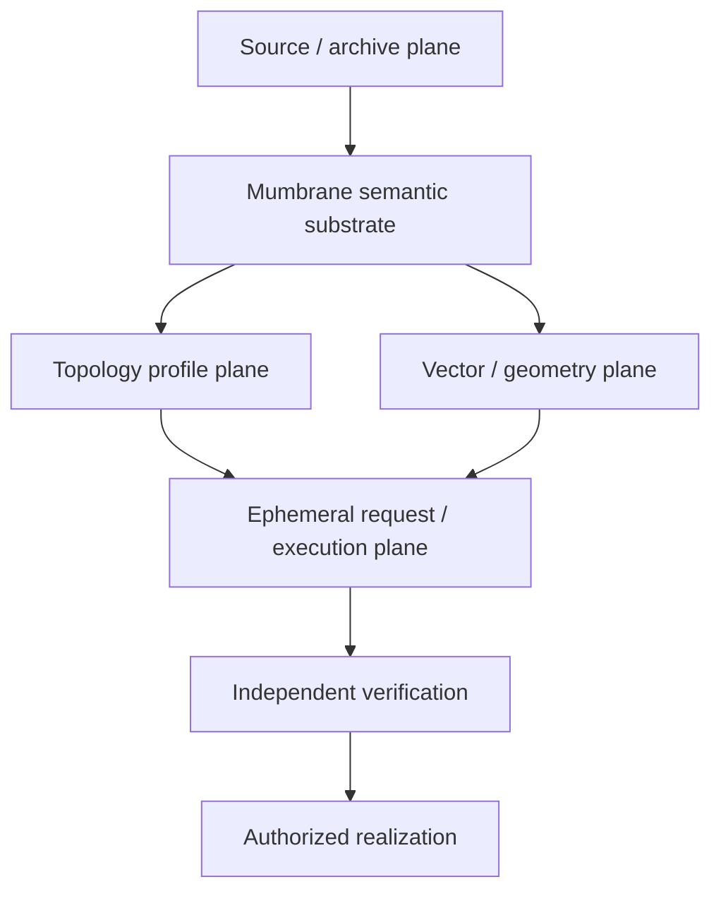

| Plane | Owns | May write | Must not do |
| --- | --- | --- | --- |
| Source/archive | raw text, spans, aliases, labels, hashes | ingestion, correction, supersession | directly execute semantics |
| Mumbrane substrate | exact units, ports, coordinates, context, provenance | validated atomic transactions | accept uncertain compiler output |
| Topology profile | registered laws, thresholds, addressing, output policy | signed version changes | invent absent semantics or execute arbitrary code |
| Vector/geometry | continuous bundles and sidecars | verified embedding builds | authorize facts or change exact roles |
| Request/execution | anchor, frontier, proof/equilibrium state, trace | ephemeral operations | become persistent truth without a new transaction |

## 7. Mumbrane IR v1

### 7.1 Universal record

**Validated.** LTM-R2 demonstrates a single record family for content,
operators, contexts, provenance, identity, regions, constraints, and
certificates.

```text
MumbraneUnit
    unit_id
    schema_revision
    unit_class_code
    semantic_code
    feature_mask
    port and coordinate ranges
    optional vector-bundle reference
    base weight and flags
    semantic hash
```

Sparse `MumbranePort` records preserve named roles, direction, ordinals, and
targets. `MumbraneCoordinate` records preserve exact scalar and categorical
context. Vector bundles are optional and separately hashed.

### 7.2 Nine feature bands

| Band | Examples | Authority |
| --- | --- | --- |
| Content | entity, claim, event, state, scalar | exact |
| Operator | relation, action, constraint, hard/soft class | exact |
| Role | premise, conclusion, older, newer, source, target | exact |
| Context | polarity, modality, scope, time, applicability | exact |
| Provenance | source, span, hash, derivation | exact |
| Geometry | content, role, context, binding vectors | soft/routing |
| Identity | canonical object, alias, supersession | exact |
| Region | address and dependency membership | exact routing |
| Integrity | revision, validation, semantic hash | authorization |

Absence is explicit. A missing feature is not an anonymous zero that a profile
may reinterpret later.

### 7.3 Hash identities

The architecture separates:

1. semantic hash: exact meaning;
2. artifact hash: meaning plus vectors and sidecars;
3. execution hash: substrate plus compiled profile;
4. archive hash: raw source and presentation labels.

This separation allows re-embedding without pretending the fact changed and
profile switching without rewriting the source meaning.

## 8. FieldIR v2

**Validated as an execution bridge.** FieldIR v2 packs symbols, atoms,
factors, bindings, contexts, provenance, and vector references into stable
numeric tables. It is derived from Mumbrane semantics, not a second factual
ontology.

Required invariants:

- deterministic ordering and insertion-order invariance;
- exact G1 signature preservation;
- complete sidecar dimensions and hashes;
- source text excluded from active numeric tables;
- identical meaning after pack, reload, and replay;
- separate semantic and artifact identity.

## 9. Topology profiles

A profile selects how captured semantics are used. Initial purposes are
reasoning, planning, evidence/science, and conversation memory. A profile is a
compiled numeric program, never arbitrary Python.

Profile changes have three tiers:

1. dynamics-only: weights, thresholds, budgets;
2. structural policy: operator activation, cardinality, hard/soft treatment;
3. missing semantics: source recompilation required.

L7 introduces a bounded fixed-equilibrium law with explicit conjunction,
source normalization, polarity, tension, convergence, and abstention policy.
That law remains validated only for its acyclic test boundary.

## 10. Compilation lifecycle

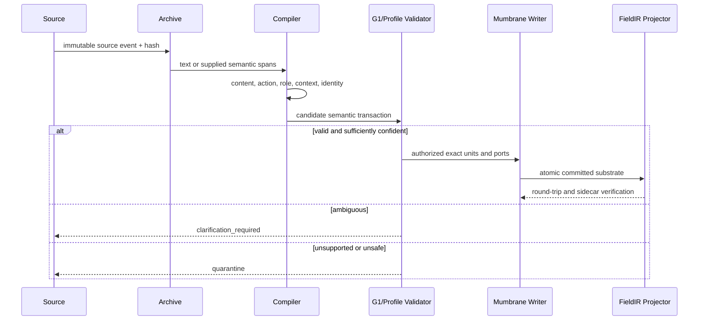

### 10.1 Compiler lanes

- **Validated:** G2.14 routes supplied-span controlled conversation with
  accepted precision 1.0000 and zero incorrect accepted mutations within its
  report boundary.
- **Provisional:** G2.5 proposes supplied-atom reasoning topology but recorded
  directional false accepts. High-impact use requires preview, confirmation,
  or abstention.
- **Provisional:** controlled mathematical compilers can produce formal bodies
  on narrow grammars.
- **Planned:** unrestricted semantic segmentation and reasoning compilation.

### 10.2 Atomic transaction

The writer constructs units, ports, contexts, provenance, indexes, FieldIR
factors, and vector references as one transaction. Any failed G1 relation,
round trip, hash, sidecar, reality, or provenance check commits nothing.

## 11. Persistent field organization

The field has an immutable base and a transactional session overlay. Base
updates require ingestion or certified migration. Session turns may add
preferences, corrections, references, and neutral user-reported claims.

Corrections supersede rather than erase history. Deletion removes active
influence and invalidates dependent summaries. Session clearing removes all
overlay influence while preserving the base. Assistant responses remain
events with no independent evidential authority.

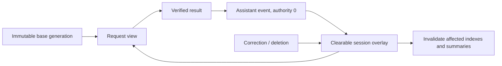

## 12. Addressing, frontier, and coverage

G3 resolves stable semantic addresses. G4 opens a bounded active frontier. G5
certifies that unopened regions cannot change the accepted result or widens
the frontier. Exact membership is factual; vector similarity only proposes
regions.

“All data influence” has two legitimate meanings:

1. every body contributes to a committed hierarchy or index summary;
2. every answer-changing body is opened or bounded by a coverage certificate.

It does not mean that every request reads every body. A whole-field scan was
intentional in L7’s 512-body mechanism probe; it is not a production scaling
strategy.

## 13. Request lifecycle

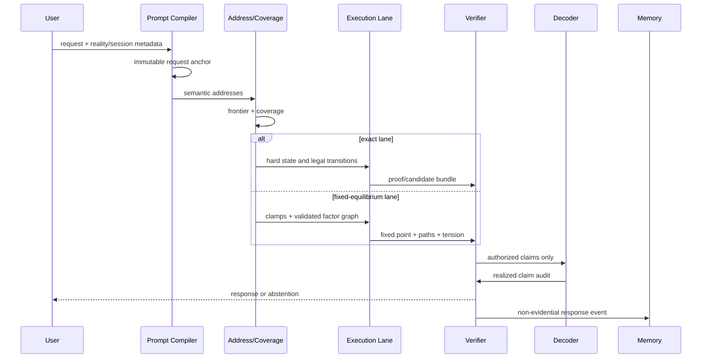

## 14. Exact reasoning lane

### 14.1 G1 and G6

G1 is the exact registry and validation authority. G6 executes registered
typed relations. Hard reasoning does not emerge from vector proximity.

### 14.2 Formal proof search

I3/I3.1 introduced formal expressions, reusable bodies, proposal scoring, and
exact proof transitions. L1 characterized the frozen runtime through 64
grounded steps; L3 connected controlled source compilation to verified 45-step
paths. L4 showed the limit: unseen branching proposal selection did not meet
its development gate.

The supported pattern is therefore:

```text
formal assumptions and goal
→ exact body retrieval
→ proposal ranking
→ exact legal transition
→ frontier reopening
→ proof completion
→ independent replay
```

The learned scorer may improve efficiency, but exact code owns legality and
verification.

## 15. Fixed-law equilibrium lane

### 15.1 Correct mental model

The prompt does not become a free vector that drifts until it “feels right.”
The compiled prompt meaning is immutable. It clamps selected semantic
variables. The ephemeral activation state of the field changes around it.

### 15.2 State

For atom \(j\):

\[
x_{j,+}, x_{j,-}, t_j \in [0,1]
\]

Prompt assumptions are clamped to one. Every other atom, factor, and tension
value starts at zero.

For factor \(b\), conjunction completeness is:

\[
C_b(x)=\min_{i\in inputs(b)} x_{i,+}
\]

Reality, scope, and time supply an exact mask \(M_b\). The target is:

\[
F_b=M_b C_b(x)
\]

Its source mass is:

\[
W_b=base_b\,authority_b\,confidence_b
\]

Equivalent bodies from one source contribute only their maximum. Incoming
support for atom \(j\), polarity \(s\), uses source-normalized noisy-OR:

\[
A_{j,s}=1-\prod_{g\in independent\ sources}
\left(1-\max_{b\in g\to(j,s)}W_bF_b\right)
\]

Tension is explicit:

\[
T_j=\min(A_{j,+},A_{j,-})
\]

### 15.3 Objective

The registered objective measures clamp, factor, atom, tension, and sparsity
dissatisfaction:

\[
E=\lambda_cE_{clamp}
+\lambda_f\sum_b(f_b-F_b)^2
+\lambda_a\sum_{j,s}(x_{j,s}-A_{j,s})^2
+\lambda_t\sum_j(t_j-T_j)^2
+\lambda_sE_{sparsity}
\]

L7’s implementation also includes a registered relational-satisfaction reward
so newly satisfied source-backed constraints lower the total objective without
letting duplicate factor count manufacture authority.

### 15.4 Synchronous update

```text
initialize prompt clamps to 1
initialize every other activation to 0
repeat:
    snapshot all atom and factor values
    compute every factor target from the snapshot
    compute every atom and tension target from the same logical sweep
    propose one projected block update
    recompute the complete objective from proposed state
    accept only a non-increasing update
until residual and objective tolerances pass
```

One sweep cannot secretly traverse an arbitrary chain because downstream
targets observe the prior logical state. A depth-20 path required repeated
sweeps. Multihop computation has not disappeared; it is expressed as fixed
point iteration rather than an explicit proof beam.

### 15.5 Candidate discovery

The query gives a requested formal property, sort, reality, scope, and time. It
does not give an answer ID or route. Compatible activated outcome atoms become
candidates. A strong signed margin yields a candidate; near-tied modes yield
alternatives; no supported mode yields unknown; uncertified convergence yields
incomplete equilibrium.

### 15.6 Evidence and limits

**Validated:** L7 `r3` reached 1.0000 exactness and independent-equilibrium
agreement on 240 supplied-formal prompts over 512 acyclic bodies, including
paths through 20 body applications, with zero incorrect accepted conclusions.
Removing optimization, relational law, or correct endpoints caused the frozen
performance collapse.

**Planned:** cyclic fixed points, 64-hop equilibrium, indexed large fields,
literal counterfactual arithmetic tables, and raw-language input.

## 16. Contradiction, authority, and uncertainty

Contradiction is paraconsistent: positive and negative channels coexist. No
explosion occurs. The stronger source-normalized mode may become primary, but
the losing activation remains visible. Near equality returns alternatives.

Duplicate records from one source do not create independent authority. This
distinguishes provenance-backed support from raw vote count.

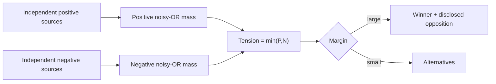

## 17. Reality isolation

Every unit and factor carries a reality key. The runtime filters incompatible
realities before execution, and the verifier rejects cross-reality paths.

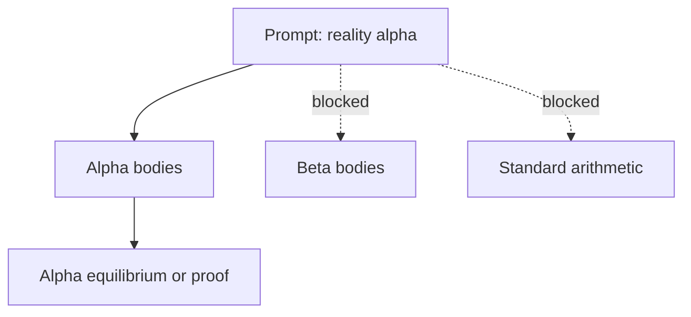

An example custom reality may assert:

```text
alpha: 1 ⊕ 1 = 3
alpha: if x = 3 then x ⊕ 2 = 5
```

The architecture supports representing this policy. The current L7 experiment
did not directly validate that literal operator table; it used synthetic
custom transformation lanes. That distinction remains explicit.

## 18. Verification and authorization

### 18.1 Exact lane

The verifier checks schema, reality, side conditions, every before/after state,
proof completeness, provenance, and final goal equality without importing the
proposal scorer.

### 18.2 Equilibrium lane

The evaluator independently solves the fixed equations, compares activations,
tension, residual, objective, candidate set, and supporting paths, and rejects
state swaps or unexplained residuals.

### 18.3 Decoder boundary

Only an authorized claim bundle crosses into realization. A decoder may choose
surface form; it may not add facts. Generated text is checked back against the
bundle. Failure returns an abstention or structured answer.

## 19. Decoder and realization

G10.1 validates strict realization over prevalidated candidates. The decoder
receives:

```text
authorized claims
proof or equilibrium certificate
source labels permitted for display
confidence, opposition, and tension
required uncertainty language
forbidden unsupported claims
```

An optional language model is an untrusted renderer. Its output is parsed or
matched against the authorized claims. The architecture does not give a
decoder access to evaluator gold or permission to infer new evidence.

## 20. Conversation and memory lifecycle

G11 validates structured session behavior; G12 validates incremental
persistence; G13 validates a controlled scale layout. User assertions remain
user-reported until evidence promotes them. Preferences are authoritative for
response form, not world truth. Corrections require an unambiguous target.

Assistant output is stored as a discourse occurrence with no independent
authority. Deleting its source removes derived influence. Clearing a session
removes all overlay influence. Restart and replay reproduce hashes.

## 21. Scaling model

### 21.1 Complexity

```text
Compilation: O(new source + affected indexes + affected summaries)
Storage:     O(units + ports + coordinates + vectors + indexes)
Exact query: O(opened bodies + legal proposals + proof states)
Equilibrium: O(active factors × sweeps + independent verification)
```

The persistent archive avoids repeatedly sending all source text to a decoder,
but it does not make difficult reasoning free. Retrieval coverage, branching,
factor diameter, cycles, and verification remain real costs.

### 21.2 Equilibrium compute unit

A practical billing abstraction is:

```text
1 ECU = up to 512 active factors × 32 sweeps × one verification
```

This is a product proposal, not an experimentally locked price. Current L7
local measurements showed tens of milliseconds per 512-body request, while
production networking, tenant loading, persistence, logs, and language
compilation may dominate.

### 21.3 Retrieval scaling

G13 supports controlled indexed storage. L1 and L3 support dynamic reopening
in exact search. L7 intentionally removed retrieval as a variable and scanned
one compatible 512-body partition. Combining L7 with minimap or indexed
coverage is **Planned**.

## 22. Security and failure semantics

| Failure | Required behavior |
| --- | --- |
| unknown schema/profile | reject before execution |
| corrupt vector sidecar | reject artifact |
| stale field or minimap hash | fail closed and rebuild |
| ambiguous compiler output | clarify without mutation |
| cross-reality body | exclude and report integrity failure |
| incomplete frontier | widen or return incomplete coverage |
| non-convergent equilibrium | return incomplete equilibrium |
| invalid proof/certificate | authorize no factual result |
| decoder adds a claim | reject realization |
| partial transaction | roll back all semantic writes |
| evaluator-gold access | integrity failure |

## 23. Deployment architecture

**Planned.** G15 has not run.

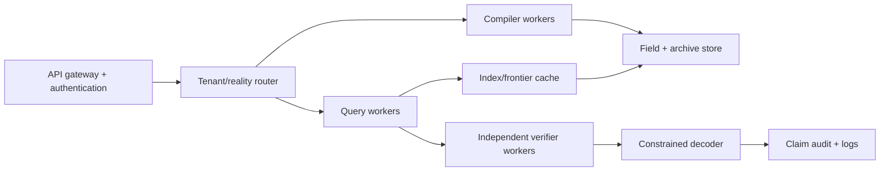

Production readiness requires tenant isolation, rate limits, crash recovery,
immutable audit logs, deterministic resume, regional persistence, concurrency,
resource ceilings, and failure injection.

## 24. Worked flows

### 24.1 Conversational preference

```text
User: "Please answer concisely."
→ supplied semantic span
→ G2.14 set_preference decision
→ session-scoped preference Mumbrane
→ G11 overlay transaction
→ later response profile reads preference
→ decoder uses concise authorized form
```

The preference changes response form, not factual truth.

### 24.2 Correction

```text
Turn 1: "My appointment is Tuesday."
Turn 2: "Correction: it is Wednesday."
→ correction linker finds one active target
→ new user-reported claim
→ supersedes(old, new)
→ Tuesday retains provenance but loses active validity
```

Ambiguous targets produce clarification and no mutation.

### 24.3 Exact proof search

```text
formal assumptions + goal
→ applicable axiom bodies
→ scorer ranks legal applications
→ exact kernel applies one transition
→ frontier reopens
→ goal reached
→ verifier replays every step
```

L1 observed grounded paths through 64 steps. This is not a 64-sweep L7 result.

### 24.4 L7 depth-20 equilibrium

One assumption atom starts at activation one. Twenty separate bodies connect
it to the queried proposition. Every other activation begins at zero. Repeated
synchronous sweeps move support across the chain. The final requested atom has
positive activation one, negative activation zero, and tension zero. The
independent evaluator reconstructs all twenty bodies and the same fixed point.

### 24.5 Weighted contradiction

Five strong independent sources may outweigh eleven weak records. Positive and
negative modes remain present; duplicate rows from one source do not add mass.
The response states the winner and residual opposition.

### 24.6 Ambiguity and abstention

If two candidates remain within the alternative margin, the decoder presents
alternatives. If no candidate crosses confidence, it returns unknown. If
coverage or convergence is uncertified, it returns incomplete rather than a
best guess.

## 25. Correctness arguments

### 25.1 Semantic preservation

Mumbrane-to-G1 and Mumbrane-to-FieldIR projections must preserve exact
signatures. Hashes bind schema, profile, vectors, and archive separately.

### 25.2 Atomicity

All semantic outputs share one transaction boundary. Therefore no valid atom
can be committed with missing provenance or an invalid companion relation.

### 25.3 Reality isolation

Reality is checked during addressing, execution, certification, and decoding.
No single filtering layer is trusted as the only defense.

### 25.4 Equilibrium causality

L7 controls establish bounded causality because no optimization, no relational
law, and shuffled endpoints collapse performance, while decisive-body and
authority interventions change results and irrelevant changes do not.

### 25.5 Authorization

The search or optimizer cannot authorize its own output. Independent replay or
fixed-point agreement is required. This converts inference from an assertion
into a candidate plus certificate.

## 26. Evidence matrix

| Architectural area | Evidence | Current conclusion |
| --- | --- | --- |
| exact ontology | G1 | validated controlled registry |
| compiler | G2.14 / G2.5 | supplied-span conversation validated; reasoning provisional |
| numeric representation | LTM-R1, LTM-R2 | universal target validated on controlled bodies |
| execution bridge | LTM-I1 | FieldIR v2 validated on confirmed topology |
| addressing and coverage | G3–G5 | validated controlled indexes/frontiers |
| exact reasoning | G6 | validated registered relations |
| soft reconciliation | G7–G8 | validated registered bounded laws |
| verification | G9 | validated registered corruptions |
| decoder | G10.1 | validated strict realization, not unrestricted language |
| lifecycle | G11–G13 | validated controlled session/storage/scale components |
| composition | G14 | controlled path; raw product not ready |
| formal search | I3/L1/L3/L4 | grounded long paths; branching selection unresolved |
| learned latent equilibrium | L5/L6 | pending/development only |
| fixed equilibrium | L7 | validated bounded acyclic depth-20 mechanism |
| serving | G15 | planned |

## 27. Current limits and next tests

Priority experiments are:

1. freeze the L7 law and test cyclic fixed-point uniqueness;
2. combine the same law with indexed large-field coverage;
3. test 64-body equilibrium separately from L1 exact search;
4. compile literal custom arithmetic tables and downstream operations;
5. complete the canonical G2.14 Mumbrane writer;
6. improve raw semantic compilation without weakening abstention;
7. run G15 production isolation and failure recovery.

## 28. Related work

LTM combines ideas that have separate research histories. None of these papers
proves the LTM architecture.

- Concept bottlenecks motivate explicit, inspectable intermediate semantics,
  while LTM requires exact persistence and independent authorization beyond a
  learned bottleneck ([Koh et al., ICML 2020](https://proceedings.mlr.press/v119/koh20a.html)).
- Neural Relational Inference demonstrates recovery of latent interactions
  from dynamics; LTM currently stores or compiles exact relational incidence
  rather than claiming general unsupervised recovery
  ([Kipf et al., ICML 2018](https://proceedings.mlr.press/v80/kipf18a.html)).
- Continuous modern Hopfield networks relate attention to associative energy
  retrieval, motivating but not validating field optimization
  ([Ramsauer et al., ICLR 2021](https://openreview.net/forum?id=tL89RnzIiCd)).
- Predictive-coding associative memories motivate iterative completion
  ([Salvatori et al., NeurIPS 2021](https://proceedings.neurips.cc/paper_files/paper/2021/hash/1fb36c4ccf88f7e67ead155496f02338-Abstract.html)).
- Compositional energy work shows that inference procedure can determine
  whether energy composition succeeds, reinforcing the need for causal
  optimizer controls
  ([Du et al., ICML 2023](https://proceedings.mlr.press/v202/du23a.html)).
- Systematic generalization failures warn against treating regular chain
  completion as general reasoning
  ([Lake and Baroni, ICML 2018](https://proceedings.mlr.press/v80/lake18a.html)).
- LeanDojo, HyperTree Proof Search, and TacticZero exemplify separating formal
  proof environments from learned guidance
  ([Yang et al., NeurIPS 2023](https://proceedings.neurips.cc/paper_files/paper/2023/hash/4441469427094f8873d0fecb0c4e1cee-Abstract-Datasets_and_Benchmarks.html),
  [Lample et al., NeurIPS 2022](https://proceedings.neurips.cc/paper_files/paper/2022/hash/a8901c5e85fb8e1823bbf0f755053672-Abstract-Conference.html),
  [Wu et al., NeurIPS 2021](https://proceedings.neurips.cc/paper/2021/hash/4dea382d82666332fb564f2e711cbc71-Abstract.html)).
- Hierarchical neural memory and similarity-graph routing motivate explicit
  multiscale retrieval controls
  ([Huynh et al., ICLR 2020](https://openreview.net/forum?id=ByxKo04tvr),
  [Baranchuk et al., ICML 2019](https://proceedings.mlr.press/v97/baranchuk19a.html)).
- Retrieval-augmented generation demonstrates the utility of combining learned
  generation with retrieved external memory; LTM differs by compiling exact
  persistent semantics and requiring independent authorization
  ([Lewis et al., NeurIPS 2020](https://papers.neurips.cc/paper/2020/hash/6b493230205f780e1bc26945df7481e5-Abstract.html)).
- Provenance semirings formalize how query results depend on source records;
  LTM uses a different schema but shares the requirement that derivation remain
  source-accountable
  ([Green et al., PODS 2007](https://doi.org/10.1145/1265530.1265535)).
- The Logic of Paradox is a foundational paraconsistent logic; L7 is not an
  implementation of LP, but likewise refuses explosion from contradiction
  ([Priest, 1979](https://doi.org/10.1007/BF00258428)).
- Constrained neural realization from compositional semantic representations
  motivates separating content plans from surface generation
  ([Balakrishnan et al., ACL 2019](https://aclanthology.org/P19-1080/)).

## 29. Bibliography

1. Balakrishnan, A. et al. “Constrained Decoding for Neural NLG from Compositional Representations in Task-Oriented Dialogue.” ACL, 2019.
2. Baranchuk, D. et al. “Learning to Route in Similarity Graphs.” ICML, 2019.
3. Du, Y. et al. “Reduce, Reuse, Recycle: Compositional Generation with Energy-Based Diffusion Models and MCMC.” ICML, 2023.
4. Green, T. J., Karvounarakis, G., and Tannen, V. “Provenance Semirings.” PODS, 2007. DOI: 10.1145/1265530.1265535.
5. Huynh, D. et al. “Multigrid Neural Memory.” ICLR, 2020.
6. Kipf, T. et al. “Neural Relational Inference for Interacting Systems.” ICML, 2018.
7. Koh, P. W. et al. “Concept Bottleneck Models.” ICML, 2020.
8. Lake, B. and Baroni, M. “Generalization without Systematicity.” ICML, 2018.
9. Lample, G. et al. “HyperTree Proof Search for Neural Theorem Proving.” NeurIPS, 2022.
10. Lewis, P. et al. “Retrieval-Augmented Generation for Knowledge-Intensive NLP Tasks.” NeurIPS, 2020.
11. Priest, G. “The Logic of Paradox.” Journal of Philosophical Logic, 1979. DOI: 10.1007/BF00258428.
12. Ramsauer, H. et al. “Hopfield Networks Is All You Need.” ICLR, 2021.
13. Salvatori, T. et al. “Associative Memories via Predictive Coding.” NeurIPS, 2021.
14. Wu, M. et al. “TacticZero: Learning to Prove Theorems from Scratch with Deep Reinforcement Learning.” NeurIPS, 2021.
15. Yang, K. et al. “LeanDojo: Theorem Proving with Retrieval-Augmented Language Models.” NeurIPS, 2023.

## 30. Glossary

| Term | Meaning |
| --- | --- |
| Mumbrane | universal typed semantic unit plus its feature bands |
| Field | persistent units, factors, context, indexes, vectors, and profiles |
| Reality | signed and isolated semantic namespace |
| Prompt anchor | immutable compiled meaning of a request |
| Clamp | prompt-owned activation fixed during equilibrium |
| Frontier | detailed bodies opened for a request |
| Coverage | certificate that unopened regions cannot change authorization |
| Exact lane | registered typed transitions and proof replay |
| Equilibrium lane | fixed synchronous satisfaction over a validated acyclic graph |
| Tension | coexistence magnitude of positive and negative activation |
| Candidate | inferred result awaiting independent authorization |
| Authorized bundle | claims, certificates, sources, and uncertainty permitted to reach the decoder |
| Semantic hash | identity of exact meaning independent of vectors and wording |

## 31. Final architectural statement

LTM-ARCH-1.2 is a post-transformer energy-based latent architecture with an
incomplete language boundary. Its strongest contribution is not a claim that
one latent vector replaces reasoning. It is the separation of persistent
semantic reality, exact topology, registered continuous influence, ephemeral
request computation, independent verification, and constrained realization.
L7 validates bounded fixed-law satisfaction; L8 provisionally shows that a
compiled reasoning policy can change that equilibrium without mutating the
field. The architecture becomes a general system only if future work preserves
these authority boundaries while solving compilation, retrieval, cycles,
scaling, and production isolation.

## 32. Formal system model

This chapter restates the architecture as a state-transition system. The goal
is to make explicit which objects exist, which transformations are legal, and
where experimental evidence ends.

### 32.1 Persistent state

For one tenant, let the persistent state be

\[
\mathcal{P}=(\mathcal{A},\mathcal{M},\mathcal{F},\mathcal{I},\mathcal{C}),
\]

where \(\mathcal{A}\) is the append-only source archive, \(\mathcal{M}\) the
exact Mumbrane substrate, \(\mathcal{F}\) the derived FieldIR execution view,
\(\mathcal{I}\) the addresses, summaries, indexes, caches, and validity
metadata, and \(\mathcal{C}\) the signed configuration and topology-profile
commitments.

Every member of \(\mathcal{P}\) is versioned. A request never observes “the
database” in the abstract; it observes one consistent snapshot identified by a
base hash, overlay generation, profile revision, and cache generation. If any
identifier disagrees, the request is not authorized to execute.

An archive event \(e\) is not itself a semantic fact. It has source identity,
canonical payload, provenance, reception time, source category, and declared
reality/session/scope ownership. A compiler transaction \(T(e)\) may propose a
semantic delta, but only validation and commit can move that delta into
\(\mathcal{M}\).

### 32.2 Semantic state

A Mumbrane unit can be modeled abstractly as

\[
m=(i,k,r,s,t,p,c,v,h),
\]

with stable identity \(i\), semantic kind \(k\), reality key \(r\), scope/time
applicability \((s,t)\), exact ports \(p\), exact context coordinates \(c\),
soft vectors \(v\), and integrity/provenance commitment \(h\). Concrete schemas
remain authoritative, and different kinds need not fill every optional band.

The exact projection

\[
\pi_{exact}(m)=(i,k,r,s,t,p,c,h)
\]

is semantic authority. The soft projection \(\pi_{soft}(m)=v\) may influence
addressing, ranking, continuous reconciliation, or rendering style. No function
of \(\pi_{soft}\) alone may alter \(\pi_{exact}\). This one-way boundary is the
core defense against mistaking a similar vector for an exact fact.

### 32.3 Request state

For request \(q\), the ephemeral state is

\[
\mathcal{R}_q=(q_0,A_q,F_q,X_q,V_q,O_q),
\]

where \(q_0\) is the immutable request anchor, \(A_q\) the starting addresses,
\(F_q\) the opened frontier, \(X_q\) the exact or continuous execution state,
\(V_q\) verification evidence, and \(O_q\) the authorized output bundle. Only
\(O_q\), not an intermediate state, can cross the realization boundary.

The phrase “the prompt moves” is shorthand and should not appear in an
implementation contract. Prompt meaning and assumptions remain fixed. What
changes is \(X_q\): proof states in exact search, or atom/factor activations in
fixed-law equilibrium. This prevents optimization from rewriting the question
until an easy answer appears.

### 32.4 Legal transitions

The architecture permits four classes of transition:

1. **Archive transition:** append an immutable source event.
2. **Semantic transaction:** validate and atomically commit a compiler delta.
3. **Ephemeral execution transition:** update proof or activation state without
   changing persistent truth.
4. **Lifecycle transition:** supersede, expire, delete, fold, reopen, or clear a
   scoped overlay through a new auditable event.

It forbids an execution transition from becoming a semantic transaction merely
because an answer is confident. A proof result, equilibrium result, or decoder
sentence may be recorded as an occurrence, but is not automatically evidence.
Promotion requires a separate authorized source or policy boundary.

### 32.5 Invariants

For every committed state and authorized request, the intended invariants are

\[
\operatorname{roundtrip}(\mathcal{M},\mathcal{F})=
\pi_{exact}(\mathcal{M}),
\]

\[
\operatorname{reality}(m)=\operatorname{reality}(q)
\quad\text{for every }m\in F_q,
\]

and

\[
\operatorname{authorize}(O_q)\Rightarrow
\operatorname{coverage}(F_q)\land\operatorname{verify}(V_q,O_q).
\]

Clarification, quarantine, failed verification, and equilibrium inference all
have \(\Delta\mathcal{M}=\varnothing\). Some invariants are **Validated** in
controlled experiments; their unrestricted conjunction under production load
is **Planned** and belongs to G15.

## 33. Ingestion transaction protocol

### 33.1 Source receipt and hashing

The ingestion service first creates a source envelope. It does not interpret
content before hashing, because exact bytes and public metadata must be
available to reproduce later interpretation. The envelope includes source,
tenant, reality, session, episode, and turn identities; content hash; source
and authority category; receipt time; encoding; and schema revision.

If the source is corrected, the old envelope remains. A later event links the
replacement or supersession. Provenance is therefore a historical graph rather
than a mutable “last updated” field. This design supports rollback, targeted
deletion, legal retention policies, and reconstruction of which exact source
authorized a unit.

### 33.2 Segmentation boundary

Segmentation identifies candidate spans, clauses, formulas, records, or
already-structured objects. Supplied semantic spans are a valid input boundary
and are the one under which G2.14 passed. Raw segmentation is a separate model
and must report offsets against the archived source. It may not normalize away
a negation, quote marker, uncertainty cue, or scope phrase without retaining an
exact mapping.

A segment record should contain:

```text
segment_id
source_id
byte and character offsets
display-text hash
normalization revision
segment-kind hypothesis
confidence and margin
```

The compiler rejects offsets that do not reproduce the claimed source hash.
This protects explainability and deletion: a user can locate the occurrence
that produced a semantic unit.

### 33.3 Narrow decision composition

The compiler is modular because one opaque class label cannot expose which
decision failed. Typical independent decisions are content identity and type;
discourse action or semantic operator; named role or slot assignment;
direction; polarity, modality, quotation, scope, and time; identity/reference
target; correction, retraction, or preference target; and disposition.

These outputs are combined only into candidates legal under the exact registry.
The compiler does not learn arity when G1 already defines it. It does not learn
a relation's role names when those names are contract data. It learns only the
language-dependent assignment of observed content to existing legal structure.

This is the most important distinction between semantic compilation and
end-to-end prediction. Structural knowledge that is already exact should be
looked up and validated, not reconstructed approximately. Learned modules are
reserved for facts not available from the registry: which span expresses which
content, which legal action is intended, how a pronoun links to bounded memory,
and whether the evidence is strong enough to proceed.

### 33.4 Monotonic gating

Suppose an upstream predictor returns disposition \(d\) and the candidate
resolver returns evidence \(e\). The final gate is constrained by the authority
order

\[
\mathrm{quarantine}\preceq\mathrm{clarify}\preceq\mathrm{accept}.
\]

Downstream processing may move left in this order, never right. Equivalently,
final authority is no greater than the least authoritative required stage:

\[
\operatorname{authority}_{final}=
\min_i\operatorname{authority}_i.
\]

This explains why G2.14 could safely wrap the frozen G2.13 predictor without
changing its weights. Candidate compatibility, confidence, and ambiguity
evidence reduced acceptance. The gate did not invent a positive decision or
promote an abstention.

### 33.5 Candidate validation

Validation is a pipeline of pure checks over the complete proposed transaction:

1. schema and revision are registered;
2. stable identities are unique or intentionally linked;
3. roles, arity, direction, and kinds satisfy G1;
4. reality, tenant, session, scope, and time are compatible;
5. source spans reproduce source hashes;
6. provenance and authority categories are present;
7. vector sidecars have correct dimensions, row identities, and hashes;
8. FieldIR and Mumbrane projections reproduce the exact signature;
9. lifecycle mutations reference one valid active target;
10. no partial operation can commit independently.

Validation is not semantic repair. If a role is missing, the validator does not
guess it. If a reference is cross-session, the validator does not replace it
with the nearest same-session item. It rejects the active mutation and, where
policy permits, preserves only the neutral audit event.

### 33.6 Atomic commit protocol

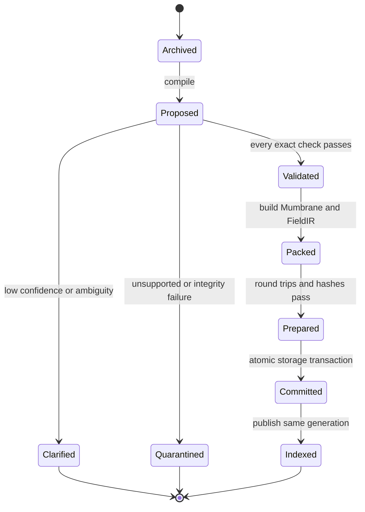

The storage implementation may stage rows, sidecars, and indexes physically,
but readers cannot observe the generation until the transaction marker commits.
On failure, staged objects are unreachable and collectible. Recovery after a
crash replays or discards the prepared transaction according to the commit
record; it never infers success from the presence of a subset of files.

### 33.7 Corrections, retractions, and deletion

A correction creates new content and a supersession edge only when the old
target is unique. The older occurrence remains in history but is inactive in
the new generation. A retraction closes validity or creates a tombstone for one
exact target. Targeted deletion removes the target's active influence and
invalidates every summary that committed its membership. Session clear creates
a new empty overlay generation while preserving the immutable base and audit
trail allowed by policy.

This behavior is **Validated** for structured events in G11–G13. Compiling
arbitrary raw-language corrections into those events remains **Planned**.

## 34. Request execution protocol

### 34.1 Request compilation

A request compiler produces a structured request anchor containing assumptions,
requested result type, reality, scope, time, and source identity. It contains
neither the answer nor a hidden route. Ambiguity produces clarification before
field execution. The anchor is immutable for the request lifetime. A widened
frontier, changed proof state, or changed activation vector cannot rewrite its
assumptions; a user modification creates a new request and hash.

### 34.2 Address resolution and frontier

G3-style addressing maps exact identity, type, and permissible soft cues to
starting regions. Exact keys narrow types and realities; vectors may rank
regions. Neither authorizes a conclusion. The active frontier is a materialized
set of bodies and units within configured budgets. Its trace records opened
regions and bodies, reasons for opening, filter decisions, cumulative reads,
summary cells evaluated, cache generation, and coverage bound.

Dynamic reopening means execution may query the index again from a new proof or
activation state. It does not authorize a whole-field scan. Every reopening is
budgeted. A cumulative query can read more bodies than one frontier contains,
so telemetry must report both per-frontier and cumulative distinct reads.

### 34.3 Coverage certification

Coverage asks whether an unopened compatible region could contain a contribution
strong enough to change authorization. The certificate depends on the execution
law. Exact proof search may require recall of applicable axioms or decisive
bodies within the proof budget. Equilibrium needs an upper bound on unopened
factor influence. If the bound cannot be certified, the result is
`incomplete_frontier`, not a low-confidence factual answer.

Coverage is distinct from convergence. A solver can converge on the wrong
subset. A complete frontier can be present while a solver fails to converge.
Both conditions must pass independently.

### 34.4 Lane selection

The profile and request type select one lane:

- exact registered relation propagation or formal proof search;
- G7 soft reconciliation after exact facts are known;
- L7 fixed-law equilibrium for a compatible bounded acyclic factor reality;
- clarification or unsupported when no lane's preconditions hold.

Lane selection is exact configuration logic. Failed exact verification cannot
fall back to an unverified soft factual answer without changing claim type and
disposition explicitly.

### 34.5 Verification and realization

The runtime returns a candidate and certificate. The verifier receives the
public snapshot and trace, but internal confidence is not authority. It
reconstructs the relevant exact transition, proof, or equilibrium independently.
Process separation is useful but insufficient unless imports and filesystem
capabilities also prevent evaluator gold from entering runtime.

The authorized bundle contains proposition or candidate set, disposition,
proof or equilibrium certificate, provenance, scope, time, conflicts, coverage,
and permitted labels. It is the only semantic input to realization. A claim
audit verifies every factual clause after rendering. The response may be stored
as `ASSISTANT_RESPONSE`, but never becomes evidence merely by being repeated.

### 34.6 Failure and abstention flow

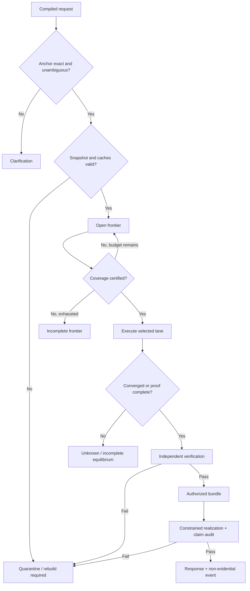

## 35. Fixed-law equilibrium derivation

### 35.1 Why a fixed law

L7 removed learned geometry from the causal question. The field law is not a
language model and contains no trained knowledge. It asks whether already
compiled user data can determine request-time state under a registered,
deterministic satisfaction rule. This separates compiler correctness, field-law
correctness, and decoder fidelity instead of hiding them in one score.

### 35.2 State and factor targets

Each atom \(j\) has positive activation \(x_{j,+}\), negative activation
\(x_{j,-}\), and tension \(t_j\), constrained to \([0,1]\). Prompt assumptions
clamp the relevant channels to one. All others begin at zero. A factor \(b\)
with inputs \(I_b\) has conjunction completeness

\[
C_b(x)=\min_{i\in I_b}x_{i,s_i}.
\]

The exact compatibility mask

\[
M_b=M_{reality}M_{scope}M_{time}M_{validity}
\]

blocks incompatible factors without ranking outcomes. The target factor
activation is

\[
F_b=M_bC_b(x).
\]

The runtime retains explicit factor variable \(f_b\) and penalizes deviation
from \(F_b\). A body is not said to “fire” because it is legally applicable;
activation emerges as optimization reduces factor residual.

### 35.3 Source-normalized aggregation

Source weight is

\[
W_b=\operatorname{clip}(base_b\,authority_b\,confidence_b,0,1).
\]

Let \(G(j,s)\) be independent source groups supporting atom \(j\) with polarity
\(s\). Each group contributes its maximum equivalent support,

\[
u_g=\max_{b\in g\rightarrow(j,s)}W_bf_b,
\]

and channel target is the noisy-OR

\[
A_{j,s}=1-\prod_{g\in G(j,s)}(1-u_g).
\]

Duplicating one source does not add mass. Independent sources combine with
diminishing saturation. This is the registered L7 source law, not a claim of
universal epistemic optimality.

### 35.4 Contradiction and objective

Positive and negative support coexist. Tension target is

\[
T_j=\min(A_{j,+},A_{j,-}).
\]

Thus a losing contradiction remains visible. Within the configured margin,
the result is alternatives. Outside the margin, the stronger channel is primary
and the decoder still reports opposing support.

The conceptual registered objective is

\[
\begin{aligned}
E(x,f,t)=&\lambda_q\sum_{(j,s)\in Q}(x_{j,s}-1)^2\\
&+\lambda_f\sum_b(f_b-F_b(x))^2\\
&+\lambda_a\sum_{j,s}(x_{j,s}-A_{j,s}(f))^2\\
&+\lambda_t\sum_j(t_j-T_j(f))^2+\lambda_sR(x,f).
\end{aligned}
\]

All weights and regularization are profile data. The runtime recomputes the
objective from state; it may not clamp telemetry to appear nonincreasing.

### 35.5 Synchronous propagation

At sweep \(k\), every target is calculated from snapshot
\((x^k,f^k,t^k)\), then all variables are proposed together. A newly activated
outcome cannot become a downstream input during the same sweep. A length-20
chain therefore requires repeated propagation. “One optimization” names the
outer procedure; sweeps are the computational work carrying constraint
satisfaction through the graph.

Backtracking accepts only a state with

\[
E^{k+1}\le E^k+\epsilon_E.
\]

The solver stops only when equation residual and state change both pass. Budget
exhaustion yields `incomplete_equilibrium`.

### 35.6 Independent fixed-point solution

For L7's acyclic graphs, the evaluator uses monotone lower/upper fixed-point
iteration and exact topological evaluation. Runtime does not receive the
topological order. Agreement checks candidate set, activations, tension,
residual, objective, and source-normalized paths. A swapped final state can look
plausible yet fail because its reality, path, or fixed point does not replay.

L7 **Validated** this mechanism on 240 supplied-formal prompts over a 512-body
acyclic field through 20 applications. It did not test cycles, minimap retrieval,
millions of bodies, raw language, or universal mathematics.

## 36. Detailed end-to-end traces

The following traces are explanatory reconstructions of mechanisms validated in
separate controlled experiments. They are not new measurements. Each trace
identifies where the real architecture is validated, provisional, or planned.

### 36.1 Conversational preference and later replacement

Assume a session receives the supplied semantic span “Keep answers concise.”
Public metadata fixes the user, session, turn, and source hash. The G2.14 lane
receives the span and bounded current-session candidates.

1. The discourse predictor identifies a request or statement-like preference
   expression; the memory-action head selects `set_preference`; slot extraction
   identifies the response-form key and `concise` value.
2. The monotonic gate checks required head probabilities and margins, ensures
   both slots exist, and confirms that no reference or correction target is
   required. If any check fails, the neutral utterance audit event is retained
   without active preference mutation.
3. Candidate construction creates a preference unit, response-style target,
   provenance occurrence, and exact `prefers` relation. The writer stage is
   still a documented gap for the canonical G2.14 product lane, so this full
   handoff is **Planned** even though the routing decision is **Validated**.
4. G1 checks roles and kinds. Mumbrane and FieldIR projections must reproduce
   the same semantic signature. The transaction commits preference and indexes
   in one generation.
5. A later request resolves the active session preference through indexed G11
   lifecycle state. The decoder receives `style=concise` as response-form
   authority, not factual evidence.

Now suppose the user says, “Actually, give detailed answers.” A unique active
preference target permits a replacement. The new occurrence supersedes the
older occurrence. The old preference remains in history but does not affect the
active response profile. If two preference targets are equally plausible, no
replacement occurs and clarification is returned.

This trace illustrates a general rule: user preference is authoritative for
response form inside its scope, while an ordinary user assertion is only a
user-reported occurrence with `factual_authority=false`. The same user can
define a signed mathematical reality, but that definition is isolated from
standard mathematics and other tenants.

### 36.2 Correction, evidence deletion, and assistant non-evidence

Consider a structured session claim “The project codename is Blue” followed by
the unambiguous correction “The codename is Green.” The correction compiler
must supply both replacement content and one exact active target.

The resulting transaction contains:

```text
new neutral claim occurrence: codename = Green
supersedes(older_blue_occurrence, newer_green_occurrence)
source and character-span provenance
session and episode applicability
```

If G1 validation, source offsets, FieldIR packing, or Mumbrane round trip fails,
neither the new occurrence nor the supersession edge commits. A later context
query reads Green and may disclose that Blue was superseded if history is
authorized.

Suppose the assistant previously replied, “Understood—the codename is Blue.”
That response is stored as an assistant occurrence derived from the original
source, not as independent evidence. When the original Blue occurrence is
deleted, the assistant repetition cannot keep Blue alive. G11's targeted-
deletion tests validate this non-self-contamination behavior for structured
events.

Deletion changes the active overlay generation and invalidates affected indexes
and summaries. Queries pinned to the older generation may complete according to
snapshot policy; new queries see the new generation. A summary built before
deletion is stale and must fail closed rather than silently retain residual
influence.

### 36.3 Exact mathematical proof lane

Take supplied formal source expression \(e_0\), goal \(g\), and a signed bank of
registered rewrite schemas. The request anchor contains \(e_0\), \(g\),
reality, and budgets; it contains no expected proof depth or axiom route.

At proof state \(s_k\), the engine retrieves compatible bodies, enumerates exact
type-valid applications, rejects invalid side conditions, canonicalizes result
states, and uses a scorer or deterministic priority only to rank legal actions.
The ranking component cannot declare success. A transition occurs only through
the exact formal kernel.

```text
s0 = canonical(source)
for k in 0..budget:
    bodies = frontier(s_k, goal, reality)
    legal = enumerate_exact_applications(s_k, bodies)
    ranked = proposal_scorer(legal, s_k, goal)
    next_beam = canonical_unique(apply_exact(ranked[:limit]))
    if goal in next_beam:
        return proof_certificate
return unknown_or_budget_exhausted
```

The independent verifier reconstructs substitutions and replays each step
without importing the proposal scorer. L1 demonstrated independently replayed
grounded paths through 64 steps, but its cases were designed to measure search
and transport capacity. L4 then showed that unseen branching proposal selection
was not solved: returned proofs remained exact, while local proposal recall and
answerable coverage failed. The honest architectural conclusion is therefore
“long exact paths can execute when found,” not “the architecture solves
arbitrary 64-step theorem proving.”

### 36.4 Twenty-body equilibrium trace

Consider a chain of factor bodies

```text
a0 → a1
a1 → a2
...
a19 → a20
```

and a prompt clamping \(a_0^+=1\) while querying the property represented by
\(a_{20}\). Every non-prompt activation and every factor activation begins at
zero. No consumer map sets \(a_1\) to one.

During the first synchronous sweep, the first factor sees complete input and
moves toward activation, but its outcome target was computed from the previous
zero factor snapshot. During subsequent sweeps, satisfaction pressure moves
from factor to outcome, then from that outcome into the next factor. Damping or
backtracking can require more than one sweep per body. The runtime trace records
state hashes, objective, residual, and state change.

The final candidate is discovered from activated outcomes compatible with the
query slot. The evaluator checks that \(a_{20}\)'s activation is the unique
fixed-point result, that the exact path contains twenty valid bodies, that no
cross-reality factor contributed, and that runtime objective regret is within
the registered bound. Removing a decisive body makes the terminal state unknown
or changes it; one-sweep and no-optimization controls fail long cases. Those
causal changes are what make the L7 result evidence about the field law rather
than a static answer table.

### 36.5 Weighted contradiction trace

Suppose the prompt activates paths supporting \(p\) and \(\neg p\). Eleven
records support \(p\), but all eleven duplicate one low-authority source. Five
records support \(\neg p\), each from a distinct high-authority source.

Source normalization first reduces the eleven duplicates to one source-group
maximum. If each duplicate has effective support 0.30, the positive target is
0.30, not \(1-(1-0.30)^{11}\). If the five independent negative sources each
contribute 0.50, their noisy-OR is

\[
1-(1-0.50)^5=0.96875.
\]

The primary result is negative, positive support remains visible, and tension
is 0.30. A count-only control chooses the wrong side. Duplicating the positive
source twenty more times leaves the result unchanged. Swapping source authority
must reverse the winner when the frozen intervention says it should.

This example demonstrates why “satisfy all activated things” cannot mean make
every proposition true. Contradictory factors cannot all be simultaneously
satisfied in one Boolean world. The architecture instead finds the registered
paraconsistent equilibrium, preserves unsatisfied opposition, and reports the
residual conflict.

### 36.6 Custom reality trace

Let reality `counterfactual-alpha` define a custom binary operator \(\oplus\)
through signed operator-table bodies, including \(1\oplus1=3\). Let reality
`counterfactual-beta` define \(1\oplus1=2\). Standard reality retains ordinary
addition and has no rule equating \(1+1\) with three.

A prompt in alpha querying \(1\oplus1\) may activate the alpha result. The same
prompt in beta activates the beta result. A standard-arithmetic prompt uses
`+`, not \(\oplus\), and remains unaffected. The example is architectural: L7
validated cross-reality counterfactual twins, but the repository does not claim
that the literal `1 ⊕ 1 = 3` chain was its locked test item.

The decoder must label the reality. “In reality alpha, the registered result is
3” is authorized. “One plus one is universally three” is not. If the reality
manifest is unsigned, stale, or mismatched to the field snapshot, execution
stops before optimization.

### 36.7 Ambiguity and incomplete coverage

If two candidate outcomes have activations within the alternative margin, the
authorized disposition is alternatives. The renderer reports both candidates,
their source-normalized support, and tension. It must not use stylistic fluency
to pick one.

If no candidate exceeds confidence, the result is unknown. If a compatible
unopened summary could overturn the winner, the result is incomplete frontier.
If the fixed-point bounds do not meet, the result is incomplete equilibrium.
If proof replay or claim audit fails, the result is quarantine. These are
semantically different abstentions and should be observable separately in an
API.

### 36.8 One combined production-style trace

The following sequence shows all four major components without implying that
the unrestricted composition has passed:

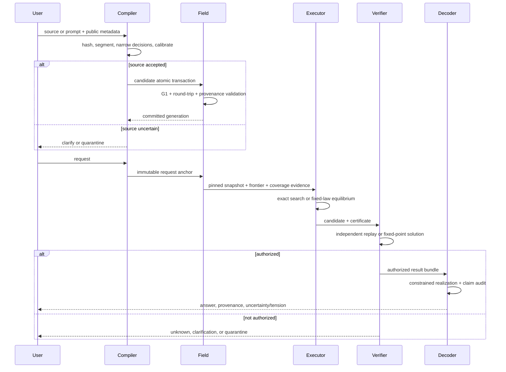

## 37. Security, integrity, and threat model

### 37.1 Assets and trust boundaries

The architecture protects more than raw data. Its assets include source
confidentiality, semantic correctness, reality isolation, provenance,
availability, deterministic replay, evaluator independence, and the user's
ability to delete or supersede influence. The principal trust boundaries are:

- client to ingestion API;
- archive to compiler;
- compiler to atomic writer;
- exact substrate to derived vector and cache artifacts;
- persistent field to ephemeral runtime;
- runtime to verifier;
- verifier to renderer;
- tenant/reality/session partitions;
- online services to offline experiment gold.

Cryptographic hashes detect changes but do not establish that content is true.
A signed reality manifest establishes ownership and revision, not universal
validity. A valid proof establishes consequence under registered premises, not
the external truth of those premises.

### 37.2 Source and compiler attacks

An adversarial source can contain prompt injection, fake metadata, embedded
schema names, claimed evaluator paths, or text designed to resemble a trusted
authority. The archive stores these bytes as data. The compiler receives public
metadata from the authenticated request context, not from instructions inside
the source text. A document saying `authority=system` cannot promote itself.

Span attacks include invalid UTF-8 boundaries, visually confusable characters,
normalization collisions, overlapping offsets, and hashes calculated over a
different normalization. The source envelope must specify encoding and hashing
bytes. Display normalization is a derived view. Semantic units retain a mapping
to exact source offsets and normalized-content hash.

Candidate attacks include missing roles, role swapping, negation loss, quoted
content treated as asserted, hypothetical content treated as active, and a
correction linked to a semantically similar but wrong target. These are why the
compiler separates heads, resolver evidence, and exact validation. The history
of G2 failures shows that high average classification performance does not make
directional false acceptance harmless.

### 37.3 Sidecar and packing attacks

Vector sidecars can be truncated, reordered, substituted across realities, or
loaded with an incompatible projection revision. Each row therefore needs
stable semantic identity and artifact hash. FieldIR tables commit exact row
ordering and semantic hashes separately from vectors. On reload, the system
verifies row count, dimension, dtype, endianness, revision, and content hash.

A sidecar failure cannot fall back to a nearby vector file. If vectors are
optional for a requested exact lane, the profile may execute without them only
through an explicit registered mode. Otherwise it fails closed.

### 37.4 Cache and minimap attacks

Indexes and minimaps are derived data. An attacker or crash can leave an old
summary after insertion, deletion, expiry, or reality migration. Every summary
commits member generation, child hashes, profile revision, and scope/reality
partition. An incremental rebuild follows the affected leaf-to-root path. Clean
and incremental rebuilds should agree for the same canonical field.

A query encountering a stale ancestor cannot trust its energy bound or
membership count. It must refuse execution or rebuild. Cache validity is part
of coverage, not a best-effort performance optimization.

### 37.5 Cross-tenant and cross-reality attacks

Tenant, reality, session, episode, scope, and time restrictions are exact
filters applied before learned or continuous scoring. This prevents a highly
similar vector in another tenant from entering the legal candidate set. Index
partitions should incorporate tenant and reality ownership so a bug in ranking
does not expose prohibited identifiers.

Reality isolation also prevents semantic cache poisoning. A cached proof state,
frontier, or equilibrium from one signed reality is invalid in another even if
the expression hashes are otherwise equal. Cache keys include the manifest and
base topology hash.

### 37.6 Runtime/evaluator leakage

An experiment is invalid if runtime can read expected answers, evaluator files,
proof routes, depth labels, or query-specific hints. Production has an analogous
boundary: a verifier should reconstruct claims from public field state and
certificates, not trust runtime assertions.

Process separation alone is not a security sandbox. A process with the same
filesystem permissions can still read gold. Stronger deployment uses capability
separation: runtime receives only public request and field snapshot; evaluator
receives public snapshot and returned certificate; evaluator gold or external
truth stays in a separate address space and storage policy.

### 37.7 Decoder and injection attacks

The decoder is an untrusted renderer unless it is a strictly deterministic
template. It may be prompted indirectly by archived labels or source excerpts.
The decoder context therefore contains the authorized bundle plus only archive
text explicitly needed for quotation. Source text is delimited and never gains
instruction authority.

Post-generation claim validation parses or matches the response against the
bundle. Unsupported factual clauses are removed or cause regeneration under a
bounded policy. If the audit cannot certify the final text, a structured answer
or safe abstention is returned. A fluent sentence is never preferred over a
verified one.

### 37.8 Denial of service and resource exhaustion

Attackers may submit prompts that maximize branching, force repeated frontier
reopening, create dense contradictions, or prevent convergence. Configuration
therefore caps source size, wordpieces, candidates, frontier bodies, cumulative
reads, proof states, sweeps, backtracking, wall time, memory, and output size.

Budget exhaustion is an ordinary disposition, not an exception that triggers
unbounded fallback. The API should distinguish `budget_exhausted`,
`incomplete_frontier`, and `incomplete_equilibrium` so operators can tune the
right limit without weakening semantic checks.

### 37.9 Transaction and replay attacks

Partial writes can fabricate a relation without its nodes, a vector row without
its semantic row, or a deletion without summary invalidation. Atomic generation
publication prevents readers from observing such mixtures. Execution history
and prediction shards are write-once in locked experiments. Production event
logs use monotonic sequence numbers or transactional database semantics.

Replay verifies that the same snapshot, profile, request, and deterministic
runtime produce the same semantic result and trace hashes. Renderer wording may
be separately nondeterministic only if every variant passes the same claim
audit. A semantic mismatch blocks authorization.

### 37.10 Failure-code taxonomy

Failure codes should be stable, narrow, and assigned before generic fallbacks.
Suggested classes are:

| Class | Examples | Required disposition |
|---|---|---|
| Source integrity | hash mismatch, invalid offsets, unknown encoding | quarantine |
| Compiler uncertainty | low confidence, low margin, ambiguous target | clarification |
| Semantic validity | illegal role, arity, reality, scope, or time | quarantine |
| Representation | round-trip mismatch, corrupt sidecar, stale schema | quarantine |
| Retrieval | missing required body, uncertified coverage, budget exhausted | incomplete frontier / unknown |
| Exact execution | invalid application, proof loop, step limit | unknown / unsupported |
| Equilibrium | objective increase, residual, non-unique bounds, sweep limit | incomplete equilibrium |
| Verification | proof replay, certificate, provenance, regret failure | quarantine |
| Realization | unsupported clause, label access violation | structured fallback / quarantine |
| Lifecycle | cross-session target, partial commit, stale generation | quarantine |

### 37.11 Safety case structure

A production safety case should connect each hazard to prevention, detection,
and recovery evidence. For example:

```text
hazard: cross-reality conclusion
prevention: partitioned index + exact reality mask
detection: runtime trace and verifier reality replay
recovery: reject request; invalidate contaminated cache generation
evidence: controlled reality-isolation tests; production audit telemetry
open risk: G15 multi-tenant fault-injection not yet run
```

This structure prevents a passing unit test from being treated as a complete
operational guarantee.

## 38. Deployment and economic model

### 38.1 Service decomposition

A deployable LTM should be decomposed by authority rather than merely by
throughput. One possible service topology is:

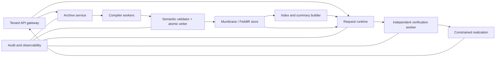

The gateway authenticates tenant and reality ownership and supplies metadata
that source text cannot override. Archive storage is append-oriented. Compiler
workers may use models but have no write authority. The validator/writer has
schema authority but no freedom to guess semantics. Runtime can read a pinned
snapshot but cannot mutate persistent truth. Verification runs with a narrower
capability set. Realization receives only authorized bundles and permitted
labels.

### 38.2 Tenant and reality ownership

Every persistent key begins with tenant and reality. Session and episode are
subpartitions, not global labels. A signed reality manifest includes owner,
revision, parent or base reality, registered operators and laws, source policy,
profile revision, and integrity commitment. Inheritance must be explicit: a
custom reality may import standard arithmetic and add \(\oplus\), or replace a
named custom operator, but cannot shadow `+` silently.

An API creating a reality should return its manifest hash. Every ingestion and
query references that hash or an allowed “latest” policy resolved transactionally.
This makes responses reproducible and prevents a law change during execution.

### 38.3 Storage layout

Logical storage has four durability classes:

1. archive events and provenance, retained according to source policy;
2. exact Mumbrane units, ports, context, and lifecycle events;
3. derived FieldIR, indexes, summaries, and vector artifacts;
4. ephemeral request traces and caches.

Classes one and two are authoritative and require transactional backup. Class
three is rebuildable from exact state but must be hash-consistent before use.
Class four can expire, subject to audit-retention policy. Separating these
classes avoids paying maximum durability cost for regenerable vectors while
protecting source and semantic history.

### 38.4 Compilation cost

Let a source have \(n\) tokens or structured records, \(c\) candidate spans,
and \(u\) committed units. A typical neural compiler costs

\[
O(\operatorname{encoder}(n)+cH+uV),
\]

where \(H\) summarizes narrow-head work and \(V\) validation/packing. Identity
resolution adds bounded candidate comparison rather than transcript scan.
Index maintenance is proportional to changed units and affected summary paths.

Compilation can be expensive because it is amortized across requests. It is
also the highest semantic-risk operation because it changes persistent reality.
Pricing should therefore separate ingestion units from query units.

### 38.5 Exact-query cost

For exact relation execution, cost depends on active units and registered
operators. Formal search adds legal proposals, beam width, and proof depth:

\[
O(d\,B\,P\,C_{apply}),
\]

where \(d\) is step budget, \(B\) beam width, \(P\) legal proposals retained or
enumerated, and \(C_{apply}\) exact application/canonicalization cost. The
verifier adds linear proof replay in accepted proof length.

This is why hop count alone is not a price. A 45-step linear path can be cheaper
than a six-step proof with hundreds of branches.

### 38.6 Equilibrium-query cost

For full-field L7-style equilibrium with \(A\) atom channels, \(F\) factors,
and \(S\) accepted/proposed sweeps, the dominant work is

\[
O\left(S\left(\sum_{b=1}^{F}|I_b|+A+F\right)\right).
\]

Backtracking multiplies objective evaluation by a bounded factor. An independent
fixed-point verifier adds comparable graph work. On a retrieved field, replace
\(F\) by cumulative active factors and add summary-cell scoring and coverage
certification.

An **Equilibrium Compute Unit** can be defined operationally as a normalized
bundle of atom-factor evaluations, objective evaluations, and verification
work. It should not be marketed as a token. Suggested billing dimensions are:

```text
compiled source units
vector-embedding units
active factor evaluations
exact proposal applications
verification operations
decoder input/output tokens when an LM is used
persistent semantic storage
```

### 38.7 Context-cost scaling

An LLM typically reprocesses or attends over supplied context each request. LTM
aims to compile stable source once, then address a bounded semantic frontier.
The economic advantage exists only when reuse is high and retrieval remains
complete. It weakens when every request touches most of the field, when sources
change continuously, or when verification dominates.

Consequently the defensible claim is not “constant cost regardless of context.”
It is: stable compilation can be amortized, and request cost can scale with
opened semantic work rather than raw archived text. Coverage, frontier
reopening, proof branching, and decoder cost remain explicit variables.

This comparison is architectural, not a claim that LTM is an LLM accessory.
LTM's durable substrate and request-time satisfaction/exact execution are its
primary computation. An optional transformer adapter has separately metered
compilation or realization cost and cannot substitute for field, optimizer, or
verifier work.

### 38.8 Capacity planning

Operators should measure per tenant and per profile:

- ingestion rate, source bytes, committed units, and compiler abstention;
- index build latency and stale-summary backlog;
- p50/p95/p99 bodies, factors, proof states, sweeps, and verification time;
- cache hit rate by exact snapshot key;
- coverage failure and widening rate;
- contradiction density and alternative disposition rate;
- decoder regeneration and claim-audit failure;
- deletion propagation and replay lag.

Autoscaling a renderer without scaling verification can create a backlog of
unauthorized text. Autoscaling runtime without index rebuild capacity can
increase stale-cache failures. Capacity follows the authority pipeline.

### 38.9 Availability and graceful degradation

If the optional vector service is unavailable, exact addressable requests may
run only under a profile explicitly allowing vector-free execution. If the
verifier is unavailable, factual answers do not bypass it; the service returns
temporarily unavailable or a non-factual acknowledgement. If the renderer is
unavailable, structured authorized bundles may be returned directly. If
coverage cannot be certified within latency budget, the API returns incomplete
coverage and may offer an asynchronous expanded query.

### 38.10 G15 production gap

G15 must test concurrency, multi-tenant isolation, authorization, rate limits,
fault injection, crash recovery, cache invalidation, backpressure, observability,
secret handling, and deployment rollback. G13's controlled scale layout and
L7's sub-minute small probe do not establish these properties. Until G15 passes,
the deployment architecture remains **Planned**.

## 39. Correctness case and proof obligations

### 39.1 Compiler obligation

For source envelope \(e\) and accepted transaction \(T\), the compiler/writer
obligation is:

\[
\operatorname{Accept}(T)\Rightarrow
\operatorname{SourceBound}(T,e)\land
\operatorname{G1Valid}(T)\land
\operatorname{RoundTrip}(T)\land
\operatorname{Atomic}(T).
\]

Calibration estimates when to attempt acceptance; it does not weaken this
logical obligation. G2.14 validates the decision gate on supplied spans, not the
complete canonical writer.

### 39.2 Retrieval obligation

For request \(q\), opened frontier \(F\), and execution law \(L\):

\[
\operatorname{CoverageCert}(q,F,L)\Rightarrow
\sup_{b\notin F}\operatorname{Impact}_L(b,q)
<\operatorname{decisionMargin}(q,F).
\]

This abstract inequality means no unopened legal body can cross the decision
boundary. Different profiles require different computable bounds. A summary
hash proves which bodies were summarized, not the inequality by itself.

### 39.3 Exact execution obligation

For proof \(P=(s_0,a_1,s_1,\ldots,a_n,s_n)\), authorization requires every
application to satisfy the registered schema and side conditions, each
after-state to equal canonical exact application, \(s_0\) to equal the source,
and \(s_n\) to equal the goal or registered refutation. Proposal scores are
irrelevant to replay validity.

### 39.4 Equilibrium obligation

For runtime state \(x^*\) and public factor graph \(G\), authorization requires:

\[
\|x^*-\Phi_G(x^*)\|_\infty\le\epsilon_r,
\]

objective regret below threshold, agreement with the independent candidate set,
complete factor/source accounting, and valid path reconstruction. In L7's
acyclic boundary, lower and upper fixed points must coincide. For cycles, unique
fixed-point or globally certified selection remains **Planned**.

### 39.5 Decoder obligation

Let \(B\) be the authorized bundle and \(y\) rendered output. A claim extractor
\(C(y)\) must satisfy

\[
C(y)\subseteq\operatorname{AuthorizedClaims}(B).
\]

Required uncertainty and conflict disclosures must also appear. A decoder that
omits “within custom reality alpha” changes the claim and fails even if its
arithmetic token is correct.

### 39.6 Composition obligation

End-to-end authorization is conjunctive:

\[
Safe(q)=Compile(q)\land Snapshot(q)\land Coverage(q)\land
Execute(q)\land Verify(q)\land Realize(q).
\]

No high score in one component compensates for another false term. This is why
the architecture presents component evidence separately and why the experiment
series contains failures alongside passes rather than one aggregate benchmark.

### 39.7 Determinism and replay

Semantic replay requires the same source hashes, exact substrate, profile,
request anchor, and deterministic execution configuration to reproduce the
same authorized semantic result. Floating-point traces may require fixed dtype,
thread count, reduction order, and tolerances. If a future GPU implementation
changes numerical order, it needs a semantic equivalence proof or new evidence.

### 39.8 Evidence maturity

An architectural statement is **Validated** only if a named report measured the
same input boundary, mechanism, and gate. Code existence is **Provisional**.
Specifications and designs are **Planned** until execution. Development metrics
can decide whether to continue an experiment but cannot become locked evidence.
These labels are part of correctness because they control what a builder is
permitted to infer from the repository.

## 40. Research foundations and architectural differences

External research motivates individual choices; it does not prove LTM. The
comparisons below identify the narrow relationship and the important
difference.

### 40.1 Structured and neuro-symbolic reasoning

Neuro-symbolic systems combine learned perception or guidance with explicit
symbolic operations. LTM adopts the same broad separation of concerns: a
compiler or proposal scorer may be learned, while exact semantics and proof
application remain registered. The difference is architectural scope. LTM also
specifies persistent provenance, user-defined reality isolation, session
lifecycle, field packing, coverage, and constrained realization.

The lesson from the repository is consistent with this separation. Learned G2
compiler attempts often failed direction, role, or coverage gates, while exact
G1/G6 and verification components passed controlled boundaries. I3/L4 likewise
kept exact proof replay sound when learned branching selection was weak.

Concept bottleneck models make predictions through intermediate concepts that
humans can inspect or intervene upon [Koh et al.,
2020](https://proceedings.mlr.press/v119/koh20a.html). Mumbrane exact bands are
not a conventional bottleneck layer trained end-to-end, but the motivation is
related: important semantic variables should be explicit rather than hidden in
an uninterpretable prediction. LTM goes further by treating registered exact
roles, polarity, scope, identity, and provenance as authority and continuous
vectors as non-authoritative.

### 40.2 Relational inference

Neural Relational Inference learns latent interaction graphs from observed
dynamics [Kipf et al., 2018](https://proceedings.mlr.press/v80/kipf18a.html).
That work motivates asking whether relations or dynamics can be recovered from
complete bodies without labels. I1 and I2 tested related relation-free ideas
and failed their core local boundaries. The current locked architecture does
not assume that arbitrary relations will emerge. It stores exact registered
ports when they are known and uses L7 only over supplied formal factors.

This distinction matters for user-defined reality. A body encoding a custom law
is not merely a cluster of co-occurring vectors; it has exact reality, input,
outcome, polarity, context, authority, and provenance. The fixed law can
reconcile such bodies because the compiler has already supplied their legal
factor structure.

### 40.3 Energy-based models

Energy-based modeling supplies a vocabulary for scoring configurations and
performing inference through optimization. Compositional Energy-Based Models
study composition of learned energies and show both promise and difficulty
[Du et al., 2023](https://proceedings.mlr.press/v202/du23a.html). The I-series
tested learned energy and minimap mechanisms; several results showed associative
or traversal behavior without validating the intended causal energy law.

L7's fixed objective is deliberately more modest. It is a registered residual
over an acyclic factor graph, not a learned universal energy landscape. Its
candidate is authorized only after an independent solver reproduces the fixed
point. The architecture therefore takes from energy-based work the idea of
configuration-level satisfaction while rejecting the claim that low learned
energy alone constitutes truth.

In ARCH-1.2 this is the post-transformer core: registered topology supplies the
variables and legal constraints, the profile supplies the law, request-time
optimization supplies ephemeral activation, and verification authorizes the
result. Transformer components may remain at input/output boundaries during
migration, but do not supply the core computational state or authority.

### 40.4 Associative memory and predictive coding

Modern Hopfield networks connect attention-like updates with continuous
associative memory [Ramsauer et al.,
2021](https://openreview.net/forum?id=tL89RnzIiCd). Predictive-coding research
also studies associative completion through iterative dynamics [Salvatori et
al., 2021](https://proceedings.neurips.cc/paper_files/paper/2021/hash/1fb36c4ccf88f7e67ead155496f02338-Abstract.html).
These works motivate iterative completion and state updates.

LTM's difference is the authority model. Associative recall can retrieve a
similar pattern, but an LTM factual conclusion requires exact compatibility,
coverage, provenance, and verification. L7 uses iteration to transmit factor
satisfaction; it does not retrieve a memorized answer pattern. The no-
optimization and one-sweep controls establish that repeated updates matter in
the bounded test, while independent topological evaluation establishes what the
correct state should be.

### 40.5 Compositional generalization

Lake and Baroni showed that strong sequence models can generalize without the
systematicity expected of symbolic composition [Lake and Baroni,
2018](https://proceedings.mlr.press/v80/lake18a.html). This is a direct warning
against calling familiar completion “reasoning.” The L-series progressively
separated linear traversal, formal application, unseen branching, and fixed
equilibrium. L1's 64-step paths and L3's 45-step compilation were therefore not
allowed to settle the L4 branching question or the L7 equilibrium question.

The architecture's response is not to assume perfect symbolic generalization.
It makes each composition mechanism falsifiable: exact proof replay checks
formal transitions; causal controls check whether search guidance matters;
fixed-point oracles check equilibrium. Failure leads to a narrower claim.

### 40.6 Theorem proving and proof search

TacticZero learns theorem-proving policies while checking tactics in HOL4
[Wu et al., 2021](https://proceedings.neurips.cc/paper/2021/hash/4dea382d82666332fb564f2e711cbc71-Abstract.html).
HyperTree Proof Search combines learned guidance and tree search
[Lample et al., 2022](https://proceedings.neurips.cc/paper_files/paper/2022/hash/a8901c5e85fb8e1823bbf0f755053672-Abstract-Conference.html).
LeanDojo provides an environment for retrieval-augmented theorem proving with
Lean [Yang et al., 2023](https://proceedings.neurips.cc/paper_files/paper/2023/hash/4441469427094f8873d0fecb0c4e1cee-Abstract-Datasets_and_Benchmarks.html).

These systems support the exact-search lane's key design: learned premise or
action ranking is separable from a formal kernel that checks steps. LTM adds
reality manifests and provenance but currently has a much narrower formal
fragment. L4's failure is unsurprising in the broader theorem-proving context:
branching action selection is a real search problem, not something eliminated
by calling the state latent.

### 40.7 Hierarchical retrieval and memory

Multiscale and hierarchical memory research motivates summaries that permit
large stores to affect retrieval without reading every item. Multigrid Neural
Memory studies hierarchical memory access
[Ke et al., 2018](https://openreview.net/forum?id=ByxKo04tvr), while similarity-
based routing work studies efficient sparse access [Baranchuk et al.,
2019](https://proceedings.mlr.press/v97/baranchuk19a.html).

LTM's minimap concept is related but carries stronger semantic obligations. A
cell summary commits exact membership and must support coverage bounds; it may
not cache transitive closure, answer lists, or query-specific routes. L7 removed
retrieval entirely to isolate the equilibrium mechanism. A future scaling
experiment must reconnect the two without making a summary the hidden answer
authority.

### 40.8 Provenance and paraconsistency

Database provenance asks why an output exists and which source records
contributed. LTM adopts this operationally: units and results retain source and
derivation identities, deletion invalidates dependent influence, and a verifier
replays supporting and opposing paths. Provenance is not an after-the-fact
citation layer; it is part of authorization.

Paraconsistent reasoning avoids explosion when propositions and their negations
coexist. L7 realizes a numeric, source-weighted paraconsistent policy using
separate positive/negative channels and explicit tension. It does not implement
every paraconsistent logic. The exact law is a topology-profile choice whose
behavior is tested through weighted contradictions, alternatives, source
duplication, and authority swaps.

### 40.9 Constrained decoding and verification

Constrained generation research motivates restricting output syntax or content.
LTM's G10.1 boundary is semantic: the renderer receives a finite authorized
bundle and may not create claims outside it. A free-form language model can be
used only as an untrusted paraphraser followed by claim validation. This is
stricter than asking a model to cite sources after generation.

The architecture also distinguishes semantic correctness from linguistic
quality. A structured JSON result can be fully authorized but awkward. A fluent
answer can be unsafe. Product work may improve style independently as long as
the post-generation authority check remains complete.

### 40.10 What research does not establish

No cited paper proves that LTM will work at unrestricted scale or language.
Likewise, LTM experiments do not invalidate the broader research programs they
touch. A failed small energy kernel does not refute energy-based modeling; a
passed bounded equilibrium does not establish universal energy reasoning. The
citation role is to identify antecedents, comparable mechanisms, and known
difficulties. Repository reports remain the only authority for LTM measurements.

## 41. Research roadmap from the locked architecture

### 41.1 Compiler completion

The first critical path is not a larger equilibrium. It is a reliable semantic
front door. Work should implement and separately validate raw segmentation,
formal mathematical compilation, canonical G2.14 writing, identity linking,
and atomic Mumbrane/FieldIR commit. Every submodule needs contrast twins for
negation, direction, quotation, scope, time, and ambiguity. Compiler errors
must abstain before entering persistent reality.

### 41.2 Cyclic equilibrium

L7 graphs are acyclic and have a straightforward unique solution. Cycles can
create multiple fixed points, oscillation, or dependence on initialization.
The next mechanism experiment should include signed monotone cycles, inhibitory
cycles, multiple equilibria, and explicit selection policies. It must compare
lower/upper bounds, global objective, initialization sensitivity, and
intervention response. If uniqueness cannot be certified, the correct output is
alternatives or incomplete equilibrium.

### 41.3 Scaled equilibrium retrieval

A scaling experiment should embed a small decisive factor subgraph within a
large materialized field. It must prove required-factor recall, coverage, stale-
cache refusal, incremental/full rebuild equality, distant relevant sensitivity,
irrelevant-region invariance, and honest cumulative read accounting. It should
compare full-field oracle equilibrium with minimap-frontier equilibrium. A
metadata-only commitment to a million bodies is not scale evidence.

### 41.4 Branching exact search

L4 localized failure to proposal selection. Future work should strengthen the
action representation, goal-conditioned value learning, training proof diversity,
and search algorithms while retaining exact enumeration and replay. It should
test paired goals with different first moves, necessary detours, broad branching,
and disjoint proof motifs. Long linear paths cannot substitute for these tests.

### 41.5 Decoder development

A useful product needs fluent explanations, source citations, uncertainty, and
conflict summaries. Decoder work should build a machine-readable claim plan,
then compare deterministic realization, grammar-constrained generation, and an
untrusted small language renderer. The evaluation must score claim precision,
required disclosure, provenance alignment, injection resistance, latency, and
style separately.

### 41.6 Production validation

G15 should operate a realistic service with concurrent tenants, signed reality
updates, session overlays, crash recovery, verifier isolation, rate limiting,
and observability. It should inject stale caches, corrupted sidecars, partial
writes, deleted sources, unauthorized realities, and overloaded branches. No
architecture is production-ready until these operational failures are measured.

### 41.7 Evidence discipline

Every new experiment should publish specification, frozen config, public/evaluator
separation, immutable results, controls, counterexamples, verification, and a
mechanical classification. Development results guide engineering but stay
labeled. A failed experiment gets a new attempt directory rather than revised
history. Architecture maturity changes only after the report is reconciled into
the registry, ledger, evidence matrix, and lock.

## 42. Topology-profile reference designs

Topology profiles define how captured semantics are used. They do not define a
new substrate and may not invent missing roles, operators, polarity, scope, or
provenance. The following profiles are reference designs; only their
experimentally exercised subsets are **Validated**.

### 42.1 Reasoning

The reasoning profile activates registered exact operators, proof/search laws,
hard/soft precedence, contradiction disclosure, coverage, and verification. Its
request contains assumptions, a goal or query slot, reality, scope, time, and
budgets—never an answer route.

Hard conclusions replay exactly. Soft geometry may retrieve or rank bodies but
cannot change a proof step. If an exact proof and equilibrium candidate coexist,
the profile declares their claim types and precedence instead of averaging them.
Configuration includes frontier and cumulative-read bounds, proposal/beam/step
limits, source law, alternative margin, convergence, and certificate revision.

### 42.2 Planning

The planning profile treats goals, resources, actions, constraints, costs,
deadlines, and preferences as captured objects. Exact constraints block illegal
actions. Soft terms rank feasible plans. A plan remains a proposal until its
preconditions, resource transitions, and conflicts verify.

Planning differs from exact theorem proving because several feasible outcomes
may be valid. The profile discloses which constraints are hard and which
preferences are soft. Generic representation and G6/G7 support this direction,
but a comprehensive planning experiment remains **Planned**.

### 42.3 Evidence and science

The evidence profile centers source occurrences, observation design,
measurement, authority, uncertainty, contradiction, and derivation. Duplicate
reports from one source cannot become independent evidence. Retractions and
supersession change active applicability without erasing history.

Its output is a source-qualified synthesis rather than an unqualified fact.
Exact provenance and scope are authoritative; continuous weights express a
registered evidence policy. Conflicting studies, source dependence, changed
measurements, and deletion need a dedicated experiment before end-to-end
validation.

### 42.4 Conversation memory

The conversation profile stores user-reported claims, questions, requests,
preferences, corrections, references, episode objects, and assistant responses.
Assertions have `factual_authority=false`. Preferences control form. Corrections
mutate active state only with a unique target. Assistant output is non-evidence.

G11–G13 **Validated** the structured lifecycle and G2.14 **Validated** supplied-
span routing. The canonical writer and unrestricted raw-turn compiler remain
**Planned**.

### 42.5 Compilation and switching

A profile source is declarative data compiled to a closed set of registered
numeric opcodes. It records supported schema revisions, hard/soft map, allowed
indexes, budgets, objective, candidate policy, verification, decoder policy,
hash, and signer. Arbitrary executable callbacks are prohibited.

A Tier-1 switch changes dynamics over captured semantics. A Tier-2 switch needs
an indexed structural migration and rollback. A Tier-3 switch needs absent
semantics and therefore source recompilation. A profile may select and weight
captured meaning; it may not infer exact structure and persist it for another
profile without a compiler transaction.

### 42.6 Composition

Profile composition is not objective addition. Hard constraints, authority
maps, candidates, and verifier rules must be compatible. Conversation memory can
feed planning, but a user-reported premise remains unverified and a plan remains
a proposal. The compiled composite profile declares ownership of every term and
fails if policies disagree about exact authority.

## 43. Data governance and reality administration

### 43.1 Creation and revision

Creating a reality is an administrative transaction. The owner chooses a base
or empty namespace, operators, profile, source policy, retention, sharing, and
allowed compilers. The service prevents custom symbols from impersonating
protected standard symbols unless an explicit fork is declared.

The signed manifest has stable revision and hash. Ingested bodies cite it.
Changing operator tables or source policy creates a new revision and may require
migration; it does not rewrite earlier responses.

### 43.2 Import and trust

Imported data retains original provenance plus an import occurrence. A tenant
can assign local authority without rewriting source category. Content hashes
detect duplication, while independent-source grouping follows source identity
and policy. Mirrors of one publication should not automatically count as
independent evidence.

### 43.3 Sharing and forks

A reality can be private, shared read-only, or collaboratively writable. Shared
base layers are immutable to sessions. Collaborative writes are authenticated
transactions. A fork references the base hash and evolves independently. Merge
is semantic ingestion, not raw database union.

### 43.4 Merge and contradiction

Equivalent semantic units may share identity while occurrences retain separate
provenance. Conflicting laws remain separate factors or require an explicit
administrator policy. Merge cannot erase contradictions merely to produce one
answer. Cross-reality proof and equilibrium states are never reused implicitly.

### 43.5 Revocation and deletion

Revoking a source closes its active applicability and invalidates dependent
summaries, caches, and future context. Previously issued responses remain
historical but non-evidential. Hard deletion follows tenant/legal policy;
retained hashes must not permit reconstruction of sensitive content.

### 43.6 Audit export

An authorized export includes manifest, source inventory, active units,
provenance, profile revisions, lifecycle events, summary hashes, and selected
certificates. It excludes evaluator gold, other tenant identities, secrets, and
raw vectors unless explicitly authorized.

### 43.7 User expectations

A custom reality defines consequence inside a namespace. It does not change
external truth. The decoder labels custom results, discloses conflict, and
distinguishes premise authority from proof validity. A valid proof from fictional
axioms is valid inside that reality only.

## 44. Expanded evidence-to-claim catalogue

Exact measurements and report links are in the
[experiment-series compendium](../experiments/series-summary.md).

### 44.1 Substrate

**Validated:** G1 exact topology, LTM-R1 numeric compatibility, LTM-R2 Mumbrane
target, and integration I1 FieldIR bridge on confirmed topology.

**Not authorized:** arbitrary ontology induction, raw-language correctness, or
unreviewed replacement of every physical codec.

### 44.2 Compilation

**Validated:** G2.14 supplied-span conversational routing and gating.

**Provisional:** G2.5 supplied-typed-atom reasoning proposals under validation,
preview, confirmation, and abstention.

**Planned:** raw segmentation, ordinary mathematical language, unrestricted
reasoning compilation, and canonical G2.14 writing.

### 44.3 Retrieval and scale

**Validated:** G3–G5 controlled addressing/frontier/coverage and G13 controlled
storage layout.

**Not authorized:** that every profile uses the same summary or that equilibrium
over millions of materialized bodies is complete and bounded.

### 44.4 Execution and verification

**Validated:** G6 exact relations, G7 registered soft reconciliation, G8 bounded
reduction, G9 verification, and G10.1 strict realization.

**Not authorized:** continuous override of exact conclusions, unknown-schema
verification, or unrestricted generation without claim audit.

### 44.5 Memory

**Validated:** G11–G13 structured lifecycle, persistence, deletion, replay, and
controlled scale.

**Not authorized:** raw conversation understanding or production multi-tenant
durability.

### 44.6 Multistep mathematics

**Validated:** L1 grounded formal/opaque paths through 64 and L3 controlled
compiled paths through 45.

**Failed/open:** L4 unseen branching discovery. The long paths are not arbitrary
theorem-proving depth claims.

### 44.7 Equilibrium

**Validated:** L7 fixed unlearned equilibrium on supplied-formal acyclic
512-body fields through 20 applications, including source-weighted conflict and
independent fixed-point verification.

**Unclassified/development:** L5 is pending and L6 development-only.

**Planned:** cycles, minimap scale, depth beyond 20, literal broad
counterfactual arithmetic chains, and raw language.

### 44.8 Overall system

The product direction combines validated pieces behind strict authority
boundaries. The general API—with raw compilation, canonical writing, fluent
audited decoding, materialized equilibrium scale, operational tenancy, and G15
evidence—is **Planned**. No current report authorizes describing that product as
complete.

## 45. Reference API and contract inventory

This chapter is an architectural blueprint, not a frozen runtime API. Names can
change during product implementation, but the authority boundaries should not.

### 45.1 Ingestion endpoint

```http
POST /v1/realities/{reality_id}/sources
Idempotency-Key: opaque-client-key
If-Reality-Revision: sha256:...
Content-Type: application/json
```

```json
{
  "source_id": "opaque",
  "source_kind": "document|turn|formal_body|structured_event",
  "content": "...",
  "scope_key": "global",
  "session_id": null,
  "episode_id": null,
  "authority_category": "user_reported",
  "effective_time": null,
  "compiler_profile": "controlled-conversation/1"
}
```

The gateway supplies tenant and authenticated principal; the body cannot choose
another tenant. Successful archive receipt returns a source hash even if
semantic compilation later clarifies or quarantines. Responses distinguish:

```text
archived_only
compiled_and_committed
clarification_required
quarantined
transaction_conflict
```

An accepted response contains semantic generation and transaction hash, but no
internal evaluator data. A clarification response names missing or ambiguous
public fields. Quarantine returns a stable failure class without disclosing
sensitive internals.

### 45.2 Supplied-semantics endpoint

For controlled integrations, a caller can submit already segmented semantic
content under a registered schema. The request includes source-span offsets,
content kind, exact typed values, context, and provenance. This endpoint does
not bypass validation; it bypasses only raw-language segmentation and selected
learned decisions.

It is the appropriate product analogue of G2.14's supplied-span boundary and
L7's supplied-formal boundary. Calling it “raw LTM language understanding” would
be incorrect.

### 45.3 Query endpoint

```http
POST /v1/realities/{reality_id}/queries
If-Reality-Revision: sha256:...
```

```json
{
  "request_id": "opaque",
  "query": "structured or controlled text",
  "scope_key": "global",
  "valid_at": null,
  "session_id": null,
  "profile": "reasoning/1",
  "budgets": {
    "maximum_bodies": 128,
    "maximum_cumulative_bodies": 2048,
    "maximum_steps": 64,
    "deadline_ms": 500
  },
  "response_format": "structured+text"
}
```

The server clamps budgets to tenant and service limits. The response identifies
snapshot and profile. It separates semantic disposition from transport status:

```json
{
  "disposition": "candidate",
  "primary": {"claim_id": "...", "display": "..."},
  "alternatives": [],
  "opposition": [{"claim_id": "...", "activation": 0.31}],
  "tension": 0.31,
  "coverage": "certified",
  "verification": "passed",
  "sources": [{"source_id": "...", "label": "..."}],
  "snapshot_hash": "sha256:...",
  "authorization_hash": "sha256:..."
}
```

An `unknown` response may have HTTP 200 because it is a correct semantic result.
Corrupt manifests or unauthorized access use appropriate error status.

### 45.4 Clarification continuation

A clarification result carries a continuation token bound to original source or
request hash, candidate set, and snapshot. The user supplies only the missing
choice or span. If the snapshot changed so the candidate set is no longer valid,
the server recompiles instead of applying an old selection.

### 45.5 Reality administration

Administrative endpoints create, fork, revise, freeze, share, and retire
realities. A manifest update uses compare-and-swap revision. Operator-table or
profile changes include migration plan and compatibility decision. A reality
cannot be deleted while retained sources or legal policy require history;
retirement blocks new execution and follows deletion workflow.

### 45.6 Correction and deletion

Correction APIs target exact occurrence IDs and provide replacement source.
Raw-language correction can first produce a clarification candidate. Deletion
APIs return an operation ID and affected generation. Completion means active
indexes and summaries no longer include the source, not merely that archive
text is hidden.

### 45.7 Verification endpoint

An internal verification service accepts public snapshot reference, candidate,
and certificate. It has no mutation capability and no compiler model. It returns
pass/failure code, replay hash, verified claims, required disclosures, and
resource accounting. External clients may verify exported certificates where
schemas and source policy permit.

### 45.8 Event and audit stream

An append-only audit stream contains source receipt, compilation disposition,
semantic transaction, reality revision, cache rebuild, query authorization,
deletion, and security events. Payloads use IDs/hashes with controlled links to
sensitive archive content. Consumers can build billing, incident, and compliance
views without receiving semantic write authority.

### 45.9 Idempotency and retries

Ingestion idempotency keys bind tenant, endpoint, source hash, and intended
operation. Reusing a key with different content fails. Query retries remain
pinned to the same snapshot unless the client requests latest. Verification is
idempotent by certificate hash. Decoder retries reuse the same authorized bundle.

### 45.10 Streaming

Factual text should not stream before verification. The service can stream
progress events—compiling, widening, executing, verifying—without speculative
claims. After authorization, deterministic or audited text may stream at claim
boundaries. If post-generation audit is required, buffer each clause until its
claim mapping passes.

### 45.11 Batch operations

Batch ingestion preserves per-source atomicity and can optionally require whole-
batch atomicity. Batch queries share a pinned snapshot but retain independent
anchors, budgets, frontiers, and certificates. Cross-query caching is keyed by
exact request and generation; one tenant's result never seeds another's
activation state.

### 45.12 API versioning

The URI version covers transport contracts. Semantic schema, Mumbrane, FieldIR,
profile, reality, certificate, and decoder revisions remain explicit fields.
Transport backward compatibility cannot silently translate unknown semantic
revisions. Deprecation publishes migration and fail-closed date.

## 46. Requirements traceability

### 46.1 Compile once, reuse many times

**Requirement:** stable source semantics are compiled once and reused without
re-reading raw text for ordinary numeric execution.

**Design:** immutable archive, Mumbrane semantic commit, FieldIR packing,
addresses, indexes, summaries, and source-text exclusion from active tables.

**Evidence:** representation and integration audits plus G3–G13 controlled
components. **Open:** unrestricted compiler and production reuse economics.

**Failure evidence:** source access during numeric execution, semantic changes
after vector re-embedding, or request cost proportional to full archive text.

### 46.2 Exact/soft separation

**Requirement:** vectors and continuous objectives cannot create exact facts.

**Design:** exact Mumbrane projection, registered G1/G6 operations, profile
authority map, candidate status, independent verification.

**Evidence:** G1, G6, G7, G9, L7 controlled boundaries. **Open:** complete
production enforcement across every extension.

**Failure evidence:** vector nearest neighbor directly commits a relation,
optimizer flips polarity, or decoder promotes a soft candidate without replay.

### 46.3 Persistent/ephemeral separation

**Requirement:** request computation cannot mutate persistent truth.

**Design:** immutable prompt anchor, read-only snapshot, empty factual operation
tuple for inference, separate semantic transaction API.

**Evidence:** controlled exact/equilibrium experiments and lifecycle tests.

**Failure evidence:** inferred candidate appears as a source fact, assistant
response becomes evidence, or failed query changes active memory.

### 46.4 Reality isolation

**Requirement:** custom laws affect only their signed reality.

**Design:** tenant/reality partition keys, exact masks, manifest-bound caches and
certificates, decoder qualification.

**Evidence:** L7 counterfactual reality and isolation panel within its controlled
field. **Open:** adversarial multi-tenant G15 deployment.

**Failure evidence:** standard arithmetic changes after custom import, cached
proof reused across realities, or a response omits required reality label.

### 46.5 Source authority and provenance

**Requirement:** output identifies its contributing sources and duplicates do
not manufacture independence.

**Design:** occurrence/source keys, maximum-per-source support, noisy-OR across
independent groups, provenance certificate, deletion invalidation.

**Evidence:** structured lifecycle and L7 source-law controls.

**Failure evidence:** copying one source changes equilibrium, missing provenance
still authorizes, or deleting decisive evidence leaves residual influence.

### 46.6 Contradiction without explosion

**Requirement:** opposing data coexists, influences disposition, and does not
authorize unrelated claims.

**Design:** positive/negative channels, tension, alternative margin, winner-plus-
tension rendering, exact query-slot candidate restriction.

**Evidence:** L7 weighted contradictions and alternatives in a bounded formal
field.

**Failure evidence:** one conflict activates arbitrary atoms, losing opposition
vanishes, or count alone overrides source policy.

### 46.7 Bounded access with coverage

**Requirement:** ordinary queries avoid full scans without ignoring decisive
data.

**Design:** G3 address, G4 frontier, G5 coverage, summaries, widening, incomplete-
frontier disposition.

**Evidence:** controlled addressing/storage experiments. **Open:** combined
scaled L7 equilibrium coverage.

**Failure evidence:** full scan, missing decisive body under a “certified”
frontier, stale summary accepted, or hidden cumulative reads.

### 46.8 Independent verification

**Requirement:** a separate mechanism authorizes every factual result.

**Design:** G9, formal proof replay, equilibrium oracle, capability separation,
certificate hashes.

**Evidence:** G9 and mathematical/equilibrium controlled reports.

**Failure evidence:** runtime confidence accepted as proof, evaluator imports
runtime scorer/optimizer, corrupted step passes, or gold becomes readable.

### 46.9 Fail-closed behavior

**Requirement:** uncertainty or integrity failure reduces authority.

**Design:** monotonic disposition, typed failure codes, no partial commits,
unknown/incomplete/quarantine responses.

**Evidence:** G2.14 gating and component attack tests.

**Failure evidence:** abstention promoted downstream, ambiguous correction
mutates several targets, or corrupt sidecar triggers approximate fallback.

### 46.10 Deterministic replay

**Requirement:** same semantic inputs and configuration reproduce the same
authorized result.

**Design:** canonical ordering, separate hashes, frozen config, immutable shards,
trace/state commitments.

**Evidence:** multiple experiment replay gates. **Open:** heterogeneous hardware
and production concurrency equivalence.

**Failure evidence:** storage order changes result, resume changes RNG/data order,
or renderer adds different unsupported facts.

### 46.11 Atomic lifecycle

**Requirement:** nodes, relations, representations, indexes, and lifecycle state
change together or not at all.

**Design:** prepared semantic transaction and generation publication.

**Evidence:** G11–G13 controlled lifecycle/persistence.

**Failure evidence:** relation without node, active deletion with stale summary,
or preference replacement without supersession.

### 46.12 Bounded equilibrium causality

**Requirement:** field factors—not a stored answer or learned hidden state—cause
the L7 final state.

**Design:** neutral initialization, immutable clamps, synchronous sweeps, no
answer candidates, factor/path certificates, causal controls.

**Evidence:** L7 controlled pass through depth 20.

**Failure evidence:** no-optimization control succeeds, one sweep crosses a long
path, endpoint shuffle is invariant, or removing a decisive body changes nothing.

### 46.13 Constrained realization

**Requirement:** language expresses only authorized claims and disclosures.

**Design:** authorized bundle, claim plan, restricted labels, claim audit,
deterministic fallback, non-evidential response event.

**Evidence:** G10.1 strict realization. **Open:** fluent general renderer.

**Failure evidence:** hallucinated source, missing contradiction, lost scope, or
assistant sentence becomes evidence.

### 46.14 Production isolation

**Requirement:** all above invariants hold under concurrent adversarial service
conditions.

**Design:** separated services/capabilities, quotas, transactional generations,
observability, incident response.

**Evidence:** **Planned** G15 only.

**Failure evidence:** any cross-tenant access, verifier bypass, unrecoverable
partial commit, or cache contamination under fault injection.

## 47. Scenario matrix and expected behavior

| Scenario | Compiler | Field/execution | Verification | Decoder |
|---|---|---|---|---|
| clear supplied preference | accept if slots/margins pass | update session overlay transactionally | G1/round-trip/lifecycle checks | apply style only |
| ambiguous preference key | clarification | no active mutation | no factual bundle | ask bounded question |
| unambiguous correction | new claim + exact old target | supersede in overlay | replay target and transaction | acknowledge correction |
| ambiguous correction | clarification | no mutation | verify candidate IDs only | ask which occurrence |
| quoted false assertion | quoted context | no active factual claim | context replay | describe as quote |
| hypothetical rule | hypothetical context | excluded from active exact/equilibrium profile unless requested | scope/modality replay | preserve qualification |
| valid formal proof | supplied AST accepted | exact search and application | independent step replay | proof summary |
| branching proof not found | anchor valid | search budget exhausted | no proof authorization | unknown/budget message |
| L7 unique equilibrium | supplied formal anchor | synchronous convergence | fixed point + paths | winner and support |
| L7 balanced conflict | anchor valid | two modes within margin | candidate-set agreement | alternatives plus tension |
| L7 unresolved cycle | graph outside profile | no authorized solve | cycle/profile failure | unsupported/incomplete |
| stale minimap | anchor valid | execution refused | manifest mismatch | temporary integrity response |
| deleted decisive source | source tombstoned | caches rebuilt; no influence | deletion/replay check | revised result or unknown |
| custom reality query | exact manifest | only that partition | reality-bound certificate | label custom reality |
| standard query after custom import | standard manifest | standard partition unchanged | isolation check | ordinary standard result |
| cross-session pronoun | target filtered | no link/mutation | candidate filter audit | clarification |
| assistant repeats claim | assistant event only | no independent source mass | non-evidence invariant | may reference previous response |
| corrupt proof step | request otherwise valid | runtime candidate present | replay failure | quarantine, no claim |
| decoder adds fact | authorized bundle valid | no change | bundle remains valid | claim audit rejects text |
| frontier budget exhausted | compile succeeds | incomplete coverage | no authorization | incomplete-frontier response |

The matrix is a compact acceptance oracle for product design reviews. New
features add rows before implementation. If a proposed feature has no clear
compiler disposition, field authority, verifier, and decoder behavior, it is
not ready to cross the architecture boundary.
