# LTM v1 — Canonical Architecture

> Normative contract: [LTM-ARCH-1.2](architecture-lock-v1.md). This overview is
> a concise explanatory view.

## Status

This is the current post-transformer product architecture. Historical Infinity-2 prose remains
recoverable through repository history; experiment reports remain immutable
evidence. The architecture is intentionally narrower than the long-term
vision: it is the first buildable LTM with exact topology, numeric field state,
independent verification, and a clear compiler boundary.

G2 is engineering-complete through a modular compiler boundary. G2.14 is an
accepted supplied-span conversational *decision and authorization gate*, but
its direct G1/FieldIR/Mumbrane writer is still an identified implementation
gap. G2.5 remains the provisional reasoning compiler because its registered
reliability gate failed. Both paths must be validator-gated and able to abstain.
LTM-R2 authorizes Mumbrane IR v1 as the universal semantic target; FieldIR v2
remains the implemented packed execution bridge during promotion.

## One-sentence definition

An LTM compiles source into universal Mumbrane units, applies a versioned
topology profile, resolves an ephemeral latent state through exact execution or
registered field satisfaction, independently verifies the result, and only
then realizes an authorized response.

The field and optimizer are the primary computation. Transformers may be used
only as replaceable validated compiler or renderer adapters; they are not LTM's
persistent state, reasoning authority, factual authority, or verifier.

## The complete flow

```mermaid
flowchart LR
    A["Source text or user turn"] --> B["Source archive and compiler boundary"]
    B --> S["Semantic spans or explicit structure"]
    S --> C1["G2.14 conversational decision gate"]
    S --> C2["G2.5 provisional reasoning route"]
    C1 --> W["Pending: G2.14 G1/FieldIR/Mumbrane writer"]
    W --> D["Atomic Mumbrane + G1 validation"]
    C2 --> D
    D --> E["Universal numeric substrate"]
    E --> F["Compiled topology profile"]
    F --> G["FieldIR v2 execution view"]
    G --> H["G3 addresses and G4 frontier"]
    H --> I["G5 coverage and widening"]
    I --> J{"Registered execution lane"}
    J -->|"Exact proof/search"| X["G6 exact propagation"]
    J -->|"Fixed acyclic equilibrium"| Y["L7 synchronous satisfaction"]
    X --> K["G7 soft reconciliation + G8 reduction"]
    Y --> K
    K --> L["G9 independent verification"]
    L --> M["G10.1 authorized surface realization"]
    M --> N["Validated response and memory event"]
```



Compilation may be expensive and incremental. Ordinary request execution uses
stable addresses and bounded factors instead of resending the complete source
corpus to a decoder.

## Five planes

1. **Source plane** — raw text, aliases, source spans, hashes, audit records and
   display text. It is used by ingestion, lexical addressing, provenance
   checks, and surface realization.
2. **Mumbrane substrate plane** — universal numeric units, exact sparse ports,
   coordinates, context, identity, provenance and integrity. This is the
   factual topology.
3. **Profile plane** — compiled exact/soft opcodes, active operators,
   addressing, coverage, objective, verification and migration policy.
4. **Vector plane** — immutable content, operator, role, context and binding
   sidecars. Vectors route and shape continuous influence; they cannot create
   a semantic factor.
5. **Request plane** — ephemeral goal state, addresses, active frontier,
   coverage certificate, derivation graph, soft state, conflicts and decoder
   bundle.

The source, substrate, artifact and profile-execution identities are separately
hashable. The Mumbrane substrate is usable without opening source text or
vector rows.

## Field state

The persistent field is one universal typed program:

```text
Mumbrane units + sparse named ports + exact coordinates
    + vector bundles + indexes + certified summaries
```

It is not one anonymous semantic vector. The same record schema represents
content, operators, context, provenance, identity, regions and constraints.
Exact codes and ports authorize meaning; vector bundles provide continuous
geometry.

Reasoning, planning, evidence and conversation-memory profiles can execute the
same substrate. Dynamics-only changes rewrite no field rows; structural changes
migrate indexed affected units; missing semantics require source recompilation.

At request time the state contains:

```text
goal, addresses, exact hard state, continuous soft state,
reference bindings, conflict branches, uncertainty, coverage and provenance
```

G6 exact propagation is authoritative for hard conclusions. G7 optimization
handles soft evidence, preferences, uncertainty, references and contradiction
branches. G8 reduces memory-bounded contributions without allowing batch order
to determine the answer.

L7 adds a distinct controlled lane: exact topology defines a bounded acyclic
factor graph, prompt assumptions remain clamped, and a fixed unlearned law
optimizes positive, negative and tension activations to an independently
reproduced equilibrium. Exact keys validate constraints and paths but do not
procedurally activate outcomes.

## Components and evidence

| Component | Current implementation/evidence | Product status |
| --- | --- | --- |
| G1 registry and exact engine | `topology_g1` | canonical exact authority |
| Conversational compiler | G2.14 margin-gated supplied-span decision gate | controlled routing pass; active field writer pending |
| Reasoning compiler | G2.5 typed handoff | provisional; experimentally failed |
| Universal semantic substrate | LTM-R2 Mumbrane IR audit | canonical target; isolated implementation |
| Packed execution bridge | LTM-I1 and `ltm` FieldIR v2 | canonical implemented runtime |
| Addressing/frontier/coverage | G3–G5 plus LTM-I1/R2 adapters | controlled canonical views |
| Exact/soft execution | G6–G8 plus LTM-I1/R2 adapters | controlled canonical views |
| Verification | G9 | canonical safety boundary |
| Surface realization | G10.1 | strict authorized realization |
| Session/storage/scale | G11–G13 | controlled component evidence |
| Unified composition | G14 | controlled only; raw product not ready |
| Serving and isolation | G15 | not run |
| Relation-free latent inference | I2.3 summary-dependent development prototype | promising controlled traversal; not frozen or certified |
| Mathematical realities | I3.1 exact search plus L1 capacity audit | 64-hop grounded capacity observed; not general mathematics |
| Fixed-law equilibrium | L7 `r3` | controlled 512-body acyclic pass through 20 applications; scaling/cycles open |
| Policy-conditioned equilibrium | L8 reduced probe | provisional 16-observation causal mechanism evidence; full suite open |

## Relation-free inference boundary

The experimental I-series is separate from the canonical G6/G7 execution
path. I2.3 tests whether supplied semantic states can move through a learned,
bounded minimap without explicit G1 relation labels. Its current development
prototype attempts paths of one through 64 stored bodies and reaches `0.9767`
answerable exactness, but required-body recall is `0.9785` and 37 of 2,000
development cases are incorrect accepted candidates. The experiment therefore
remains unfrozen.

These hops are stored semantic-state transitions, not complete natural-language
reasoning steps. No comparison with a frontier LLM is valid until both systems
run the same opaque-body suite under the same retrieval and compute policy.
The architecture may eventually use such a field as a primary specialized
post-transformer execution substrate once its compiler boundary is reliable;
G6/G9 remain the factual reasoning and authorization authorities.

## Formal mathematical-reality prototype

I3.1 adds a development prototype for a bounded mathematical field. A signed
reality manifest selects the legal axiom and established-lemma bodies. A
content-addressed index opens only bodies whose exact source (or exact target
for reverse search) matches the current formal state. A compact learned scorer
ranks applicable bodies, exact code applies the selected rewrite, and a
separate replay check authorizes an accepted proof.

This establishes the implementation pattern:

```text
reality-scoped field bodies
→ bounded state/target address
→ learned action guidance
→ exact proof-state search
→ independent proof replay
```

It currently has development evidence for body-index reopening and
goal-conditioned action ranking. Hierarchical minimap-only retrieval and a
learned remaining-cost heuristic did not pass their causal controls, so neither
is part of the demonstrated I3.1 claim.

L1 subsequently froze the I3.1 `r13` runtime without retraining and observed
20/20 independently replayed cases at every depth from 1 through 64 in
grounded formal-rewrite and opaque traversal panels. The per-depth Wilson lower
bound is about 83.9%, and the formal cases use simple grounded identity
transformations. The supported claim is 64-hop grounded capacity, not arbitrary
64-hop mathematics. L2 has a conservative arithmetic development baseline but
has no locked result and remains untested as a full compiler.

L3 then connected a controlled exact prose/notation compiler to that runtime.
On a 50,000-body field it produced `256 / 256` independently replayed,
shortest 45-step grounded proofs and `128 / 128` replayed eight-schema ring
45-step paths, with zero incorrect accepted proofs. The result validates exact source
compilation, indexed reopening, and proof replay together. It does not extend
the claim to raw mathematical language or learned branching proof selection:
on this mostly linear corpus the content index and dynamic reopening mattered,
while removing the learned scorer, goal anchor and remaining-cost head did not
reduce success.

L4 then isolated learned branching proof selection over a reusable signed
axiom bank. It stopped at the mandatory development gate: accepted proofs were
exact on a 12-case stratified panel, but answerable success was 33.3% and
proposal recall@16 was 27.4%, with
no causal gain from the scorer or goal. The architecture therefore supports
verified traversal of supplied proof structure, not reliable learned proof
discovery in unseen branching spaces.

L7 then tested the corrected no-learning equilibrium hypothesis independently
of L6. Across 240 supplied-formal prompts over a 512-body field, its fixed law
reached `1.0000` exactness and accepted precision through depth 20, with zero
incorrect accepted conclusions and `1.0000` independent fixed-point agreement.
Removing optimization, relational satisfaction or correct endpoints caused
the required collapse. This is bounded evidence for acyclic factor
satisfaction, not arbitrary theorem proving, cyclic equilibrium or large-field
retrieval.

## Non-negotiable invariants

- G1 direction, role names, arity, scope and provenance survive serialization.
- A vector cannot authorize a topology insertion.
- Invalid or ambiguous compiler output commits nothing.
- Base knowledge and the clearable session overlay are separate owners.
- Every region is opened exactly, summarized with a bound, or explicitly
  recorded as uncertifiable.
- Hard conclusions are verified independently from the engine that produced
  them.
- Decoder text is checked against authorized claims before it is returned or
  stored.
- Re-embedding changes artifact identity but not exact semantic identity.
- Profile changes alter execution identity, not substrate semantic identity.
- A profile cannot invent a semantic feature absent from the substrate.
- Batch order, storage order and source-text wording cannot silently change
  exact semantics.
- The system abstains when it cannot establish safe coverage or provenance.

## Analogy to an LLM

| LLM concept | LTM v1 equivalent |
| --- | --- |
| vocabulary/token IDs | Mumbrane class, semantic, role and coordinate codebooks |
| model weights | topology profile plus compiler/projection weights |
| token sequence/context | persistent numeric field plus request frontier |
| attention routing | topology indexes, typed traversal and summary lookup |
| logits/hidden state | candidate proof state and structured continuous state |
| token decoder | authorized answer representation and G10.1 realization |

The analogy is useful for intuition, but LTM retains exact symbolic incidence
and verification that a dense embedding alone does not provide.

## Current engineering confidence

These are dated architecture judgments, not experimental pass metrics:

| Outcome | Probability after L7 controlled evidence |
| --- | ---: |
| Exact isolated user-defined mathematical realities | `90%` |
| Fixed-law supplied-formal acyclic equilibrium through 20 bodies | `95%+` within the tested boundary |
| Scaled or cyclic fixed-law equilibrium | `45–60%` |
| Controlled conversational memory with supplied semantic spans | `90%` |
| Verified bounded 2–16-hop mathematical proof system after a clean locked corpus | `80–90%` |
| Useful curated-domain LTM prototype | `75–85%` |
| Complete controlled end-to-end product after the missing writer and G15 | `70–80%` |
| Broad multi-domain reasoning with dedicated exact executors | `60–70%` |
| General mathematical reasoning with the current architecture | `35–50%` |
| Unrestricted language and arbitrary user data | `25–40%` |
| Fixed-law optimization replacing search inside bounded acyclic fields | `75–85%` |
| Generic latent optimization replacing exact verification | `<20%` |
| Full long-term vision after further compiler and retrieval engineering | `60–75%` |

L7 raises confidence in a post-transformer design with two explicit reasoning lanes:
verified exact search for branching formal problems, and fixed-law equilibrium
for bounded acyclic factor fields. It does not validate a generic optimizer
for arbitrary graphs or remove independent verification. G2.14 still supplies
the strongest conversational-routing evidence, while raw semantic segmentation
and general reasoning-language compilation remain open.

## Claim boundary

This architecture is ready for a controlled LTM v1 build. It does not claim
reliable unrestricted-language compilation, raw semantic-span extraction,
natural conversational fluency, pure differentiable equilibrium reasoning,
universal topology atoms, or a completed serving gate. Those remain explicit
future work.
