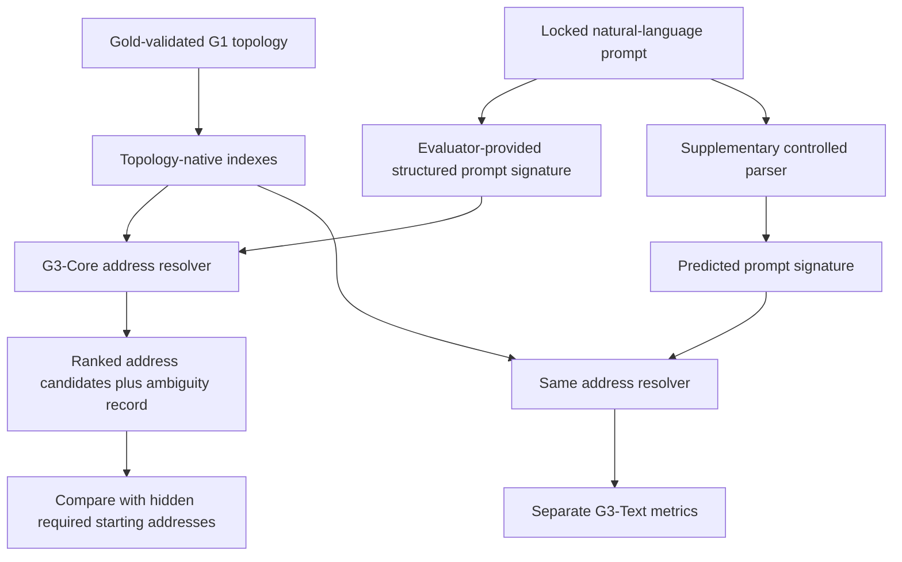

# G3 — Prompt-to-Topology Addressing Experiment

## 1. Status and approval boundary

This document is the proposed frozen specification and implementation plan for
G3. No G3 implementation or locked evaluation should begin until this document
is reviewed and approved.

G3 proceeds as an isolated component experiment. It uses a correct,
gold-validated G1 topology so that failures from G2 and G2.1 cannot contaminate
the result. Passing G3 does not change the failed G2 classifications.

## 2. Objective

Test the following falsifiable hypothesis:

> Given a structured description of a prompt and a correct persistent topology,
> topology-native indexes can locate every required starting address with high
> recall, bounded ambiguity, and no complete-topology scan.

The experiment must distinguish two questions:

1. **G3-Core — address resolution:** Can a correct structured prompt signature
   locate the right topology addresses?
2. **G3-Text — controlled prompt parsing:** Can a small deterministic parser
   produce that signature from registered controlled prompts?

Only G3-Core determines the main G3 classification. G3-Text is a diagnostic
integration result and must be reported separately.

Passing G3-Core permits this conclusion:

> A prompt signature can enter the correct region of a registered topology
> through bounded indexed work, without scanning the complete topology.

It does not prove unrestricted-language understanding, topology compilation,
active-frontier completeness, latent optimization, decoding, or 100-million-
token reliability.

## 3. Why the split is required

G2 and G2.1 did not reach reliable language-to-topology compilation. If G3 used
their generated topology or an unrestricted model-generated prompt parse, a
miss could have three incompatible explanations:

- the topology was compiled incorrectly;
- the prompt signature was extracted incorrectly;
- the address resolver searched incorrectly.

G3-Core removes the first two explanations. It receives evaluator-generated,
runtime-visible prompt signatures and searches an independently generated
gold topology. G3-Text then tests the controlled parsing boundary separately.

## 4. Experiment flow



## 5. Fixed technical decisions

- Language: Python `>=3.11`.
- Required runtime dependency: NumPy only.
- Optional semantic candidate generator: frozen local
  `.models/all-MiniLM-L6-v2` through the already installed Sentence
  Transformers runtime.
- Storage: SQLite plus immutable NumPy arrays.
- Execution device: CPU.
- Network access: prohibited.
- Development topology: 10,000 addressable objects.
- Locked topology: a fresh 10,000 addressable objects.
- Development prompts: 200.
- Locked prompts: 400.
- Seed: development `1731`; locked `20260804`; verification `91731`.
- Target full `run-all` time: below 600 seconds.
- Target peak RSS: below 2 GB.
- No model training, generative model, latent optimizer, decoder, or RAG.

## 6. Repository additions

```text
configs/
└── topology-g3.json

docs/experiments/gaps/g03/
├── specification.md
└── report.md

src/topology_g3/
├── __init__.py
├── __main__.py
├── cli.py
├── schemas.py
├── generator.py
├── indexes.py
├── signatures.py
├── resolver.py
├── controls.py
├── metrics.py
├── evaluate.py
└── report.py

tests/topology_g3/
├── test_generator.py
├── test_indexes.py
├── test_signatures.py
├── test_resolver.py
├── test_controls.py
└── test_evaluation.py
```

Generated topologies, prompt suites, index files, predictions, manifests, and
raw results remain under ignored `workspaces/topology-g3/`.

## 7. Commands

Implement exactly:

```bash
python -m topology_g3 develop \
  --workspace workspaces/topology-g3

python -m topology_g3 freeze \
  --workspace workspaces/topology-g3

python -m topology_g3 locked-suite-build \
  --workspace workspaces/topology-g3

python -m topology_g3 evaluate \
  --workspace workspaces/topology-g3 \
  --offline

python -m topology_g3 report \
  --workspace workspaces/topology-g3

python -m topology_g3 verify \
  --workspace workspaces/topology-g3 \
  --offline

python -m topology_g3 run-all \
  --workspace workspaces/topology-g3 \
  --offline
```

Repository verification:

```bash
.venv/bin/python -m pytest -q
.venv/bin/python -m ruff check .
.venv/bin/python -m compileall -q src tests
git diff --check
```

Every stage uses atomic writes. Development cannot run after freeze. The locked
suite is generated once, and a completed locked evaluation cannot be
overwritten.

## 8. Immutable interfaces

Use frozen, slotted dataclasses.

```python
TopologyAddress(
    address_id: str,
    object_id: str,
    object_kind: str,
    canonical_name: str,
    aliases: tuple[str, ...],
    predicate: str | None,
    relation_type: str | None,
    scope_id: str,
    valid_from: int | None,
    valid_to: int | None,
    episode_id: str | None,
    entity_type: str | None,
    provenance_ids: tuple[str, ...],
)

PromptMention(
    text: str,
    normalized_text: str,
    expected_kind: str | None,
    source_start: int,
    source_end: int,
)

PromptSignature(
    prompt_id: str,
    goal_kind: str,
    entity_mentions: tuple[PromptMention, ...],
    predicate_phrases: tuple[str, ...],
    relation_hints: tuple[str, ...],
    target_variables: tuple[str, ...],
    scope_hints: tuple[str, ...],
    valid_at: int | None,
    valid_between: tuple[int, int] | None,
    polarity: str,
    modality: str,
    conversation_references: tuple[str, ...],
    ambiguity_policy: str,
)

AddressCandidate(
    address_id: str,
    score: float,
    channels: tuple[str, ...],
    exact_matches: tuple[str, ...],
    conflicts: tuple[str, ...],
)

AddressResult(
    prompt_id: str,
    candidates: tuple[AddressCandidate, ...],
    resolved_addresses: tuple[str, ...],
    retained_ambiguities: tuple[tuple[str, ...], ...],
    disposition: str,
    confidence: float,
    indexes_consulted: tuple[str, ...],
    postings_visited: int,
    objects_materialized: int,
    complete_scan: bool,
    runtime_us: int,
)

GoldAddressRecord(
    prompt_id: str,
    required_entity_addresses: tuple[str, ...],
    required_predicate_addresses: tuple[str, ...],
    required_scope_id: str | None,
    required_temporal_addresses: tuple[str, ...],
    required_episode_addresses: tuple[str, ...],
    acceptable_ambiguity_sets: tuple[tuple[str, ...], ...],
    resolvable: bool,
)
```

The resolver API cannot accept `GoldAddressRecord`. Runtime input and evaluator
gold must live in separate files and processes.

## 9. Topology construction

Generate a deterministic, executable G1-compatible topology containing exactly
10,000 addressable records:

| Family | Count |
| --- | ---: |
| Entity addresses | 1,000 |
| Entity aliases | 2,000 |
| Predicate and relation addresses | 1,000 |
| Fact and claim addresses | 3,500 |
| Temporal versions and corrections | 1,000 |
| Scope and fictional-domain objects | 500 |
| Conversation episode objects | 500 |
| Hard constraints and exact exceptions | 500 |
| **Total** | **10,000** |

Requirements:

- 20 registered relation types, including all address-relevant G1 relations;
- 20 scopes, including global, conversation-local, hypothetical, and fictional;
- 50 conversation episodes;
- 200 entities with at least one near-name distractor;
- 200 aliases shared lexically with an incorrect entity in another scope;
- 500 temporally versioned claims;
- 250 supersession chains;
- opaque fictional names and predicates;
- stable IDs derived through the G1 identity contract;
- no invalid G1 topology object;
- development and locked topology vocabularies are disjoint.

The topology generator writes runtime topology and evaluator-only address maps
separately.

## 10. Topology-native indexes

Build immutable indexes before prompt evaluation:

1. canonical entity-name index;
2. normalized alias index;
3. entity-type index;
4. predicate and relation-name index;
5. relation-role index;
6. scope index;
7. temporal interval index;
8. episode and conversation-reference index;
9. hard-constraint index;
10. exact-exception index;
11. source and provenance index;
12. optional semantic candidate index.

Every posting list uses stable address ordering. Index manifests contain the
topology hash, record count, index count, build time, bytes, and per-index hash.

The semantic index is only a candidate generator. A semantic neighbor cannot
become a resolved address unless it is compatible with the registered type,
scope, temporal, and episode constraints.

## 11. Prompt suites

### 11.1 Development suite

Generate 200 development prompts, 20 in each category:

1. exact canonical entity;
2. exact alias;
3. near-duplicate name;
4. paraphrased predicate;
5. explicit scope;
6. temporal qualifier;
7. pronoun or ellipsis with episode context;
8. multiple required entities;
9. intentionally ambiguous prompt;
10. unsupported or out-of-topology prompt.

### 11.2 Locked suite

Generate 400 fresh prompts, 40 in each category. Locked prompts use disjoint:

- entity names and aliases;
- predicate names and paraphrases;
- scope names;
- episode identifiers;
- temporal values;
- surface templates;
- distractor arrangements;
- source and prompt IDs.

Exactly 320 locked prompts are resolvable. Forty are intentionally ambiguous,
and forty are unsupported. At least half of all prompts require more than plain
canonical-name lookup.

### 11.3 Core and text inputs

For G3-Core, the runtime receives the natural-language prompt plus the correct
structured `PromptSignature`. It never receives required address IDs.

For G3-Text, a deterministic registered-language parser receives only prompt
text and public session context. It emits a predicted `PromptSignature` and
uses the identical resolver. Its metrics are reported separately.

## 12. Address-resolution algorithm

Resolve each signature through the following fixed stages:

1. Normalize Unicode, case, whitespace, punctuation, and registered morphology.
2. Query exact canonical-name and alias indexes.
3. Query predicate and relation indexes.
4. If exact candidates are absent or ambiguous, request semantic candidates.
5. Intersect candidates with entity-type constraints when present.
6. Apply explicit scope constraints.
7. Apply temporal applicability and supersession constraints.
8. Resolve episode references against session-visible episodes only.
9. Attach hard-constraint and exact-exception starting addresses applicable to
   the resolved target.
10. Rank the remaining candidates deterministically.
11. Resolve only when the top candidate is sufficiently supported and separated.
12. Otherwise retain all compatible candidates and return clarification or
    abstention.

### 12.1 Fixed candidate score

Use an interpretable score:

```text
3.0 exact canonical identity
2.5 exact alias identity
2.0 exact predicate or relation match
1.5 compatible scope
1.5 compatible temporal interval
1.5 compatible episode/reference
1.0 compatible entity type
0.5 semantic candidate similarity
-4.0 explicit scope conflict
-4.0 temporal inapplicability
-4.0 episode isolation violation
```

Semantic similarity is normalized to `[0,1]` before applying the `0.5`
coefficient.

### 12.2 Resolution and ambiguity policy

- Resolve one address only when score is at least `3.0`, no hard conflict
  exists, and the margin over the next compatible address is at least `0.75`.
- Retain multiple candidates when the margin is smaller.
- Return `clarification_required` when a retained ambiguity can change the
  starting topology region.
- Return `unknown` when no compatible candidate scores at least `1.5`.
- Never resolve a candidate with a scope, temporal, or episode-isolation
  conflict.
- Tie-break output ordering by address ID, never by insertion order.

These values are frozen before the full development run. G3 has no learned
parameters.

## 13. Controlled text parser

G3-Text uses a small deterministic parser only for the registered prompt
families. It may extract:

- exact source spans;
- registered aliases;
- explicit scope markers;
- explicit temporal expressions;
- episode references;
- registered question-goal phrases;
- registered polarity and modality markers.

It may not inspect gold addresses, template IDs, or evaluator annotations. It
may not infer unstated entities or silently choose ambiguous references.

Failure of G3-Text does not fail G3-Core. It identifies work that must be joined
with the eventual repaired G2 compiler.

## 14. Controls and ablations

Run every locked case through:

1. **Full topology-native resolver** — candidate mechanism.
2. **Lexical-only resolver** — exact names, aliases, and predicates only.
3. **Semantic-only resolver** — nearest frozen embedding candidates.
4. **No scope/temporal indexes** — demonstrates their contribution.
5. **No episode index** — tests conversational reference dependence.
6. **No ambiguity retention** — forced top-one resolution safety control.
7. **Complete scan oracle** — evaluates every address and applies the same
   compatibility rules; used only as an accuracy ceiling.

Controls cannot become the selected method. No locked tuning is permitted.

## 15. Primary metrics

Report aggregate and per-category values for:

- starting-entity recall and precision;
- predicate/relation recall and precision;
- scope accuracy;
- temporal applicability accuracy;
- conversation-reference accuracy;
- hard-constraint and exact-exception attachment recall;
- exact required-address-set agreement;
- resolvable top-one accuracy;
- ambiguity recall and precision;
- unsupported-query abstention accuracy;
- incorrect confident resolution count;
- median and p95 candidate-set size;
- mean reciprocal rank;
- postings visited;
- objects materialized;
- fraction of topology inspected;
- median and p95 latency;
- index build time and bytes;
- complete-scan flag count;
- deterministic replay agreement.

G3-Text additionally reports exact signature-field accuracy and the change from
G3-Core on every address metric.

## 16. Mandatory G3-Core pass gates

G3-Core receives `G3-A` only if every gate passes:

| Metric | Gate |
| --- | ---: |
| Starting-entity recall | `>=0.99` |
| Predicate/relation recall | `>=0.98` |
| Scope accuracy | `>=0.99` |
| Temporal applicability accuracy | `>=0.99` |
| Conversation-reference accuracy | `>=0.98` |
| Hard-constraint activation recall | `1.00` |
| Exact-exception activation recall | `1.00` |
| Ambiguity recall | `>=0.99` |
| Unsupported-query abstention | `>=0.99` |
| Incorrect confident resolutions | `0` |
| Median candidate-set size | `<=8` |
| p95 candidate-set size | `<=24` |
| Median topology fraction inspected | `<0.005` |
| Requests performing a complete scan | `0` |
| Repeated-result agreement | `1.00` |
| Locked runtime | `<600 s` |
| Peak RSS | `<2 GB` |
| Network calls | `0` |

The complete-scan oracle is exempt from the scan and latency gates.

## 17. Supplementary G3-Text gates

Report, but do not use to determine G3-Core:

- signature entity-mention recall at least `0.98`;
- predicate-phrase recall at least `0.95`;
- scope and temporal field accuracy at least `0.98`;
- conversation-reference extraction at least `0.95`;
- end-to-end starting-entity recall at least `0.98`;
- incorrect confident resolutions `0`.

If all pass, report `G3-TEXT-PASS`. Otherwise report
`G3-TEXT-NOT-DEMONSTRATED`.

## 18. Classifications

- **G3-A — PASS:** Every G3-Core gate passes. Authorize G4 using predicted G3
  addresses over gold topology.
- **G3-B — UNBOUNDED CANDIDATES:** Recall passes, but candidate-set or inspected-
  fraction gates fail. Addressing is accurate but not sufficiently sparse.
- **G3-C — ADDRESS MISS:** One or more address-recall gates fail. The system can
  enter the wrong topology region or omit a required starting point.
- **G3-D — UNSAFE AMBIGUITY:** Any incorrect confident resolution occurs, or
  ambiguity/abstention gates fail.
- **G3-E — CONTEXT INDEX FAILURE:** Entity lookup works, but scope, time, episode,
  hard-constraint, or exception addressing fails.
- **G3-F — INTEGRITY FAILURE:** Gold leakage, nondeterminism, changed frozen
  artifacts, cross-session access, or hash mismatch invalidates the run.
- **G3-COMPUTE:** Accuracy passes but runtime or memory fails.

No failed gate may be waived. G3-Text receives its separate diagnostic label.

## 19. Development, freeze, and locked execution

### 19.1 Development

`develop` must:

1. generate and validate the development topology;
2. build all topology-native indexes;
3. generate 200 development prompts and signatures;
4. run G3-Core and every control;
5. run the supplementary G3-Text parser;
6. write metrics and every counterexample;
7. make no learned or post-hoc parameter selection.

### 19.2 Freeze

`freeze` records hashes for:

- G1 schemas, identity codec, and registry;
- G3 source and configuration;
- optional MiniLM model files;
- development topology, inputs, signatures, gold, and results;
- index definitions;
- score and ambiguity policy;
- generator and evaluator code;
- metric definitions and gates;
- Python, NumPy, SQLite, and optional embedding runtime versions;
- all seeds.

Any changed hash blocks locked generation or evaluation.

### 19.3 Locked suite

`locked-suite-build` generates the fresh locked topology, inputs, public
signatures, and evaluator-only gold exactly once after freeze.

### 19.4 Locked evaluation

`evaluate`:

1. verifies all frozen hashes;
2. starts the runtime without access to evaluator gold;
3. builds locked indexes;
4. runs G3-Core, G3-Text, controls, and complete-scan oracle;
5. evaluates outputs in a separate gold-readable process;
6. writes atomic raw results and the mechanical classification;
7. refuses to overwrite a completed result.

### 19.5 Verification

`verify` reruns deterministic address resolution without overwriting results and
requires identical candidates, ordering, dispositions, metrics, and hashes.

## 20. Required artifacts

```text
workspaces/topology-g3/
├── development-topology/
├── development-inputs.jsonl
├── development-signatures.jsonl
├── development-gold/
├── development-index-manifest.json
├── development-results.json
├── frozen-manifest.json
├── locked-topology/
├── locked-inputs.jsonl
├── locked-signatures.jsonl
├── locked-gold/
├── locked-index-manifest.json
├── locked-predictions.jsonl
├── control-predictions.jsonl
├── locked-results.json
├── counterexamples.json
└── report.md
```

Tracked outputs after evaluation:

- this specification;
- `docs/experiments/gaps/g03/report.md`;
- the G3 source, tests, and configuration;
- updated `docs/roadmap/results-ledger.md`.

## 21. Test strategy

### 21.1 Unit tests

- canonical and alias normalization;
- stable address identity;
- deterministic posting-list ordering;
- temporal interval containment;
- superseded-address exclusion;
- scope compatibility;
- episode isolation;
- score calculation;
- ambiguity margin behavior;
- unsupported-query abstention;
- semantic candidates cannot bypass hard filters.

### 21.2 Integration tests

- canonical entity resolves directly;
- alias resolves to the same entity;
- near-name distractor remains unresolved without sufficient evidence;
- predicate paraphrase enters through semantic candidacy and typed validation;
- explicit fictional scope excludes global near matches;
- temporal qualifier selects the applicable version;
- pronoun resolves only inside the supplied episode context;
- hard constraint and exact exception are attached;
- unresolved ambiguity retains both valid addresses;
- unsupported prompt returns unknown;
- different insertion orders produce identical index and result hashes.

### 21.3 Adversarial tests

- same alias in two scopes;
- identical predicate under incompatible entity types;
- stale temporal version with stronger lexical match;
- near-identical entity in another conversation session;
- semantic nearest neighbor that violates scope;
- prompt-injection text requesting an arbitrary address;
- corrupted index topology hash;
- runtime attempt to open evaluator gold;
- forced top-one ambiguity produces the expected safety degradation;
- complete-scan flag accidentally set by the candidate method.

## 22. Granular implementation tasks

- [ ] **Task 1: Freeze configuration and schemas**
  - Acceptance: every seed, count, score, gate, and immutable type is encoded.
  - Verify: schema unit tests and CLI help.
  - Files: config, schemas, CLI scaffold.

- [ ] **Task 2: Generate the gold G1 topology**
  - Acceptance: exact object counts, valid G1 objects, and disjoint splits.
  - Verify: generator and leakage tests.
  - Files: generator and generator tests.

- [ ] **Task 3: Build topology-native indexes**
  - Acceptance: all 12 indexes have deterministic manifests and hashes.
  - Verify: hand-calculated posting-list fixtures.
  - Files: indexes and index tests.

- [ ] **Task 4: Generate prompts, signatures, and hidden gold**
  - Acceptance: exact category balance and no address IDs in runtime signatures.
  - Verify: split-disjointness and source-span tests.
  - Files: generator, schemas, generator tests.

- [ ] **Task 5: Implement the core resolver**
  - Acceptance: fixed score, filtering, ranking, and ambiguity policy match manual
    examples.
  - Verify: resolver unit and adversarial tests.
  - Files: resolver and resolver tests.

- [ ] **Task 6: Add the optional semantic candidate channel**
  - Acceptance: offline deterministic candidates; hard filters remain authoritative.
  - Verify: invalid semantic neighbor cannot resolve.
  - Files: indexes, resolver, tests.

- [ ] **Task 7: Implement G3-Text**
  - Acceptance: registered prompts produce signatures without gold access.
  - Verify: controlled parsing and ambiguity tests.
  - Files: signatures and signature tests.

- [ ] **Task 8: Implement controls**
  - Acceptance: lexical, semantic, ablation, forced-top-one, and oracle paths use
    identical cases.
  - Verify: each control removes only its declared capability.
  - Files: controls and control tests.

- [ ] **Task 9: Implement metrics and instrumentation**
  - Acceptance: accuracy, safety, sparsity, latency, memory, and scan metrics match
    hand calculations.
  - Verify: metric fixtures.
  - Files: metrics, evaluate, tests.

- [ ] **Task 10: Implement development and freeze**
  - Acceptance: frozen hashes prevent later mutation.
  - Verify: changed config or code blocks locked build.
  - Files: CLI, evaluate, tests.

- [ ] **Task 11: Implement locked execution and verification**
  - Acceptance: one locked run, gold-process separation, deterministic rerun.
  - Verify: end-to-end fixture and overwrite refusal.
  - Files: CLI, evaluate, integration tests.

- [ ] **Task 12: Generate report and update ledger**
  - Acceptance: all gates and counterexamples appear; classifications are
    mechanical and G2 remains failed.
  - Verify: report regeneration does not run resolution.
  - Files: report and `docs/roadmap/results-ledger.md`.

## 23. Implementation order and checkpoints

```text
Schemas and config
→ topology generator
→ indexes
→ prompt/signature generator
→ resolver
→ controls
→ metrics
→ development run
→ freeze
→ one locked run
→ report and ledger
```

Checkpoint 1: topology and indexes reproduce exactly.

Checkpoint 2: manual prompt fixtures resolve correctly without semantic search.

Checkpoint 3: adversarial ambiguity never produces a confident wrong address.

Checkpoint 4: development gates are calculated before freeze, without tuning.

Checkpoint 5: locked evaluation occurs once and produces a mechanical result.

## 24. Risks and mitigations

| Risk | Mitigation |
| --- | --- |
| Public signatures make the task trivial | Include aliases, temporal versions, scope collisions, episodes, multiple entities, and semantic paraphrases. |
| Candidate recall is inflated by huge sets | Enforce median and p95 candidate-set gates plus inspected-fraction measurement. |
| Semantic similarity becomes hidden reasoning | Restrict it to candidacy; typed indexes and compatibility authorize addresses. |
| G2 failure is accidentally hidden | Use gold topology and report G2 classifications unchanged. |
| Deterministic parser memorizes locked templates | Use disjoint locked prompt families and report G3-Text separately. |
| Full scans masquerade as indexing | Count postings, materialized objects, inspected fraction, and complete-scan flags. |
| Ambiguity is forced into a wrong top-one result | Require candidate retention, clarification, or abstention and zero confident mistakes. |

## 25. Code style

Use explicit immutable records, pure scoring functions, and deterministic
ordering:

```python
def rank_candidates(
    signature: PromptSignature,
    candidates: tuple[TopologyAddress, ...],
) -> tuple[AddressCandidate, ...]:
    scored = tuple(score_candidate(signature, candidate) for candidate in candidates)
    return tuple(sorted(scored, key=lambda item: (-item.score, item.address_id)))
```

Use snake_case for functions and fields, PascalCase for dataclasses, explicit
type annotations, no module-level mutable state, and no hidden fallback scans.

## 26. Boundaries

### Always

- use gold-validated G1 topology;
- separate runtime inputs from evaluator gold;
- preserve ambiguity;
- count all inspected records;
- freeze before the locked suite;
- retain every locked failure;
- keep G2 and G2.1 classifications unchanged.

### Ask first

- changing a mandatory gate;
- adding a learned model or dependency;
- increasing dataset size or runtime envelope;
- changing the public prompt-signature contract;
- using compiler-produced topology.

### Never

- expose required address IDs to the resolver;
- use evaluator gold for ranking;
- scan the complete topology in the candidate method;
- infer that G2 passed from a G3 result;
- tune after locked evaluation;
- overwrite a completed locked run;
- claim 100-million-token reliability from this experiment.

## 27. Handoff acceptance

Implementation is complete only when:

- all existing G1, G2, G2.1, and MICRO-LTM tests still pass;
- every G3 unit, integration, and adversarial test passes;
- development, freeze, locked build, evaluation, report, and verification run;
- runtime cannot access evaluator gold;
- repeated verification is identical;
- all metrics and counterexamples are retained;
- the ledger records the result without modifying previous classifications;
- Ruff, compilation, and `git diff --check` pass.

## 28. Expected effort

Implementation estimate: 2–4 hours.

Expected experiment execution after implementation: 1–5 minutes, depending on
whether the optional MiniLM semantic candidate index is built from scratch.

## 29. Open approval questions

Before implementation, confirm or change these decisions:

1. G3-Core uses evaluator-provided structured signatures as its mandatory test.
2. G3-Text remains supplementary and cannot fail G3-Core.
3. The locked topology contains 10,000 addresses and 400 prompts.
4. Semantic embeddings may generate candidates but never authorize an address.
5. A G3-Core pass authorizes G4 over gold topology, despite G2 remaining failed.
