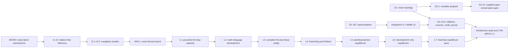

# LTM Experiment-Series Evidence Compendium

> **Evidence cutoff:** 2026-08-08  
> **Registry:** [`registry.json`](registry.json)  
> **Normative architecture:** [LTM-ARCH-1.1](../architecture/architecture-lock-v1.md)  
> **Explanatory architecture:** [Mother Architecture](../architecture/mother-architecture.md)

This document is the human-readable history of the 51 experiments registered at
the evidence cutoff. The registry is the machine-readable status authority; the
linked reports are the sole authority for measured results. A specification says
what an experiment intended to test. It is never evidence that the test passed.

## 1. Status and authority legend

| Label | Meaning |
|---|---|
| **PASS** | The registered authoritative boundary passed its mechanical gates. |
| **CONTROLLED_PASS** | A deliberately bounded or split classification passed; the stated boundary matters. |
| **FAILED** | A measured gate failed. Negative evidence remains useful and immutable. |
| **DEVELOPMENT_ONLY** | Implementation or development measurements exist, but no qualifying locked pass exists. |
| **ADOPTED_PROVISIONAL** | Engineering retained a component despite an experimental failure; its authority is constrained. |
| **UNCLASSIFIED** | No authorized pass/fail classification exists. |
| **PLANNED** | The experiment has not been executed. |

Maturity in the architecture documents has a related but different meaning:
**Validated** names a passing experimental boundary, **Provisional** names an
engineering choice without a qualifying pass, and **Planned** names intended but
untested work.

## 2. Global timeline and dependency map



The dependency graph is not a ladder of monotonically improving scores. Several
branches test different mechanisms. In particular, L1's verified 64-step search,
L3's controlled 45-step compiled path, and L7's 20-body fixed equilibrium are
different capabilities and must not be merged into one “hop count.”

## 3. MICRO series — early latent-mechanism studies

| ID | Status / classification | Hypothesis and result | Architectural lesson | Sources |
|---|---|---|---|---|
| **MICRO-LTM-1** — Micro latent equilibrium | FAILED / historical negative evidence | Early bounded equilibrium study; it did not establish a product reasoning path. | A small latent state reaching a numerical equilibrium is not enough to establish semantic reasoning. | [Spec](micro-ltm/01/specification.md) · [Report](micro-ltm/01/report.md) |
| **MICRO-LTM-2** — Micro latent compression | FAILED / historical negative evidence | Tested compression as a latent mechanism; retained only as a legacy report. | Compression quality cannot substitute for exact semantic authority or causal inference evidence. | No tracked specification · [Report](micro-ltm/02/report.md) |
| **MICRO-LTM-3** — Differentiable latent field | FAILED / `MICRO-LTM-3-E` | The exact path passed, but the strict latent-only mechanism failed. | Exact and soft computation must be evaluated independently; passing exact fallback cannot validate latent dynamics. | [Spec](micro-ltm/03/specification.md) · [Report](micro-ltm/03/report.md) |

These failures motivated the architecture's hard separation between exact
semantic topology and soft or equilibrium state.

## 4. G series — topology, compiler, execution, memory, and serving

### 4.1 G1: exact semantic authority

| ID | Status / classification | Boundary, result, and adoption | Sources |
|---|---|---|---|
| **G1** — Executable conversational topology | PASS / `G1-A` | Validated the registered controlled ontology and became the exact topology authority. It does not compile language. | [Spec](gaps/g01/specification.md) · [Report](gaps/g01/report.md) |

### 4.2 G2 compiler sequence

The long G2 sequence is one of the most important negative-result records in the
repository. It rules out the idea that a single frozen sentence embedding, a
large correlated structural target, or unconstrained coordinate prediction is
already a reliable semantic compiler.

| ID | Status / classification | Authoritative boundary and principal result | Lesson / adoption | Sources |
|---|---|---|---|---|
| **G2** — Natural-language topology compiler | FAILED / registered G2 compiler failure | Raw controlled-language compiler; no locked compiler metrics were produced. | Raw language remains open. | [Spec](gaps/g02/specification.md) · [Report](gaps/g02/report.md) |
| **G2.1** — Frozen reasoning embedding kernel | FAILED / `G2.1-C` | Frozen MiniLM representation was inadequate. | Semantic similarity alone did not encode the required topology. | [Spec](gaps/g02-1/specification.md) · [Report](gaps/g02-1/report.md) |
| **G2.2** — Sentence reasoning compiler | FAILED / `G2.2-C-FROZEN-REPRESENTATION-INSUFFICIENT` | Sentence-to-topology representation gate failed. | More classifier structure did not repair an insufficient frozen representation. | [Spec](gaps/g02-2/specification.md) · [Report](gaps/g02-2/report.md) |
| **G2.3** — Hierarchical sentence compiler | UNCLASSIFIED / no locked classification | Development-only hierarchical controlled compiler. | No capability was adopted from an unclassified run. | [Spec](gaps/g02-3/specification.md) · [Report](gaps/g02-3/report.md) |
| **G2.4** — Atom-vector topology compiler | FAILED / sentence-core failure | Sentence-core failed; identity and cross-sentence linking were not tested authoritatively. | Atom vectors alone were not a sufficient compiler. | [Spec](gaps/g02-4/specification.md) · [Report](gaps/g02-4/report.md) |
| **G2.5** — Typed atom coordinate compiler | ADOPTED_PROVISIONAL / experimental failure with engineering waiver | Supplied typed atoms; 81.75% exactness and 199 reversal false accepts. | Retained only as a proposal generator. High-impact outputs require strict validation, preview, confirmation, or abstention. | [Spec](gaps/g02-5/specification.md) · [Report](gaps/g02-5/report.md) |
| **G2.6** — G1-constrained atom-pair compiler | FAILED / `G2.6-B` | Gold-content routing kernel recorded 84.37%, below its gate. | Exact ontology constraints helped validity but not enough for reliable selection. | [Spec](gaps/g02-6/specification.md) · [Report](gaps/g02-6/report.md) |
| **G2.7** — Frozen atom-coordinate compiler | FAILED / `G2.7-B` | Development gate failure. | Frozen coordinates remained insufficient. | [Spec](gaps/g02-7/specification.md) · [Report](gaps/g02-7/report.md) |
| **G2.8** — Versioned golden-atom compiler | FAILED / `G2.8-B` | Gold-content topology-kernel development gate failed. | Versioning did not solve semantic discrimination. | [Spec](gaps/g02-8/specification.md) · [Report](gaps/g02-8/report.md) |
| **G2.9** — Post-attention golden-query compiler | FAILED / `G2.9-B` | Gold-query comparator development gate failed. | Post-attention comparison alone was insufficient. | [Spec](gaps/g02-9/specification.md) · [Report](gaps/g02-9/report.md) |
| **G2.10** — Behavioral topology coordinates | FAILED / `G2.10-B` | Supplied-atom behavioral cells were safe but had inadequate coverage. | Abstention can protect precision, but low coverage is still a failed compiler boundary. | [Spec](gaps/g02-10/specification.md) · [Report](gaps/g02-10/report.md) |
| **G2.11** — Atomic attention-to-Mumbrane compiler | FAILED / `G2.11-B` | Atomic coordinate basis failed its kernel. | Predicting a large correlated structural basis was retired. | [Spec](gaps/g02-11/specification.md) · [Report](gaps/g02-11/report.md) |
| **G2.12** — Factorized operator-role compiler | FAILED / `G2.12-B` | Gold-span factorized kernel reached only 59.79% accepted precision. | Factorization was architecturally cleaner but did not establish a reasoning compiler. | [Spec](gaps/g02-12/specification.md) · [Report](gaps/g02-12/report.md) |
| **G2.13** — Conversational Mumbrane compiler | FAILED / `G2.13-B` | Controlled conversation predictor retained 115 incorrect accepted predictions. | Its frozen predictor became an input to G2.14, but its acceptance policy was rejected. | [Spec](gaps/g02-13/specification.md) · [Report](gaps/g02-13/report.md) |
| **G2.14** — Margin-gated conversational compiler | PASS / `G2.14-A` | Supplied semantic spans; accepted precision 1.00, safe coverage 0.9998, and zero incorrect accepted predictions. | Adopted as the supplied-span conversation gate. Raw segmentation and the canonical Mumbrane writer remain absent. | [Spec](gaps/g02-14/specification.md) · [Report](gaps/g02-14/report.md) |

### 4.3 G3–G9: controlled execution spine

| ID | Status | Validated boundary and adopted component | Limitation | Sources |
|---|---|---|---|---|
| **G3** — Prompt addressing | PASS / `G3-A` | Addressing over controlled topology. | Requires structured addresses. | [Spec](gaps/g03/specification.md) · [Report](gaps/g03/report.md) |
| **G4** — Active frontier | PASS / `G4-A` | Bounded indexed frontier traversal. | Does not prove unrestricted retrieval. | [Spec](gaps/g04/specification.md) · [Report](gaps/g04/report.md) |
| **G5** — Coverage certificate | PASS / `G5-A` | Coverage certification over registered region summaries. | A certificate is only as strong as the registered summary contract. | [Spec](gaps/g05/specification.md) · [Report](gaps/g05/report.md) |
| **G6** — Typed relation engine | PASS / `G6-A` | Exact hard reasoning over registered G1 relations. | Cannot infer missing relations from language. | [Spec](gaps/g06/specification.md) · [Report](gaps/g06/report.md) |
| **G7** — Structured latent optimizer | PASS / `G7-A` | Registered quadratic soft reconciliation. | Not a universal reasoning engine. | [Spec](gaps/g07/specification.md) · [Report](gaps/g07/report.md) |
| **G8** — Memory-bounded reduction | PASS / `G8-A` | Order-independent reduction over bounded batches. | Only registered reductions are authorized. | [Spec](gaps/g08/specification.md) · [Report](gaps/g08/report.md) |
| **G9** — Independent verifier | PASS / `G9-A` | Independent verification for registered corruption families. | Unknown schemas still require fail-closed behavior. | [Spec](gaps/g09/specification.md) · [Report](gaps/g09/report.md) |

### 4.4 G10–G15: realization, memory, persistence, and serving

| ID | Status / classification | Result and adoption | Limitation | Sources |
|---|---|---|---|---|
| **G10** — Conversational decoder | CONTROLLED_PASS | The original run was model-limited; closure came through G10.1. | No unrestricted decoder pass. | [Spec](gaps/g10/specification.md) · [Report](gaps/g10/report.md) |
| **G10.1** — Strict surface realization | PASS / `G10.1-S-A` | Adopted constrained realization of prevalidated candidates. | Not free-form factual generation. | [Spec](gaps/g10-1/specification.md) · [Report](gaps/g10-1/report.md) |
| **G11** — Conversation lifecycle | PASS / `G11-A` | Adopted session lifecycle for already structured events. | Does not compile raw turns. | [Spec](gaps/g11/specification.md) · [Report](gaps/g11/report.md) |
| **G12** — Persistent storage | PASS / `G12-A` | Adopted incremental persistence for controlled topology. | Production durability remains open. | [Spec](gaps/g12/specification.md) · [Report](gaps/g12/report.md) |
| **G13** — Large-context storage scaling | PASS / `G13-A` | Adopted indexed scale layout within the controlled 1M–100M study. | Not a production-throughput claim. | [Spec](gaps/g13/specification.md) · [Report](gaps/g13/report.md) |
| **G14** — Unified benchmark | CONTROLLED_PASS / `G14-C-A`, product not ready | Structured/gold composition evidence passed. | Raw-language product remained not ready. | [Spec](gaps/g14/specification.md) · [Report](gaps/g14/report.md) |
| **G15** — Serving and isolation | PLANNED / not run | Intended production operations boundary. | Unimplemented; no report or metrics. | No tracked spec or report |

## 5. R series — representation audits

| ID | Status / classification | Result and adoption | Limitation | Sources |
|---|---|---|---|---|
| **LTM-R1** — Vector-native representation audit | PASS / `LTM-R1-A` | Validated numeric active representation compatibility across G1–G14. | Used controlled exact topology. | [Spec](representation/r01/specification.md) · [Report](representation/r01/report.md) |
| **LTM-R2** — Universal Mumbrane representation | PASS / `LTM-R2-A` | Established Mumbrane IR v1 as the normative future semantic target. | The implementation remains isolated pending product promotion. | [Spec](representation/r02/specification.md) · [Report](representation/r02/report.md) |

## 6. Integration series

| ID | Status / classification | Result and adoption | Limitation | Sources |
|---|---|---|---|---|
| **LTM-I1** — Canonical FieldIR v2 integration | PASS / `LTM-I1-A` | Validated FieldIR v2 as the packed execution bridge for confirmed topology. | Does not validate raw-language compilation. | [Spec](integration/i01/specification.md) · [Report](integration/i01/report.md) |

`topology_field_ir` is intentionally not registered as an experiment. It is a
product execution package whose evidence comes from the integration experiment.

## 7. I series — latent-inference research

| ID | Status / classification | Hypothesis and result | Architectural lesson | Sources |
|---|---|---|---|---|
| **I1** — Relation-free Mumbrane inference | FAILED / `I1-B` | A local relation-free energy representation failed at body representation. | Associative completion was not enough to establish compositional reasoning. | [Spec](inference/i01/specification.md) · [Report](inference/i01/report.md) |
| **I2** — Multiscale minimap inference | FAILED / `I2-C` | Anonymous-transition multiscale field failed the local transition boundary. | Hierarchical summaries cannot compensate for an invalid local transition law. | [Spec](inference/i02/specification.md) · [Report](inference/i02/report.md) |
| **I2.1** — Aligned transition navigation | PASS / `I2.1-A` | Identity-addressed observed transitions passed their controlled boundary. | This was navigation over aligned transitions, not arbitrary inference. | [Spec](inference/i02-1/specification.md) · [Report](inference/i02-1/report.md) |
| **I2.2** — Global content-addressed navigation | PASS with post-hoc boundary correction | Deterministic observed-successor traversal passed. | It did not validate the proposed energy/minimap theory and cannot be promoted to relation-free reasoning. | [Spec](inference/i02-2/specification.md) · [Report](inference/i02-2/report.md) |
| **I2.3** — Hermetic summary-dependent inference | DEVELOPMENT_ONLY | Opaque learned-summary development retained 37 incorrect accepted candidates. | No locked claim; false acceptance remained a blocker. | [Spec](inference/i02-3/specification.md) · [Report](inference/i02-3/report.md) |
| **I3** — Latent-guided formal math | DEVELOPMENT_ONLY | Built local formal rewriting and exact checking. | The exact formal kernel was useful; learned search had no authoritative locked pass. | [Spec](inference/i03/specification.md) · [Report](inference/i03/report.md) |
| **I3.1** — Branching mathematical reality search | DEVELOPMENT_ONLY | Supplied formal bodies with a search prototype. | Development corpus and minimap/cost controls did not establish a locked capability. | [Spec](inference/i03-1/specification.md) · [Report](inference/i03-1/report.md) |

## 8. L series — capacity and equilibrium studies

| ID | Status / classification | Principal evidence | Architectural lesson / limitation | Sources |
|---|---|---|---|---|
| **L1** — Frozen multihop limit characterization | CONTROLLED_PASS / `L1-A` | 20/20 cases at every tested depth 1–64 in grounded formal and opaque panels; independently replayed proofs; the per-depth 20/20 Wilson lower bound is about 83.9%. | Shows observed grounded search/transport capacity through 64, not arbitrary 64-hop mathematics and not equilibrium depth. | [Spec](limits/l01/specification.md) · [Report](limits/l01/report.md) |
| **L2** — Ordinary mathematical-language compilation | DEVELOPMENT_ONLY | Conservative controlled-math compiler implementation began; no locked result. | Ordinary language to trusted formal reality remains open. | [Spec](limits/l02/specification.md) · [Report](limits/l02/report.md) |
| **L3** — Compiled 45-hop mathematical reality | CONTROLLED_PASS / `L3-A` | Controlled prose/notation compiled into source-backed, independently replayable 45-step standard-math paths. | The mostly linear corpus did not make learned scorer, goal anchor, or remaining-cost head causally necessary; no broad branching claim. | [Spec](limits/l03/specification.md) · [Report](limits/l03/report.md) |
| **L4** — Unseen branching mathematical proof discovery | FAILED / `L4-C` development stop | Twelve-case pre-lock stop: 33.3% answerable success, 27.4% proposal recall@16, and failed scorer/goal/value causal controls. | Local branching proposal selection is an unsolved learned-search boundary. | [Spec](limits/l04/specification.md) · [Report](limits/l04/report.md) |
| **L5** — Compiled multi-hypothesis latent field equilibrium | UNCLASSIFIED / pending authoritative execution | Implementation and a pending report exist, but no measured classification is authorized. | It must remain neither pass nor failure until its authoritative lifecycle is executed and audited. | [Spec](limits/l05/specification.md) · [Report](limits/l05/report.md) |
| **L6** — Causal mathematical reality equilibrium | DEVELOPMENT_ONLY | Bounded smoke implementation only; authoritative training, locked field, independent oracle, and causal run remain pending. | Learned-geometry equilibrium was not established. | [Spec](limits/l06/specification.md) · [Report](limits/l06/report.md) |
| **L7** — Fixed-law mathematical reality equilibrium | CONTROLLED_PASS / `L7-A` | On the supplied-formal acyclic 512-body probe, all 240 cases were exact, depth-20 cases passed, contradictions and alternatives agreed with the independent oracle, and execution completed in 27.34 seconds. | Validates a zero-parameter fixed-law equilibrium through 20 bodies within this field. It does not validate cycles, minimap scale, raw language, literal counterfactual arithmetic chains, or unrestricted mathematics. | [Spec](limits/l07/specification.md) · [Report](limits/l07/report.md) |

The L-series chain is therefore:

```text
L1 → L2 → L3 → L4 → L5 → L6 → L7
```

It records a scientific course correction: from measuring exact search depth, to
testing compilation, to exposing branching weakness, to distinguishing learned
geometry from a deterministic field-satisfaction law.

## 9. Architecture-audit series

| ID | Status / classification | Result | Sources |
|---|---|---|---|
| **LTM-A2** — Full architecture evidence audit | CONTROLLED_PASS / bounded audit | Reconciled repository evidence and open boundaries. It is an audit, not a new capability experiment. | [Spec](../audits/2026-08-06-ltm-architecture-viability-audit-specification.md) · [Report](../audits/2026-08-06-ltm-architecture-viability-audit.md) |

## 10. Cross-series decision trace

| Architectural concern | Evidence trace | Current decision |
|---|---|---|
| Representation | G1 → R1 → R2 → integration I1 | Mumbrane IR v1 is normative; FieldIR v2 is the implemented packed bridge; G1 remains exact authority. |
| Compiler | G2–G2.13 failures → G2.14 pass | Use narrow, calibrated, fail-closed compiler modules. Supplied-span conversation routing is validated; raw segmentation and unrestricted reasoning compilation are open. |
| Retrieval | G3–G5, G13, I2 sequence | Use indexes, bounded frontiers, coverage certificates, and explicit cache validity. Do not call deterministic successor traversal “latent inference.” |
| Exact reasoning | G6, I3/I3.1, L1, L3, L4 | Exact transitions and proof replay are authoritative. Grounded linear depth is strong; unseen branching selection remains weak. |
| Equilibrium | MICRO failures, G7, L5/L6, L7 | Keep G7 soft reconciliation separate. For bounded acyclic user realities, L7's fixed unlearned satisfaction law is the validated equilibrium mechanism. |
| Verification | G9, G10.1, formal/equilibrium evaluators | Independent replay or fixed-point verification authorizes claims; internal confidence never does. |
| Decoder | G10 → G10.1 | Render only an authorized result bundle. A language model may phrase, but may not add facts. |
| Persistence and scale | G11–G13 | Use session isolation, assistant non-evidence, atomic transactions, replay, deletion, and indexed storage. Production serving remains G15. |

## 11. Failed approaches and what they ruled out

1. **Similarity is not topology.** G2.1–G2.2 rejected the assumption that frozen
   sentence embeddings alone reliably determine exact operator, role, direction,
   polarity, and context.
2. **More correlated outputs are not semantic authority.** G2.11's atomic
   coordinate basis and G2.12's factorization both failed their locked kernels.
3. **An accurate classifier still needs an acceptance boundary.** G2.13's false
   accepts motivated the monotonic G2.14 margin gate.
4. **Exact fallback cannot validate a latent mechanism.** MICRO-LTM-3 and the I2
   sequence showed that success from deterministic traversal must be separated
   from success caused by energy or geometry.
5. **Linear depth is not branching discovery.** L1 and L3 demonstrated grounded
   transport/search depth; L4 showed that selecting among competing proof actions
   remained difficult.
6. **State movement is not causal evidence by itself.** L5 and L6 were not
   promoted; L7 instead tested whether an explicit, fixed satisfaction law makes
   the field data causally determine the equilibrium.

## 12. Current adopted architecture

The evidence-backed architecture is hybrid:

```text
source/archive
→ modular fail-closed compiler
→ Mumbrane exact substrate
→ G1 validation and FieldIR packing
→ indexed address/frontier/coverage
→ exact G6 or bounded L7 equilibrium lane
→ independent G9/proof/fixed-point verification
→ G10.1 constrained realization
→ G11–G13 lifecycle and persistence
```

Validated components are never allowed to lend authority to an unvalidated
neighbor. For example, G2.14 does not validate raw span extraction, L1 does not
validate L7 at 64 bodies, and L7 does not validate a general-purpose decoder.

## 13. Open experimental questions

- Can raw conversational and mathematical language be compiled with exact spans,
  context, provenance, and canonical Mumbrane output at acceptable coverage?
- Can the canonical G2.14 writer be completed and validated transactionally?
- Does the L7 fixed law remain unique and useful on cyclic fields?
- Can minimap retrieval preserve complete factor influence at materialized scale?
- How does fixed-law equilibrium behave beyond 20 bodies and with many candidates?
- Can unseen branching proof selection pass without leaking route structure?
- Can a production G15 service enforce tenant, reality, evaluator, and cache
  isolation under load?
- What renderer provides fluent answers while maintaining exact claim audit?

## 14. Compact registry appendix

This appendix is intentionally one row per registered experiment. Detailed
metrics remain in the linked reports.

| Experiment | Series | Status | Classification |
|---|---|---|---|
| MICRO-LTM-1 | MICRO | FAILED | historical negative evidence |
| MICRO-LTM-2 | MICRO | FAILED | historical negative evidence |
| MICRO-LTM-3 | MICRO | FAILED | MICRO-LTM-3-E |
| G1 | G | PASS | G1-A |
| G2 | G | FAILED | registered G2 compiler failure |
| G2.1 | G | FAILED | G2.1-C |
| G2.2 | G | FAILED | G2.2-C-FROZEN-REPRESENTATION-INSUFFICIENT |
| G2.3 | G | UNCLASSIFIED | no locked classification |
| G2.4 | G | FAILED | G2.4-r1 sentence-core failure |
| G2.5 | G | ADOPTED_PROVISIONAL | experimental failure; engineering waiver |
| G2.6 | G | FAILED | G2.6-B |
| G2.7 | G | FAILED | G2.7-B |
| G2.8 | G | FAILED | G2.8-B |
| G2.9 | G | FAILED | G2.9-B |
| G2.10 | G | FAILED | G2.10-B |
| G2.11 | G | FAILED | G2.11-B |
| G2.12 | G | FAILED | G2.12-B |
| G2.13 | G | FAILED | G2.13-B |
| G2.14 | G | PASS | G2.14-A |
| G3 | G | PASS | G3-A |
| G4 | G | PASS | G4-A |
| G5 | G | PASS | G5-A |
| G6 | G | PASS | G6-A |
| G7 | G | PASS | G7-A |
| G8 | G | PASS | G8-A |
| G9 | G | PASS | G9-A |
| G10 | G | CONTROLLED_PASS | closed through G10.1 |
| G10.1 | G | PASS | G10.1-S-A |
| G11 | G | PASS | G11-A |
| G12 | G | PASS | G12-A |
| G13 | G | PASS | G13-A |
| G14 | G | CONTROLLED_PASS | G14-C-A / G14-P-NOT-READY |
| G15 | G | PLANNED | not run |
| LTM-R1 | R | PASS | LTM-R1-A |
| LTM-R2 | R | PASS | LTM-R2-A |
| LTM-I1 | INTEGRATION | PASS | LTM-I1-A |
| I1 | I | FAILED | I1-B |
| I2 | I | FAILED | I2-C |
| I2.1 | I | PASS | I2.1-A |
| I2.2 | I | PASS | I2.2-A with boundary correction |
| I2.3 | I | DEVELOPMENT_ONLY | no locked classification |
| I3 | I | DEVELOPMENT_ONLY | no locked classification |
| I3.1 | I | DEVELOPMENT_ONLY | no locked classification |
| L1 | L | CONTROLLED_PASS | L1-A |
| L2 | L | DEVELOPMENT_ONLY | no locked result |
| L3 | L | CONTROLLED_PASS | L3-A |
| L4 | L | FAILED | L4-C |
| L5 | L | UNCLASSIFIED | pending authoritative execution |
| L6 | L | DEVELOPMENT_ONLY | no locked result |
| L7 | L | CONTROLLED_PASS | L7-A |
| LTM-A2 | AUDIT | CONTROLLED_PASS | bounded audit |

