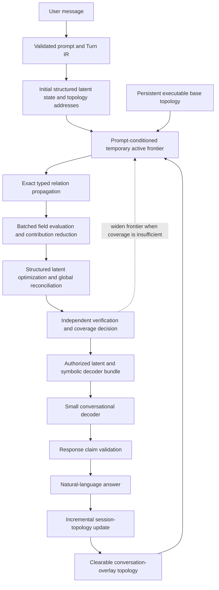

# Remaining Gaps to the Final Shipping LTM

## 1. Final shipping product

The target product is a normal conversational model backed by a persistent,
executable reasoning topology with up to 100 million source-token-equivalent
units of context.

From the user's perspective, it behaves like an ordinary chat model:

```text
User message
→ natural-language response
→ conversation continues
```

Internally, one turn executes this cycle:



The final product must provide:

- natural multi-turn conversation;
- persistent knowledge and conversational context;
- a 100-million-token-equivalent workspace or conversation capacity;
- explicit corrections, conflicts, scopes, preferences, time, and provenance;
- topology-directed activation instead of resending the complete context;
- exact registered relation propagation for correctness;
- structured latent optimization for soft constraints and reconciliation;
- independent coverage and conclusion verification;
- grounded conversational decoding;
- clearable conversational context that leaves base knowledge untouched;
- bounded ordinary-request compute and an explicit exhaustive mode;
- user-visible evidence, assumptions, conflicts, and traces when requested.

The shippable system does not require pure smooth latent equilibrium to perform
all reasoning. Exact topology propagation is the first correctness path. Pure
latent-equilibrium reasoning remains a parallel research program until it
passes causal locked evaluation.

## 2. Current project position

The architecture is no longer missing an end-to-end flow. The remaining work
is concentrated at specific component boundaries.

What has been demonstrated in controlled settings:

- a typed topology can store facts, relations, corrections, scopes, conflicts,
  conversation state, and provenance;
- exact topology propagation can solve registered relation compositions;
- persistent and session fields can operate together;
- an independent verifier can authorize or reject materialized conclusions;
- a small decoder can express authorized conclusions with deterministic
  fallback;
- sparse field activation and SSD-backed compiled storage are mechanically
  feasible at small engineering scale;
- a completed symbolic field state can be compressed and decoded.

What has not been demonstrated:

- reliable unrestricted-language topology compilation;
- reliable prompt-to-topology addressing on a large persistent store;
- certified activation of every answer-changing factor;
- general relation operators across broad conversational language;
- order-independent memory-bounded field execution at large scale;
- a natural decoder with a low fallback rate;
- reliable 100-million-token context operation;
- pure differentiable latent reasoning;
- frontier-model equivalence.

The strict MICRO-LTM-3 result localizes one important limitation: the exact
structured field reached 100% on its registered cases, while the strict
differentiable optimizer plus query-agnostic compression reached 49.86% and
failed causal state-swap testing. The first product must therefore preserve the
hybrid exact-propagation path.

## 3. Shipping dependency chain

The critical path is:

```text
Topology schema
→ natural-language topology compiler
→ prompt-address encoder
→ active-frontier construction
→ coverage certification
→ exact relation engine and structured optimizer
→ verifier
→ conversational decoder
→ conversation lifecycle
→ 100M scaling
→ production serving
```

A later component cannot repair a failed earlier boundary. For example:

- the optimizer cannot use a relation the compiler omitted;
- the frontier cannot open an entity mapped to the wrong address;
- the verifier cannot prove coverage without reliable influence bounds;
- the decoder cannot faithfully express a conclusion absent from the verified
  bundle;
- a 100M store is not useful if required-factor activation fails.

## 4. Gap 1 — Executable general conversational topology

### Objective

Freeze an implementable topology schema capable of representing ordinary
conversation and persistent domain knowledge.

### Required object families

- entities and stable identities;
- values and typed states;
- source events and source spans;
- facts, observations, claims, and hypotheses;
- user questions, goals, and response acts;
- implications and multi-premise rules;
- requirements, dependencies, exclusions, and equality;
- temporal events, corrections, and supersession;
- preferences and instructions;
- fictional, hypothetical, domain, conversation, and episode scopes;
- supporting and opposing claims;
- conflicts and alternative branches;
- uncertainty and applicability;
- assistant response events;
- provenance and verifier artifacts.

### Required relation metadata

Every relation must declare:

```text
stable type and version
argument roles and arity
direction
valid object types
scope behavior
temporal behavior
composition rules
exact propagation behavior
field energy or residual behavior
independent verifier behavior
decoder-visible explanation
provenance requirements
```

### Shipping gate

- every supported topology object validates deterministically;
- every relation has exact and field semantics;
- relation direction and argument roles survive serialization;
- schema migrations are versioned and replayable;
- unknown structures are quarantined rather than guessed;
- every derived object retains exact provenance.

## 5. Gap 2 — Natural-language topology compiler

### Objective

Convert unrestricted documents and conversation turns into validated topology
operations without deterministic recovery hiding model failures.

### Compiler flow

```text
Raw source
→ source-preserving event record
→ model-proposed structured IR
→ schema and source-span validation
→ identity and reference resolution
→ scope and temporal resolution
→ correction and conflict detection
→ deterministic topology operations
→ accepted, clarification-required, or quarantined
```

### Required capabilities

- multiple claims and speech acts in one turn;
- paraphrases and implicit predicates;
- pronouns, aliases, and omitted references;
- explicit and implicit corrections;
- fictional and hypothetical scopes;
- temporal validity and supersession;
- facts versus questions, preferences, instructions, and speculation;
- confidence and ambiguity representation;
- exact source-span and source-document retention;
- incremental document and conversation compilation;
- deletion and reversal of derived topology contributions.

### Shipping gate

| Metric | Required value |
| --- | ---: |
| Claim tuple F1 | ≥ 0.95 |
| Relation direction accuracy | ≥ 0.98 |
| Entity-link accuracy | ≥ 0.98 |
| Coreference accuracy | ≥ 0.98 |
| Correction-target accuracy | ≥ 0.99 |
| Scope accuracy | ≥ 0.99 |
| Temporal applicability accuracy | ≥ 0.99 |
| Provenance integrity | 1.00 |
| Silent invalid insertions | 0 |

The compiler remains the largest current product risk.

## 6. Gap 3 — Prompt-to-topology address encoder

### Objective

Map each user message to the correct starting addresses in the executable
topology.

The prompt encoder must produce:

```json
{
  "goal": {},
  "entities": [],
  "predicates": [],
  "target_variables": [],
  "scope": [],
  "time": [],
  "polarity": [],
  "modality": [],
  "conversation_references": [],
  "starting_addresses": [],
  "ambiguities": [],
  "coverage_policy": {}
}
```

Addressing should use topology-native indexes:

- entity and alias index;
- predicate and relation index;
- adjacency and reverse-dependency index;
- scope index;
- temporal index;
- episode and conversation-reference index;
- hard-constraint and exception index;
- semantic index as a candidate generator, not a reasoning authority.

### Shipping gate

| Metric | Required value |
| --- | ---: |
| Starting-entity recall | ≥ 0.99 |
| Predicate/relation recall | ≥ 0.98 |
| Scope accuracy | ≥ 0.99 |
| Temporal accuracy | ≥ 0.99 |
| Conversation-reference accuracy | ≥ 0.98 |
| Confident answers from unresolved addresses | 0 |

Ambiguous prompts must retain multiple candidates, request clarification, or
abstain. They must not silently choose an unsupported address.

## 7. Gap 4 — Prompt-conditioned active frontier

### Objective

Follow the known topology from the starting addresses and construct the
temporary set of exact and summarized factors capable of affecting the goal.

### Required traversal behavior

- activate applicable session factors first;
- follow directed implications and reverse prerequisites correctly;
- include matching corrections and supersession paths;
- include relevant conflict branches;
- cross registered domain and capsule bridges;
- open exact hard constraints and answer-changing exceptions;
- instantiate applicable multi-premise rules;
- preserve open proof obligations;
- retain summaries for safely distant regions;
- remain inside explicit factor, depth, branch, block, and latency budgets.

Every persistent region must be represented in coverage accounting as:

```text
opened exactly
or represented by a declared aggregate summary
or omitted with a certified maximum-influence bound
```

### Shipping gate

| Metric | Required value |
| --- | ---: |
| Required-factor recall | ≥ 0.99 |
| Answer agreement with exhaustive frontier | ≥ 0.98 |
| Hard-constraint activation | 1.00 |
| Exact-exception activation | 1.00 |
| Unexplained omitted factor | 0 |

## 8. Gap 5 — Coverage certificate and expansion policy

### Objective

Determine whether unopened or summarized topology regions could materially
change the candidate answer.

Every request must record:

```text
prompt addresses and ambiguities
regions opened exactly
regions represented by summaries
hard constraints checked
exceptions checked
relation paths followed
uninstantiated rule obligations
unresolved conflicts
maximum omitted influence
summary approximation bounds
coverage status
additional work capable of changing the answer
```

The verifier must widen the frontier when:

- an address remains materially ambiguous;
- a premise or dependency points outside the active frontier;
- an unopened region exceeds its influence tolerance;
- an exception index reports a possible override;
- a conflict branch remains unexamined;
- the conclusion depends on an approximation outside its certified bound.

### Shipping gate

- every registered answer-changing omission is detected;
- insufficient coverage never produces an unqualified verified answer;
- widening reaches exhaustive agreement within the registered budget;
- unresolved coverage produces a partial answer, clarification, exhaustive
  mode, or abstention.

## 9. Gap 6 — General relation engine

### Objective

Implement exact and field semantics for the relations needed by normal
conversation and domain reasoning.

Initial relation library:

- implication;
- multi-premise conjunction;
- requirement and dependency;
- exclusion and incompatibility;
- equality and comparison;
- temporal before/after;
- correction and supersession;
- support and opposition;
- preference and instruction;
- coreference and identity;
- conditional scope;
- causal hypothesis;
- uncertainty propagation.

For each relation, implement:

1. topology schema;
2. exact propagation operator;
3. field energy, residual, or message operator;
4. materialized derivation record;
5. independent verifier;
6. decoder-visible explanation.

### Shipping gate

| Metric | Required value |
| --- | ---: |
| Depth-two composition accuracy | ≥ 0.95 |
| Depth-four-to-six composition accuracy | ≥ 0.90 |
| Multi-premise accuracy | ≥ 0.90 |
| Correction and temporal accuracy | ≥ 0.99 |
| Conflict disclosure | ≥ 0.95 |
| Reversed-relation false accepts | 0 |

## 10. Gap 7 — Structured latent optimizer

### Objective

Reconcile exact propagated assignments, soft constraints, uncertain references,
preferences, conflicts, competing evidence, and aggregate field influence into
a valid structured final state.

The first product optimizer should use:

```text
exact registered relation propagation
+ typed factor/message evaluation
+ bounded continuous optimization
+ discrete projection or branch selection
+ global reconciliation
```

It must not depend on one arbitrary vector discovering logical closure through
generic smooth energy. MICRO-LTM-3 showed that this mechanism is currently
insufficient.

### Shipping gate

- no accepted invalid hard-constraint update;
- no unjustified accepted energy increase;
- exact propagated conclusions survive optimization;
- conflict alternatives remain separately materializable;
- uncertain references remain uncertain or trigger clarification;
- disabling topology-directed reasoning causes a measurable loss on unseen
  composition cases;
- the optimizer remains within its field-evaluation and memory budgets.

## 11. Gap 8 — Memory-bounded field batching and reconciliation

### Objective

Run fields larger than fast memory without making storage order determine the
answer.

Every evaluated block emits:

```text
energy
force or typed update message
residuals
hard obligations
conflicts and exceptions
candidate assignments
exact evidence
provenance
coverage metadata
```

The runtime reduces these contributions using registered order-independent
operators before applying a global state update. Local candidate states are not
combined by naïve averaging.

### Required tests

- different block sizes;
- ascending, descending, random, and influence-prioritized order;
- sequential and parallel execution;
- different memory budgets;
- cold and warm caches;
- one or several reconciliation passes;
- selected frontier versus exhaustive blocks.

### Shipping gate

- hard deterministic conclusion agreement = 1.00 across valid batch orders;
- decisive provenance agreement = 1.00;
- comparable-state cosine ≥ 0.99;
- registered energy and residual differences remain within tolerance;
- no lost hard constraint or exception;
- memory use remains within the configured machine envelope.

Batching lowers memory requirements. It does not convert exhaustive inference
into constant-time computation.

## 12. Gap 9 — Independent verifier

### Objective

Authorize conclusions using checks independent of the optimizer's convergence
criterion.

The verifier must check:

- prompt-address validity;
- active-frontier coverage;
- source existence and provenance;
- relation direction and argument roles;
- premise availability and path continuity;
- scope and temporal applicability;
- correction and supersession behavior;
- hard constraints;
- conflict disclosure;
- assistant self-evidence prohibition;
- field-block and topology-version integrity;
- decoder claim authorization.

### Shipping gate

- registered adversarial false accepts = 0;
- unsupported factual authorization below 1%;
- every insufficient-coverage case widens, returns partial, or abstains;
- repeating the optimizer's energy calculation is never accepted as independent
  verification.

## 13. Gap 10 — Conversational decoder

### Objective

Express the verified state naturally without performing hidden factual
reasoning or inventing evidence.

The decoder receives two bounded channels.

Latent channel:

- final structured state projection;
- state change and equilibrium features;
- influence and residual summaries;
- confidence, conflict, and coverage features.

Authorized symbolic channel:

- normalized prompt and response goal;
- verified conclusion;
- exact proof or relation paths;
- supporting and opposing evidence;
- preferences and requested style;
- assumptions and uncertainty;
- unresolved conflicts;
- coverage and approximation warnings;
- exact provenance.

After generation, a response validator extracts claims and rejects anything
outside the authorized bundle. One constrained repair may be attempted before
a deterministic fallback.

### Shipping gate

| Metric | Required value |
| --- | ---: |
| Authorized-claim precision | ≥ 0.99 |
| Authorized-claim recall | ≥ 0.95 |
| Unsupported final claims | < 0.01 |
| Ordinary fallback rate | < 0.10 |
| Preference adherence | ≥ 0.95 |
| Conflict disclosure | ≥ 0.95 |
| OOD abstention | ≥ 0.98 |
| Blinded naturalness | ≥ 4/5 |

## 14. Gap 11 — Conversation memory lifecycle

### Objective

Maintain growing conversational context without replaying the full transcript
and allow that context to be removed without affecting base knowledge.

Use two separately owned layers:

```text
Base topology
Documents, domain knowledge, stable rules, and durable workspace data

Session overlay
User turns, references, preferences, commitments, corrections, fictional
rules, episodes, accepted assistant response events, and session summaries
```

Every conversational cycle must:

1. preserve the raw user source event;
2. compile validated user-derived topology operations;
3. answer through the combined base and session topology;
4. validate the generated answer;
5. store the assistant response as a discourse event;
6. link authorized assistant claims to their original evidence;
7. assign assistant text low independent epistemic authority;
8. update only affected session blocks and summaries.

Clearing a session must:

- tombstone or remove session nodes and relations;
- remove session field contributions;
- recompute affected summaries;
- invalidate active-frontier caches and certificates;
- preserve the base topology;
- leave no assistant-derived self-support behind.

### Shipping gate

| Metric | Required value |
| --- | ---: |
| Correction supersession | ≥ 0.99 |
| Fictional-scope containment | ≥ 0.99 |
| Old-episode reopening | ≥ 0.95 |
| Session isolation | 1.00 |
| Assistant self-contamination accepts | 0 |
| Clear-operation residual influence | 0 |
| Compressed/uncompressed conclusion agreement | ≥ 0.99 |
| Decisive-provenance agreement | ≥ 0.98 |

## 15. Gap 12 — Persistent storage and incremental compilation

### Objective

Store a 100-million-token-equivalent executable topology on consumer or modest
server hardware and update it without rebuilding everything.

Required storage capabilities:

- immutable or append-only source records;
- transactional topology identities and relations;
- memory-mapped latent coordinates and factor arrays;
- independently readable field blocks;
- checksummed region and capsule summaries;
- copy-on-write session overlays;
- local update and ancestor-summary invalidation;
- topology versioning and schema migration;
- restartable, atomic compilation stages;
- deletion and source-to-derived-object lineage;
- SSD-backed operation with bounded warm caches.

The model must report more than raw token count:

```text
source tokens
source bytes
chunks
topology objects
relations and factors
compiled field bytes
summary and index bytes
active-factor budget
decoder size
required RAM, accelerator memory, and SSD capacity
```

### Shipping gate

- deterministic rebuild and reopen;
- every accepted source represented once or explicitly quarantined;
- local update does not rebuild unrelated regions;
- corrupt or incompatible blocks are rejected;
- clear and delete operations remove all derived contributions;
- crash recovery preserves topology and provenance integrity.

## 16. Gap 13 — Scaling from 1M to 100M tokens

### Objective

Demonstrate that context capacity grows through persistent storage while
ordinary request work remains bounded and answer quality remains stable.

Required ladder:

| Stage | Persistent source capacity | Main question |
| --- | ---: | --- |
| S1 | 1 million tokens | Does the complete conversation work? |
| S2 | 10 million tokens | Does topology addressing retain required factors? |
| S3 | 30 million tokens | Do SSD blocks, summaries, and caches remain stable? |
| S4 | 100 million tokens | Does final reliability and cost meet the product gate? |

At every stage, replay the same locked prompts and measure:

- conclusion accuracy;
- required-factor recall;
- exhaustive-frontier agreement;
- irrelevant-corpus drift;
- block reads and bytes read;
- active factors and relation depth;
- prompt addressing, traversal, optimization, and verification latency;
- decoder latency and output tokens;
- compilation and incremental-update time;
- peak RAM and accelerator memory;
- session clear and restart behavior.

### Final 100M gate

- no more than a 2–5 percentage-point accuracy loss relative to S1;
- required-factor recall ≥ 0.99;
- answer agreement with exhaustive mode ≥ 0.98;
- ordinary requests read less than 0.1% of compiled field bytes;
- ordinary active factors remain below the registered budget;
- warm response p95 below 3–5 seconds;
- session update p95 below 250 ms;
- runtime memory below the configured 16–24 GB target;
- no ordinary full-corpus scan;
- explicit exhaustive mode for genuinely global questions.

## 17. Gap 14 — Benchmark and evaluation program

### Objective

Establish that the system is genuinely conversational, reliably uses growing
context, performs registered reasoning, and does not hide failures behind one
combined score.

Benchmark families:

### Conversational context

- pronouns and ellipsis;
- user preferences and instructions;
- explicit and implicit corrections;
- fictional and hypothetical rules;
- episode closing and reopening;
- synthesis across early and recent context.

### Persistent knowledge

- facts introduced millions of tokens earlier;
- temporal corrections;
- exact exceptions;
- conflicting authorities;
- provenance and source questions;
- deletion and clear-context checks.

### Reasoning

- depth-two through depth-six relation composition;
- multi-premise rules;
- exclusions and dependencies;
- temporal relations and supersession;
- unresolved conflicts;
- cross-domain bridges.

### Adversarial reliability

- misleading summaries;
- similar entity names;
- hidden exceptions;
- reversed relations;
- unsupported questions;
- assistant self-contamination;
- cross-session leakage;
- intentionally missed topology regions;
- corrupted field blocks and incompatible versions.

Required controls:

- raw/full-history language model where technically possible;
- language model with summarization;
- strong RAG;
- graph traversal or exact symbolic control;
- exhaustive topology frontier;
- LTM without exact propagation;
- LTM without latent optimization;
- LTM without session overlay;
- LTM without verification;
- LTM without latent decoder channel.

## 18. Gap 15 — Product serving and operations

### Objective

Turn the research engine into a reliable conversational product.

Required capabilities:

- workspace creation and deletion;
- streaming multi-turn chat API;
- source ingestion and progress reporting;
- session and tenant isolation;
- access control and encrypted storage;
- context inspection and correction tools;
- explicit clear-context operation;
- topology version migrations;
- resource and storage quotas;
- crash-safe compilation and restart;
- backup and recovery;
- latency, coverage, and fallback monitoring;
- trace and provenance inspection;
- background summary rebuilding and compaction;
- exhaustive-mode authorization and cost controls.

### Shipping gate

- deterministic recovery after restart;
- no cross-workspace or cross-session leakage;
- every answer reports topology and verifier versions;
- all destructive data operations are attributable and auditable;
- resource limits fail safely;
- monitoring exposes compiler, address, frontier, verifier, and decoder errors
  separately.

## 19. Parallel research track — Pure latent equilibrium

Pure differentiable latent reasoning remains important but does not block the
first product.

Open questions:

- relation-specific latent transfer operators;
- topology-native equilibrium laws;
- structured multi-variable state capacity;
- causal state-swap behavior;
- overcomplete latent representations;
- long-depth equilibrium generalization;
- whether latent optimization can outperform exact propagation, graph search,
  or message passing in quality or cost.

It should enter the shipping correctness path only after a locked experiment
demonstrates:

- at least 95% unseen conclusion accuracy;
- at least 95% causal state-swap accuracy;
- at least 95% decisive-rule intervention accuracy;
- strong depth generalization;
- clear advantage over averaging and fact-only controls;
- zero numerical and provenance failures.

## 20. Recommended implementation order

### Phase A — Compiler and addressing

1. Freeze the executable conversational topology schema.
2. Build unrestricted-language topology extraction.
3. Build deterministic validation and quarantine.
4. Build prompt structure extraction.
5. Build prompt-to-topology addressing.
6. Evaluate compiler and address accuracy independently.

Exit gate:

- compiler F1 ≥ 0.95;
- starting-address recall ≥ 0.99;
- correction and scope accuracy ≥ 0.99;
- provenance integrity = 1.00.

### Phase B — Frontier and reasoning

1. Build topology-native indexes and adjacency traversal.
2. Build the prompt-conditioned active frontier.
3. Implement influence bounds and exact exceptions.
4. Implement the initial exact relation library.
5. Implement structured optimization and conflict reconciliation.
6. Build the coverage certificate and frontier-widening loop.
7. Compare with exhaustive topology evaluation.

Exit gate:

- required-factor recall ≥ 0.99;
- exhaustive-answer agreement ≥ 0.98;
- unseen depth-four-to-six accuracy ≥ 0.90;
- no missed hard constraints or exceptions.

### Phase C — Conversation and decoding

1. Build the separately owned session overlay.
2. Implement incremental turn compilation.
3. Implement correction, scope, episode, and preference behavior.
4. Complete the independent verifier.
5. Train or configure the small dual-channel decoder.
6. Implement response claim validation, repair, and fallback.
7. Implement assistant-response reinsertion.
8. Implement complete session clearing.

Exit gate:

- conversational context score ≥ 0.90;
- correction and scope accuracy ≥ 0.99;
- unsupported final claims below 1%;
- fallback below 10%;
- session isolation and clear behavior = 100%.

### Phase D — Memory-bounded execution

1. Compile field regions into independently readable blocks.
2. Implement standardized block contributions.
3. Implement deterministic reduction and global reconciliation.
4. Test block-size, order, and memory-budget invariance.
5. Add memory mapping, cache management, and restart recovery.

Exit gate:

- deterministic hard conclusions across valid batch orders;
- no decisive-provenance drift;
- memory remains inside the target hardware envelope;
- cold and warm executions remain within declared latency budgets.

### Phase E — Scaling ladder

1. Run the complete product at 1M tokens.
2. Freeze correctness, addressing, coverage, and decoder configurations.
3. Scale to 10M tokens.
4. Scale to 30M tokens.
5. Scale to 100M tokens.
6. Compare every stage against the same exhaustive and external controls.

Exit gate:

- final 100M quality, memory, latency, update, and clear-context requirements
  all pass.

### Phase F — Product hardening

1. Build APIs, streaming, authentication, and tenant isolation.
2. Add observability, quotas, backup, migration, and recovery.
3. Run security, reliability, deletion, and adversarial evaluations.
4. Conduct a blinded naturalness audit.
5. Run a limited domain-focused private beta.

## 21. Immediate next experiment

The next experiment should isolate the highest-risk product boundary:

```text
Unseen natural-language source and prompt
→ validated topology compilation
→ structured prompt signature
→ correct persistent topology addresses
→ complete answer-changing active frontier
→ exact verified conclusion
```

Exclude fluent decoding, pure latent equilibrium, 100M scale, and product UI.
Those components cannot repair compiler, address, or coverage errors.

The experiment passes only if:

- claim and relation extraction F1 ≥ 0.95;
- starting-address recall ≥ 0.99;
- required-factor recall ≥ 0.99;
- answer agreement with exhaustive topology ≥ 0.98;
- hard-constraint and exception recall = 1.00;
- provenance integrity = 1.00;
- numerical and topology corruption failures = 0.

Passing this gate would remove the largest conceptual risk for the shippable
architecture. The remaining work would primarily be conversational integration,
decoder quality, storage engineering, and scaling.

## 22. Final shipping checklist

The product is ready to ship only when all are true:

- [ ] Natural-language sources compile into valid topology reliably.
- [ ] Prompts map to the correct topology addresses.
- [ ] Active frontiers include all answer-changing factors.
- [ ] Coverage failures force widening, partial output, or abstention.
- [ ] Exact relation propagation handles registered reasoning correctly.
- [ ] Structured optimization preserves exact conclusions and conflicts.
- [ ] Batched field execution is order-invariant within tolerance.
- [ ] The independent verifier has zero registered false accepts.
- [ ] The decoder is natural and does not add unsupported claims.
- [ ] Assistant responses cannot authenticate themselves.
- [ ] Corrections, scopes, preferences, and episodes persist correctly.
- [ ] Clearing context removes every session-derived contribution.
- [ ] The 1M, 10M, 30M, and 100M scaling gates pass.
- [ ] Ordinary requests remain inside latency, memory, and I/O budgets.
- [ ] Exhaustive mode exists for genuinely global or uncertain questions.
- [ ] Restart, recovery, deletion, security, and tenant isolation pass.
- [ ] The final benchmark report beats or clearly differentiates itself from
      strong RAG and long-context language-model controls.

Until this checklist passes, the project should describe itself as an active
research architecture rather than a production-ready general conversational
model.
