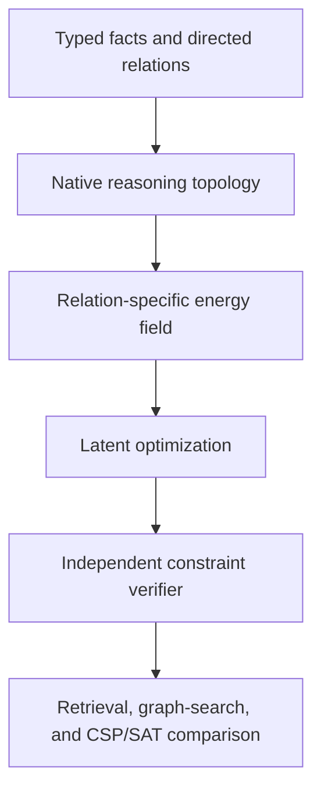

# LTM Experimental Report

**Report date:** 2026-07-29  
**Implemented architecture:** semantic-topology surrogate  
**Native reasoning topology:** not implemented  
**Pipeline classification:** **PASS**  
**Semantic reasoning-surrogate classification:** **INSUFFICIENT**

## Executive conclusion

> The complete semantic-surrogate pipeline works. Data can be embedded,
> compiled into a field, optimized under bounded numerical budgets, resolved
> into evidence, and decoded. Semantic embeddings did not demonstrate the
> reasoning advantage expected from a native reasoning topology. Native
> reasoning topology remains unimplemented and untested.

The experiments establish that the interfaces and mechanics of the proposed
pipeline can run locally:

```text
data → latent organization → dynamic field → optimization
     → exact evidence → decoder
```

They do not establish that semantic distance is reasoning. The native
architecture described in [architecture.md](architecture.md) requires typed
premises, implications, dependencies, conflicts, goals, and relation-specific
energies. None of the completed phases implements that defining component.

Accordingly, Result B and E-B are performance classifications for particular
semantic objectives. They are not classifications of the complete LTM
architectural hypothesis.

## Questions tested

| Hypothesis | Status |
| --- | --- |
| Four-component surrogate pipeline can execute end to end | Supported |
| Latent optimization can move states stably under a hard budget | Supported |
| Exact evidence and provenance can survive the latent pipeline | Supported |
| A hierarchy can bound active work at 10,000-vector engineering scale | Supported |
| Single-state semantic optimization beats retrieval | Not supported |
| Multi-state semantic diversification improves evidence | Not supported |
| Semantic equilibrium beats weighted averaging | Not supported |
| Native reasoning topology enables reasoning | Not tested |
| Quality remains useful at 10–20 million source tokens | Not tested |
| Production economics or frontier-model equivalence are competitive | Not tested |

## Shared experimental boundary

All completed phases use the frozen
`sentence-transformers/all-MiniLM-L6-v2` semantic encoder at revision
`1110a243fdf4706b3f48f1d95db1a4f5529b4d41`.

The normal Phase 1 decoder uses `google/flan-t5-small` at revision
`0fc9ddf78a1e988dac52e2dac162b0ede4fd74ab`.

The experiments are intentionally small enough for Apple Silicon and operate
offline after model download. Phase 1.1 and Phase 1.2 measure evidence
selection without using the decoder, preventing answer fluency from hiding
retrieval or field failures.

## Phase 1 — Single-state semantic-field pipeline

### Question

Can the complete surrogate pipeline ingest data, organize it in semantic
space, create a query-conditioned field, optimize a prompt state, recover
exact evidence, and decode an answer?

A secondary comparison asks whether the particular single-state semantic
objective improves evidence selection over direct retrieval or directional
mean shift.

### Implementation

Phase 1 contains:

- deterministic ingestion and token-aware chunking;
- normalized 384-dimensional semantic embeddings;
- integrity-checked local vector and payload storage;
- exact cosine retrieval;
- query-weighted semantic density;
- tangent-projected optimization on the unit sphere;
- bounded field evaluations;
- exact evidence recovery;
- compact grounded decoding and deterministic fallback;
- CLI commands for workspace creation, ingestion, inference, diagnostics, and
  evaluation.

### Evaluation

- 50 queries;
- direct cosine retrieval control;
- eight-step directional mean shift;
- eight-step, nine-evaluation latent optimizer;
- evidence budget of four.

### Results

| Method | Recall@4 | Precision@4 | Mean evaluations |
| --- | ---: | ---: | ---: |
| Direct cosine retrieval | 0.950 | 0.475 | 0 |
| Directional mean shift | 0.890 | 0.445 | 8 |
| Single latent optimizer | 0.890 | 0.445 | 9 |

### Interpretation

The full pipeline passed mechanically:

- corpus data reached the field;
- the optimizer changed the prompt state;
- accepted updates did not increase energy;
- evaluation remained within its hard budget;
- the final state selected exact source evidence;
- the decoder produced a citation-bound output.

The semantic objective did not outperform retrieval. It approximately matched
mean shift while requiring more work. Its registered semantic-performance
classification is Result B.

The correct combined reading is:

- **pipeline result: pass;**
- **single-state semantic advantage: not demonstrated.**

Detailed evidence: [Phase 1 results](phases/phase-1/results.md) and
[`results/phase-1/`](../results/phase-1/).

## Phase 1.1 — Multi-state semantic optimization

### Question

Does replacing one latent state with several independently optimized states
recover multiple semantic modes and improve evidence selection?

### Implementation

Phase 1.1 adds:

- two or four unit-normalized latent slots;
- deterministic MMR seeds from the top 16 candidates;
- query/seed interpolation;
- pairwise diversity penalties above a similarity cap;
- tangent-projected set optimization;
- distinct evidence resolution with slot provenance;
- a fixed 24-configuration development grid;
- two registered diagnostic ablations.

The ingestion pipeline, encoder, normal decoder, and `ask` path remain
unchanged.

### Evaluation

- 100 locked queries;
- 20 unseen semantic domains;
- 20 paraphrase cases;
- 20 lexical-distractor cases;
- 20 rare-cluster cases;
- 20 multi-evidence bridge cases;
- 20 duplicate-density or adversarial cases;
- four evidence items per method.

The selected development configuration used four slots, seed mixture 0.30,
diversity weight 0.25, similarity cap 0.60, eight updates, and nine set
evaluations.

### Results

| Method | Recall@4 | Precision@4 |
| --- | ---: | ---: |
| Direct cosine retrieval | 0.880 | 0.440 |
| MMR retrieval | 0.750 | 0.375 |
| Directional mean shift | 0.915 | 0.458 |
| Existing single latent optimizer | 0.930 | 0.465 |
| Selected multi-state optimizer | 0.885 | 0.443 |
| Multi-state without diversity | 0.890 | 0.445 |
| Multi-state with query-only initialization | 0.945 | 0.473 |

Registered diagnostics:

- multi-state improvement over direct: 0.005;
- paired-bootstrap 95% interval: `[-0.035, 0.040]`;
- maximum domain Recall@4 loss versus direct: 0.300;
- evidence changed from MMR in 64% of cases;
- numerical failures: zero;
- observed peak RSS: approximately 463 MB;
- selected configuration, evidence IDs, energies, and quality metrics were
  reproduced in an offline repeat.

### Interpretation

Multiple states can be initialized, optimized, separated, traced, and resolved
into distinct evidence. That is a mechanical success.

The selected diversity objective did not provide a reliable evidence
advantage. It was effectively tied with direct retrieval and below the
existing single-state optimizer.

The query-only initialization ablation scored highest, but it was inspected on
held-out data. It cannot be promoted or tuned without a new locked suite.

The registered classification is Result B:

- **multi-state mechanics: pass;**
- **semantic-diversity advantage: not demonstrated;**
- **native reasoning topology: no conclusion.**

Detailed evidence: [Phase 1.1 results](phases/phase-1.1/results.md) and
[`results/phase-1.1/`](../results/phase-1.1/).

## Phase 1.2 — Hierarchical semantic equilibrium

### Question

Can every corpus item influence a prompt-conditioned equilibrium, either
exactly or through a fixed hierarchy, while bounded active work preserves the
exact-oracle result?

Does the iterative smooth worst-residual objective improve on a closed-form
weighted barycenter?

### Implementation

Phase 1.2 adds:

- prompt-conditioned similarity and metadata influence;
- exact whole-corpus equilibrium;
- average-consensus and smooth worst-residual energy terms;
- analytic gradients and bounded spherical optimization;
- a required closed-form weighted barycenter;
- a deterministic spherical k-means hierarchy;
- a fixed frontier with exact vectors and aggregate regions;
- explicit evidence, residual, provenance, aggregate-force, and tension
  bundles;
- deterministic non-generative fallback;
- an 18-configuration development grid;
- exact-oracle and scaling comparisons.

### Evaluation

- 120 locked queries;
- 24 new semantic domains;
- 24 balanced-consensus cases;
- 24 unequal-authority cases;
- 24 contradictory-evidence cases;
- 24 irrelevant-density cases;
- 24 multi-evidence bridge cases;
- at least three relevant constraints and eight local distractors per case.

The selected configuration used query anchor 0.5, average-consensus weight
1.0, smooth worst-residual weight 2.0, beta 10, eight updates, and a
16-evaluation hard limit.

### Results

| Method | Recall@4 | Precision@4 | Worst important residual |
| --- | ---: | ---: | ---: |
| Direct cosine retrieval | 0.239 | 0.179 | — |
| Existing density optimizer | 0.156 | 0.117 | — |
| Weighted barycenter | 0.261 | 0.196 | 0.519 |
| Exact equilibrium | 0.253 | 0.190 | 0.637 |
| Hierarchical equilibrium | 0.189 | 0.142 | 0.633 |

Registered quality and fidelity diagnostics:

- exact-equilibrium Recall improvement over direct: 0.0139;
- paired-bootstrap 95% interval: `[-0.006, 0.036]`;
- worst important residual: 22.7% worse than barycenter;
- average weighted residual: 19.3% worse than barycenter;
- minimum exact final-state prompt cosine: 0.870;
- controlled weight intervention moved toward the raised item in 100% of
  trials;
- controlled irrelevant expansion caused negligible state drift;
- minimum hierarchy/exact state cosine: 0.980;
- maximum hierarchy oracle-energy error: 3.05%;
- mean hierarchy/exact evidence overlap: 70.4%;
- numerical failures: zero.

### Scaling measurements

| Corpus vectors | Hierarchy build | Frontier | Warm optimization | Peak RSS |
| ---: | ---: | ---: | ---: | ---: |
| 100 | approximately 0.6 ms | approximately 0.2 ms | approximately 0.1 ms | approximately 514 MB |
| 1,000 | approximately 7 ms | approximately 0.6 ms | approximately 0.4 ms | approximately 515 MB |
| 10,000 | approximately 169 ms | approximately 2.3 ms | approximately 0.4 ms | approximately 584 MB |

These are synthetic-vector engineering measurements, not evidence of
10,000-document answer quality. They demonstrate that a bounded frontier is
computationally feasible at this scale.

### Interpretation

The conservative field, metadata intervention, optimizer, hierarchy
partitioning, and resource bounds worked mechanically.

The iterative equilibrium did not improve over the closed-form barycenter.
The hierarchy introduced additional state and evidence loss on the locked
suite.

The registered classification is E-B:

- **whole-corpus field mechanics: pass;**
- **small-scale bounded hierarchy execution: pass;**
- **semantic equilibrium advantage: not demonstrated;**
- **native reasoning topology: no conclusion.**

Detailed evidence: [Phase 1.2 results](phases/phase-1.2/results.md) and
[`results/phase-1.2/`](../results/phase-1.2/).

## Combined conclusions

### What has been demonstrated

- deterministic corpus ingestion and compilation;
- local normalized latent representations;
- explicit query-conditioned energy fields;
- analytic gradient calculations;
- tangent-projected bounded optimization;
- unit-normalized optimized states;
- monotonic accepted energy updates;
- exact evidence recovery;
- source provenance through the pipeline;
- residual and tension reporting;
- deterministic configuration selection;
- reproducible evidence and quality outputs;
- hierarchy partitioning without omitted or duplicated active items;
- low-resource execution on the target Apple Silicon environment;
- compact decoder integration and deterministic fallback.

### What has not been demonstrated

- a native typed reasoning topology;
- implication or dependency chaining;
- causal reasoning;
- a constraint-solving advantage;
- reliable contradiction resolution;
- verified generalization to unseen proof depth;
- useful quality at 10–20 million source tokens;
- large-scale SSD-streamed field execution;
- trillion-parameter knowledge operation on one GPU;
- frontier-model equivalence;
- $0.01 production inference;
- request-pricing economics;
- commercial demand or valuation.

## Final POC classification

The POC requires two separate classifications.

### Pipeline classification: PASS

The complete semantic-surrogate pipeline executes:

```text
semantic organization → latent field → bounded optimization
                      → exact evidence → decoder
```

The experiment also confirms that the semantic surrogate can later be
replaced behind the topology/field interface without redesigning ingestion,
optimization traces, evidence handling, or decoding boundaries.

### Semantic reasoning-surrogate classification: INSUFFICIENT

The tested semantic objectives did not reliably outperform retrieval,
mean-shift, or weighted averaging. Semantic embeddings organize similar
language; they do not encode the typed reasoning structure required by the
canonical architecture.

This result neither proves nor disproves that a well-designed native reasoning
topology will work.

## Next experimental gate

The next falsifiable experiment is:



The first controlled worlds should contain:

```text
A AND B imply C
C implies D
D conflicts with E
Observed: A, B, E
Goal: determine whether D is supportable
```

The phase succeeds only if topology plus optimization solves unseen relation
compositions or constraint problems beyond retrieval and averaging, returns
the valid supporting path, reports conflicts, and remains competitive with
graph and constraint-solver baselines.

Until that result exists, LTM should be described as a mechanically validated
latent-field pipeline around an untested reasoning-topology hypothesis.
