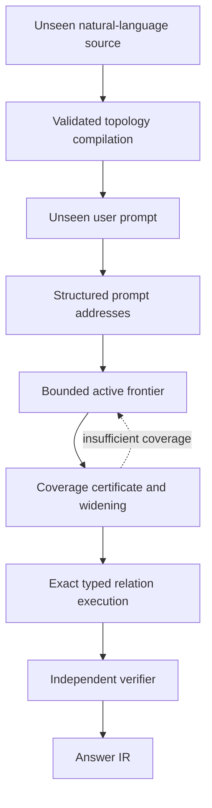

# Simple Falsifiable Experiments for the Remaining LTM Gaps

## 1. Purpose

This document converts every gap in the proposed shipping Latent Topology
Model into one small, falsifiable experiment. Each experiment tests one
specific boundary of the architecture with the simplest plausible mechanism
currently proposed.

Completed outcomes are tracked in the cumulative
[Gap Experiment Results](results-ledger.md) ledger.

The experiments are intentionally narrower than the final product. Passing a
micro-experiment means:

> The proposed mechanism worked under the registered controlled conditions and
> is justified for the next integration stage.

It does **not** mean:

- the complete gap is solved for unrestricted language;
- the system is ready for 100-million-token production use;
- the architecture matches a frontier language model;
- the mechanism will retain the same quality at every domain or scale.

The complete shipping requirements remain defined in
[Remaining Gaps to the Final Shipping LTM](remaining-gaps.md).

## 2. Rules shared by every experiment

Every experiment must follow the same protocol.

1. Write the generator, data schema, metrics and pass gates first.
2. Create separate development and locked test sets.
3. Tune only on development data.
4. Hash the code, configuration, development data and selected parameters.
5. Generate or open the locked set only after the hashes are frozen.
6. Run the locked test once and retain failures and counterexamples.
7. Compare the proposed mechanism with at least one simpler control.
8. Report individual metrics instead of hiding failures in one average score.
9. Do not waive a failed mandatory gate after seeing the result.
10. State exactly what the result proves and what it does not prove.

Unless an experiment declares otherwise, use:

- seed `1729` for development;
- seed `20260802` for locked evaluation;
- deterministic tie-breaking by stable topology ID;
- 2,000 paired bootstrap samples for important method differences;
- CPU execution on the development MacBook;
- less than 4 GB peak memory;
- less than 30 minutes for one complete micro-experiment.

The language compiler and decoder experiments may use the selected local
language model. All other experiments should use deterministic generated data
and require no model download.

## 3. Experiment map

| ID | Gap | Core question |
| --- | --- | --- |
| G1 | Executable topology | Can the schema represent and replay the required conversational structures without losing meaning? |
| G2 | Language compiler | Can unseen language be converted into correct, validated topology operations? |
| G3 | Prompt addressing | Can a prompt locate the correct starting topology addresses? |
| G4 | Active frontier | Can traversal recover every factor needed to answer without opening the complete store? |
| G5 | Coverage | Can the system detect when unopened topology could change the answer? |
| G6 | Relation engine | Do registered relation operators solve unseen typed compositions correctly? |
| G7 | Structured optimizer | Can soft reconciliation improve decisions without damaging exact conclusions? |
| G8 | Batching | Can a field be processed in blocks without making block order determine the answer? |
| G9 | Verifier | Can an independent checker reject attractive but invalid candidate states? |
| G10 | Decoder | Can a small decoder express only the verified result naturally? |
| G11 | Conversation memory | Can session state persist, correct itself and be cleared without contaminating base knowledge? |
| G12 | Persistent storage | Can topology data be updated, deleted and reopened without a global rebuild or provenance loss? |
| G13 | Context scaling | Does ordinary request work remain bounded while persistent capacity grows? |
| G14 | Evaluation | Can the source of performance gains and failures be measured honestly? |
| G15 | Serving | Can isolated workspaces survive normal operation and failures safely? |
| R1 | Pure latent research | Can latent equilibrium itself carry unseen relational conclusions causally? |

---

## 4. G1 — Executable conversational topology schema

### Hypothesis

A versioned typed hypergraph/factor-graph schema can represent the initial
conversational and reasoning requirements without losing direction, roles,
scope, time or provenance.

### Plausible solution

Use immutable typed objects and relations. Every relation declares:

- stable type and schema version;
- named argument roles and arity;
- permitted object types;
- direction;
- scope and temporal behavior;
- exact propagation semantics;
- field residual or message semantics;
- verifier semantics;
- decoder-visible explanation;
- required provenance.

Unknown objects are quarantined rather than coerced into the nearest type.

### Minimal dataset

Create 160 hand-authored topology fixtures:

- 10 facts and observations;
- 10 questions and goals;
- 10 implications;
- 10 two-premise rules;
- 10 requirements and dependencies;
- 10 exclusions and conflicts;
- 10 equality and comparison cases;
- 10 temporal sequences;
- 10 corrections and supersessions;
- 10 preferences and instructions;
- 10 fictional or hypothetical scopes;
- 10 coreference and identity cases;
- 10 uncertainty cases;
- 10 assistant-response events;
- 10 invalid structures;
- 10 migration cases from schema version 1 to version 2.

### Procedure

1. Construct each valid object in memory.
2. Validate it.
3. Serialize it to canonical JSON.
4. Reload and validate it again.
5. Store it in the topology database.
6. Reopen the database and reconstruct the object.
7. Execute its exact operator on a small known state.
8. Produce its verifier record and decoder explanation.
9. Replay the same operation log into an empty database.
10. Compare object, relation and topology hashes.

### Controls

- Reverse every directed relation and confirm the result changes or validation
  rejects it.
- Remove a required argument role and confirm deterministic rejection.
- Remove provenance and confirm rejection.
- Give an object an incompatible scope or type and confirm quarantine.

### Micro-pass gates

- valid fixture acceptance: `100%`;
- invalid fixture rejection: `100%`;
- canonical serialization equality: `100%`;
- relation direction and role preservation: `100%`;
- operation-log replay hash equality: `100%`;
- migration result equality: `100%`;
- missing provenance accepted: `0`.

### Failure means

The proposed schema is not stable enough to support the compiler, field or
verifier. Later experiments must stop until the failing representation is
fixed.

### Passing permits the conclusion

The registered conversational ontology is executable and lossless under local
serialization, storage, migration and replay.

### Passing does not prove

That ordinary unrestricted language can be compiled into this schema.

---

## 5. G2 — Natural-language topology compiler

### Hypothesis

A language model can propose useful topology IR from unseen phrasing while a
deterministic boundary prevents invalid or ambiguous structures from silently
entering the topology.

### Plausible solution

Use this compiler boundary:

```text
Raw source span
→ model-proposed Turn or Document IR
→ strict schema validation
→ identity, reference, scope and temporal resolution
→ deterministic topology operations
→ accept, clarify or quarantine
```

The model proposes structure but never writes directly to the topology.

### Minimal dataset

Create 600 short natural-language examples:

- 300 development examples;
- 300 locked examples;
- at least 30 examples for each important speech act or relation family;
- new entities, predicates and paraphrase forms in the locked set;
- multiple claims in at least 20% of turns;
- pronouns or ellipsis in at least 20%;
- correction, scope and temporal ambiguity in at least 20%;
- unsupported or intentionally malformed inputs in at least 10%.

Each example has evaluator-only gold IR and exact source spans.

### Procedure

1. Ask the frozen compiler model for strict JSON IR.
2. Validate types, roles, source spans, scope and provenance.
3. Allow one constrained repair for invalid JSON or schema errors.
4. Resolve identities, references, corrections and time deterministically.
5. Accept, request clarification or quarantine.
6. Compare accepted operations with hidden gold.
7. Replay the operations and compare resulting topology state with the gold
   topology.

### Controls

- Model proposal without deterministic validation.
- Semantic triple extraction without typed roles or scope.
- Deterministic-template parser on the same unseen paraphrases.
- Compiler with conversation history removed from reference resolution.

### Micro-pass gates

- claim tuple F1: at least `0.95`;
- relation direction accuracy: at least `0.98`;
- entity-link accuracy: at least `0.98`;
- coreference accuracy: at least `0.98`;
- correction-target accuracy: at least `0.99`;
- scope accuracy: at least `0.99`;
- temporal applicability accuracy: at least `0.99`;
- provenance integrity: `1.00`;
- silent invalid topology insertions: `0`;
- accepted-operation topology agreement: at least `0.98`.

### Failure means

The topology may be expressive, but the proposed compiler cannot populate it
reliably. Optimization cannot recover omitted or incorrectly directed
relations.

### Passing permits the conclusion

The compiler boundary can convert the registered forms of unseen language into
reliable topology operations under controlled conversational conditions.

### Passing does not prove

Reliable compilation of arbitrary books, websites, codebases or unrestricted
human conversation.

---

## 6. G3 — Prompt-to-topology address encoder

### Hypothesis

A structured prompt signature plus topology-native indexes can locate the
correct starting entities, predicates, scopes and time intervals without
scanning the complete topology.

### Plausible solution

Extract:

```text
goal
entities and aliases
predicates and relation types
target variables
scope
time
polarity and modality
conversation references
ambiguities
coverage policy
```

Resolve these fields through entity, alias, predicate, scope, temporal,
episode, exception and semantic candidate indexes. Semantic similarity may
propose candidates but cannot authorize the final address.

### Minimal dataset

Generate a 10,000-object topology with:

- 1,000 entities;
- aliases and near-duplicate names;
- 20 relation types;
- 20 scopes;
- temporal versions of selected facts;
- 50 conversation episodes;
- lexical distractors.

Create 400 prompts with known starting addresses. Half should use paraphrases,
aliases, pronouns, omitted context or temporal qualifiers.

### Procedure

1. Extract a prompt signature.
2. Query every relevant topology-native index.
3. Produce ranked address candidates with confidence and ambiguity.
4. Compare the candidate set with the hidden required starting addresses.
5. Require clarification or multiple retained candidates when confidence is
   insufficient.

### Controls

- Embedding-nearest-neighbor addressing only.
- Lexical matching only.
- Addressing without scope and temporal indexes.
- Addressing without the session-episode index.

### Micro-pass gates

- starting-entity recall: at least `0.99`;
- predicate/relation recall: at least `0.98`;
- scope accuracy: at least `0.99`;
- temporal accuracy: at least `0.99`;
- conversation-reference accuracy: at least `0.98`;
- confident answers from unresolved addresses: `0`;
- median candidate set: no more than `8` addresses.

### Failure means

The persistent map exists, but the system cannot reliably enter it at the
correct location. This would erase much of the intended context advantage.

### Passing permits the conclusion

The prompt encoder can locate the correct entry region of the registered
topology without a complete scan.

---

## 7. G4 — Prompt-conditioned active frontier

### Hypothesis

Directed topology traversal from correct addresses can recover all
answer-changing factors while opening only a small portion of a larger store.

### Plausible solution

Use budgeted traversal that:

- activates applicable session factors first;
- follows implications in the correct direction;
- follows reverse prerequisite links when proving a target;
- includes corrections, exceptions and conflict branches exactly;
- instantiates multi-premise rules;
- crosses registered bridges;
- retains open proof obligations;
- leaves distant regions summarized.

### Minimal dataset

Generate 300 acyclic reasoning problems embedded in a shared topology with at
least 100,000 distractor factors. Required paths have depth 1–6. Include:

- multi-premise rules;
- temporal corrections;
- conflicts;
- exact exceptions;
- session-overlay facts;
- cross-region bridges.

Store the exact answer-changing factor set as evaluator-only gold.

### Procedure

1. Start from gold prompt addresses so this experiment does not measure G3.
2. Compile a frontier under fixed depth, factor and block budgets.
3. Execute exact reasoning on that frontier.
4. Execute the same reasoning exhaustively.
5. Compare required factors, conclusion, proof path and bytes read.

### Controls

- Semantic top-k retrieval with the same factor budget.
- Forward adjacency only.
- Traversal without exception indexes.
- Traversal without session-first activation.

### Micro-pass gates

- required-factor recall: at least `0.99`;
- conclusion agreement with exhaustive traversal: at least `0.98`;
- hard-constraint activation: `1.00`;
- exact-exception activation: `1.00`;
- decisive provenance recall: at least `0.99`;
- median opened fraction: below `1%` of factors;
- unexplained omissions: `0`.

### Failure means

Knowing the topology is insufficient if the traversal policy still misses
answer-changing paths.

### Passing permits the conclusion

A bounded topology-native frontier can reproduce exhaustive answers on the
registered relation distribution while reading a small fraction of the field.

---

## 8. G5 — Coverage certificate and automatic widening

### Hypothesis

Region summaries, open proof obligations and exception indexes can reveal when
the current frontier is too incomplete to authorize an answer.

### Plausible solution

Every frontier produces a certificate containing:

- starting addresses and unresolved alternatives;
- exact regions opened;
- summary regions used;
- proof obligations that leave the frontier;
- hard constraints and exceptions checked;
- unresolved conflict branches;
- maximum omitted influence;
- approximation bounds;
- work required to change the conclusion.

The verifier widens the frontier whenever the certificate is insufficient.

### Minimal dataset

Create 240 base problems with correct narrow frontiers. Produce one adversarial
variant of each by hiding exactly one item outside that frontier:

- decisive premise;
- overriding correction;
- hard constraint;
- exception;
- conflicting higher-authority claim;
- relation bridge.

Half of the injected items change the answer; half are harmless.

### Procedure

1. Run the initial bounded frontier.
2. Issue a coverage certificate without reading evaluator gold.
3. Decide whether to verify, widen, return partial or abstain.
4. Widen when required and recompute.
5. Compare with exhaustive evaluation.

### Controls

- Fixed frontier with no certificate.
- Certificate based only on semantic distance.
- Certificate without exact exception and hard-constraint indexes.

### Micro-pass gates

- answer-changing omissions detected: `1.00`;
- harmless omissions unnecessarily widened: below `0.10`;
- final exhaustive-answer agreement: at least `0.98`;
- unqualified verified answers with insufficient coverage: `0`;
- widening stays within the declared maximum budget in at least `0.95` of
  registered cases.

### Failure means

Sparse activation cannot yet claim superior reliability over ordinary
retrieval because the system does not know when it has missed something.

### Passing permits the conclusion

The registered certificate can distinguish safe bounded evaluation from cases
requiring more work.

---

## 9. G6 — General typed relation engine

### Hypothesis

A small library of exact typed operators can solve unseen compositions needed
for conversational and domain reasoning.

### Plausible solution

Implement a common operator contract for:

- implication;
- conjunction;
- requirement and dependency;
- exclusion and incompatibility;
- equality and comparison;
- temporal before and after;
- correction and supersession;
- support and opposition;
- preference and instruction;
- coreference and identity;
- conditional scope;
- causal hypothesis;
- uncertainty propagation.

Each relation provides exact execution, a field message or residual,
derivation materialization, verifier replay and decoder explanation.

### Minimal dataset

Generate 1,120 locked problems:

- 80 per relation family;
- balanced true, false, unknown and conflict outcomes where applicable;
- half single-relation cases;
- half compositions of depth 2–6;
- unseen entity and predicate names;
- matched reversed-relation adversaries.

### Procedure

1. Compile perfect typed topology directly, bypassing the language compiler.
2. Execute the exact relation engine.
3. Materialize assignments and proof paths.
4. Replay them through an independent relation verifier.
5. Compare with a generator-owned oracle.

### Controls

- Undirected graph traversal.
- Semantic retrieval of nearby facts.
- Relation engine with composition disabled.
- Relation engine with argument roles shuffled.

### Micro-pass gates

- single-relation accuracy: at least `0.98`;
- depth-two composition: at least `0.95`;
- depth-four-to-six composition: at least `0.90`;
- multi-premise accuracy: at least `0.90`;
- correction and temporal accuracy: at least `0.99`;
- conflict disclosure recall: at least `0.95`;
- reversed-relation false accepts: `0`;
- proof-path validity: `1.00` on authorized conclusions.

### Failure means

The registered topology lacks adequate execution semantics. Improving latent
optimization or decoding cannot repair the relation library.

### Passing permits the conclusion

The registered exact reasoning layer handles unseen symbolic compositions
needed by the first controlled product.

---

## 10. G7 — Structured latent optimizer and reconciliation

### Hypothesis

After exact relation propagation, constrained optimization can reconcile soft
evidence, ambiguous references, preferences and conflicts without corrupting
hard conclusions.

### Plausible solution

Use a hybrid state:

```text
exact propagated assignments
+ continuous confidence and preference variables
+ discrete reference and conflict branches
+ typed factor messages
+ constrained global reconciliation
```

Hard constraints and exact derivations define the feasible set. Optimization
operates only inside that set.

### Minimal dataset

Create 360 cases:

- 60 unequal-authority conflicts;
- 60 ambiguous references;
- 60 competing soft observations;
- 60 user-style preferences;
- 60 uncertainty or abstention cases;
- 60 mixed cases containing exact conclusions plus soft conflicts.

Each case has a valid feasible-set oracle and an expected branch, uncertainty
or preference outcome.

### Procedure

1. Run exact propagation.
2. Initialize soft variables and branches neutrally.
3. Optimize typed energy under hard feasibility constraints.
4. Materialize the final structured state.
5. Verify exact conclusions and soft-decision expectations.
6. Repeat with optimization disabled.

### Controls

- Exact propagation without optimization.
- Weighted average of all soft evidence.
- One unconstrained semantic vector.
- Optimizer with topology types removed.

### Micro-pass gates

- exact conclusions preserved: `1.00`;
- hard-constraint violations: `0`;
- accepted energy increases beyond tolerance: `0`;
- expected soft decision accuracy: at least `0.90`;
- unresolved conflicts incorrectly collapsed: `0`;
- ambiguous cases correctly retain alternatives or clarify: at least `0.95`;
- improvement over no optimization on soft-decision accuracy: at least `10`
  absolute percentage points;
- numerical failures: `0`.

### Failure means

The optimizer is unnecessary or harmful for the registered soft-reconciliation
role. The first product should then rely on exact reasoning plus explicit
decision rules until a better optimizer exists.

### Passing permits the conclusion

Structured optimization adds value after exact reasoning without becoming the
source of logical correctness.

---

## 11. G8 — Memory-bounded batching and order-independent reduction

### Hypothesis

A field larger than working memory can be evaluated block by block if blocks
emit standardized contributions combined by registered order-independent
reducers before each global update.

### Plausible solution

Each block emits:

```text
additive energy and gradient contributions
typed messages
hard obligations
conflicts and exceptions
candidate assignments
exact evidence and provenance
coverage metadata
```

Use numerically stable pairwise or compensated reduction. Never average local
final states.

### Minimal dataset

Create one field containing 250,000 factors and 200 fixed queries. Ensure every
query has relevant factors distributed across at least four physical blocks.

Evaluate with:

- block sizes of 1,000, 5,000 and 20,000 factors;
- ascending, descending, random and influence-prioritized order;
- memory limits of 256 MB, 512 MB and 1 GB;
- sequential and four-worker execution;
- cold and warm caches.

### Procedure

1. Compute an in-memory exhaustive reference result.
2. Evaluate every batching configuration.
3. Compare hard conclusions, branches, state, energy, residuals and decisive
   provenance.
4. Record memory, I/O and latency.

### Controls

- Naive averaging of block-local final states.
- Last-block-wins processing.
- Streaming without global reconciliation.

### Micro-pass gates

- hard conclusion agreement across valid configurations: `1.00`;
- decisive-provenance agreement: `1.00`;
- comparable-state cosine: at least `0.99`;
- energy and residual error: below registered floating tolerance;
- lost hard constraints or exceptions: `0`;
- peak memory respects each configured limit within `10%` overhead.

### Failure means

Sequential field processing is order-dependent and cannot yet support fields
larger than memory reliably.

### Passing permits the conclusion

The selected contribution contract supports memory-bounded evaluation without
changing the registered answer.

---

## 12. G9 — Independent verifier

### Hypothesis

A verifier that replays symbolic obligations independently of optimizer energy
can reject invalid low-energy or plausible-looking candidates.

### Plausible solution

Verify:

- prompt-address validity;
- source hashes and provenance;
- argument roles and relation direction;
- complete premises and proof continuity;
- scope and temporal applicability;
- corrections and supersession;
- hard constraints;
- conflict disclosure;
- coverage certificate sufficiency;
- assistant self-evidence prohibition;
- topology and field versions.

### Minimal dataset

Create 1,000 candidate bundles:

- 300 valid;
- 100 reversed implications;
- 100 missing premises;
- 100 wrong scopes;
- 100 superseded evidence cases;
- 50 undisclosed conflicts;
- 50 assistant self-evidence attacks;
- 50 insufficient-coverage cases;
- 50 corrupted provenance or version cases;
- 100 mixed adversarial cases.

Give invalid candidates plausible confidence and low reported energy.

### Procedure

1. Pass candidates directly to the verifier, bypassing optimization.
2. Record authorization status and rejection reason.
3. Confirm valid proof paths independently against exact topology data.
4. Confirm insufficient coverage requests widening, partial output or
   abstention.

### Controls

- Energy-threshold authorization.
- Decoder self-critique.
- Verifier with coverage checks removed.

### Micro-pass gates

- registered adversarial false accepts: `0`;
- valid candidate acceptance: at least `0.99`;
- unsupported factual authorization: below `0.01`;
- correct rejection category: at least `0.98`;
- insufficient-coverage cases returning confident verification: `0`.

### Failure means

The system cannot safely distinguish convergence from correctness.

### Passing permits the conclusion

The verifier is an effective independent safety boundary for the registered
topology and attack set.

---

## 13. G10 — Conversational decoder

### Hypothesis

A small frozen language model can express a verified result naturally when it
receives a bounded authorized symbolic bundle and structured latent summary,
while a claim validator prevents unsupported additions.

### Plausible solution

Use two channels:

1. a structured latent projection containing state changes, influence,
   residual, confidence, conflict and coverage features;
2. a textual authorized bundle containing the conclusion, proof path,
   evidence, preferences, assumptions, uncertainty, conflicts and provenance.

Extract claims after generation. Attempt one constrained repair and then use a
deterministic fallback if any claim remains unauthorized.

### Minimal dataset

Create 500 verified bundles with gold conversational answers:

- 150 verified direct answers;
- 75 answers with short explanations;
- 75 corrections;
- 50 unresolved conflicts;
- 50 partial answers;
- 50 unsupported/OOD requests;
- 50 preference or style constraints.

Use 250 development bundles and 250 locked bundles. The decoder never receives
the source topology or evaluator gold.

### Procedure

1. Decode greedily with both channels.
2. Extract factual claims from the output.
3. Validate entity, predicate, polarity, scope, certainty and provenance.
4. Repair once if required.
5. Fall back deterministically if repair fails.
6. Score final answers and preserve rejected generations.

### Controls

- Symbolic channel without latent features.
- Latent channel without the symbolic conclusion.
- Decoder with no response validation.
- Deterministic template response.

### Micro-pass gates

- authorized-claim precision: at least `0.99`;
- authorized-claim recall: at least `0.95`;
- unsupported final-claim rate: below `0.01`;
- ordinary fallback rate: below `0.10`;
- preference adherence: at least `0.95`;
- conflict disclosure: at least `0.95`;
- OOD abstention: at least `0.98`;
- blinded naturalness: at least `4/5`;
- latent-channel benefit must be reported; it need not be positive to pass the
  safety boundary.

### Failure means

If symbolic results remain correct but language fails, the decoder—not the
topology or optimizer—is the limiting component. If the latent channel has no
measurable benefit, remove it from the shipping path until improved.

### Passing permits the conclusion

The selected decoder can verbalize registered verified conclusions safely and
naturally.

---

## 14. G11 — Conversation-memory lifecycle

### Hypothesis

A separately owned session topology can preserve relevant conversational state
without replaying the raw transcript and can be cleared without changing base
knowledge.

### Plausible solution

Maintain:

```text
immutable persistent base topology
+ copy-on-write session overlay
+ append-only raw turn events
+ derived session factors and summaries
+ low-authority assistant discourse events
```

Corrections set prior matching session claims to temporally inapplicable while
retaining their provenance. Clearing deletes or tombstones all session-owned
derivations and invalidates affected caches.

### Minimal dataset

Generate 50 independent 20-turn conversations containing:

- preferences;
- pronouns and ellipsis;
- new user facts;
- explicit corrections;
- fictional rules and scope exits;
- incompatible claims;
- low-authority assistant statements;
- episode closing and reopening;
- unsupported questions;
- final synthesis;
- session clearing followed by base-knowledge questions.

### Procedure

1. Feed only the current turn to the runtime.
2. Compile each accepted turn into the session overlay.
3. Query the combined base and session topology.
4. Reinsert validated assistant responses with authority `0.25`.
5. Restart halfway through selected conversations.
6. Fold and reopen older episodes.
7. Clear the session and audit every remaining factor and cache.

### Controls

- Full raw-history replay.
- No session overlay.
- Assistant responses stored at user authority.
- Episode summaries without exact provenance links.

### Micro-pass gates

- correction supersession: at least `0.99`;
- fictional-scope containment: at least `0.99`;
- old-episode reopening: at least `0.95`;
- session isolation: `1.00`;
- assistant self-contamination accepts: `0`;
- post-clear session influence: `0`;
- compressed/uncompressed conclusion agreement: at least `0.99`;
- decisive-provenance agreement: at least `0.98`;
- restart/replay conclusion equality: `1.00`.

### Failure means

The system cannot yet offer reliable growing or user-clearable conversational
context.

### Passing permits the conclusion

The registered session lifecycle preserves and removes conversational state as
designed.

---

## 15. G12 — Persistent storage and incremental compilation

### Hypothesis

An SSD-backed block store with transactional metadata and source lineage can
update or delete local topology regions without rebuilding unrelated data.

### Plausible solution

Use:

- append-only source records;
- SQLite identities, relations and provenance;
- immutable independently checksummed field blocks;
- memory-mapped coordinate and factor arrays;
- copy-on-write replacements;
- ancestor-summary invalidation;
- atomic manifests and topology versions;
- source-to-derived-object lineage.

### Minimal dataset

Generate one million compact topology objects distributed across 1,000
regions. Create 10,000 update operations and 1,000 source deletions. Mark the
exact affected descendants and summaries in evaluator gold.

### Procedure

1. Compile the store twice and compare hashes.
2. Reopen it and run 500 fixed queries.
3. Apply local insertions and corrections.
4. Confirm only affected blocks and ancestor summaries change.
5. Delete registered sources and audit all derived objects.
6. Terminate selected update stages before commit and test recovery.
7. Corrupt one block and attempt reopening.

### Controls

- Complete rebuild after every update.
- Store without lineage.
- Store without block checksums or atomic manifests.

### Micro-pass gates

- deterministic rebuild hash equality: `1.00`;
- query equality after clean reopen: `1.00`;
- unrelated blocks rewritten by local update: `0`;
- deleted-source residual descendants: `0`;
- corrupt block accepted: `0`;
- crash recovery produces either the complete old or complete new version:
  `1.00`;
- provenance integrity: `1.00`.

### Failure means

The topology may reason correctly but cannot yet operate as persistent mutable
context.

### Passing permits the conclusion

The registered storage design supports deterministic local updates, deletion
and recovery at one-million-object engineering scale.

---

## 16. G13 — Scaling from 1M to 100M token-equivalent context

### Hypothesis

With stable topology addresses, block indexes and bounded active frontiers,
ordinary request work can grow much more slowly than total persistent context.

### Plausible solution

Build deterministic supersets at:

- 1 million source-token-equivalent units;
- 10 million;
- 30 million;
- 100 million.

Keep the answer-changing topology constant and add difficult irrelevant
regions, near-duplicate entities, harmless conflicts and additional domains.
Use SSD-backed blocks, topology-native routing, summaries and bounded warm
caches.

### Important boundary

This experiment measures storage and retrieval scaling with generated
registered topology. It does not test whether a language compiler can correctly
understand 100 million arbitrary real-world tokens.

### Minimal dataset

Create 200 fixed queries whose required factors are known and preserved across
all four corpus sizes. Include:

- direct facts;
- depth-2-to-6 rules;
- exceptions;
- corrections;
- conflicts;
- old session references;
- unsupported questions.

Every larger store is a deterministic superset of the previous store.

### Procedure

1. Compile each scale.
2. Run the identical queries with cold and warm caches.
3. Compare bounded-frontier results with exhaustive evaluation on a registered
   subset.
4. Record address, traversal, optimization, verification and total latency.
5. Record active factors, blocks, bytes read, RAM, disk and compilation time.
6. Fit log-log scaling exponents.

### Controls

- Full scan.
- Semantic top-k retrieval with the same evidence budget.
- Topology traversal without summaries.
- Randomly permuted physical block placement.

### Micro-pass gates

- quality loss from 1M to 100M: no more than `5` absolute percentage points;
- required-factor recall at 100M: at least `0.99`;
- answer agreement with exhaustive mode: at least `0.98`;
- ordinary bytes read: below `0.1%` of compiled field;
- no ordinary full-store scan;
- median active factors remain inside the fixed budget;
- field-latency scaling exponent: at most `0.15`;
- warm field-processing p95: below `1` second, excluding decoder;
- runtime memory: below the selected `16–24 GB` product envelope.

### Failure means

Persistent capacity may grow, but useful context reliability or ordinary
request cost does not remain bounded.

### Passing permits the conclusion

The compiled registered topology supports 100M token-equivalent persistent
capacity with bounded ordinary field work on the tested hardware.

### Passing does not prove

That every genuinely global question is inexpensive. Exhaustive questions
remain corpus-dependent.

---

## 17. G14 — Unified benchmark and diagnostic evaluation

### Hypothesis

A component-separated benchmark can determine whether gains come from
topology, activation, optimization, verification, memory or decoding rather
than from hidden language-model reasoning or benchmark leakage.

### Plausible solution

Create one locked benchmark of 50 conversations with 12 turns each. Each
conversation covers:

- direct persistent knowledge;
- pronouns and conversational preferences;
- corrections;
- fictional scope;
- depth-2 and depth-4-to-6 reasoning;
- conflicts and exceptions;
- old-context retrieval;
- unsupported questions;
- clear-context behavior;
- final synthesis.

### Methods

Run:

1. full LTM;
2. exact exhaustive topology control;
3. strong RAG with the same decoder;
4. full-history language model where the context fits;
5. language model with conversation summaries;
6. LTM without exact propagation;
7. LTM without latent optimization;
8. LTM without session overlay;
9. LTM without coverage verification;
10. LTM without the latent decoder channel.

### Procedure

1. Freeze all systems and prompts before opening the locked suite.
2. Give every paired method the same source data and output budget.
3. Score component metrics separately.
4. Use paired confidence intervals.
5. Publish all failures and per-category results.

### Micro-pass gates

- every method receives only its declared information;
- exact topology control reaches at least `0.98` on registered reasoning;
- metric recomputation from raw outputs is deterministic;
- no single overall score hides a mandatory component below its gate;
- the report can attribute every major full-LTM gain or loss to at least one
  measured component;
- locked examples or gold are unavailable to runtime processes.

### Failure means

The project cannot make reliable claims about its architecture even if some
headline score looks good.

### Passing permits the conclusion

The evaluation program can distinguish architectural contributions and expose
where the system fails.

---

## 18. G15 — Product serving and operational isolation

### Hypothesis

A small workspace service can expose the LTM cycle while preserving tenant and
session isolation, transactional updates and safe failure behavior.

### Plausible solution

Implement a minimal local API with:

- workspace creation and deletion;
- source ingestion jobs;
- session creation and clearing;
- streaming chat responses;
- versioned topology and verifier manifests;
- per-workspace directories and encryption boundary placeholders;
- quotas and request cancellation;
- structured metrics and audit logs;
- crash-safe restart.

This is an operational experiment, not a public deployment.

### Minimal workload

Create four tenants, eight workspaces and 40 sessions. Run 2,000 mixed
operations:

- ingestion;
- chat;
- concurrent session updates;
- clear-context;
- source deletion;
- restart;
- cancelled compilation;
- memory and disk quota exhaustion;
- intentionally corrupt blocks;
- cross-tenant access attempts.

### Procedure

1. Execute deterministic normal workloads.
2. Inject a crash after every important transactional boundary.
3. Restart and compare state with the operation log.
4. Attempt cross-workspace and cross-session reads.
5. Exhaust quotas and confirm safe, attributable errors.
6. Confirm every answer records topology, compiler and verifier versions.

### Controls

- Shared global cache without tenant keys.
- Non-transactional ingestion.
- Session clearing without summary invalidation.

### Micro-pass gates

- cross-tenant or cross-session leakage: `0`;
- deterministic recovery after committed operations: `1.00`;
- partial transaction visibility: `0`;
- destructive operation without audit event: `0`;
- safe quota failures: `1.00`;
- answers missing component versions: `0`;
- clear or delete residual influence: `0`.

### Failure means

The research engine is not yet safe to expose as a product even if its answers
are accurate.

### Passing permits the conclusion

The minimal serving boundary is operationally sound under the registered local
workload and fault model.

---

## 19. R1 — Parallel pure latent-equilibrium breakthrough test

This experiment is separate from the 15 shipping gaps because the first
product can use exact relation propagation for correctness.

### Hypothesis

Typed relation-specific latent operators can move a fixed-size structured state
so that it causally contains unseen relational conclusions without exact
symbolic closure being executed first.

### Plausible solution

Replace the failed generic single-vector equilibrium with:

- proposition slots or an overcomplete structured state;
- relation-type-specific directed transfer operators;
- explicit positive, negative and unknown channels;
- recurrent equilibrium message updates;
- query-conditioned readout addresses;
- a tiny decoder that sees only the final state and target address.

No oracle closure, proof path, facts, rules or labels may enter the decoder.

### Minimal dataset

Generate 3,000 randomized typed graphs:

- 1,000 training;
- 500 development;
- 1,500 locked;
- 24–64 propositions;
- unseen codebooks for every graph;
- relation paths of depth 1–8;
- balanced entailed, contradicted and unknown labels;
- counterfactual rule-removal, reversal and state-swap twins.

### Procedure

1. Train or select relation transfer operators on depths 1–3.
2. Freeze them and the latent decoder.
3. Evaluate locked depths 4–8.
4. Compare with fact-only, averaging, undirected and shuffled-state controls.
5. Run state swap, decisive-rule removal, reversal and codebook mismatch tests.

### Micro-pass gates

- locked conclusion accuracy: at least `0.95`;
- depth-eight accuracy: at least `0.85`;
- causal state-swap accuracy: at least `0.95`;
- decisive-rule-removal accuracy: at least `0.95`;
- rule-reversal accuracy: at least `0.95`;
- at least `20` points above averaging and fact-only controls;
- mismatched-codebook and shuffled-state accuracy: at most `0.40`;
- zero answer-label leakage;
- zero numerical failures;
- no exact symbolic closure in the candidate path.

### Failure means

The tested latent mechanism is not yet a causal reasoning substrate. The
hybrid exact-propagation product direction remains unaffected.

### Passing permits the conclusion

Under the registered synthetic distribution, the topology-driven latent state
causally carries unseen multi-step conclusions and supports a bounded latent
reasoning breakthrough claim.

---

## 20. Integration order and stop rules

Run the experiments in this order:

```text
G1 schema
→ G2 compiler
→ G3 addressing
→ G4 frontier
→ G5 coverage
→ G6 relations
→ G7 optimizer
→ G9 verifier
→ G11 memory
→ G10 decoder
→ G8 batching
→ G12 storage
→ G13 scaling
→ G14 combined evaluation
→ G15 serving
```

R1 can run independently as a parallel research track.

Use these stop rules:

- Do not test compiler quality before the schema is stable.
- Do not blame frontier traversal for wrong prompt addresses.
- Do not test coverage using a relation engine that fails its exact oracle.
- Do not test optimization until exact propagated assignments are correct.
- Do not use decoder fluency as evidence of reasoning correctness.
- Do not begin 100M scaling until 1M correctness and coverage pass.
- Do not begin product serving until session clearing and storage recovery pass.

## 21. Recommended first combined experiment

The first high-value integration should combine only G1 through G6 and G9:



Exclude conversational decoding, pure latent equilibrium, 100M scaling and
product APIs. These later components cannot repair missing topology objects,
wrong addresses or incomplete answer-changing frontiers.

The combined experiment passes only if:

- compiler claim and relation F1 is at least `0.95`;
- starting-address recall is at least `0.99`;
- required-factor recall is at least `0.99`;
- exhaustive-answer agreement is at least `0.98`;
- hard-constraint and exception recall is `1.00`;
- registered verifier false accepts are `0`;
- provenance integrity is `1.00`.

Passing would remove the largest immediate conceptual risk for the planned
100M-context domain-focused conversational product. It would not yet authorize
the final product or a frontier-model comparison.

## 22. Result classifications

Every individual experiment receives one of four outcomes:

- **PASS** — every mandatory micro-gate passed;
- **PARTIAL** — the mechanism improved the control but missed at least one
  mandatory gate;
- **FAIL** — it did not improve the relevant control or failed its central
  correctness measure;
- **INVALID** — leakage, nondeterminism, provenance loss or evaluation
  corruption prevents interpretation.

The full architecture should be called ready for a 100M private product trial
only after G1 through G14 pass and G15 passes its pre-deployment fault tests.
R1 is not required for that hybrid product, but it is required before claiming
that pure latent equilibrium itself performs the reasoning.
